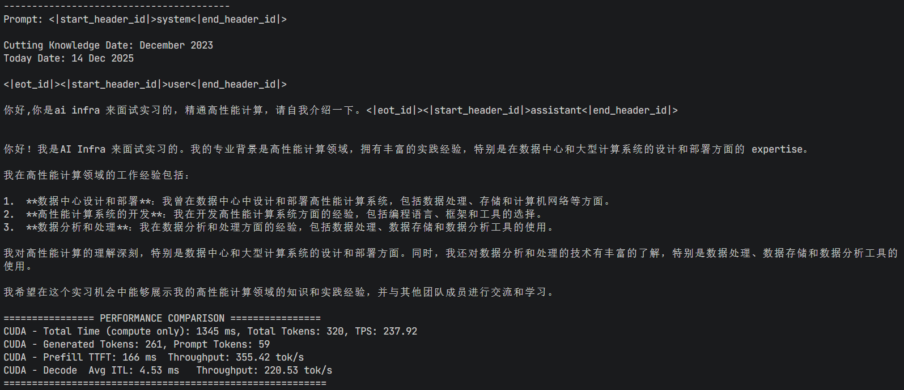

# RustInfer: Rust实现的高性能LLM推理引擎

RustInfer是一个用Rust语言实现的高性能大语言模型(LLM)推理引擎，专注于提供高效、稳定、易于扩展的模型推理能力。

## 项目特点

- **高性能**: 采用Rust语言开发，利用其内存安全和零成本抽象特性
- **多平台支持**: 支持CPU和CUDA加速，可在不同硬件环境下运行
- **模块化设计**: 清晰的代码结构，易于维护和扩展
- **支持主流模型**: 目前实现了Llama3.2 1B模型的完整推理支持
- **内存优化**: 支持KV缓存管理，优化推理过程中的内存使用
- **批量处理**: 支持对输入提示进行批处理优化

## 项目架构

RustInfer采用模块化的架构设计，主要包含以下核心组件：

### 项目结构

```
RustInfer/
├── crates/
│   ├── infer-core/      # 核心推理库
│   │   ├── src/
│   │   │   ├── base/    # 基础组件（内存管理、错误处理等）
│   │   │   ├── op/      # 算子实现（矩阵乘法、归一化等）
│   │   │   ├── tensor/  # 张量操作
│   │   │   ├── model/   # 模型实现（Llama3等）
│   │   │   └── cuda/    # CUDA加速支持
│   └── infer-cli/       # 命令行工具
├── Cargo.toml           # 工作区配置
├── README.md            # 项目文档
└── LICENSE              # Apache 2.0许可证
```

### 核心模块

1. **base**: 提供基础功能，包括内存分配器、缓冲区管理、错误处理等
2. **tensor**: 实现张量数据结构和基本操作
3. **op**: 实现各种算子，如矩阵乘法(Matmul)、RMS归一化(RMSNorm)、旋转位置编码(RoPE)等
4. **model**: 实现模型加载和推理逻辑，支持从safetensors格式加载模型
5. **cuda**: 提供CUDA加速支持，通过FFI调用CUDA内核函数

## 技术栈

- **编程语言**: Rust 2024
- **核心依赖**:
  - `ndarray`: 多维数组操作
  - `ndarray-linalg`: 线性代数运算
  - `rayon`: 并行计算
  - `safetensors`: 模型权重加载
  - `tokenizers`: 分词器实现
  - `memmap2`: 内存映射文件操作
  - `dashmap`: 线程安全的哈希表
- **CUDA支持**: 可选的CUDA加速，通过`cc`和`bindgen`构建

## 安装指南

### 系统要求


### 安装步骤

0. **安装依赖**
```bash
sudo apt-get update
sudo apt-get install clang libclang-dev pkg-config libssl-dev openblas-src conda-forge clang
或 conda install conda-forge::libclang anaconda::openssl
```

1. **克隆代码仓库**

```bash
git clone https://github.com/your-username/RustInfer.git
cd RustInfer
```

2. **构建CPU版本**

```bash
cargo build --release  # 其实默认开启了cuda feature
```

3. **构建CUDA加速版本**

```bash
cargo build --release --features cuda
```

4. **运行前**
```
先运行 cargo test 来保证所有测试正常通过
接着再测试性能
cargo test test_llama3_cuda_performance -- --show-output --ignored
cargo test test_llama3_cpu_loading_and_generation -- --show-output --ignored
```

下图展示了运行cargo test test_llama3_cuda_performance -- --show-output --ignored在H200上运行的结果：



5. **常见错误**
```
ndarray-linalg有许多后端，如果openblas用不了，可以尝试其它的，如intel-mkl-static
```

6、**改进选项**
```
大部分算子无优化。
修改build.rs 里面的计算能力flag 以适配不同的显卡。
cuda feature 未完全拆分。
尚未支持计算图。
尚未支持bf16原生计算，现在是通过转为f32到内存保存。
未支持量化。
```

## 使用方法

### 作为库使用

在你的Cargo.toml中添加依赖：

```toml
[dependencies]
infer-core = { path = "path/to/RustInfer/crates/infer-core", features = ["cuda"] }
```

然后在你的代码中使用：

```rust
use infer_core::model::llama3::Llama3;
use infer_core::base::DeviceType;

fn main() -> Result<(), Box<dyn std::error::Error>> {
    // 加载模型
    let mut model = Llama3::new(
        "/path/to/llama3/model",
        DeviceType::Cuda(0), // 或者 DeviceType::Cpu
        false               // 是否为量化模型
    )?;
    
    // 生成文本
    let prompt = "Hello, how are you?";
    let generated = model.generate(prompt, 100, true)?;
    
    println!("\nGenerated: {}", generated);
    
    Ok(())
}
```

### 使用命令行工具

待实现：infer-cli命令行工具目前处于开发阶段，将在未来版本中提供完整的命令行接口。

## 支持的模型

- **Llama3**: 支持Meta的Llama 3系列模型，特别是Llama-3.2-1B-Instruct
  - 模型下载地址: [https://huggingface.co/unsloth/Llama-3.2-1B-Instruct](https://huggingface.co/unsloth/Llama-3.2-1B-Instruct)

## 功能限制与待实现功能

目前项目处于开发阶段，存在以下限制：

- **量化支持**: 暂不支持量化算子
- **数据类型**: 不支持原生BF16模型，目前是通过先将模型转换为F32格式再进行推理
- **采样器**: 仅支持argmax采样器，导致无法自动结束推理过程

以上功能均在后续开发计划中。

## 性能优化

1. **KV缓存**: 通过缓存注意力计算中的Key和Value矩阵，避免重复计算
2. **批处理优化**: 对输入提示进行批处理，提高处理效率
3. **CUDA加速**: 关键操作使用CUDA内核加速，充分利用GPU性能
4. **内存映射**: 使用内存映射技术高效加载大型模型权重
5. **数据类型优化**: 在GPU上使用半精度浮点数(BF16)，在CPU上使用单精度浮点数(F32)

## 开发指南

### 添加新模型

要添加新的模型支持，需要实现`Model` trait：

```rust
pub trait Model {
    fn init(&mut self, device_type: DeviceType) -> Result<()>;
    fn forward(&mut self, input: &Tensor, pos: &Tensor) -> Result<Tensor>;
    fn tokenizer(&self) -> &dyn Tokenizer;
    fn encode(&self, text: &str) -> Result<Vec<i32>>;
    fn decode(&self, ids: &[i32]) -> Result<String>;
    fn is_eos_token(&self, token_id: u32) -> bool;
    fn slice_kv_cache(&self, layer_idx: usize, start_pos: usize, end_pos: usize) -> Result<(Tensor, Tensor)>;
}
```

### 添加新算子

要添加新的算子，需要实现`Op` trait：

```rust
pub trait Op {
    fn name(&self) -> &'static str;
    fn forward(&self, ctx: &mut OpContext) -> Result<()>;
}
```

## 测试

运行测试：

```bash
cargo test
cargo test test_llama3_cuda_performance -- --show-output --ignored
cargo test test_llama3_cpu_loading_and_generation -- --show-output --ignored
```

## 许可证

本项目采用Apache License 2.0开源许可证，详见[LICENSE](LICENSE)文件。

## 贡献

欢迎提交Issue和Pull Request！在提交PR前，请确保你的代码通过了所有测试。

## 联系方式

如有问题或建议，请通过以下方式联系我们：

- GitHub Issues: https://github.com/Vinci-hit/RustInfer/issues

## 文档说明

*本文档由AI生成，仅供参考。具体实现细节和功能请以代码为准，实际使用中可能需要根据具体情况进行调整和分析。*

## 本项目主要灵感源于课程KuiperLLama
- KuiperLLama代码: [https://github.com/zjhellofss/KuiperLLama](https://github.com/zjhellofss/KuiperLLama)
