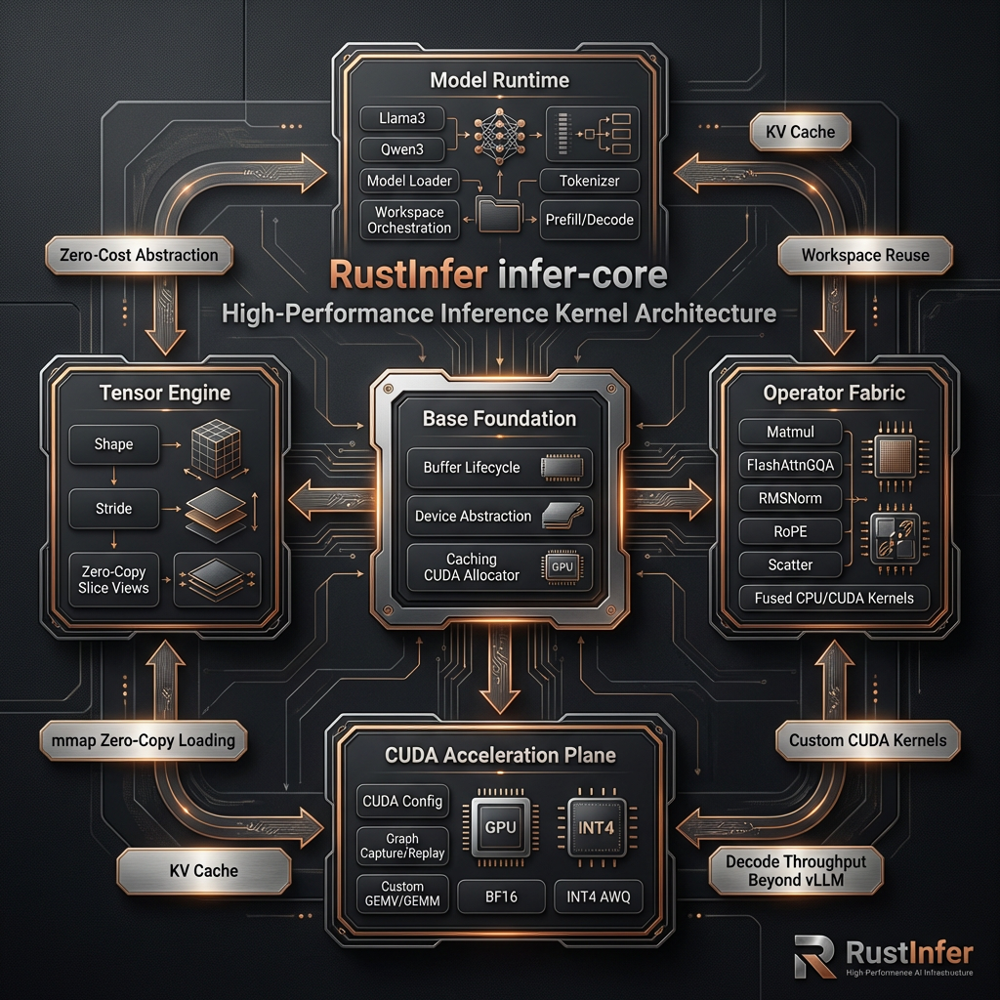

# RustInfer: Rust实现的高性能LLM推理引擎

RustInfer是一个用Rust语言实现的高性能大语言模型(LLM)推理引擎，手写CUDA算子，支持BF16与INT4(AWQ)量化推理，**单请求decode吞吐量超越vLLM**。

## 🏗️ 核心架构

<div align="center">



*高性能推理内核架构 - 从零成本抽象到显存优化*

</div>

RustInfer 采用**分层模块化架构**，核心包括：

- **Model Runtime**: Llama3/Qwen3 模型加载和执行
- **Base Foundation**: 内存管理、CUDA显存分配器、设备抽象
- **Tensor Engine**: 零拷贝张量系统，Shape/Stride/Zero-Copy Slice Views
- **Operator Fabric**: CPU/CUDA 融合算子库（Matmul、FlashAttnGQA、RoPE、RMSNorm 等）
- **CUDA Acceleration Plane**: 手写 GEMV/GEMM、INT4 量化、CUDA Graph、BF16/INT4 AWQ 推理
- **Workspace Reuse**: 推理循环内存预分配，零动态分配

---

## 📊 性能对比：RustInfer vs vLLM

> **测试环境**: H20, Batch Size=1, BF16, CUDA Graph enabled, vLLM compile disabled, temperature = 0, topk = None

### Qwen3-4B

| | RustInfer | vLLM |
|--|-----------|------|
| **Decode 吞吐量** | **294 tok/s** | 259 tok/s |

### Llama-3.2-1B-Instruct

| | RustInfer | vLLM |
|--|-----------|------|
| **Decode 吞吐量** | **920 tok/s** | **735 tok/s**  |

### INT4 AWQ 量化推理

> Batch Size=1, compressed-tensors K-packed INT4, BF16 activation

| 模型 | A10 (sm_86) | H20 (sm_90) |
|------|-------------|-------------|
| Llama-3.2-1B-AWQ | 326 tok/s (1.74x vs BF16) | **1000 tok/s** |
| Qwen3-4B-AWQ (MLP only) | 105 tok/s | 303 tok/s |

> **注意**: 长序列性能受到 flashdecode 影响，输出越长越慢。

**v0.7.0 优化路径（259 → 281 tok/s, Qwen3-4B）**:
- 手写 BF16 GEMV kernel，decode 阶段小矩阵比 cublasLt 快 25-44%
- 融合 scatter_kv kernel，每层省 1 次 kernel launch
- RMSNorm/fused_add_rmsnorm 线程数 128→256，提升 SM 占用率
- SwiGLU 精度修复（bf16 h2exp → FP32 expf）+ 去除运行时设备查询开销
- Benchmark 关闭流式打印，消除 tokenizer O(n²) decode 开销

---

### 项目结构

```
RustInfer/
├── crates/
│   ├── infer-protocol/    # 通信协议定义（MessagePack）
│   ├── infer-engine/      # 独立推理引擎进程
│   ├── infer-core/        # 核心推理库
│   │   ├── base/          # 内存管理、分配器
│   │   ├── tensor/        # 张量系统（零拷贝）
│   │   ├── op/            # 算子库（CPU/CUDA）
│   │   ├── model/         # 模型实现（Llama3 / Qwen3）
│   │   └── cuda/          # CUDA集成
│   ├── infer-server/      # HTTP API服务器（Axum）
│   │   ├── api/           # OpenAI兼容端点
│   │   ├── chat/          # 聊天模板
│   │   └── zmq_client.rs  # ZMQ客户端
│   └── infer-frontend/    # Web UI（Dioxus WASM）
├── DEVELOPERS.md          # 开发者文档（架构深度解析）
├── README.md              # 本文件
└── Cargo.toml             # 工作区配置
```

---

## 🚀 快速开始

### 1. 安装依赖

```bash
# Ubuntu/Debian
sudo apt-get update
sudo apt-get install clang libclang-dev pkg-config libssl-dev

# OpenBLAS（CPU后端）
sudo apt-get install libopenblas-dev

# 或使用Conda
conda install conda-forge::libclang anaconda::openssl
```

### 2. 克隆仓库

```bash
git clone https://github.com/Vinci-hit/RustInfer.git
cd RustInfer
```

### 3. 构建项目

```bash
# CPU版本
cargo build --release

# CUDA版本（需要CUDA toolkit）
cargo build --release --features cuda
```

**注意**: `build.rs` 会自动检测GPU计算能力（通过 nvidia-smi），也可通过 `CUDA_ARCH=sm_90` 环境变量手动指定。

### 4. 运行测试

先下载测试模型（Llama-3.2-1B-Instruct）：

```bash
uv run hf download unsloth/Llama-3.2-1B-Instruct --local-dir ./Llama-3.2-1B-Instruct
```

```bash
# 基础测试
cd RustInfer/crates/infer-core
cargo test

# CUDA性能测试
cargo test test_llama3_cuda_performance --release -- --nocapture --ignored

# CPU推理测试
cargo test test_llama3_cpu_loading_and_generation --release -- --nocapture --ignored
```

---

## 📦 支持的模型

### Llama 3 系列

| 模型 | 参数量 | BF16 | INT4 AWQ | 推荐设备 |
|------|--------|------|----------|----------|
| Llama-3.2-1B-Instruct | 1B | ✅ | ✅ 912 tok/s (H20) | CPU / GPU |

### Qwen3 系列

| 模型 | 参数量 | BF16 | INT4 AWQ | 推荐设备 |
|------|--------|------|----------|----------|
| Qwen3-4B-Instruct | 4B | ✅ | ✅ 105 tok/s (A10, MLP only) | GPU (8GB+) |

**下载地址**:
- [Llama-3.2-1B-Instruct](https://huggingface.co/unsloth/Llama-3.2-1B-Instruct)

**支持格式**:
- ✅ SafeTensors (.safetensors)
- ✅ 分片模型 (model.safetensors.index.json)
- ✅ HuggingFace Tokenizer (tokenizer.json)
- ✅ compressed-tensors K-packed INT4 量化

---

## 📊 性能基准与版本演进

### 性能提升历程

> **测试环境**: H20, Qwen3-4B, Batch Size=1

| 版本 | Decode 吞吐量 | 关键优化 |
|------|--------------|----------|
| v0.8.0 | **1000 tok/s (Llama-1B-AWQ, H20)** / **303 tok/s (Qwen3-4B-AWQ, H20)** | INT4 AWQ 量化推理 |
| v0.7.0 | **281 tok/s (Qwen3-4B)** / **829 tok/s (Llama-3.2-1B-Instruct)** | 手写GEMV + kernel融合 + 算子调优 |
| v0.6.0 | 259 tok/s | 融合GEMM + 零拷贝decode + 融合add+rmsnorm |
| v0.5.0 | 192 tok/s | Qwen3-4B支持 |
| v0.2.0 | 436 tok/s (Llama-3.2-1B-Instruct) | BF16 + Flash Attention |
| v0.1.0 | 220 tok/s (Llama-3.2-1B-Instruct) | 基线 |

### 版本历史

#### v0.8.0 (当前) - INT4 AWQ 量化推理
**发布日期**: 2026-04

**核心改进**:
- INT4 AWQ 量化推理：compressed-tensors K-packed 格式，手写 GEMV/GEMM CUDA kernel
- Llama-3.2-1B-AWQ: **912 tok/s** decode（H20），**326 tok/s**（A10），相比 BF16 提速 1.74x
- Qwen3-4B-AWQ (MLP only): **105 tok/s** decode（A10），H20 待调优
- QuantParams 抽象 enum，可扩展 GPTQ / FP8
- RoPE scaling (Llama3.1/3.2) 移入 CUDA kernel，支持 BF16/FP16
- 量化 GEMV/GEMM 合并到 matmul 统一模块

#### v0.7.0 - 手写GEMV + Kernel级优化，281 tok/s
**发布日期**: 2026-04

**核心改进**:
- 手写 BF16 GEMV kernel：decode 阶段 M=1 时替代 cublasLt，bf16x8 向量化 + shared memory 缓存输入 + warp shuffle 归约 + `__ldg` read-only cache，小矩阵（QKV/wo/w2）比 cublasLt 快 25-44%
- 智能 dispatch：N≤16384 走自定义 GEMV，N>16384（lm_head）走 cublasLt
- 融合 scatter_kv kernel：K/V cache 写入合并为单次 kernel launch，每层省 1 次 launch
- RMSNorm / fused_add_rmsnorm 线程数 128→256，提升 SM 占用率
- SwiGLU 精度修复：bf16 原生 h2exp 替换为 FP32 expf，消除精度损失
- SwiGLU 去除运行时 cudaGetDevice/cudaDeviceGetAttribute 开销
- Benchmark 关闭流式打印，消除 tokenizer 全量 decode 的 O(n²) 开销
- 新增 SGLang benchmark 脚本

**性能**:
- Qwen3-4B (H20): **281 tok/s**
- Llama-3.2-1B-Instruct (H20): **829 tok/s**

#### v0.6.0 - Decode性能优化，超越vLLM
**发布日期**: 2026-04

**核心改进**:
- 融合 QKV GEMM：加载时拼接 Wq/Wk/Wv，每层 3 次矩阵乘 → 1 次
- 融合 Gate-Up GEMM：拼接 W1/W3，每层 2 次矩阵乘 → 1 次
- Decode 零拷贝列切片：seq_len=1 时直接 slice 出 q/k/v view，无需 split_cols kernel
- 多 block 并行 argmax：替代单 block 扫描（202µs → 5µs）
- 融合 residual-add + RMSNorm：合并残差加法与归一化，跨层融合（每层 2 处）
- cudaGraphLaunch 开销：752µs → 90µs（减少 180 个 graph node）

#### v0.5.0 - Qwen3 模型支持
**发布日期**: 2026-04

- Qwen3-4B 推理支持（per-head QK-norm, head_dim=128, CUTE Flash Attention）
- 参数化 RoPE theta，UTF-8 增量安全流式输出

#### v0.4.0 - 架构升级
**发布日期**: 2026-01

- 进程分离架构（infer-engine + infer-server + infer-protocol）
- ZeroMQ IPC 通信（MessagePack，10-50µs 延迟）

#### v0.3.0 - CUDA Graph优化
**发布日期**: 2026-01

- CUDA Graph 捕获与回放，decode kernel 启动开销大幅降低

#### v0.2.0 - 性能突破
**发布日期**: 2026-01

- BF16 混合精度：decode 220 → 436 tok/s (2x)，显存 4GB → 2GB
- Flash Attention GQA，cuBLASLt 自动调优

#### v0.1.0 - 初始版本
**发布日期**: 2025-10

- Llama3 完整推理，CPU/CUDA 双后端，KV缓存，OpenAI兼容API
- 基线: decode 220 tok/s, prefill 355 tok/s (F32)

---

## ⚡ 性能优化技术

### 已实现的优化

1. **CUDA内存池化** (`/crates/infer-core/src/base/allocator.rs`)
   - 分配延迟: 800µs → 1µs
   - 线程安全并发访问（DashMap）
   - 双层池策略（小块first-fit，大块best-fit）

2. **零拷贝模型加载** (`/crates/infer-core/src/model/loader.rs`)
   - mmap直接映射文件
   - 无需反序列化（100x加速）
   - 安全的生命周期扩展

3. **Workspace预分配** (`/crates/infer-core/src/model/llama3.rs`)
   - 预分配最大尺寸缓冲区
   - 推理循环零内存分配
   - HashMap管理命名缓冲区

4. **CUDA Graph捕获** (`/crates/infer-core/src/cuda/config.rs`)
   - 首次迭代捕获计算图
   - 后续迭代回放图（10-100x加速）
   - 消除kernel启动开销

5. **Flash Attention** (`/crates/infer-core/src/op/kernels/cuda/flash_attn_gqa/`)
   - 分块注意力计算
   - 在线softmax
   - 减少3x内存访问

6. **算子融合**
   - SwiGLU: gate + silu + multiply单kernel
   - 融合 QKV / Gate-Up GEMM：加载时拼接权重，减少kernel数量
   - 融合 residual-add + RMSNorm：单kernel完成残差加法+归一化
   - 融合 scatter_kv：K/V cache 单次kernel写入
   - Decode 零拷贝列切片：seq_len=1时无需split kernel

7. **手写 BF16 GEMV kernel**
   - Decode M=1 场景替代 cublasLt（避免 splitK + Tensor Core 填充开销）
   - bf16x8 向量化加载 + FP32 累加 + warp shuffle 归约
   - `__ldg` read-only cache 路径减少 L1 thrashing
   - 智能 dispatch：小矩阵走 GEMV，大矩阵走 cublasLt

8. **INT4 AWQ 量化推理**
   - compressed-tensors K-packed INT4 格式
   - 手写 INT4 GEMV kernel：int4 向量化 weight + input 读取，warp reduction
   - QuantParams enum 抽象，可扩展 GPTQ / FP8
   - RoPE scaling (Llama3.1/3.2) 直接在 CUDA kernel 内完成

9. **BF16混合精度**
   - GPU使用BFloat16
   - 2x内存带宽
   - FP32累加器保证精度

---

## ⚠️ 当前限制

### 已实现 ✅
- [x] Llama3 / Qwen3 模型推理
- [x] 进程分离架构（ZeroMQ IPC）
- [x] KV缓存管理
- [x] CPU和CUDA双后端
- [x] F32和BF16数据类型
- [x] OpenAI兼容API
- [x] 流式响应（SSE）
- [x] CUDA Graph优化
- [x] Flash Attention GQA
- [x] 融合 QKV / Gate-Up GEMM
- [x] 融合 residual-add + RMSNorm
- [x] Decode 零拷贝列切片
- [x] 手写 BF16 GEMV kernel（decode M=1）
- [x] 融合 scatter_kv（K/V cache 单次写入）
- [x] INT4 AWQ 量化推理（compressed-tensors K-packed）

### 待实现 🔄

**高优先级**:
- 
- 采样器：仅argmax，缺少temperature/top-p/top-k
- 连续批处理：目前串行处理请求
- PagedAttention：固定KV缓存大小

**中优先级**:
- 多模型架构支持
- 部分算子CUDA优化不足
- 错误处理改进（减少unwrap）

**低优先级**:
- 自定义停止序列
- Token概率输出
- Function calling
- API认证机制

详细技术实现指南请参阅 **[DEVELOPERS.md](DEVELOPERS.md)**

---

## 🛠️ 开发指南

### 添加新算子

请参阅 [DEVELOPERS.md](DEVELOPERS.md) 中的详细模板和示例。

关键步骤:
1. 实现 `Op` trait
2. CPU和CUDA双后端
3. 编写CUDA kernel
4. 添加单元测试

### 添加新模型

参考 `/crates/infer-core/src/model/llama3.rs` 实现:
1. 定义配置结构
2. 实现层组合
3. Workspace管理
4. 两阶段推理（prefill/decode）

完整指南: [DEVELOPERS.md](DEVELOPERS.md)

---

## 📄 许可证

Apache License 2.0 - 详见 [LICENSE](LICENSE)

---

## 🙏 致谢

**灵感来源**:
- [KuiperLLama](https://github.com/zjhellofss/KuiperLLama) - 课程项目
- [vLLM](https://github.com/vllm-project/vllm) - 推理引擎设计

**技术栈**:
- 🦀 Rust - 内存安全与零成本抽象
- ⚡ CUDA - GPU加速
- 🌐 Axum + Dioxus - 现代Web
- 📦 ZeroMQ - 高性能IPC
- 🎯 HuggingFace - 模型生态

---

<div align="center">

**如果这个项目对你有帮助，请给我们一个 ⭐ Star！**

Made with ❤️ and 🦀 Rust

[GitHub](https://github.com/Vinci-hit/RustInfer) • [Issues](https://github.com/Vinci-hit/RustInfer/issues)

</div>
