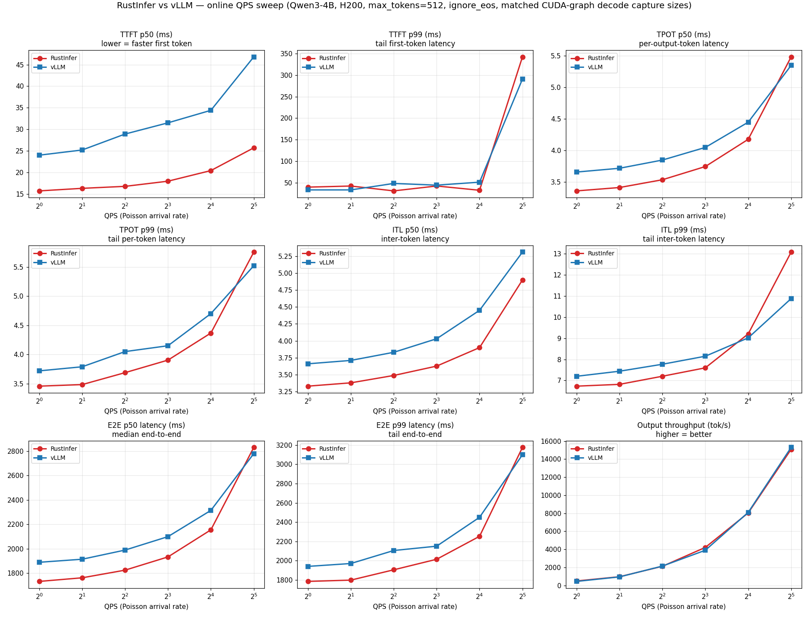

# RustInfer

A high-performance, **architecture-first** LLM inference engine written in Rust.
OpenAI-compatible API, continuous batching, paged KV cache, and CUDA-graph decode
— built on a hexagonal, zero-cost multi-backend core that swaps CUDA for CPU at
compile time with no runtime penalty.

[](LICENSE)
[](https://www.rust-lang.org/)
[](https://developer.nvidia.com/cuda-toolkit)

---

## Performance

RustInfer **outperforms vLLM** on an online QPS sweep — **Qwen3-4B, NVIDIA H200**,
`max_tokens=512`, `ignore_eos`, matched CUDA-graph decode capture sizes. Across the
sweep, RustInfer (red) holds lower TTFT / TPOT / ITL and lower end-to-end latency
than vLLM (blue) at equal or higher throughput:



> **RustInfer beats vLLM on the tail, not just the median.** Tail inter-token
> latency (**ITL p99**) stays below vLLM at *every* arrival rate — **6.6 → 9.0 ms**
> vs **7.2 → 10.9 ms** (qps 1 → 32) — alongside lower ITL / TPOT median and
> end-to-end latency at matched or higher throughput. Bench harness under `bench/`.

---

## Design philosophy

RustInfer is organized around a few principles, applied consistently top to bottom.

### Hexagonal core (ports & adapters)

`infer-core` owns nothing but **ports** — trait definitions for everything the
inference path needs from hardware:

```
infer-core/ports/
  backend.rs      math_ops.rs     fused_ops.rs
  sampler.rs      collective.rs   op_ports.rs
```

The backends are **adapters** that implement those ports: `infer-backend-cuda`
(`.cu` kernels + cuBLASLt + CUTLASS) and `infer-backend-cpu` (a pure-Rust reference
implementation, always linked, used as baseline and for tests). The core has zero
knowledge of CUDA; the entire GPU toolchain (nvcc / bindgen / cuDNN / CUTLASS) is
confined to the single `infer-backend-cuda` leaf crate.

### Heterogeneous backends at zero cost

The model layer is generic over an `LlmBackend` trait and **monomorphizes at
compile time** to whichever backend is selected — CUDA or CPU. There is no virtual
dispatch on the inference hot path: dispatch cost is paid by the compiler, not per
op. The same model code runs on GPU in production and on the CPU reference backend
in unit tests, byte-for-byte the same call sites.

### High cohesion, low coupling

Eight crates form an acyclic dependency graph with a GPU-free bottom. Each crate
has one job; cross-crate contact happens only through `infer-protocol` (wire types)
and `infer-core` (ports). Swapping a backend, a scheduler policy, or a transport
touches exactly one crate.

### DDD layering inside the worker

The worker — the most complex crate — is split into Domain / Application /
Infrastructure, so pure inference logic never mixes with I/O or orchestration:

```
infer-worker/src/
  domain/          model.rs, plan.rs, kv, forward_scratch, global_kv_alloc
                   → pure inference logic; no I/O, no transport
  application/     runtime, decode_engine, serve_loop, worker_scheduler,
                   sampler_stack, hosting  → orchestration & lifecycle
  infrastructure/  io, transport           → ZMQ / MsgPack adapters
  components/      attention, ffn, norm, embed, lm_head  → reusable NN blocks
  models/          llama3, qwen3, decoder, loader        → composition
```

### Model variation lives in the data, not in branches

A model's specialness (quantization, hybrid attention, tied embeddings) is an
**attribute of the operator/weight it lives on**, not a conditional threaded through
higher layers. The weight loader is generic and name-driven — it reads exactly the
tensor names and shapes the checkpoint declares; only the model module knows how to
assemble them.

---

## Architecture

Three cooperating processes share a single TOML config and communicate over
ZMQ (IPC) with MessagePack framing:

```
  infer-server              infer-scheduler                infer-worker
  ┌──────────────┐          ┌──────────────────┐          ┌────────────────────┐
  │ Axum /v1/... │          │ RadixTree prefix   │          │ Runtime<T,D,Model>  │
  │ chat template│  ZMQ     │   cache            │  ZMQ     │  ├ persistent ABC   │
  │ tokenizer    │ ───────► │ continuous batching│ ───────► │  ├ CUDA-graph capture│
  │ SSE stream   │ ◄─────── │ chunked prefill    │ ◄─────── │  └ KV / scratch pool │
  └──────────────┘          └──────────────────┘          │        │            │
         │                          │                       │        ▼            │
         └──────────┬───────────────┘                       │  DecoderModel       │
                    ▼                                        │  (Decoder<T,D>)     │
            infer-protocol                                   │        │            │
  (config / server↔sched / sched↔worker msgs)                │        ▼            │
                                                             │  Components         │
                                                             │ (Attention/FFN/...) │
                                                             └────────┬───────────┘
                                                                      │ calls ops
                                                                      ▼
                                                   infer-core ── LlmBackend (trait port)
                                                                      ▲        ▲
                                                        impl          │        │  impl
                                                  ┌───────────────────┘        └──────────┐
                                          infer-backend-cuda            infer-backend-cpu
                                          (.cu kernels + cuBLASLt)      (reference / tests)
```

### Workspace

| Crate                 | Role |
|-----------------------|------|
| `infer-core`          | Foundation: dtypes, quant scheme, value types, and the `LlmBackend` **ports**. GPU-free — the bottom of the DAG. |
| `infer-protocol`      | Wire types: config parsing + server↔scheduler↔worker messages. |
| `infer-server`        | Axum HTTP front end, OpenAI `/v1` API, chat template, SSE streaming. |
| `infer-scheduler`     | RadixTree prefix cache, continuous batching, chunked prefill, batch planning. |
| `infer-worker`        | GPU inference runtime (DDD: domain / application / infrastructure), models, components. |
| `infer-backend-cuda`  | CUDA adapter: `.cu` kernels + cuBLASLt; statically links the kernel set + CUTLASS. |
| `infer-backend-cpu`   | CPU adapter: pure-Rust reference backend; always linked as baseline / fallback. |
| `infer-frontend`      | Optional front end (outside the core inference path). |

---

## Features

- **OpenAI-compatible API** — `/v1/chat/completions` and `/v1/completions`, with
  SSE streaming, chat templates, and HF tokenizers.
- **Continuous batching** with chunked prefill and RadixTree prefix caching.
- **Paged KV cache** with profile-driven sizing and KV recycling.
- **CUDA-graph decode** — captured graphs over a fixed set of batch sizes, with a
  persistent ABC buffer that eliminates per-step allocation in the hot loop.
- **Quantization** — dense BF16 and AWQ int4 (W4A16) MLP.
- **Models** — Llama-3.2, Qwen3, Qwen3 (AWQ). Qwen3.5 hybrid attention
  (Gated DeltaNet + full attention) is in progress; see [Status](#status).

---

## Quick start

### Prerequisites

- Rust (2024 edition), a CUDA-capable GPU, and the CUDA toolkit.
- The cuDNN frontend headers on the include path:

```bash
export CUDNN_FRONTEND_INCLUDE_DIR=/path/to/site-packages/include
```

### Build

```bash
cargo build --release
```

### Run (one-shot e2e smoke test)

Launches scheduler + worker + server for a config, sends one chat completion,
prints the reply, and tears everything down:

```bash
scripts/e2e_smoke.sh run_qwen3.toml 8100 "Say hello in one short sentence."
```

### Run (manual, three processes)

Each binary takes the same `--config`:

```bash
./target/release/rustinfer-scheduler --config run_qwen3.toml &
./target/release/rustinfer-worker    --config run_qwen3.toml &
./target/release/rustinfer-server     --config run_qwen3.toml &
```

Then hit the OpenAI-compatible endpoint:

```bash
curl http://127.0.0.1:8100/v1/chat/completions \
  -H 'Content-Type: application/json' \
  -d '{"model":"Qwen3-4B-Instruct-2507",
       "messages":[{"role":"user","content":"What is the capital of France?"}]}'
```

Ready-to-use configs: `run_qwen3.toml`, `run_qwen3_awq.toml` (AWQ int4),
`run_llama1b.toml`.

---

## Configuration

Config is a single TOML shared by all three processes. Key fields:

| Field                   | Meaning |
|-------------------------|---------|
| `model`                 | Path to the HF model directory (config + safetensors + tokenizer). |
| `model_name`            | Name reported by the `/v1` API. |
| `device`                | e.g. `cuda:0`. |
| `port`                  | HTTP port for the server. |
| `max_batch_tokens`      | Token budget per forward batch. |
| `max_batch_seqs`        | Max concurrent sequences in a batch. |
| `max_model_len`         | Max context length. |
| `chunked_prefill_size`  | Chunked-prefill chunk size (`0` = disabled). |
| `enable_prefix_caching` | Toggle the RadixTree prefix cache. |
| `mem_fraction_static`   | Fraction of GPU memory reserved for weights + static buffers. |
| `num_blocks`            | KV-cache blocks (`0` = auto-size from a memory profile). |
| `capture_sizes`         | Batch sizes to capture CUDA graphs for, e.g. `[1,2,4,8,16,24,32]`. |
| `ignore_eos`            | Ignore EOS (useful for fixed-length benchmarking). |

---

## Status

RustInfer serves Llama-3.2, Qwen3, and Qwen3-AWQ end to end today.

Qwen3.5 (hybrid Gated DeltaNet + full attention) is being brought up in phases:
config parsing and the generic name-driven weight loader are done; the
heterogeneous forward path (recurrent state cache + full-attention output gate +
partial RoPE) is in progress.

---

## License

Licensed under the [Apache License 2.0](LICENSE).
