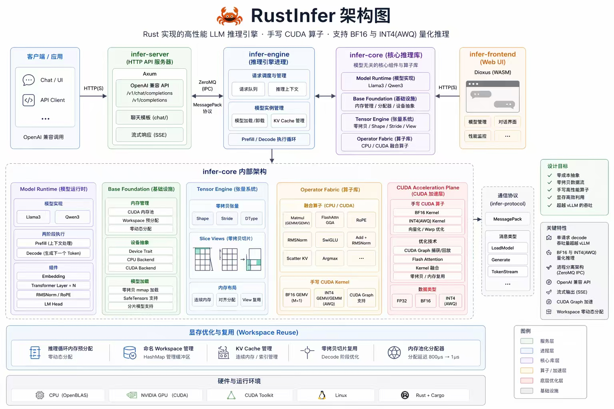

# RustInfer: Rust实现的高性能LLM推理引擎

RustInfer是一个用Rust语言实现的高性能大语言模型(LLM)推理引擎，手写CUDA算子，支持BF16与INT4(AWQ)量化推理，**单请求decode吞吐量超越vLLM**。

## 🏗️ 核心架构

<div align="center">



*高性能推理内核架构 - 从零成本抽象到显存优化*

</div>

RustInfer 采用**领域驱动设计(DDD) + 六边形架构**，核心设计原则：

### 三进程分离架构

```
┌─────────────┐     ┌─────────────┐     ┌─────────────┐
│   Server    │────▶│  Scheduler  │────▶│   Worker    │
│  (Axum HTTP)│     │ (Continuous │     │ (GPU Inference)
│             │◀────│  Batching)  │◀────│             │
└─────────────┘     └─────────────┘     └─────────────┘
       │                   │                   │
       └───────────────────┴───────────────────┘
                    ZeroMQ IPC
                 (MessagePack, 10-50µs)
```

- **Server**: Axum HTTP API 服务器，OpenAI 兼容接口
- **Scheduler**: 连续批处理调度器，负责请求调度和 KV 缓存管理
- **Worker**: GPU 推理运行时，执行模型前向传播

### DDD 分层架构

核心 crate (`infer-scheduler` / `infer-worker`) 采用 DDD 三层架构：

1. **Domain 层** (领域层)
   - 纯业务逻辑，无 IO 依赖，无异步运行时
   - 类型状态 (Typestate) 保证编译期状态安全
   - 策略模式 (Policy Pattern) 实现可插拔调度策略
   - 端口定义 (Ports) 通过 trait 实现依赖倒置

2. **Application 层** (应用层)
   - 编排器 (Orchestrator) + 系统 (Systems)
   - 异步事件驱动 (tokio select! 循环)
   - 工作流管理 (LLM/Diffusion)

3. **Infrastructure 层** (基础设施层)
   - IO 和运行时 (ZMQ Transport, CUDA Kernels)
   - 指标和监控 (Prometheus)
   - 具体实现 (CUDA Kernels, CPU 后备)

### 设计模式

- **Typestate Pattern**: 编译期状态验证，防止无效操作
- **Policy Pattern**: 可插拔调度策略 (ContinuousBatching, Diffusion, TokenBudget)
- **Repository Pattern**: 请求/会话管理
- **Port-Adapter Pattern**: Transport 层抽象，便于测试和扩展
- **Dependency Inversion**: Domain 定义 trait，Infrastructure 实现

---

## 📊 性能对比：RustInfer vs vLLM

> **测试环境**: H20, Batch Size=1, BF16, CUDA Graph enabled, vLLM compile disabled, temperature = 0, topk = None

### Qwen3-4B

| | RustInfer | vLLM |
|--|-----------|------|
| **Decode 吞吐量** | **294 tok/s** | 259 tok/s |

### Llama-3.2-1B-Instruct

| | RustInfer | vLLM |
|--|-----------|------|
| **Decode 吞吐量** | **920 tok/s** | **735 tok/s**  |

### Online Serving（Continuous Batching）

> **测试环境**: A10 GPU, Llama-3.2-1B-Instruct BF16, 1000 请求, concurrency=32, max_tokens=256, arrival_rate=20 req/s, Alpaca 数据集

| 指标 | RustInfer | vLLM 0.11.2 |
|------|-----------|-------------|
| **系统吞吐** | 2847 tok/s | 2952 tok/s |
| **p50 延迟** | **1245ms** | 1767ms |
| **p90 延迟** | **1948ms** | 2562ms |
| **p99 延迟** | 3010ms | **2830ms** |
| **平均延迟** | **1158ms** | 1527ms |
| **每请求 tps** | **125.4 tok/s** | 103.2 tok/s |

> 系统吞吐持平，RustInfer 延迟全面占优（p50 低 30%，平均低 24%），单请求体感更快。

<details>
<summary><b>复现步骤</b></summary>

**1. 配置 `rustinfer.toml`**

复制并修改 `rustinfer.toml`，设置 `model` 路径及其他参数：

```toml
model = "/path/to/your/model"
device = "cuda:0"
host = "0.0.0.0"
port = 8000
max_batch_tokens = 8192
max_batch_seqs = 32
max_model_len = 4096
paged_block_size = 1
mem_fraction_static = 0.9
log_level = "info"
```

**2. 构建**

```bash
cargo build --release --features cuda,models
```

**3. 启动 RustInfer（三进程）**

使用脚本一键启动（推荐）：

```bash
# Terminal 1: Scheduler（先启动，绑定 IPC sockets）
./scripts/start_scheduler.sh rustinfer.toml

# Terminal 2: Worker
./scripts/start_worker.sh rustinfer.toml

# Terminal 3: HTTP Server
./scripts/start_server.sh rustinfer.toml
```

> 脚本会自动设置 `RUST_LOG` 等环境变量，并以前台模式运行。
> 如需手动启动，直接运行二进制文件并传入 `--config` 参数：
> ```bash
> ./target/release/rustinfer-scheduler --config rustinfer.toml
> ./target/release/rustinfer-worker --config rustinfer.toml
> ./target/release/rustinfer-server --config rustinfer.toml
> ```

**4. 启动 vLLM**

```bash
pip install vllm==0.22.0
vllm serve ~/models/Qwen3-4B \
  --port 8000 --max-model-len 4096 \
  --gpu-memory-utilization 0.9 \
```

**5. 安装压测依赖并运行**

```bash
cd bench
pip install aiohttp
python bench_online.py \
  --url http://localhost:8000 \
  --num-requests 1000 \
  --concurrency 32 \
  --max-tokens 256 \
  --arrival-rate 20 \
  --dataset bench_prompts.json
```

> 数据集 `bench_prompts.json` 包含 51906 条 Alpaca prompts，请求按 20 req/s 泊松到达。

</details>

### INT4 AWQ 量化推理

> Batch Size=1, compressed-tensors K-packed INT4, BF16 activation

| 模型 | A10 (sm_86) | H20 (sm_90) |
|------|-------------|-------------|
| Llama-3.2-1B-AWQ | 326 tok/s (1.74x vs BF16) | **1000 tok/s** |
| Qwen3-4B-AWQ (MLP only) | 105 tok/s | 303 tok/s |

> **注意**: 长序列性能受到 flashdecode 影响，输出越长越慢。

**v0.7.0 优化路径（259 → 281 tok/s, Qwen3-4B）**:
- 手写 BF16 GEMV kernel，decode 阶段小矩阵比 cublasLt 快 25-44%
- 融合 scatter_kv kernel，每层省 1 次 kernel launch
- RMSNorm/fused_add_rmsnorm 线程数 128→256，提升 SM 占用率
- SwiGLU 精度修复（bf16 h2exp → FP32 expf）+ 去除运行时设备查询开销
- Benchmark 关闭流式打印，消除 tokenizer O(n²) decode 开销

---

## 🎨 文生图（Text-to-Image）

RustInfer 支持 **Z-Image** 系列模型进行高质量文生图推理，完全使用 Rust + CUDA 实现，无需 Python 依赖。

### 支持的模型

| 模型 | 推理步数 | 1024×1024 耗时 | 特点 |
|------|----------|----------------|------|
| [Z-Image-Turbo](https://huggingface.co/Tongyi-MAI/Z-Image-Turbo) | 2 步 | **1.1 秒** | 蒸馏加速版，极速生成 |
| [Z-Image](https://huggingface.co/Tongyi-MAI/Z-Image) | 50 步 | 24 秒 | 完整版，更高质量 |

> **测试环境**: H20 GPU, BF16 精度, CUDA Graph 优化

### 效果展示

**Prompt**: *一只可爱的橘色小猫咪，戴着白色围裙和厨师帽，在温馨明亮的厨房里做饭，阳光透过窗户洒进来，灶台上有一口冒着热气的锅，小猫用锅铲翻炒着五颜六色的蔬菜，表情专注又开心，厨房里摆放着绿植和可爱的厨房用品，温暖治愈的氛围，高清细腻，皮克斯风格*

<div align="center">
<table>
<tr>
<td align="center"><b>Z-Image-Turbo (2步, 1.1秒)</b></td>
<td align="center"><b>Z-Image (50步, 24秒)</b></td>
</tr>
<tr>
<td></td>
<td></td>
</tr>
</table>
</div>

### 快速使用

**1. 下载模型**

```bash
# Z-Image-Turbo（推荐，极速生成）
huggingface-cli download Tongyi-MAI/Z-Image-Turbo --local-dir ./Z-Image-Turbo

# Z-Image（完整版，更高质量）
huggingface-cli download Tongyi-MAI/Z-Image --local-dir ./Z-Image
```

**2. Rust 代码示例**

```rust
use infer_worker::model::diffusion::z_image::{ZImagePipeline, DiffusionRequest};
use infer_worker::base::device::DeviceType;

// 加载模型
let mut pipeline = ZImagePipeline::from_pretrained(
    "/path/to/Z-Image-Turbo",
    DeviceType::Cuda(0)
)?;

// Warmup（首次运行，预热 CUDA kernel）
pipeline.warmup_for(1024, 1024)?;

// 生成图片
let request = DiffusionRequest {
    prompt: "一只可爱的橘猫在厨房做饭，皮克斯风格".to_string(),
    height: 1024,
    width: 1024,
    num_inference_steps: 2,   // Turbo 用 2 步，Full 用 28-50 步
    guidance_scale: 1.0,      // Turbo 用 1.0，Full 用 4.5
    seed: Some(42),
    ..Default::default()
};

let output = pipeline.generate(&request)?;
// output.output: [1, 3, H, W] 的 RGB 张量，值域 [0, 255]
```

**3. 运行测试**

```bash
# Z-Image-Turbo 测试
cargo test --lib model::diffusion::z_image::pipeline::tests::test_pipeline_generate_cuda \
    --release -- --nocapture --ignored

# Z-Image 完整版测试
cargo test --lib model::diffusion::z_image::pipeline::tests::test_pipeline_z_image_full_cuda \
    --release -- --nocapture --ignored
```

### 参数说明

| 参数 | 类型 | 说明 |
|------|------|------|
| `prompt` | String | 文本描述，支持中英文 |
| `height` / `width` | u32 | 图片尺寸，建议 512-1024 |
| `num_inference_steps` | u32 | 去噪步数，Turbo=2，Full=28-50 |
| `guidance_scale` | f32 | CFG 强度，Turbo=1.0，Full=4.5 |
| `seed` | Option<u64> | 随机种子，固定可复现结果 |

### 技术特性

- **FlowMatch Euler Scheduler**: 支持可配置的 shift 参数（Turbo=3.0, Full=6.0）
- **BF16 精度**: 模型权重原生 BF16，减少显存占用
- **CUDA Graph 加速**: Warmup 后去噪循环高度优化
- **灵活参数**: 支持自定义分辨率、推理步数、CFG guidance scale、seed 等

---

### 项目结构

```
RustInfer/
├── crates/
│   ├── infer-protocol/    # 通信协议定义（MessagePack）
│   ├── infer-scheduler/   # 连续批处理调度器 (DDD 架构)
│   │   ├── domain/        # 领域层：请求、会话、调度策略
│   │   ├── application/   # 应用层：调度引擎 + 5 大系统
│   │   └── infrastructure/# 基础设施层：ZMQ、Prometheus、RadixTree
│   ├── infer-worker/      # GPU 推理运行时 (DDD 架构)
│   │   ├── domain/        # 领域层：Tensor、Ops、Ports (trait)
│   │   ├── application/   # 应用层：ModelRunner、CudaGraph
│   │   ├── models/        # 模型实现：Llama3、Qwen3、Diffusion
│   │   └── infrastructure/# 基础设施层：CUDA Kernels、CPU 后备
│   ├── infer-server/      # HTTP API 服务器（Axum）
│   │   ├── api/           # OpenAI 兼容端点
│   │   ├── chat/          # 聊天模板
│   │   └── client/        # ZMQ 客户端
│   └── infer-frontend/    # Web UI（Dioxus WASM）
├── DEVELOPERS.md          # 开发者文档（架构深度解析）
├── README.md              # 本文件
└── Cargo.toml             # 工作区配置
```

---

## 🚀 快速开始

### 1. 安装依赖

```bash
# Ubuntu/Debian
sudo apt-get update
sudo apt-get install clang libclang-dev pkg-config libssl-dev

# OpenBLAS（CPU后端）
sudo apt-get install libopenblas-dev

# 或使用Conda
conda install conda-forge::libclang anaconda::openssl
```

### 2. 克隆仓库

```bash
git clone https://github.com/Vinci-hit/RustInfer.git
cd RustInfer
```

### 3. 构建项目

```bash
# CPU版本
cargo build --release

# CUDA版本（需要CUDA toolkit）
cargo build --release --features cuda
```

**注意**: `build.rs` 会自动检测GPU计算能力（通过 nvidia-smi），也可通过 `CUDA_ARCH=sm_90` 环境变量手动指定。

### 4. 运行测试

先下载测试模型（Llama-3.2-1B-Instruct）：

```bash
uv run hf download unsloth/Llama-3.2-1B-Instruct --local-dir ./Llama-3.2-1B-Instruct
```

```bash
# 基础测试
cd RustInfer/crates/infer-worker
cargo test

# CUDA性能测试
cargo test test_llama3_cuda_performance --release -- --nocapture --ignored

# CPU推理测试
cargo test test_llama3_cpu_loading_and_generation --release -- --nocapture --ignored
```

---

## 🔬 Nsight Systems Profile 方法

> 目标：RustInfer 是三进程架构，端到端 profile 会混入 HTTP / Scheduler / ZMQ 等控制面开销。分析 GPU 性能时优先只 profile `rustinfer-worker`，因为真正 CUDA kernel 都在 Worker 进程内。

### 1. Worker-only 服务 profile

用脚本一键启动（推荐）：

**Terminal 1: Scheduler**

```bash
./scripts/start_scheduler.sh rustinfer.toml
```

**Terminal 2: Worker (profile)**

```bash
# 方法 A: --profile-cuda-steps 精确采集（推荐）
PROFILE_STEPS=200 ./scripts/start_worker_profile_steps.sh rustinfer.toml

# 方法 B: --delay/--duration 窗口采集（旧版）
./scripts/start_worker_profile.sh rustinfer.toml
```

> **方法 A** 使用 `--capture-range=cudaProfilerApi`，Worker 在第 N 个 step 后自动停止 profile，精确覆盖请求阶段。
> **方法 B** 使用固定时间窗口，需确保窗口覆盖实际请求而非模型加载。

**Terminal 3: HTTP Server + 压测**

```bash
./scripts/start_server.sh rustinfer.toml

python bench/bench_real_arrival.py \
  --url http://127.0.0.1:8000 \
  --model llama3.2-1b \
  --label RustInfer-PagedPrefix-Llama3.2-1B-nsys \
  --warmup-requests 2 \
  --num-requests 8 \
  --concurrency 2 \
  --arrival-rate 2 \
  --max-tokens 32 \
  --seed 20260521 \
  --verbose
```

生成统计：

```bash
nsys stats \
  --report cuda_gpu_kern_sum,cuda_gpu_mem_time_sum,cuda_api_sum,osrt_sum \
  result/nsys_worker_steps.nsys-rep
```

### 2. Operator 级 profile（用于验证 nsys 能采到 kernel）

服务进程 profile 容易因 `--delay/--duration` 窗口没覆盖请求而只采到初始化。可以先用确定会执行 CUDA kernel 的测试二进制验证 nsys：

```bash
cd /root/RustInfer
cargo test -p infer-worker --features cuda,models --no-run
BIN=$(ls -t target/debug/deps/infer_worker-* | grep -v '\.d$' | head -n1)

nsys profile \
  --trace=cuda,cublas,nvtx,osrt \
  --cuda-trace-all-apis=true \
  --sample=none \
  --cpuctxsw=none \
  --force-overwrite=true \
  --output=/root/RustInfer/result/nsys_op_decode \
  ${BIN} test_flash_attn_decode_batch --nocapture

nsys stats \
  --report cuda_gpu_kern_sum,cuda_gpu_mem_time_sum,cuda_api_sum \
  /root/RustInfer/result/nsys_op_decode.nsys-rep
```

### 3. 当前验证状态

- `bench_real_arrival.py` 的 Paged + prefix cache 小规模真实请求已经能跑通，无 timeout / panic。
- 直接 profile `infer_worker` 测试二进制可以成功采集 CUDA kernel，例如 `flash_batched_decode::pass1_kernel`。
- Worker-only serving profile 已接入 `--profile-cuda-steps=N`，可配合 `--capture-range=cudaProfilerApi` 精确采集请求阶段。
- 若未设置 `--profile-cuda-steps`，使用 `--delay/--duration` 时需要准确覆盖请求窗口；否则可能只采到初始化 kernel（如 `sin_cos_calc_bf16`）和 H2D memcpy。

---

## 📦 支持的模型

### Llama 3 系列

| 模型 | 参数量 | BF16 | INT4 AWQ | 推荐设备 |
|------|--------|------|----------|----------|
| Llama-3.2-1B-Instruct | 1B | ✅ | ✅ 912 tok/s (H20) | CPU / GPU |

### Qwen3 系列

| 模型 | 参数量 | BF16 | INT4 AWQ | 推荐设备 |
|------|--------|------|----------|----------|
| Qwen3-4B-Instruct | 4B | ✅ | ✅ 105 tok/s (A10, MLP only) | GPU (8GB+) |

**下载地址**:
- [Llama-3.2-1B-Instruct](https://huggingface.co/unsloth/Llama-3.2-1B-Instruct)

**支持格式**:
- ✅ SafeTensors (.safetensors)
- ✅ 分片模型 (model.safetensors.index.json)
- ✅ HuggingFace Tokenizer (tokenizer.json)
- ✅ compressed-tensors K-packed INT4 量化

---

## 📊 性能基准与版本演进

### 性能提升历程

> **测试环境**: H20, CUDA Graph, decode steps=256

| 版本 | Decode 吞吐量 | 关键优化 |
|------|--------------|----------|
| v0.9.0 | **Llama-1B BF16: BS1=816, BS4=2919, BS8=5519** / **Qwen3-4B BF16: BS1=270, BS4=964, BS8=1793** | Continuous Batching + 全面超越 vLLM |
| v0.9.0 | **Llama-1B-AWQ BS1=881** / **Qwen3-4B-AWQ BS1=287** (暂不支持 Tensor Core，BS>1 慢，只看 BS=1) | INT4 AWQ batch 支持 |
| v0.8.0 | 1000 tok/s (Llama-1B-AWQ, BS=1) / 303 tok/s (Qwen3-4B-AWQ, BS=1) | INT4 AWQ 量化推理 |
| v0.7.0 | 829 tok/s (Llama-1B, BS=1) / 281 tok/s (Qwen3-4B, BS=1) | 手写GEMV + kernel融合 + 算子调优 |
| v0.6.0 | 259 tok/s | 融合GEMM + 零拷贝decode + 融合add+rmsnorm |
| v0.5.0 | 192 tok/s | Qwen3-4B支持 |
| v0.2.0 | 436 tok/s (Llama-3.2-1B-Instruct) | BF16 + Flash Attention |
| v0.1.0 | 220 tok/s (Llama-3.2-1B-Instruct) | 基线 |

### v0.9.0 vs vLLM 对比 (H20, CUDA Graph, decode 256 steps)

**Llama3-1B BF16**:
| Batch | RustInfer | vLLM | Δ |
|---:|---:|---:|---:|
| 1 | **816** | 732 | **+11.5%** |
| 2 | **1536** | 1444 | **+6.4%** |
| 4 | **2919** | 2831 | **+3.1%** |
| 8 | 5519 | 5590 | -1.3% |

**Qwen3-4B BF16**:
| Batch | RustInfer | vLLM | Δ |
|---:|---:|---:|---:|
| 1 | **270** | 254 | **+6.2%** |
| 2 | **503** | 504 | 持平 |
| 4 | 964 | 1002 | -3.9% |
| 8 | 1793 | 1960 | -8.5% |

### 版本历史

#### v0.9.0 (当前) - Continuous Batching + 性能全面超越 vLLM
**发布日期**: 2026-05

**核心改进**:
- **Continuous Batching**: 完整的 batch runner 架构，支持 BS=1~8 动态 batching + CUDA Graph
- **Flash-Decoding pass1 重写**: cp.async 双缓冲 + BF16 hmul2 score + 16-group warp-reduce，pass1 从 13.9µs → 3.4µs（-75%）
- **Fused SwiGLU (packed)**: gate_up [T, 2*inter] → out [T, inter] 单 kernel，省掉 2 次 split_cols launch
- **Permute 消除**: QKV 整体 3D reshape + narrow head 维，避免 Q reshape 触发 contiguous copy
- **lm_head GEMM 修复**: BS≤4 时不再逐行 GEMV，统一走 cuBLAS GEMM
- **INT4 batched GEMM 支持**: 暂不支持 Tensor Core，BS>1 慢于 BF16，只看 BS=1
- **Z-Image diffusion 恢复**: text encoder / DiT / VAE 全链路跑通，50 步 1024×1024 生图 24s
- Llama3-1B BF16 BS=1~4 **全面超越 vLLM**，BS=8 差距仅 1.3%
- Llama3-1B-AWQ BS=1: 881 tok/s（vs BF16 816，+8%）
- Qwen3-4B-AWQ BS=1: 287 tok/s（vs BF16 270，+6%）

#### v0.8.0 - INT4 AWQ 量化推理
**发布日期**: 2026-04

**核心改进**:
- INT4 AWQ 量化推理：compressed-tensors K-packed 格式，手写 GEMV/GEMM CUDA kernel
- Llama-3.2-1B-AWQ: **912 tok/s** decode（H20），**326 tok/s**（A10），相比 BF16 提速 1.74x
- Qwen3-4B-AWQ (MLP only): **105 tok/s** decode（A10），H20 待调优
- QuantParams 抽象 enum，可扩展 GPTQ / FP8
- RoPE scaling (Llama3.1/3.2) 移入 CUDA kernel，支持 BF16/FP16
- 量化 GEMV/GEMM 合并到 matmul 统一模块

#### v0.7.0 - 手写GEMV + Kernel级优化，281 tok/s
**发布日期**: 2026-04

**核心改进**:
- 手写 BF16 GEMV kernel：decode 阶段 M=1 时替代 cublasLt，bf16x8 向量化 + shared memory 缓存输入 + warp shuffle 归约 + `__ldg` read-only cache，小矩阵（QKV/wo/w2）比 cublasLt 快 25-44%
- 智能 dispatch：N≤16384 走自定义 GEMV，N>16384（lm_head）走 cublasLt
- 融合 scatter_kv kernel：K/V cache 写入合并为单次 kernel launch，每层省 1 次 launch
- RMSNorm / fused_add_rmsnorm 线程数 128→256，提升 SM 占用率
- SwiGLU 精度修复：bf16 原生 h2exp 替换为 FP32 expf，消除精度损失
- SwiGLU 去除运行时 cudaGetDevice/cudaDeviceGetAttribute 开销
- Benchmark 关闭流式打印，消除 tokenizer 全量 decode 的 O(n²) 开销
- 新增 SGLang benchmark 脚本

**性能**:
- Qwen3-4B (H20): **281 tok/s**
- Llama-3.2-1B-Instruct (H20): **829 tok/s**

#### v0.6.0 - Decode性能优化，超越vLLM
**发布日期**: 2026-04

**核心改进**:
- 融合 QKV GEMM：加载时拼接 Wq/Wk/Wv，每层 3 次矩阵乘 → 1 次
- 融合 Gate-Up GEMM：拼接 W1/W3，每层 2 次矩阵乘 → 1 次
- Decode 零拷贝列切片：seq_len=1 时直接 slice 出 q/k/v view，无需 split_cols kernel
- 多 block 并行 argmax：替代单 block 扫描（202µs → 5µs）
- 融合 residual-add + RMSNorm：合并残差加法与归一化，跨层融合（每层 2 处）
- cudaGraphLaunch 开销：752µs → 90µs（减少 180 个 graph node）

#### v0.5.0 - Qwen3 模型支持
**发布日期**: 2026-04

- Qwen3-4B 推理支持（per-head QK-norm, head_dim=128, CUTE Flash Attention）
- 参数化 RoPE theta，UTF-8 增量安全流式输出

#### v0.4.0 - 架构升级
**发布日期**: 2026-01

- 进程分离架构（infer-scheduler + infer-server + infer-protocol）
- ZeroMQ IPC 通信（MessagePack，10-50µs 延迟）

#### v0.3.0 - CUDA Graph优化
**发布日期**: 2026-01

- CUDA Graph 捕获与回放，decode kernel 启动开销大幅降低

#### v0.2.0 - 性能突破
**发布日期**: 2026-01

- BF16 混合精度：decode 220 → 436 tok/s (2x)，显存 4GB → 2GB
- Flash Attention GQA，cuBLASLt 自动调优

#### v0.1.0 - 初始版本
**发布日期**: 2025-10

- Llama3 完整推理，CPU/CUDA 双后端，KV缓存，OpenAI兼容API
- 基线: decode 220 tok/s, prefill 355 tok/s (F32)

---

## ⚡ 性能优化技术

### 已实现的优化

1. **CUDA内存池化** (`/crates/infer-worker/src/base/allocator.rs`)
   - 分配延迟: 800µs → 1µs
   - 线程安全并发访问（DashMap）
   - 双层池策略（小块first-fit，大块best-fit）

2. **零拷贝模型加载** (`/crates/infer-worker/src/model/loader.rs`)
   - mmap直接映射文件
   - 无需反序列化（100x加速）
   - 安全的生命周期扩展

3. **Workspace预分配** (`/crates/infer-worker/src/model/llama3.rs`)
   - 预分配最大尺寸缓冲区
   - 推理循环零内存分配
   - HashMap管理命名缓冲区

4. **CUDA Graph捕获** (`/crates/infer-worker/src/cuda/config.rs`)
   - 首次迭代捕获计算图
   - 后续迭代回放图（10-100x加速）
   - 消除kernel启动开销

5. **Flash Attention** (`/crates/infer-worker/src/op/kernels/cuda/flash_attn_gqa/`)
   - 分块注意力计算
   - 在线softmax
   - 减少3x内存访问

6. **算子融合**
   - SwiGLU: gate + silu + multiply单kernel
   - 融合 QKV / Gate-Up GEMM：加载时拼接权重，减少kernel数量
   - 融合 residual-add + RMSNorm：单kernel完成残差加法+归一化
   - 融合 scatter_kv：K/V cache 单次kernel写入
   - Decode 零拷贝列切片：seq_len=1时无需split kernel

7. **手写 BF16 GEMV kernel**
   - Decode M=1 场景替代 cublasLt（避免 splitK + Tensor Core 填充开销）
   - bf16x8 向量化加载 + FP32 累加 + warp shuffle 归约
   - `__ldg` read-only cache 路径减少 L1 thrashing
   - 智能 dispatch：小矩阵走 GEMV，大矩阵走 cublasLt

8. **INT4 AWQ 量化推理**
   - compressed-tensors K-packed INT4 格式
   - 手写 INT4 GEMV kernel：int4 向量化 weight + input 读取，warp reduction
   - QuantParams enum 抽象，可扩展 GPTQ / FP8
   - RoPE scaling (Llama3.1/3.2) 直接在 CUDA kernel 内完成

9. **BF16混合精度**
   - GPU使用BFloat16
   - 2x内存带宽
   - FP32累加器保证精度

---

## ⚠️ 当前限制

### 已实现 ✅
- [x] Llama3 / Qwen3 模型推理
- [x] 进程分离架构（ZeroMQ IPC）
- [x] KV缓存管理
- [x] CPU和CUDA双后端
- [x] F32和BF16数据类型
- [x] OpenAI兼容API
- [x] 流式响应（SSE）
- [x] CUDA Graph优化
- [x] Flash Attention GQA
- [x] 融合 QKV / Gate-Up GEMM
- [x] 融合 residual-add + RMSNorm
- [x] Decode 零拷贝列切片
- [x] 手写 BF16 GEMV kernel（decode M=1）
- [x] 融合 scatter_kv（K/V cache 单次写入）
- [x] INT4 AWQ 量化推理（compressed-tensors K-packed）
- [x] **文生图（Z-Image / Z-Image-Turbo）**: 1024×1024 图片 1.1 秒生成

### 待实现 🔄

**高优先级**:
- ⚠️ **Batch decode 正确性 bug**: batch>1 时序列间交叉污染 (cross-contamination)，paged attention 读到其他序列的 KV data，导致输出混乱并提前触发 EOS。batch=1 正常，batch≥4 明显退化。
- ⚠️ **Batch 吞吐量低于 vLLM**: batch=16/32 聚合吞吐比 vLLM 低 33%，原因是上述正确性 bug 导致请求提前结束 + scheduler 在高并发下填充率不足。
- 采样器：仅argmax，缺少temperature/top-p/top-k
- 连续批处理：目前串行处理请求
- PagedAttention：固定KV缓存大小

**中优先级**:
- 多模型架构支持
- 部分算子CUDA优化不足
- 错误处理改进（减少unwrap）

**低优先级**:
- 自定义停止序列
- Token概率输出
- Function calling
- API认证机制

详细技术实现指南请参阅 **[DEVELOPERS.md](DEVELOPERS.md)**

---

## 🛠️ 开发指南

### 添加新算子

请参阅 [DEVELOPERS.md](DEVELOPERS.md) 中的详细模板和示例。

关键步骤:
1. 实现 `Op` trait
2. CPU和CUDA双后端
3. 编写CUDA kernel
4. 添加单元测试

### 添加新模型

参考 `/crates/infer-worker/src/model/llama3.rs` 实现:
1. 定义配置结构
2. 实现层组合
3. Workspace管理
4. 两阶段推理（prefill/decode）

完整指南: [DEVELOPERS.md](DEVELOPERS.md)

---

## 📄 许可证

Apache License 2.0 - 详见 [LICENSE](LICENSE)

---

## 🙏 致谢

**灵感来源**:
- [KuiperLLama](https://github.com/zjhellofss/KuiperLLama) - 课程项目
- [vLLM](https://github.com/vllm-project/vllm) - 推理引擎设计

**技术栈**:
- 🦀 Rust - 内存安全与零成本抽象
- ⚡ CUDA - GPU加速
- 🌐 Axum + Dioxus - 现代Web
- 📦 ZeroMQ - 高性能IPC
- 🎯 HuggingFace - 模型生态

---

<div align="center">

**如果这个项目对你有帮助，请给我们一个 ⭐ Star！**

Made with ❤️ and 🦀 Rust

[GitHub](https://github.com/Vinci-hit/RustInfer) • [Issues](https://github.com/Vinci-hit/RustInfer/issues)

</div>

优化/替换 flash_paged_decode::paged_decode_pass1_kernel
当前是最大 GPU 差距源。
对比 vLLM FlashAttn decode 路径。
减少 Qwen3 norm kernel 数 / fuse QK norm
RI norm 比 vLLM 多 86 ms。
尤其 Q/K norm 是否能合并或做 inplace/strided fusion。
优化 batched argmax
RI sampling 多约 30 ms。