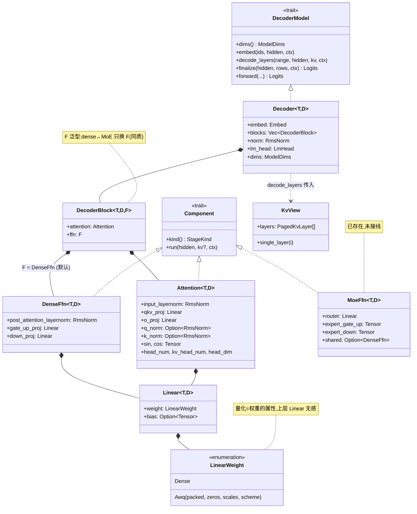
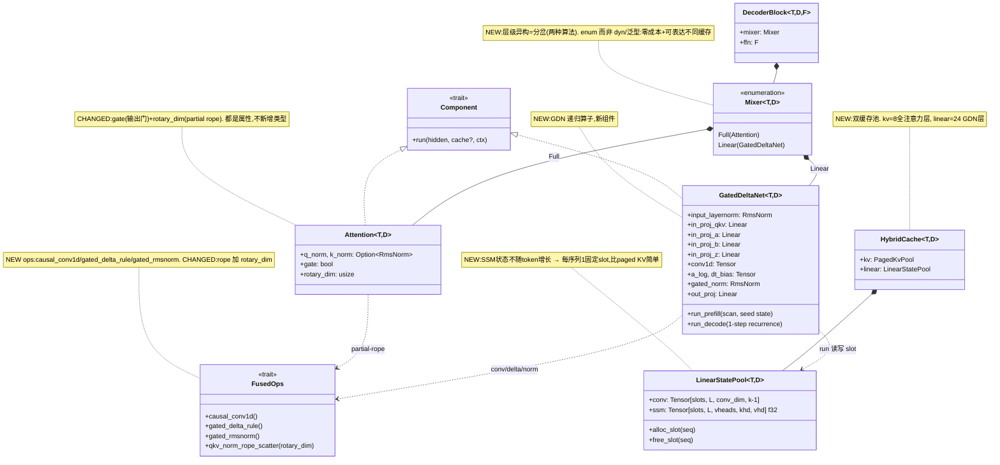

# 架构图 — RustInfer 现状 & qwen3_5 混合注意力扩展

> 配套文档:`docs/DESIGN_qwen3_5.md`(权威设计,v1 = 纯文本)。
> 本文件只画图 + 讲扩展方法论,不重复设计细节。
> Mermaid 类图在 GitHub / IDE 中渲染为 UML;ASCII 图终端直读。

---

## ① 系统分层与进程架构

```
┌────────────────────────────────────────────────────────────────────────┐
│  3 个进程,共享一份 TOML,ZMQ(IPC) + MsgPack 互联                        │
└────────────────────────────────────────────────────────────────────────┘

  infer-server              infer-scheduler                infer-worker
  ┌──────────────┐          ┌──────────────────┐          ┌────────────────────┐
  │ Axum /v1/... │          │ RadixTree 前缀缓存 │          │ Runtime<T,D,Model>  │
  │ ChatTemplate │  ZMQ     │ ContinuousBatching │  ZMQ     │  ├ 持久 ABC buffer   │
  │ Tokenizer    │ ───────► │ chunked prefill    │ ───────► │  ├ CUDA graph 捕获   │
  │ SSE stream   │ ◄─────── │ batch planning     │ ◄─────── │  └ KV/scratch 池     │
  └──────────────┘          └──────────────────┘          │        │            │
         │                          │                       │        ▼            │
         └──────────┬───────────────┘                       │  DecoderModel       │
                    ▼                                        │  (Decoder<T,D>)     │
            infer-protocol                                   │        │            │
   (config / server↔sched / sched↔worker 消息)               │        ▼            │
                                                             │  Components         │
                                                             │ (Attention/FFN/...) │
                                                             └────────┬───────────┘
                                                                      │ 调用 ops
                                                                      ▼
                                                    infer-core  ── LlmBackend (trait 端口)
                                                                      ▲        ▲
                                                          实现        │        │  实现
                                                    ┌─────────────────┘        └────────────┐
                                            infer-backend-cuda            infer-backend-cpu
                                            (.cu kernels + cuBLASLt)      (参考实现,测试用)
```

**支点:** infer-core 定义 `LlmBackend` 端口(trait),两个后端实现它。模型层泛型
`<D: LlmBackend>` 编译期单态化到 Cuda 或 Cpu,无虚调用 —— 这是"零成本抽象"的落点。

---

## ② 当前核心类图(模型 / 组件子系统)



**当前架构的两个隐含假设(qwen3_5 要打破的):**
- `DecoderBlock.attention` 是**具体类型** `Attention` → 全模型只能有一种 token mixer。
- `decode_layers` 只传一个 `KvView` → 假设**每层都用 paged KV**。

---

## ③ 目标类图:加 qwen3_5 后(NEW / CHANGED)



**五处改动 ↔ 设计决策:**

| 图上元素 | 决策 | 关键理由 |
|---|---|---|
| `Mixer` enum | 层级分岔 + 机制选择 | 两种算法**分岔**;用 **enum**(泛型装不下混合 Vec,dyn 擦除缓存类型) |
| `Attention` + gate/rotary_dim | 变体属性化 | 全注意力的变化全做属性,不新增类型 |
| `HybridCache` + `LinearStatePool` | 缓存分池 | 缓存类型是**层的静态属性** → 分池;SSM 固定大小 → slot 分配器 |
| `FusedOps` 新 ops | 算子落地 | 先 CPU 参考 → CUDA sequential → chunked |
| `GatedDeltaNet` | — | 新组件,编排上述 ops |

---

## ④ forward 流程对比

```
当前(同质,32 层都一样):
  embed
   └►[ DecoderBlock ]×32 ─► attention(KvView[i]) ─► ffn ─┐
                                                          └► 残差
   ─► norm ─► lm_head ─► logits

qwen3_5(异构,per-layer match):
  embed
   └►[ DecoderBlock ]×32
        │
        ├─ match mixer:
        │    ├ Full(attn)    ─► attention(cache.kv[full_ord])         ─┐  ← paged KV
        │    └ Linear(gdn)   ─► gated_delta_net(cache.linear[lin_ord]) ─┤  ← 递归状态 slot
        │                                                              │
        └─ ffn(dense) ───────────────────────────────────────────────┘► 残差
   ─► norm ─► lm_head(tied) ─► logits

   layer_types = [L,L,L,F, L,L,L,F, ...]   full_ord/lin_ord 加载时记死(ordinal)
```

`match mixer` = 零成本分岔:一次跳转、分支预测常命中、两支各自内联,相对层内
2560×9216 的 GEMM 成本可忽略。

---

## ⑤ 通用方法论:加**任意**新模型的扩展点

沿数据流从外到内,每一层的插槽:

```
① infer-protocol/config.rs      → resolve_model_type 认出新 model_type
② infer-server/chat/template.rs → 新 ChatTemplate(聊天格式不同)
③ worker_main.rs HfConfig       → 解析新配置字段(如嵌套 text_config)
④ domain/model.rs ModelDims     → 新维度字段(如 layer_types / linear dims)
⑤ components/                   → 新算子组件(如 GatedDeltaNet);变体优先做属性
⑥ models/loader.rs              → 权重名映射 + per-layer 构造
⑦ infer-core/ports + backends   → 新 ops 的 trait 方法 + CPU参考 + CUDA实现
⑧ domain/ 缓存                  → 若缓存语义不同,新增独立池(不污染 KvView)
```

**判断每处该"加属性"还是"加类型"的尺:**

> **共享控制流 → 属性(改数据 / 加参数);不共享 → 新类型 / enum 分支。**

判据看**控制流,不看外表**:head_dim=256 与 128 外表差很多但控制流相同 → 属性;
GDN 递归与 softmax 注意力"都是 token mixer"但控制流两回事 → 分岔。
qwen3_5 里 gate / partial-rope / head_dim256 走属性;GDN 层与递归缓存走新类型。
