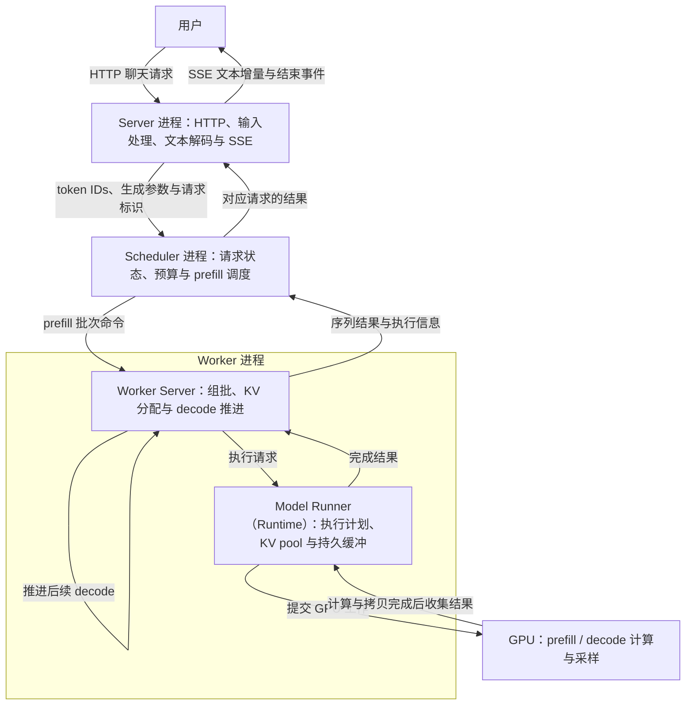

# 引言：一条推理请求的旅程

当我们向 RustInfer 发送一条消息，屏幕上很快会开始出现回答。从使用者的视角看，这是一次 HTTP 请求和一段逐步返回的文本；从推理系统内部看，它经历了输入处理、请求排队、资源分配、模型计算和结果传递。理解这些环节如何衔接，是理解整个项目的起点。

RustInfer 的服务由 Server、Scheduler 和 Worker 三个进程协作完成。Worker 内部的服务层称为 Worker Server，负责接收命令、组织批次和返回结果；模型执行器称为 Model Runner，负责把批次执行请求变成模型计算。项目源码中，模型执行器的核心类型名为 `Runtime`，它属于 Worker 进程。

本书从一条请求出发，沿着它经过的边界逐层深入，再通过索引进入具体领域和技术机制。我们会先建立完整的执行图景，随后分别讨论请求生命周期、调度、KV Cache、Worker 内部的模型执行、CUDA 算子和张量并行。每一部分都围绕几个问题展开：它负责什么，拥有什么状态，需要保证哪些条件，又如何与其他部分协作。

这里先跟随一条普通文本聊天请求。假设模型已经加载完成，Worker 已经就绪，使用单卡 dense 模型、BF16 权重和普通自回归生成。请求开启流式输出，暂时关闭前缀复用和推测解码。前缀复用会作为这条主线上的一个扩展说明；多卡执行则在后续 TP 章节展开。

请求首先到达 `infer-server`。Server 使用 Axum 接收 HTTP 请求，根据路由将其交给相应的异步处理函数。在请求进入推理流程之前，服务需要完成容量准入和参数校验，再将聊天消息按模型使用的模板组织成 prompt，通过 tokenizer 转换为 token IDs。模型最终处理的是这些整数编号，而聊天消息中的角色和文本需要先转换成模型能够理解的输入形式。

这里已经出现了第一种协作关系：异步请求处理与阻塞工作之间的协作。Axum 的处理函数可以通过 `.await` 等待结果；模板处理和 tokenizer 编码这类 CPU 工作被放入 `spawn_blocking` 的阻塞线程池。Server 与 Scheduler 的 ZMQ 通信则由专用线程负责，异步处理函数通过 channel 与它交互。这样的分工让各类工作使用适合自己的执行方式，同时把它们连接到同一条请求生命周期上。

随后，Server 将 token IDs、生成参数和请求标识等信息发送给 `infer-scheduler`。Scheduler 接收并登记请求，将其纳入等待队列。请求需要在 Worker 可用、计算预算和存储预算允许的条件下进入执行。调度器既要考虑一批可以处理多少 token、容纳多少序列，也要考虑 KV Cache 的容量，以及已经派发、尚未收到确认的工作所占用的预算。

满足条件的请求进入 prefill 阶段。Prefill 处理输入 prompt，为输入 token 计算各层需要保留的 K/V，并在 prompt 处理完成后产生第一个输出 token。较长的 prompt 可以分成多个片段，在多轮执行中完成。Scheduler 因此需要区分等待、正在 prefill 和正在 decode 的请求，持续记录它们的进度。

这也是 RustInfer 调度职责的一个重要边界：中央 Scheduler 负责首次和后续片段的 prefill 调度，Worker 内部负责持续推进 decode。Scheduler 中存在 Decoding 状态，用于管理请求生命周期和处理结果；每一步 decode 的具体执行由 Worker 自己的循环驱动。

如果开启前缀复用，Scheduler 还会查找可复用的前缀，并在满足条件时附带命中的全局 KV 索引，让 Worker 跳过相应的重复计算。Scheduler 管理前缀索引及使用关系，Worker 管理实际的 KV 存储。这条扩展路径还需要处理前缀引用、淘汰和命中边界；例如当前实现遇到整个 prompt 的 KV 命中时，会放弃该次复用并重新 prefill，因为已有 KV 本身并没有保存生成第一个输出 token 所需的 logits。

批次命令到达 Worker 后，进入执行期的资源管理。Worker 根据本次要计算的 token 数量分配 KV slot，并组织序列长度、位置、block table 等元数据。当前分配器按 token slot 管理资源：一条没有复用前缀的 100-token prompt，在完成 prefill 后需要保存 100 个 token 的 KV；后续普通 decode 每个活动序列每步处理一个输入 token，通常再新增一个 slot。实际分配还可能包含后续步骤的预留。

请求在批次中的行号、请求自身的身份，以及它持有的 KV 索引，分别承担不同的作用。一个请求可以拥有许多 KV slot；当某些请求结束、批次发生压缩时，剩余请求的行号也可以改变。Worker 通过这些映射将逻辑序列与物理存储对应起来，使不同请求能够共同进入一次模型计算。

Worker 的服务层将准备好的逻辑执行请求交给内部的 Model Runner，也就是源码中的 `Runtime` 对象。普通单卡主路径通过进程内函数调用完成这次交接。Runtime 进一步构建和校验执行计划，将索引等控制信息准备到模型计算需要的位置，再调用模型和底层算子。它持续持有模型、KV pool、临时工作区、CUDA Graph 以及输入输出缓冲等执行资源。请求准入策略与执行机制各有归属，而执行资源需要跨越多个 step 保持有效。

在 GPU 上，这一步会经过 embedding、各层 attention 和前馈网络，最终得到 logits，再按采样策略产生输出 token。满足捕获形状和图可用性等条件时，Runtime 可以重放 CUDA Graph；其他情况采用 eager 路径逐步提交算子。Graph 是执行方式的一种选择，正确执行仍然依赖有效的索引、内存布局、缓冲生命周期和同步关系。

Prefill 与 decode 还有一个容易混淆的时间关系：本次计算写入 KV 的是本次输入 token 的 K/V。刚采样得到的输出 token，通常会成为下一次 decode 的输入，再在那次计算中产生自己的 K/V。生成过程因而是一轮接着一轮推进的：处理当前输入、更新缓存、得到下一个 token，再将这个 token 带入后续计算。

Worker 在推进计算的同时，还要接收新到达的 prefill、处理控制消息，并将完成的结果送回 Scheduler。当前普通单卡主路径由一个主服务循环组织这些工作。CPU 调用 CUDA 提交接口后，GPU 可以继续执行已经入队的工作，CPU 则有机会继续处理消息和发送结果。异步执行建立的是 CPU 与 GPU 的时间重叠，具体依赖由 stream、event 和缓冲使用规则约束。

以普通 greedy 的纯 decode 稳态路径为例，主循环会先收集第 N 轮结果并更新状态，再提交第 N+1 轮 GPU 工作，然后发送第 N 轮结果。发送以及后续循环中的部分 CPU 工作可以与第 N+1 轮 GPU 计算重叠。读取结果前仍须确认相关计算和拷贝已经完成，缓冲也要在使用结束后才能复用。冷启动、混合 prefill/decode 和其他采样路径有各自的执行安排，后续 Runtime 章节会逐一展开。

结果返回时，Worker 携带序列标识发送生成的 token 和相应执行信息。Scheduler 更新请求进度与资源记录，找到对应的客户端和请求，再将输出送回 Server。Server 将收到的 token IDs 增量解码为文本，并封装为 SSE 事件沿 HTTP 响应流发给用户。token 与文本片段并非一一对应，例如一个字符可能需要多个 token 才能完整解码，因此某一轮得到 token 后，未必立即产生可见文本。

当生成达到停止条件，请求进入结束处理：相关状态被更新，资源被回收；启用前缀缓存时，符合保留条件的 KV 可以继续用于后续请求。Server 完成响应流的结束处理，这条请求的正常旅程才告一段落。后续章节还会沿着同一条链路考察取消、资源不足和 Worker 故障，理解各个参与者如何完成自己的收尾工作。

下面的数据流图概括请求经过的主要边界，具体的 CPU/GPU 重叠时序在 Runtime 章节展开。

沿着这条执行链，DDD 的组织方式也逐渐清晰。领域模型表达请求状态、资源预算和相关不变量，应用层把这些规则组合成调度和执行用例，基础设施层承接通信、存储访问和设备实现。章节会依据职责与状态边界组织，再映射到具体模块；同一个请求则贯穿这些层，帮助我们理解局部设计如何共同形成完整的推理服务。

阅读时，可以先沿正文走完这条主线，再按下表进入相关源码。对 Runtime 的分析将继续深入 CUDA 执行与内存管理，之后再把单卡步骤扩展到多个 TP rank，讨论分片、通信、执行一致性和故障处理。

| 关注的问题 | 源码阅读入口 |
| --- | --- |
| HTTP 输入如何变成推理请求 | [聊天请求处理](../../crates/infer-server/src/api/openai/chat.rs)、[ZMQ 通信桥接](../../crates/infer-server/src/client/zmq_client.rs) |
| 请求何时进入执行 | [请求生命周期](../../crates/infer-scheduler/src/domain/inference_session/lifecycle.rs)、[调度策略](../../crates/infer-scheduler/src/domain/policy/continuous_batching.rs) |
| 前缀复用与物理 KV 如何关联 | [前缀规划](../../crates/infer-scheduler/src/application/planning.rs)、[KV 分配器](../../crates/infer-worker/src/domain/global_kv_alloc.rs) |
| Worker 如何接入与推进工作 | [服务循环](../../crates/infer-worker/src/application/serve_loop.rs)、[Worker 调度](../../crates/infer-worker/src/application/worker_scheduler.rs) |
| 一步计算如何执行与完成 | [Model Runner 的 Runtime 实现](../../crates/infer-worker/src/application/runtime/mod.rs)、[DecodeEngine](../../crates/infer-worker/src/application/decode_engine.rs)、[ABC 执行路径](../../crates/infer-worker/src/application/runtime/abc_decode.rs) |
| token 如何变成流式文本 | [增量解码](../../crates/infer-server/src/api/openai/decoder.rs)、[SSE 输出](../../crates/infer-server/src/api/openai/streaming.rs) |

沿阅读主线进入[第 1 章：请求与会话的生命周期](chapters/requests/01-lifecycle.md)，先区分请求身份、执行位置与存储位置，再理解状态迁移和各层职责。随后在[第 2 章：HTTP、异步任务与 ZMQ 通信](chapters/requests/02-server-and-transport.md)中放大 Server 的输入编码、流式提交、轻量唤醒与同步收发。结果返回的细节见[结果接收与 SSE](chapters/requests/02-server-and-transport.md#receiving-results)，请求如何跨层关联见[请求状态与结果分发](chapters/requests/02-server-and-transport.md#request-state-and-routing)。

继续查看[全书目录与写作地图](01-CONTENTS.md)，或返回[书籍入口](00-README.md)。
