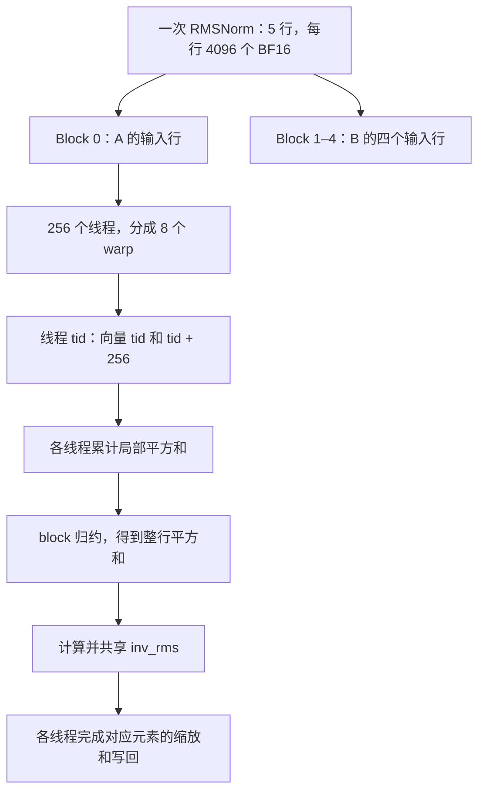
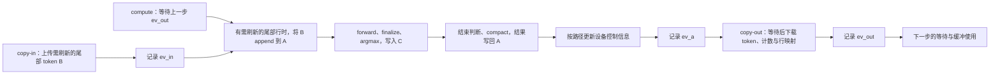

# 第 13 章：GPU 执行模型与成本分析

Worker 已经把请求变成批次，Model Runner 已经准备好输入、KV 索引和工作区。接下来，一次 forward 会在 GPU 上展开为矩阵乘法、归一化、位置编码、Attention、激活和采样等操作。即使输入输出完全相同，线程如何分工、数据从哪里读取、CPU 何时提交下一项工作，也会改变这一轮执行的时间。

沿用前面的场景：A 正在 Decode，本步有一个输入 token；B 正在处理四个 prompt token。模型主体可以看到五行输入，但最后只需要按计划取出相应行的生成结果。五行是模型的数据形状，CUDA 的 block、warp、thread 则是执行这些数据的分工方式，两者需要由每个 kernel 自己建立映射。

本章从项目中的 RMSNorm 开始，进入 GPU 的线程、存储与调度，再推导计算和访存成本，最后把这些机制对应到 Nsight Systems（命令行工具 `nsys`）与 Nsight Compute（命令行工具 `ncu`）的报告中。理解前者的时间线，才能知道整步慢在哪里；理解后者的指标，才能解释某个 kernel 为什么慢。

| 阅读问题 | 正文入口 |
| --- | --- |
| 一个 kernel 怎样分给 thread、warp、block 和 SM？ | [13.1 执行模型](#gpu-execution-model) |
| 数据在哪里，什么叫合并访存、bank conflict 和 spill？ | [13.2 存储与访问](#memory-and-access) |
| occupancy、eligible warp、延迟隐藏分别说明什么？ | [13.3 驻留与调度](#occupancy-and-latency) |
| 怎样估算 FLOPs、字节数与性能上限？ | [13.4 成本模型](#cost-model) |
| launch、同步、stream 和 Graph 分别改变什么成本？ | [13.5 提交与依赖](#launch-stream-and-graph) |
| nsys 时间线和汇总表应该怎么看？ | [13.6 Nsight Systems](#nsight-systems) |
| ncu 的 section、指标名和 stall reason 是什么意思？ | [13.7 Nsight Compute](#nsight-compute) |
| 常见问题应该对应哪些优化？ | [13.8 问题与优化](#bottlenecks-and-optimization) |

<a id="gpu-execution-model"></a>

## 13.1 从一次调用到 GPU 上的执行

### CPU 提交工作，GPU 执行指令

RustInfer 的 Model Runner 在 Worker 进程中运行。它通过后端接口进入 CUDA 实现；自定义算子最终调用 CUDA kernel，矩阵乘法等操作也可能交给 cuBLAS、cuBLASLt 等库。一次模型层调用可以产生多个 GPU kernel；一次库调用也不能直接当作一次 kernel。

CUDA 中，CPU 一侧称为 **host**，GPU 一侧称为 **device**。**kernel** 是在 GPU 上执行的函数，**launch** 是提交一次 kernel 执行。普通 kernel launch 相对主机异步：CPU 返回后可以继续组织工作，GPU 仍可能尚未开始或尚未完成该 kernel。源码中的 Rust 函数返回与设备计算完成，是两个时间点。[CUDA 编程模型](https://docs.nvidia.com/cuda/cuda-programming-guide/01-introduction/programming-model.html)给出了 host、device 和 kernel 的关系。

一个常见的 CUDA C++ 启动表达式是：

```cpp
kernel<<<grid, block, dynamic_shared_bytes, stream>>>(arguments...);
```

`grid` 指定 block 数量与维度，`block` 指定每个 block 的线程数与维度，第三项指定每个 block 额外申请的动态 shared memory，`stream` 指定提交到哪条执行流。第三项为零也可能使用静态声明的 shared memory。

### 六个容易混淆的名字

| 名词 | 含义 | 在本项目中的对应关系 |
| --- | --- | --- |
| Thread | 执行 kernel 的一个逻辑线程，有自己的索引和局部状态 | 计算若干个张量元素或一个 tile 的部分结果 |
| Warp | 由 32 个线程组成的执行组，每个位置称为 lane | warp 内归约、合并访存和分支行为的基本观察单位 |
| Block / CTA | 一组协作线程；CTA 是 Cooperative Thread Array | 可以共享 block 内的 shared memory，并进行 block 同步 |
| Grid | 一次 kernel launch 的全部 blocks | 一次 RMSNorm 所有待处理的行 |
| SM | Streaming Multiprocessor，GPU 上容纳和执行 blocks 的硬件单元 | 持有寄存器、shared memory、warp 调度器和执行流水线 |
| CUDA Core / Tensor Core | SM 内承担不同指令计算的硬件资源 | 标量计算与矩阵乘加等执行路径；不是 CUDA thread 的永久绑定位置 |

普通 block 的线程在一个 SM 上协作；一个 SM 可以同时驻留多个 block。grid 中的 block 可以分批执行，程序不能假设它们按 `blockIdx` 顺序启动。线程也不与某一个 CUDA Core 永久一一对应。

Worker Group 是模型实例的协作单位，TP rank 是组内的并行参与者，CUDA block 是单个 kernel 内的线程组织，KV block 是缓存的分配单位。这四个“组/块”处于不同层次；KV 使用 `block_size = 1` 与 CUDA block 有多少线程没有对应关系。

### 用 RMSNorm 把线程落实到数据

项目的 BF16 RMSNorm 对每一行输入计算：

```text
s = Σ x[j]²
inv_rms = 1 / sqrt(s / D + eps)
y[j] = x[j] × inv_rms × weight[j]
```

其中 `D` 是最后一维宽度。实际启动代码的核心是：

```cpp
constexpr int threads = 256;
const int rows = outer0 * outer1;
rmsnorm_half_kernel<__nv_bfloat16><<<rows, threads, 0, stream>>>(
    output, input, weight, dim, outer1,
    in_stride0, in_stride1, out_stride0, out_stride1, eps);
```

因此，它采用“一行一个 block，每个 block 256 个线程”的分工。假设 A、B 的五行隐藏状态宽度为 4096，这次启动得到 5 个 block；每个 block 有 8 个 warp。

kernel 把 8 个 BF16 元素作为 16 字节向量读取，关键索引如下：

```cpp
const int row = blockIdx.x;
const int tid = threadIdx.x;
const float4* in_ptr = reinterpret_cast<const float4*>(input + in_off);
const int vec_count = dim / 8;

float sum = 0.0f;
for (int i = tid; i < vec_count; i += blockDim.x) {
    float4 raw = in_ptr[i];
    // 将这 16 字节解释为 8 个 BF16，累加它们的平方。
}
```

这里的 `float4` 用作 16 字节载体，不表示输入被转换成了四个 FP32 数。对 `D = 4096`，一行包含 512 个这样的向量。线程 0 处理向量 0 和 256，线程 1 处理向量 1 和 257，依此类推；每个线程累计 16 个 BF16 元素的平方。



线程有自己的部分和，但归一化需要整行平方和，因此接下来必须协作。源码使用 CUB 的 `BlockReduce<float, 256>` 汇总，各线程再通过 shared memory 读取同一个 `inv_rms`：

```cpp
using BlockReduce = cub::BlockReduce<float, 256>;
__shared__ typename BlockReduce::TempStorage temp_storage;
float total = BlockReduce(temp_storage).Sum(sum);

__shared__ float inv_rms;
if (tid == 0) inv_rms = rsqrtf(total / float(dim) + eps);
__syncthreads();
```

`__syncthreads()` 保证 block 内参与的线程到达同步点，并使相应内存访问按 block 同步语义可见。否则，其他线程可能在 `inv_rms` 写好之前使用它。条件分支中的 block 同步必须满足一致到达要求，不能让需要参与的部分线程绕过屏障。

这个例子也说明了并行度的限制：五行只能产生五个 block。即使每个 block 内的代码十分紧凑，也无法靠这次启动持续覆盖一块拥有许多 SM 的 GPU。把一个 block 的线程数翻倍，不会自动使这五个 block 变成十个。

源码入口：[RMSNorm kernel 与启动函数](../../../../crates/infer-backend-cuda/src/kernels/rmsnorm/rmsnorm.cu)、[Rust 侧 RMSNorm 封装](../../../../crates/infer-backend-cuda/src/kernels/rmsnorm/mod.rs)。

### Warp、SIMT 与同步范围

**SIMT** 是 Single Instruction, Multiple Threads。程序以线程为单位描述工作，硬件以 warp 组织指令执行。一个 warp 内的线程走不同分支时，一部分 lane 会暂时不参与某条路径，这称为 **warp divergence**。是否损失明显，取决于分支内工作量、活跃 lane 和编译结果；出现 `if` 本身不足以证明性能差。

RMSNorm 中 `if (tid == 0)` 只让一个线程计算一次缩放因子，随后整组共享结果。这种分工有明确目的。相反，如果同一 warp 中有些线程要遍历很长的序列、另一些只遍历很短的序列，长短不齐可能造成持续的无效 lane。

warp 内可以用 **shuffle** 在 lane 之间交换寄存器值。项目的融合 RMSNorm 使用 `__shfl_xor_sync` 做 warp 归约，再通过 shared memory 汇总不同 warp 的结果。shuffle 的参与 mask 必须与实际参与线程相符。现代 GPU 的线程调度不能替代程序所需的显式同步。

| 同步方式 | 覆盖范围 | 典型用途 |
| --- | --- | --- |
| `__syncwarp(mask)` | 指定 warp 内的参与线程 | warp 内依赖与内存协作 |
| `__syncthreads()` | 一个 block | 多个 warp 交换 shared memory 数据 |
| 同一 stream 的操作顺序 | 该 stream 中的普通有序操作 | 后一个 kernel 使用前一个 kernel 的结果 |
| event + stream wait | 明确连接的 streams | 计算等待输入上传，回传等待结果产生 |
| host synchronize | CPU 等待指定设备工作完成 | CPU 准备读取设备回传数据 |

普通 `__syncthreads()` 不能同步整个 grid。跨 block 的一般计算依赖常通过后续 kernel 建立；需要 grid 或 cluster 协作的专门机制有各自的启动与硬件条件。线程层次与同步规则见 [CUDA SIMT kernel 指南](https://docs.nvidia.com/cuda/cuda-programming-guide/02-basics/writing-cuda-kernels.html)。

<a id="memory-and-access"></a>

## 13.2 存储层次与数据访问

### “在哪里存”与“谁能看见”是两件事

| 名称 | 主要用途与范围 | 分析时关心的成本 |
| --- | --- | --- |
| Register，寄存器 | 线程的局部值、地址、累加器 | 数量有限；用量影响可驻留线程数 |
| Shared memory，共享内存 | block 内显式管理的暂存与数据复用 | 占用容量、bank conflict、同步与搬运指令 |
| L1 / L2 cache | 缓存访问过的数据；L2 在设备上为多个 SM 共享 | 命中、重复读取、带宽与缓存工作集 |
| Global memory | 权重、激活、KV pool、设备索引等持久设备数据 | 穿过缓存层次后产生的显存访问与延迟 |
| Local memory | 线程私有的地址空间，例如部分局部数组或 spill | 名字中的 local 不代表片上寄存器，访问可能进入设备存储层次 |
| Host memory | CPU 上的请求、元数据、结果暂存 | 与 GPU 间的传输、pinning 与访问生命周期 |

显存可能使用 HBM，也可能使用 GDDR。分析项目运行设备时使用其实际容量和带宽，不能把所有 GPU 的外部存储都称作 HBM。shared memory 与 cache 的具体组织、容量和可配置方式依赖架构。

前面 KV 章节中的 `PagedKvPool` 建立的是 global memory 中的 K/V 张量。某次 Attention 读取这些张量时，部分数据可能命中 L2，随后被放进 shared memory 或寄存器参与计算。**KV pool 的容量、实际经过 DRAM 的字节数、片上临时数据量，需要分别计算。**

### 合并访存：观察同一条指令上的整个 warp

**Coalescing，合并访存**，关注一个 warp 的线程在一次访存指令中触及了哪些地址。对常见现代 CUDA 设备，可以用 32 字节 sector 分析这些访问需要覆盖多少存储片段。假设 32 个 lane 各读取一个 FP32，起始位置按 32 字节对齐：

| lane `i` 的地址 | 有效数据 | 覆盖的 32 字节片段 | 直观含义 |
| --- | --- | --- | --- |
| `base + 4*i` | 128 B | 4 个 | 连续访问，片段中的数据全部被使用 |
| `base + 4*(i+1)` | 128 B | 5 个 | 首尾跨界，额外覆盖一个片段 |
| `base + 32*i` | 128 B | 32 个 | 每个片段只使用 4 B |

这里计算的是该次访问覆盖的片段，不是承诺从 DRAM 读取相同字节数；cache 命中与相邻访问的复用还会改变下层流量。对应规则见 [CUDA 合并访存说明](https://docs.nvidia.com/cuda/cuda-c-best-practices-guide/index.html#coalesced-access-to-global-memory)。

因此，“张量整体连续”不能直接推出“某个 kernel 合并访存良好”。假设矩阵按行存储，warp 的相邻线程读取同一行相邻列，访问通常容易合并；相邻线程各读取不同一行的同一列，线程间地址就隔着整行 stride。优化时需要一起看布局和 thread-to-data mapping。

RMSNorm 把相邻 `tid` 分给相邻 16 字节向量，warp 内连续覆盖一段行数据。**向量化访问**又进一步减少了用小标量逐个加载的指令数量，但必须满足类型、对齐、宽度和边界条件。向量化与合并访存是两个概念：一个描述每个线程一次处理多少字节，另一个描述多个线程的地址能否集中覆盖少量片段。

KV slot 在不同逻辑位置之间可以不连续，同一个 slot 内的 head dimension 仍然连续。分页索引不意味着每个 BF16 元素都必须随机读取。Attention 怎样沿连续维组织 lane、怎样复用同一 KV head，将决定访问效率；具体 kernel 在第 15 章展开。

### Shared memory：复用收益需要覆盖搬运与同步

shared memory 常用来让一个 block 中的线程复用相同数据。例如矩阵乘法将 A、B 的 tile 搬入片上后，用它们产生一块输出；相同元素参与多次乘加，就减少了重复向下层存储请求的需要。

代价也具体存在：加载 tile 需要指令，生产者与消费者之间需要依赖，shared memory 用得越多，SM 能同时容纳的 block 可能越少。对只使用一次的数据，先写 shared memory 再读回来，可能只是增加了一次中转。

**Bank conflict** 是 shared memory 内部访问冲突。以常见的 32-bank、32 位字访问模型为例：

```text
bank = 32 位字的索引 mod 32
```

若 warp 的 32 个线程分别访问 `tile[lane][0]`，而 `tile` 是按行存储的 `float tile[32][32]`，每个地址相隔 32 个 FP32，便映射到同一个 bank 的不同字。将行宽改为 33，这组访问的 bank 编号就随 lane 展开。这是 padding 用来打散 bank 冲突的典型推导。

多个线程读取同一个字可以广播，不能按“同一个 bank”直接判为 32 路冲突。向量指令、BF16 布局和不同架构还需要按实际访问拆分分析。`[32][33]` 是这个 FP32 示例的解法，不是所有 shared memory 布局的通用模板。

### 寄存器、spill 与实际的融合取舍

编译器尽量把线程局部值留在寄存器中。活跃值太多时，部分值可能被 **spill** 到 local memory，后续再加载。于是，源码里“缓存到局部变量”的写法，可能同时减少一次输入加载、又增加新的 local load/store。是否最终留在寄存器，需要结合编译资源信息和机器指令判断。

项目的融合 Add + RMSNorm 有通用版本和按维度特化的 `_cached` 版本。两者都需要写出更新后的 residual，因为它是后续还会使用的模型状态；cached 版本让 `h_raw` 与 `w_raw` 跨归约阶段保持活跃，争取直接完成最后的缩放。

只计算每个 BF16 元素在源码中显式请求的 global load/store，不计 cache、shared memory 与 spill，可以得到：

| 路径 | 每元素的读写 | 请求字节数 |
| --- | --- | --- |
| 分开的 Add，再调用本项目普通 RMSNorm | Add 读 input/residual、写 residual；Norm 两次读 residual、一次读 weight、一次写 output | 14 B |
| 融合通用版本 | 第一遍读 input/residual、写 residual 并累计平方和；第二遍读 residual/weight、写 output | 12 B |
| 融合 cached 版本 | 读 input/residual/weight，写 residual/output，中间值跨归约保留 | 10 B |

这张表解释了优化意图，而不是测得的 DRAM 流量或固定加速比。普通版本的第二次读取可能命中 cache；cached 版本可能增加寄存器压力；不同精度与归约顺序还要保持所需的数值契约。

源码对 BF16 的 1024、1536、2048、2560、3072、4096 等明确维度选择 cached 实例，其他符合通用 kernel 输入条件的维度走通用路径。这也体现了特化的边界：编译期维度同时影响行偏移、有效向量数和归一化分母，不能只因为尺寸“差不多”就复用一个实例。

源码入口：[融合 Add + RMSNorm 的两个实现与分派](../../../../crates/infer-backend-cuda/src/kernels/fused_add_rmsnorm/fused_add_rmsnorm.cu)。

<a id="occupancy-and-latency"></a>

## 13.3 Occupancy、可发射 warp 与延迟隐藏

### 同时放得下多少工作

**Occupancy，占用率**，通常表示一个 SM 上活跃驻留 warp 数相对该 SM 最大可驻留 warp 数的比例。驻留说明硬件为这些 warp 保留了执行状态与资源，不表示每个 warp 都在这一拍执行有效指令。

设一个 block 有 `T` 个线程，每线程使用 `r` 个 32 位寄存器，每 block 使用 `S` 字节 shared memory。忽略资源分配粒度等细节时，每个 SM 的 block 驻留上限可以近似写成：

```text
blocks_per_SM = min(
    寄存器总数 / (T × r),
    shared memory 总量 / S,
    最大驻留线程数 / T,
    最大驻留 warp 数 / ceil(T / 32),
    最大驻留 block 数
)

warps_per_block = ceil(T / 32)
occupancy = blocks_per_SM × warps_per_block / 最大驻留 warp 数
```

各项容量比取整数下界；未使用某项资源时不形成对应限制。真实硬件还受到寄存器分配粒度、warp 上限以及特定 kernel 资源限制影响，最终以目标设备的限制和工具计算为准。[CUDA 高级 kernel 指南](https://docs.nvidia.com/cuda/cuda-programming-guide/03-advanced/advanced-kernel-programming.html)说明了资源驻留关系，具体容量见[计算能力表](https://docs.nvidia.com/cuda/cuda-programming-guide/05-appendices/compute-capabilities.html)。

用一组假设资源手算：每 SM 有 65536 个 32 位寄存器、96 KiB shared memory，最多驻留 2048 个线程、64 个 warp、32 个 block。每 block 固定 256 个线程，也就是 8 个 warp。

| 每线程寄存器 | 每 block shared memory | 寄存器限制 | shared 限制 | 最终 blocks/SM | 理论 occupancy |
| --- | --- | --- | --- | --- | --- |
| 64 | 32 KiB | 4 | 3 | 3 | 24/64 = 37.5% |
| 64 | 16 KiB | 4 | 6 | 4 | 32/64 = 50% |
| 96 | 16 KiB | 2 | 6 | 2 | 16/64 = 25% |

第一行受 shared memory 限制；减少 shared memory 后，寄存器成为限制；继续提高每线程寄存器用量，又会让驻留 block 数减少。硬件资源以整组分配，因此变化常常呈阶梯状，而不是连续变化。

### 理论占用率高，实际也可能放不满

**Theoretical Occupancy** 根据 kernel 资源需求与设备限制计算上限。**Achieved Occupancy** 从执行中的活跃 warp 统计得到，两者观察的角度不同。

假设硬件容许每 SM 驻留四个 block，但整个 grid 只有五个 block，就没有足够的工作填满大量 SM。另一个常见原因是 **tail effect，尾部效应**：大部分 block 完成后，只有少量较晚开始或工作更多的 block 还在运行。

`Waves Per SM` 可帮助估计 grid 能填充多少轮驻留容量。若有 80 个 SM，每个可驻留 3 个 block，总共 250 个 block，则：

```text
waves ≈ 250 / (80 × 3) ≈ 1.04
```

第一批容量接近填满，后面只剩很少工作。真实 block 会随着资源释放持续调度，不是硬件要求所有 SM 严格按“整轮”同时进退；这个比值用于认识尾部与工作量不足。[NVIDIA 的尾部效应说明](https://developer.nvidia.com/blog/cuda-pro-tip-minimize-the-tail-effect/)讨论了这一类问题。

### 驻留、就绪、发射：调度器面对的三个状态

一个 warp 可以已经驻留，但下一条指令还在等待前面的加载结果。此时它占用资源，却不能发射这条依赖指令。调度器可以从其他就绪 warp 中选择工作，利用它们掩盖等待时间，这就是 **latency hiding，延迟隐藏**。

| 名词 | 含义 | 观察问题 |
| --- | --- | --- |
| Active / resident warps | 当前驻留、尚未结束的 warp | 有没有足够多的工作在场？ |
| Eligible warps | 已就绪、具备发射条件的 warp | 调度器此时有没有工作可选？ |
| Issued warp / issue slot | 本拍实际选中并发射的工作 / 发射机会 | 可用机会是否被利用？ |
| Stalled warp | 暂时不能继续发射的 warp | 在等数据、依赖、屏障，还是执行资源？ |

**TLP**（Thread-Level Parallelism）增加不同线程、warp 间的独立工作；**ILP**（Instruction-Level Parallelism）在同一线程内提供多个互不依赖的操作；**MLP**（Memory-Level Parallelism）让多个独立访存同时在途。这些都可能帮助覆盖延迟。

例如，循环中只维护一个累加器，会形成“下一次累加依赖上一次结果”的链；使用多个部分累加器可以产生更多独立指令，最后再归约。但是更多累加器也消耗更多寄存器。这与 cached RMSNorm 的取舍相同：减少等待和重复加载的收益，需要与新增资源占用一起判断。

所以，提高 occupancy 是一种可能的手段，目标仍是缩短执行时间。如果现有 warp 已能持续供给执行流水线，增加更多驻留 warp 未必有益；强行压低寄存器上限，甚至可能引入 spill，让 kernel 更慢。反过来，低 occupancy 也需要解释：是共享资源换来了足够复用，还是 kernel 缺少掩盖延迟的独立工作？

<a id="cost-model"></a>

## 13.4 用计算量与字节数建立成本模型

### FLOPs、FLOP/s 与算术强度

**FLOPs** 表示完成工作所需的浮点运算数量，**FLOP/s** 表示单位时间的计算吞吐。通常把一次乘加 `a*b+c` 计为 2 FLOPs，即使硬件使用一条 FMA 指令完成它。机器指令数与 FLOPs 不能直接互换；一条矩阵乘加指令可能对应许多元素的运算。

**Arithmetic Intensity，算术强度**，定义为运算量与某一存储层次数据流量的比值：

```text
I = F / Q            单位：FLOP/byte
```

`F` 是运算量，`Q` 是所选层次的读写字节数。计算 DRAM Roofline 时使用 DRAM 流量；计算 L2 Roofline 时使用 L2 对应流量。不能把源码请求的字节数直接与测得的 DRAM 带宽拼在一起，就当成准确的硬件利用率。

设匹配当前数据类型与执行路径的计算上限为 `P`，对应存储层次带宽为 `BW`，理想成本下界为：

```text
T_compute = F / P
T_memory  = Q / BW
T_kernel  ≥ max(T_compute, T_memory)

可达到的计算吞吐 ≤ min(P, BW × I)
```

这形成 **Roofline，屋顶线模型**：低算术强度处受带宽斜线限制，高算术强度处受计算水平线限制；两者交点为 `I* = P/BW`。公式把重叠看得很理想，实际还可能受依赖链、同步、指令发射、工作量不足等因素限制，因此点落在屋顶线下方并不奇怪。Nsight Compute 的 [Roofline 图说明](https://docs.nvidia.com/nsight-compute/NsightCompute/index.html#rooflines)介绍了工具中的表示方式。

计算上限必须对应真实路径。普通逐元素 BF16 运算不能直接拿 BF16 Tensor Core 峰值当分母；dense GEMM 也不能拿要求结构化稀疏的峰值当作其上限。

### 一层线性变换：为什么批量会改变瓶颈

考虑 `Y = XW`，形状为：

```text
X: [M, K]
W: [K, N]
Y: [M, N]
```

这里 `M` 是本次参加计算的 token 行数。BF16 输入、权重和输出，忽略已有输出读取、额外 workspace 与变换，在 X/W 各读取一次、Y 写入一次的理想情况下：

```text
F ≈ 2MKN
Q_min = 2(MK + KN + MN) 字节
I_ideal = MKN / (MK + KN + MN)
```

取 `K = N = 4096`：

| M | 工作场景示意 | 理想算术强度 |
| --- | --- | --- |
| 1 | 单条序列的一步 Decode | 约 1 FLOP/B |
| 128 | 更多 Decode 行或一段 Prefill | 约 120.5 FLOP/B |
| 512 | 更大的 token 批次 | 409.6 FLOP/B |

`M = 1` 时，只读权重就需要 32 MiB，而计算量约为 3355 万 FLOPs。若假设设备对这条路径有 100 TFLOP/s 算力、1 TB/s 显存带宽，并假设权重需经过 DRAM，则计算下界约 0.34 μs，数据下界约 33.6 μs。这里是条件化的成本推导，不对应某款 GPU 的实测延迟。

增大 `M`，同一份权重可以服务更多行，理想算术强度上升。但实际 kernel 仍要通过 tiling、cache 和数据复用实现这种收益；它可能重复读取部分权重，也可能因形状、量化格式或资源限制选择不同算法。

因此，Prefill 往往更容易形成较大的矩阵计算，低 batch Decode 往往更容易受权重读取与小工作量影响。这个倾向不适用于所有算子和负载：大 batch Decode 可以提高权重复用，长上下文 Attention 又会增加 KV 读取；一次 forward 内也完全可能同时存在不同类型的瓶颈。

### RMSNorm：算得少，读取也不一定都去显存

对上面的两遍 RMSNorm，设有 `R` 行、每行 `D` 个 BF16 元素：平方与累加约 `2RD` FLOPs，最终两次缩放乘法约 `2RD` FLOPs，另有每行的归约与 `rsqrt` 开销。

这里合计的是语义运算量。实际平方与累加使用 FP32，`inv_rms` 转成 BF16 后执行后面的 BF16 乘法，不能把全部运算量直接配上某一种精度的硬件峰值。

源码显式读取两遍 input、一遍 weight，写一遍 output，因此请求字节数约 `8RD`，由此得到约 `0.5 FLOP/B` 的请求层次强度。第二遍 input 可能命中 cache，weight 也可能在多行之间复用，实际 DRAM 强度会不同。

当 `R` 很大时，减少重复访问与提高访存效率可能很有价值；当 `R = 1` 时，只启动一个 block，launch、归约依赖和 GPU 工作量不足可能比外部带宽更关键。同一个 kernel 的名字不能永久贴上“带宽受限”的标签。

### Attention：KV 容量怎样变成每步读取成本

对一层 Decode Attention，设每条序列已有 `T` 个历史位置、`Hq` 个 query head、`Hkv` 个 KV head、head dimension 为 `D`。忽略 softmax 等附加运算，QK 与 PV 的运算量合计约为：

```text
F_attention ≈ 4 × batch × Hq × T × D
```

假设每条序列的 K/V 各读取一次，BF16 的理想 KV 字节数为：

```text
Q_KV_min = 2 × batch × T × Hkv × D × 2 字节
```

例如一条序列、`T = 4096`、`Hkv = 8`、`D = 128`，单层 K/V 为 16 MiB；32 个这样的完整 Attention 层合计 512 MiB。它说明上下文增长会怎样增加潜在数据需求，不能据此断言每一步 DRAM 恰好读取 512 MiB：cache 命中、GQA 复用、kernel 分块和重复加载都影响实际流量。

GQA 让多个 query head 对应同一个 KV head，为复用提供机会，但需要具体实现把机会兑现。Paged KV 则解决物理存储和寻址问题，不会自动免除 Attention 对有效历史内容的访问。更细的分块和在线 softmax 推导在第 15 章展开。

### 整步时间沿依赖链计算

一个请求的下一 token 依赖此前的模型计算与采样。CPU 提交、GPU kernel、数据拷贝以及 TP 通信可能相互重叠，因此不能把所有耗时简单相加。

可以把工作画成带依赖的图：前驱完成后，后继才具备执行条件；在资源足够的理想情况下，最长依赖路径给出完成时间下界。真实设备还会因资源争用增加时间。这个 **critical path，关键路径**，比“哪个 API 在汇总表里排第一”更接近端到端延迟的原因。

若某项可串行归因的工作占整步时间 20%，把它加速到原来的两倍，在其他条件不变时整步加速比是：

```text
speedup = 1 / (0.8 + 0.2/2) ≈ 1.11
```

这就是 Amdahl 定律在成本分解中的用法。存在重叠时，应该分析它实际占据的关键路径时间；一个已经完全被其他工作覆盖的拷贝，即使变快，也未必缩短整步。

<a id="launch-stream-and-graph"></a>

## 13.5 Launch、Stream、Event 与 CUDA Graph

### 小 kernel 为什么容易受提交影响

一次 launch 需要 CPU 进入 CUDA API、准备参数并提交工作；GPU 还要接收与调度该工作。如果一轮模型由大量很短的 kernel 组成，CPU 可能来不及持续供给，时间线就出现相邻 kernel 间的空隙。

launch 成本不是一个跨机器固定的常数，也不能把 nsys 中每段空白都归因于 launch。空隙还可能来自 CPU 组批、同步等待、跨 stream 依赖、TP rank 到达不齐或当前没有可执行请求。只有把 GPU 操作与对应 CPU 调用连接起来，才能判断原因。

**Kernel fusion，算子融合**，减少独立 kernel 边界，并可能避免中间结果反复读写；**CUDA Graph** 则预先建立执行关系，让重复执行时通过更少的 host 提交重放一组操作。Graph 通常保留原有 kernel，不能自动把它们变成一个融合 kernel，也不会自动消除模型所需的 FLOPs 或 KV 读取。

Graph 的收益需要考虑重复次数、捕获与实例化成本，以及为稳定形状增加的 padding。若原来计算 5 行，重放的形状实际执行了更多行，省下的提交成本可能被多余计算抵消。项目对批次形状、持久地址与 Graph 路径的组织见[第 5 章执行契约](../worker/05-command-to-plan.md#execution-contract)，完整机制及五行用八行图的 KV 隔离见[第 10 章](../worker/10-cuda-graph-and-dynamic-batching.md)。[CUDA Graph 官方说明](https://docs.nvidia.com/cuda/cuda-programming-guide/04-special-topics/cuda-graphs.html)区分了定义、实例化与重放。

### Stream 提供顺序，Event 连接依赖

**Stream** 是 CUDA 操作的有序提交序列。普通情况下，同一 stream 中后面的计算按顺序使用前面的结果；不同 stream 之间需要显式建立必要依赖。多个 stream 提供并发机会，实际能否重叠还取决于工作独立性、设备资源与拷贝能力。

项目的 `CudaConfig` 保留了这些字段：

```rust
pub copy_in_stream: ffi::cudaStream_t,
pub copy_out_stream: ffi::cudaStream_t,
pub ev_in: ffi::cudaEvent_t,
pub ev_a: ffi::cudaEvent_t,
pub ev_out: ffi::cudaEvent_t,
```

它们与计算使用的 `stream` 一起服务 ABC token 缓冲路径。这里 A/B/C 是流水线缓冲的名字，与开篇请求 A、B 的身份无关。

| 依赖对象 | 记录位置 | 谁等待 | 保护的数据关系 |
| --- | --- | --- | --- |
| `ev_in` | copy-in stream 上传新 token B 之后 | compute stream 在 append 前等待 | 先上传新 token，再追加到 A 的相应行 |
| `ev_a` | compute stream 完成结果合并与控制信息更新之后 | copy-out stream 在下载前等待 | 先写好结果，再回传 |
| `ev_out` | copy-out stream 下载之后 | compute stream 在下一步 append 与 forward 前等待 | 先完成旧数据的读取，再进入下一步缓冲使用 |

例如下面这个函数只向计算流建立等待关系：

```rust
pub fn compute_wait_copy_in(&self) -> OpResult<()> {
    unsafe {
        cuda_check!(ffi::cudaStreamWaitEvent(self.stream, self.ev_in, 0));
    }
    Ok(())
}
```

`cudaStreamWaitEvent` 的设备等待可以延后该 stream 的后续工作，同时允许 CPU 继续提交。它与 `cudaStreamSynchronize` 让 CPU 等待 stream 完成，不能按同一种“阻塞”理解。



这条路径先复用 A 中仍然有效的前缀，并通过 B 刷新其余输入行；再把模型与采样结果写入 C，随后把继续执行的行压缩回 A。只有在结果准备好之后，copy-out 才能下载相应内容；下一步进入缓冲使用前还会等待 `ev_out`。这是设备数据的生命周期约束，CPU 持有一个有效 Rust 引用不能替代它。

当前普通 Decode 循环先 finalize 上一步并等待回传完成，再 issue 下一步计算，然后发送上一步结果。这里明确形成的重叠，是下一步 GPU 计算与上一步结果发送等主机工作。三条 stream 与 event 表达依赖，不代表 D2H 一定与下一步 forward 重叠；不同模型和执行路径也会选择不同的 Graph、采样与回传方式。

源码入口：[三条 stream 与 event 方法](../../../../crates/infer-backend-cuda/src/config.rs)、[ABC Decode](../../../../crates/infer-worker/src/application/runtime/abc_decode.rs)、[Worker Decode 推进](../../../../crates/infer-worker/src/application/decode_engine.rs)。

### “Async”与“CPU 已经可以读取”之间还差什么

**H2D** 是 host 到 device，**D2H** 是 device 到 host，**D2D** 是设备存储之间的拷贝。**Pinned memory** 是被页锁定的主机内存，可用于实现所需的异步 DMA 传输；普通 pageable 内存可能需要 staging，并使某些带 `Async` 后缀的操作表现出主机同步行为。[CUDA API 同步语义](https://docs.nvidia.com/cuda/cuda-runtime-api/api-sync-behavior.html)明确区分了这些情况。

异步拷贝要求源与目标缓冲在设备访问期间持续有效：H2D 还没读完，CPU 不能修改或释放源；D2H 还没写完，CPU 不能把目标当成最终结果。项目在相应 token 上传与回传路径中使用持久缓冲，并用拷贝流完成条件约束访问。

对于每轮只回传少量 token IDs 的路径，D2H 字节数很小，成本可能主要来自依赖和等待，而不是链路带宽。减少回传字节数、异步覆盖传输、推迟 CPU 必须读取结果的时点，解决的是不同问题。

普通 CPU 计时如果只包住 launch，只能描述主机提交时间。要解释 GPU 上的持续时间，需要看设备活动或合适的 CUDA event 区间；event 区间若包含 stream 等待，也会包含对应间隔。不要把“计时 API 返回了多少”直接等同于“设备纯计算花了多少”。stream 与 event 的基础语义见 [CUDA 异步执行指南](https://docs.nvidia.com/cuda/cuda-programming-guide/02-basics/asynchronous-execution.html)。

<a id="nsight-systems"></a>

## 13.6 Nsight Systems：从时间线找到整步的等待

### 先找到同一步，再连接 CPU 与 GPU

nsys 把 CPU 线程、CUDA API、GPU kernel、拷贝和用户标记放在同一时间轴上。阅读一轮推理时，先确认进程、设备、请求阶段与时间范围，再沿“谁提交了这项工作、它何时开始、谁依赖其结果”连接活动。

| 时间线中常见的名称 | 表示什么 | 在 RustInfer 中怎样理解 |
| --- | --- | --- |
| Process / Thread | 主机进程与线程 | Worker 主线程、TP rank 线程和其他服务线程 |
| CUDA API | CPU 执行 CUDA API 的时间段 | launch、拷贝提交、同步调用 |
| CUDA HW / Kernels | GPU 上的 kernel 活动 | RMSNorm、GEMM、Attention、采样、行压缩等 |
| Stream | GPU 操作所属的执行流 | compute、copy-in、copy-out 等 stream |
| Memcpy HtoD / DtoH / DtoD | 设备侧拷贝活动与方向 | 输入和索引上传、token 回传、设备缓冲复制 |
| Memset | 设备数据初始化或清零 | workspace 初始化、某些缓冲重置 |
| NVTX Range | 应用主动标记的代码区间 | 若调用路径添加标记，可显示 prefill、decode 等语义范围 |
| Correlation ID / Timeline Correlation | 连接主机调用与设备工作的关联信息 | 从某个长 kernel 回到提交它的调用 |
| OS Runtime / Thread State | 已采集的系统调用和线程状态 | 看 CPU 正在运行，还是等待锁、I/O、调度或同步 |
| GPU Memory Allocation | 设备分配随时间的变化 | 观察 allocation 容量，不能当成显存读写带宽 |

NVTX 的全称是 NVIDIA Tools Extension。它由程序显式添加标签，工具不会仅凭启用 NVTX 追踪，就自动理解某个 Rust 函数叫“模型第 12 层”。主机 range 的结束也不保证该区间提交的 GPU 工作已经完成。关联与标记的语义见 [nsys 时间线关联](https://docs.nvidia.com/nsight-systems/UserGuide/index.html#timeline-correlation)和 [NVTX 追踪](https://docs.nvidia.com/nsight-systems/UserGuide/index.html#nvtx-trace)。

### API 时间、排队时间与 kernel 时间

用一组假设时间理解它们的区别：

```text
CPU launch API：          [0, 4] μs
同 stream 的前序 GPU 工作：[0, 18] μs
本次 kernel：             [18, 30] μs
CPU 随后的同步等待：       [5, 30] μs
```

这次 launch 的 **API duration** 是 4 μs；本次 kernel 的设备持续时间是 12 μs。nsys 的相应执行跟踪报告将 API 返回到 kernel 开始的正间隔记为 **Queue time**，在这个例子中是 14 μs；从 API 开始到 GPU 开始的 **launch latency** 则是 18 μs。

排队的这 14 μs 里，GPU 正在处理前序工作，不能认为 GPU 被白白浪费了 14 μs。CPU 提前提交，使队列中有后续工作，本来就是异步执行的常见状态。

同步调用虽然占了 25 μs，但它主要在等待前序设备工作和本次 kernel。删除这次同步不会自动使这些计算消失；如果 CPU 随即读取尚未完成的结果，反而破坏了正确性。可优化的是缩短被等待的工作，或把等待移动到真正需要数据的位置，以便覆盖其他有用工作。

实际时间线还可能出现 kernel 在 launch API 返回前开始执行，因此 API、排队、kernel 不能一律当成三个互不重叠的区间相加。相关时间定义见 [nsys 执行跟踪报告](https://docs.nvidia.com/nsight-systems/AnalysisGuide/index.html)与 [NVIDIA 对提交开销和延迟的说明](https://developer.nvidia.com/blog/understanding-the-visualization-of-overhead-and-latency-in-nsight-systems/)。

### 汇总表回答“哪些工作多”，时间线回答“怎样拖慢结果”

nsys 的 kernel 汇总常包含以下列：

| 名称 | 含义 | 容易忽略的条件 |
| --- | --- | --- |
| Instances / Calls | 调用次数 | 一个很短的 kernel 出现几千次，也可能累计显著 |
| Total Time | 所列同类活动时长之和 | 并发活动的区间可能重叠 |
| Average / Median | 单次平均值 / 中位数 | 同名 kernel 的形状可能不同 |
| Min / Max / StdDev | 最小、最大值与离散程度 | 冷路径、不同序列长度和竞争会混在一起 |
| Time % | 本汇总范围中某项时长占合计的比例 | 通常不是该项占整个请求墙钟时间的比例 |

假设两个独立 kernel 的 GPU 区间分别为 `[0, 80] μs` 和 `[20, 100] μs`。它们的时长之和是 160 μs，至少有一个 kernel 在执行的区间并集是 100 μs。这组工作全部完成的跨度也是 100 μs。

若观察窗口为 110 μs，其 kernel 活动覆盖率是 `100/110`，不能用 `160/110` 解释 GPU 有效利用率。若再把 CPU 同步时间加进去，就可能对同一段等待重复计数。

项目的 [GGUF trace 分析脚本](../../../../scripts/analyze_gguf_profile.py)使用区间并集计算 kernel、拷贝与 memset 的活动覆盖，并把 API 时间另行记录，正是为了保留这一区别。并集能说明“设备存在已记录活动的时间”，仍不能证明每个 SM 或某条计算流水线已经满载。nsys 汇总报告的列定义见[分析指南](https://docs.nvidia.com/nsight-systems/AnalysisGuide/index.html)。

### 沿三种时间线形态继续追问

**GPU 空隙很长，下一项工作尚未提交。** 回到 Worker CPU 线程，看它是否正在构造元数据、等待命令、处理结果、进入同步调用或被操作系统挂起。如果工作本来没有准备好，优化 Attention 内的一个乘法不会填上这个空隙。

**CPU 提交很快，GPU 连续执行很长。** 这时更值得看关键路径上的 kernel 或 collective，以及它们的实际形状。连续忙碌不代表做的都是必要工作，padding、重复投影、重复拷贝同样可以填满时间线。

**某条 stream 空闲，其他 stream 正忙。** 先找 event 和数据依赖。等待输入、等待结果回传或等待共享缓冲可写，可能正是正确性所需的顺序。若总设备还有独立工作可做，再考虑缓冲与流水线组织；只看一条 stream 的空隙容易误判全 GPU 状态。

TP 中还要同时看多个 rank：某个 NCCL kernel 持续很久，可能包含等待其他 rank 到达的时间，而不只是数据传输时间。需要关联 collective 前的计算与提交顺序，不能直接把全部时长解释成 NVLink 或 PCIe 带宽不足。

### 项目已有的采集入口怎样对应这些信息

[按步骤采集的 Worker 脚本](../../../../scripts/start_worker_profile_steps.sh)通过 `cudaProfilerApi` 控制采集范围，并传入 `--profile-cuda-steps`。它启用了 CUDA、NVTX、OS runtime 和库调用追踪，设置 `--cuda-graph-trace=node` 以观察 Graph 节点；同时关闭 CPU sampling 与 CPU context-switch 采集。因此，这份配置能展示的 CPU 证据有明确范围，不能从缺少采样的报告推导 CPU 函数热点。

Graph node 追踪提供更细的设备活动，同时会增加采集开销。图很大、节点很短时，报告中的时间需要结合采集方式解释。项目另有 [GGUF 独立 profiling 入口](../../../../crates/infer-worker/src/bin/gguf_profile.rs)，显式标记 `prefill`、`decode/{step}` 和 `host_argmax`。这里的 host argmax 属于该独立入口，不能据此推断普通服务也把整份 logits 搬回 CPU 采样。

运行期吞吐、TTFT 和 token 间隔的定义归入第 21 章。本章先建立判断依据：在时间线里找到目标阶段，区分 host 提交、设备执行、依赖等待与结果交付。

<a id="nsight-compute"></a>

## 13.7 Nsight Compute：解释一个 kernel 内部的成本

### Section 是按问题组织的指标集合

从 nsys 找到一个位于关键路径、值得继续分析的 kernel 后，ncu 提供更细的资源与执行信息。同名 kernel 可能有不同输入长度、grid、block 和模板实例，因此首先要确认自己正在看哪一次执行。

| Section / 常见界面名称 | 主要内容 | 对应本章问题 |
| --- | --- | --- |
| Launch Statistics / `LaunchStats` | Grid、Block、寄存器、shared memory、Waves Per SM | 工作量有多大，怎样分配给硬件？ |
| Occupancy | 理论与实际 occupancy、资源限制 | 为什么放不下更多 block，或实际没有放满？ |
| Scheduler Statistics / `SchedulerStats` | Active、Eligible、Issued warps 与发射机会 | 有工作驻留时，是否有就绪指令？ |
| Warp State Statistics / `WarpStateStats` | 不同等待原因的统计 | warp 正在等待什么？ |
| Memory Workload Analysis | 数据流量、cache、请求、sector、shared 访问 | 数据经过哪些层，是否产生多余访问？ |
| Compute Workload Analysis | 计算指令与执行流水线使用 | 哪一类指令在占用执行资源？ |
| Speed Of Light / `SpeedOfLight` | 计算与存储吞吐相对硬件上限的概览 | 优先往计算还是存储方向展开？ |
| GPU Speed Of Light Roofline Chart | 算术强度与吞吐的关系 | 选定层次的成本下界离当前表现多远？ |
| Source Counters / Source | 源码、PTX、SASS 与指令关联统计 | 哪些加载、依赖、分支或同步值得定位？ |

**SOL** 是 Speed Of Light 在工具中的缩写，用于表示相对硬件能力的概览。section 是否出现取决于采集配置和设备支持，不是每份报告都自动拥有所有信息。可以通过 CLI 的 `--list-sections` 与 `--query-metrics` 查看本地工具支持的集合，界面会展示对应定义；入口见 [ncu CLI 文档](https://docs.nvidia.com/nsight-compute/NsightComputeCli/index.html)。

### 看懂一个长指标名

以一个常见 occupancy 指标为例：

```text
sm__warps_active.avg.pct_of_peak_sustained_active
│   │            │   └─ 相对持续峰值，按 active cycles 归一化
│   │            └───── 在硬件实例间做平均聚合
│   └────────────────── 活跃 warp 计数
└────────────────────── 统计所属硬件单元：SM
```

`.avg` 在这种指标中是硬件实例的聚合方式，不是“多运行几次取平均”。`.sum`、`.min`、`.max` 也是相应的聚合形式；`.per_second` 表示速率，`.pct` 表示百分比。后缀中的 **active** 与 **elapsed** 选择不同的周期分母，不能忽略后缀直接比较两个百分数。

| 名称片段 | 识别含义 |
| --- | --- |
| `gpu__` | GPU 层级的指标或派生统计 |
| `sm__` | SM 相关统计 |
| `smsp__` | SM sub-partition，SM 内子分区相关统计 |
| `l1tex__` | L1/纹理及相关访存路径的统计 |
| `lts__` | L2 slice 相关统计 |
| `dram__` | 设备外部 DRAM 相关统计 |
| `launch__` | 启动形状与静态资源信息 |

例如 `dram__bytes.sum.per_second` 关注实际 DRAM 字节速率，`launch__registers_per_thread` 关注每线程寄存器数，`launch__waves_per_multiprocessor` 关注前面讨论的 waves。完整名称与可用性随设备和工具而变化，应该按报告中的单位与说明理解，不能把一组固定 metric 名称当成所有架构通用的接口。[ncu 指标结构说明](https://docs.nvidia.com/nsight-compute/ProfilingGuide/index.html#metrics-structure)解释了名称组成与聚合。

### 三个“高百分比”分别证明什么

**Achieved Occupancy 高**，说明相关统计区间内驻留 warp 多。它不证明有很多 eligible warps，也不证明每条指令都有 32 个有效 lane，更不证明完成了很多模型所需的 FLOPs。

**SM Throughput 高**，说明相关计算或执行组成项接近其能力。它不能直接改写成“Tensor Core 已经满载”。需要继续展开实际执行流水线；大量地址计算、数据转换等也会消耗指令资源。

**Memory Throughput 高**，需要继续区分 L1、L2、DRAM 或相关内存指令通路。工具中的吞吐概览可能由组成项中的最大利用率代表，而不是所有资源百分比的平均值。假如 L1 通路繁忙而 DRAM 不高，继续减少 DRAM 字节数未必能解决最主要的问题。

这些指标都需要明确观察窗口。kernel 活跃期间的高吞吐，与整轮推理存在大量 GPU 空闲可以同时成立。NVIDIA 的 [Compute Triage](https://docs.nvidia.com/nsight-compute/ComputeTriage/index.html#memory-throughput)将概览与后续展开连接起来。

### Request、Sector、Cache hit 与带宽

**Request** 是在某一统计层次发起的访问请求；**sector** 是相应缓存访问细分的数据单位。一个 warp 的访问可以覆盖多个 sector，向量宽度、有效 lane、对齐和地址分布都会影响数量。读报告时需要同时看请求数与每请求覆盖的数据，而不是单独追求 sector 数最少。

例如前面的 FP32 连续加载需要覆盖 4 个 32 字节片段，16 字节向量加载则有更大的有效数据量。不能看见它使用更多 sector 就判定更差，应该对照实际需要处理的字节数。

**Hit rate，命中率**，也有明确层次和分母。ncu 的 L2 表按 sector 统计命中率，即请求访问的 sector 中有多少命中。高命中率不表示传输免费：L2 自身有带宽和延迟，重复读取可能仍然占据它。低命中率也不一定是错误，如果数据本来只读取一次，强求缓存命中没有对应的复用机会。

**Requested / useful bytes** 是程序有效需要的数据，**transferred bytes** 是某层实际搬运量。非合并访问、重复加载与写回可以使后者增大；cache 复用又可以降低下层流量。二者的差异正是布局、复用和融合优化需要解释的部分。

### Warp stall：先确认发射不足，再追依赖

**Scoreboard** 用来跟踪尚未满足的执行依赖。warp 等待一个加载结果时，工具可能记录 scoreboard 相关 stall。分析时先看调度器是否缺少 eligible warps、是否存在未利用的发射机会；如果其他 warp 已把所需流水线持续供满，某个 warp 的等待可能已经被覆盖。

| 常见等待名称 | 可怎样理解 | 下一步看什么 |
| --- | --- | --- |
| Long Scoreboard / `long_scoreboard` | 等待 L1TEX 相关操作产生的结果，常涉及 global/local 等访问 | 哪次加载产生了依赖；cache、流量、并行访存和地址计算 |
| Short Scoreboard / `short_scoreboard` | 等待 MIO 操作产生的结果，常见于 shared memory 路径 | shared 访问、指令依赖、bank conflict 是否另有证据 |
| Barrier / `barrier` | 等待参与的 warp 到达同步点 | 屏障是否过多、不同 warp 的工作是否不均 |
| Wait / `wait` | 等待固定延迟执行依赖等条件 | 是否存在长依赖链，能否穿插独立指令 |
| Math Pipe Throttle | 所需数学执行管线暂时不能接收更多指令 | 是否集中使用同一管线，是否存在可减少的计算或转换 |
| LG / MIO Throttle | 相应访存或 MIO 指令通路受排队压力限制 | 指令数量、访问宽度、数据复用、流水安排 |
| Not Selected / `not_selected` | warp 已就绪，但调度器选择了其他 warp | 结合 issued/eligible 判断，不能把它直接视为缺少并行度 |

Long Scoreboard 高不等于 DRAM 带宽已经用满。指针或索引依赖也可能让一个 warp 等待很久，却没有足够并发访问来产生高带宽。Short Scoreboard 高同样不能单独证明 bank conflict。

这些统计不是“kernel 总时间的互斥切片”：多个 warp 可以同时处于不同状态，采样和计数也有各自分母，不能把各项百分比直接换算成可相加的墙钟时间。分类的使用方式见 [ncu 调度与 stall 分析](https://docs.nvidia.com/nsight-compute/ComputeTriage/index.html#occupancy-scheduling-and-stall-analysis)。

### 从等待的指令回到制造依赖的指令

**PTX** 是 CUDA 的虚拟指令表示，**SASS** 是目标 GPU 的机器指令表示。ncu 的 Source 页面可以将它们与源码关联。源码的一行表达式可能展开成许多指令；相反，一条机器指令也可能合并源码中的多项运算。

**IPC** 是 Instructions Per Cycle，即每周期执行或发射的指令数量，具体按指标定义区分统计对象与口径。warp 指令、线程指令和浮点运算量并不相同，所以高 IPC 不能直接换算成高 TFLOP/s。一次向量加载、一次整数地址计算和一次矩阵乘加，对模型进展的贡献也不同。

例如：

```cpp
float x = input[index];
float y = x * scale;
```

若第二条语句在等第一条加载的结果，等待热点可能出现在消费 `x` 的乘法位置。此时只优化乘法本身没有触及原因，应追到加载的地址、依赖与访问模式。

RMSNorm 的 `float4`、cached 版本的 `h_raw`、融合算子的中间值，都可以沿这一思路理解：源码表达了意图，寄存器数量、local load/store 和实际指令描述了编译后成本。NVIDIA 的[指令分析示例](https://developer.nvidia.com/blog/analysis-driven-optimization-finishing-the-analysis-with-nvidia-nsight-compute-part-3/)展示了从 stall 追踪依赖的过程；Source 页的显示方式见 [ncu 源码关联](https://docs.nvidia.com/nsight-compute/NsightCompute/index.html#source-page)。

### ncu 的 Replay 与服务里的 Graph replay

ncu 收集的指标可能无法在一次执行中全部获取，因此使用多个 pass，并通过 kernel、application 或 range replay 等模式重复相应工作。它还可能控制 cache 状态或时钟，以获得可比较的计数条件。

这是 **profiler replay**，与 RustInfer 通过 `cudaGraphLaunch` 重放执行图的 **Graph replay** 不是同一层机制。前者服务于采集，后者服务于程序执行。采集会扰动原应用的并发与缓存条件，所以 ncu 适合解释所采集工作内部的资源成本，不能直接替代 nsys 中普通服务的并发时间线。[ncu 采集与 replay 选项](https://docs.nvidia.com/nsight-compute/NsightComputeCli/index.html#profile)列出了相应控制方式。

<a id="bottlenecks-and-optimization"></a>

## 13.8 从常见问题走向对应优化

### 现象、原因与方法之间需要一条因果链

| 常见现象 | 需要继续确认的原因 | 可能的优化 | 对应代价或边界 |
| --- | --- | --- | --- |
| GPU 间歇空闲，CPU 侧有很多短 launch | 提交速度跟不上，且不是在等外部请求或前序依赖 | Graph、融合、减少主机元数据工作 | Graph 有捕获与 padding 成本；融合增加资源需求 |
| `cudaStreamSynchronize` 排在 API 时间首位 | 等待的是哪些 kernel、拷贝或其他 stream | 优化被等待工作，把等待放到真正需要结果的位置 | CPU 读取结果和缓冲复用仍需完成保证 |
| 小 batch 时 SM 与显存吞吐都低 | grid 太小、依赖链太长，或 launch 占比高 | 增加有效批次、改线程分工、在合适边界融合 | 批次增大可能增加排队和单请求间隔 |
| DRAM 吞吐接近能力且读取量大 | 权重/KV 本身较大，或存在多余字节与重复读取 | 权重复用、数据复用、合并访存、融合、适用的量化 | 量化有精度和解码成本，复用增加片上资源需求 |
| Long Scoreboard 高，带宽却不高 | 访存结果依赖、在途请求不足或间接寻址串行 | 更多独立访存、ILP、合适的预取与流水线 | 会增加寄存器、缓冲和调度复杂度 |
| Shared 相关等待和冲突高 | lane 到 bank 的映射不佳，或同步前工作不均 | padding、swizzle、重排线程、减少不必要的中转 | 要重新核算布局、shared 容量与同步正确性 |
| 理论 occupancy 低 | 寄存器、shared 或 block 大小挡住下一组驻留 | 调整 tile、线程数和活跃值范围 | 更小 tile 可能降低复用，更少寄存器可能 spill |
| 理论 occupancy 高而 achieved 低 | 工作量少、尾部或 block 负载不均 | 调整分块、分摊长序列、增加独立工作 | 更多分块可能增加归约、索引和中间结果 |
| Occupancy 提升，kernel 却变慢 | spill、更多访存、更长指令链或更少复用 | 恢复必要寄存器，平衡并行与单线程效率 | 性能目标是时间，不是单个百分比 |
| GPU 很忙，结果仍慢 | 做了多余计算，或关键路径很长 | 删除无用行投影、减少 padding、缩短重复工作 | 必须保留实际需要的输出与模型状态 |
| TP 的通信 kernel 很长 | 数据量大、链路受限，或其他 rank 迟到 | 减少适用的通信量、平衡各 rank、建立正确的重叠 | 需要保持 collective 顺序与数据依赖一致 |

这些方法分别改变必要工作量、数据流量、并行度或时间重叠。只改变名字或引入更复杂的机制，不会自动改变成本中的任何一项。

### 例一：从“更快的 GEMM”转向“少做无用的投影”

普通生成往往只需要每条序列选定位置的下一 token 分布。假设一个 mixed batch 有 2056 行隐藏状态，实际只需输出 8 行：

```text
先全部投影： hidden[2056, D] × W[D, V] → logits[2056, V] → 选 8 行
先选定行：   hidden[2056, D] → gather[8, D] → × W[D, V] → logits[8, V]
```

词表投影的名义 FLOPs 分别约为 `2×2056×D×V` 与 `2×8×D×V`。选择行的 gather 引入一次较小的数据重排，却避免为不需要的行计算巨大词表输出。这时优化对象首先是工作量。

项目 `forward_mixed_graph_argmax` 在配置了 `mixed_readout_hidden` 时，先根据设备侧 `last_token_rows_dev` gather 隐藏状态，再执行 final norm、LM head 和 argmax。该 mixed 优化由 `RUSTINFER_MIXED_GRAPH_SELECTED_READOUT` 显式启用。普通 `step_local` 本身已有 `LastPerSeq` 路径，不能把 mixed 的特定行为概括成所有 Prefill 都计算全部 logits。

2056/8 只表示这项投影的行数比，不是整步加速比；Transformer 主体仍要处理必要的输入，较小 GEMM 的执行效率也可能改变。源码入口：[mixed readout](../../../../crates/infer-worker/src/application/runtime/mixed_abc.rs)、[普通步骤的采样行选择](../../../../crates/infer-worker/src/application/runtime/mod.rs)、[mixed 配置](../../../../crates/infer-worker/src/application/mixed_tuning.rs)。

### 例二：同一个 matmul 接口，选择不同粒度的工作

项目的普通 BF16 matmul 封装在 `M == 1`、`N <= 16384` 且未强制 GEMM 时，选择自定义 GEMV；其他对应形状进入 cuBLASLt 路径。

GEMV 是矩阵向量乘，GEMM 是矩阵矩阵乘。这一区分影响 tile、并行方式和权重复用。单行小投影与单行大词表投影虽然都是 `M = 1`，适合的实现也可能不同；多序列 Decode 的 `M` 可以大于 1。

因此，ncu 中看到某个 GEMM kernel，不必据此判断它一定属于 Prefill；看到 BF16，也不必据此判断它使用了 Tensor Core。要沿形状和真实分派回到实现。源码入口：[matmul 分派](../../../../crates/infer-backend-cuda/src/kernels/matmul/mod.rs)、[GEMV 与库调用](../../../../crates/infer-backend-cuda/src/kernels/matmul/matmul.cu)。

### 例三：少量控制计算也有固定成本

每一步生成后，Worker 需要知道哪些行继续、哪些行结束。设备上的 Decode compact kernel 根据结束条件计算标记，再通过 prefix scan 得到紧凑输出的位置。

当前常规 kernel 使用两个长度为 1024 的 shared `int` 数组，合计 8 KiB。假设 `old_batch = 5`，启动 32 个线程，scan 的 offset 依次为 1、2、4；加上初始化后的同步，共经过七次显式 block barrier。

只有五行有效业务数据，其余线程仍要按实现参与同步。把无效线程提前 `return`，或随意删除看似多余的 barrier，会破坏原来的协作条件。增加 grid block 数也不能直接并行化这个单 block scan，需要同时改变算法与块间结果合并方式。

这个 kernel 工作量小、计算强度低，但仅靠这两点仍不能判定它会占据整步主要时间。它的价值之一是让行压缩留在设备上，减少 CPU 往返与后续索引处理。应把自身成本和它减少的主机工作共同放回执行链中理解。源码入口：[Decode 行压缩](../../../../crates/infer-backend-cuda/src/kernels/gather_merge/gather_merge.cu)。

### 把一次优化讲完整

围绕 RMSNorm，可以形成这样的解释：每行一个 block，BF16 每线程按 16 字节向量处理输入，线程先计算部分平方和，再完成 block 归约。小行数时并行工作不足；行数增多后，重复读取、寄存器与归约成本更值得分析。融合 residual add 可以减少 launch 和数据访问，cached 版本进一步保留中间值，同时增加跨归约阶段的活跃状态。

接下来，nsys 判断这项工作是否位于目标步骤的关键路径，ncu 解释形状、资源、访存与发射行为。若某个实现 occupancy 更低但完成得更快，需要说明它是否用寄存器换掉了更多加载，或增加了可用 ILP。若 kernel 自身更快而请求延迟不变，则继续看它是否原本已被覆盖，以及瓶颈是否在其他阶段。

这样的分析最终应包含四件事：原来在哪里付出成本，修改改变了哪一项成本，为什么保持所需的计算与依赖关系，以及收益受哪些形状和资源条件限制。第 14–16 章沿这个方法继续进入 GEMM、Attention 和量化的具体实现。

<a id="concept-index"></a>

## 概念速查

| 名词 | 一句话定位 | 跳转 |
| --- | --- | --- |
| Kernel / Launch | GPU 函数 / 提交一次执行 | [13.1](#gpu-execution-model) |
| Grid / Block / CTA / Warp / Lane / SM | 从整次启动到协作线程组，再到实际硬件 | [13.1](#gpu-execution-model) |
| SIMT / Divergence / Shuffle / Barrier | warp 指令组织、分支、数据交换与同步 | [13.1](#gpu-execution-model) |
| Register / Shared / Local / Global / L1 / L2 | 数据的逻辑存储空间与硬件层次 | [13.2](#memory-and-access) |
| Coalescing / Vectorization | 多线程地址合并 / 单线程更宽的访问 | [13.2](#memory-and-access) |
| Bank conflict / Spill | shared 访问冲突 / 寄存器值溢出到 local memory | [13.2](#memory-and-access) |
| Occupancy / Waves / Tail effect | 驻留能力、工作轮数与尾部不足 | [13.3](#occupancy-and-latency) |
| Eligible / Issue / TLP / ILP / MLP | 从有工作到有可执行指令，以及提供独立工作的方法 | [13.3](#occupancy-and-latency) |
| FLOPs / FLOP/s / Arithmetic Intensity | 运算量、运算速率与每字节承载的运算 | [13.4](#cost-model) |
| Compute-bound / Bandwidth-bound / Latency-bound | 受计算能力、数据带宽或等待与依赖限制 | [13.4](#cost-model)、[13.8](#bottlenecks-and-optimization) |
| Roofline / Critical path / Amdahl | 硬件成本上限、依赖路径与整体加速边界 | [13.4](#cost-model) |
| Stream / Event / Graph | 提交顺序、依赖标记与可重复执行图 | [13.5](#launch-stream-and-graph) |
| H2D / D2H / D2D / Pinned | 拷贝方向与页锁定主机缓冲 | [13.5](#launch-stream-and-graph) |
| NVTX / Correlation / Queue time | 语义标记、主机设备关联与排队间隔 | [13.6](#nsight-systems) |
| Duration / Time % / GPU active time | 单项持续时间、汇总比例与活动区间覆盖 | [13.6](#nsight-systems) |
| SOL / Request / Sector / Hit rate | 吞吐概览与存储层级中的访问统计 | [13.7](#nsight-compute) |
| Scoreboard / Throttle / Not selected | 依赖等待、通路压力与就绪但未选中 | [13.7](#nsight-compute) |
| PTX / SASS / IPC / Replay | 虚拟指令、机器指令、每周期指令与采集时的重复执行 | [13.7](#nsight-compute) |
| GEMV / GEMM / Fusion | 矩阵向量乘、矩阵矩阵乘与融合计算 | [13.8](#bottlenecks-and-optimization) |

<a id="source-index"></a>

## 源码阅读索引

| 从哪个问题进入 | 代码入口 | 重点观察 |
| --- | --- | --- |
| 一个 block 怎样计算一行？ | [RMSNorm](../../../../crates/infer-backend-cuda/src/kernels/rmsnorm/rmsnorm.cu) | 256 threads、向量循环、block 归约、两遍访问 |
| 融合减少哪些数据访问？ | [Add + RMSNorm](../../../../crates/infer-backend-cuda/src/kernels/fused_add_rmsnorm/fused_add_rmsnorm.cu) | 通用与 cached 路径、活跃中间值、维度分派 |
| 最简单的低强度 kernel 是什么样？ | [逐元素乘](../../../../crates/infer-backend-cuda/src/kernels/ewise_mul/ewise_mul.cu) | 一次乘法、两读一写、grid-stride 索引与边界 |
| stream 与 event 存在哪里？ | [CUDA config](../../../../crates/infer-backend-cuda/src/config.rs) | 三条 stream、三个 event、Graph launch 与同步 |
| 普通拷贝何时同步？ | [CUDA 后端接口](../../../../crates/infer-backend-cuda/src/lib.rs) | `upload`、`upload_async`、`download` 的实际行为 |
| issue/finalize 怎样使用这些原语？ | [ABC Decode](../../../../crates/infer-worker/src/application/runtime/abc_decode.rs) | 上传、设备计算、结果回传与 host 完成边界 |
| 已捕获的形状怎样重用？ | [Graph 执行](../../../../crates/infer-worker/src/application/runtime/graph_exec.rs) | bucket 选择、热路径与捕获路径 |
| 怎样减少不必要的词表投影？ | [Mixed ABC](../../../../crates/infer-worker/src/application/runtime/mixed_abc.rs) | `forward_mixed_graph_argmax` 与先 gather 后投影 |
| 什么条件选择 GEMV？ | [matmul 封装](../../../../crates/infer-backend-cuda/src/kernels/matmul/mod.rs) | M、N、dtype 与配置对分派的影响 |
| 小批次控制计算怎样同步？ | [Gather / Merge](../../../../crates/infer-backend-cuda/src/kernels/gather_merge/gather_merge.cu) | 单 block scan、shared 数组、barrier |
| GPU 时间的边界怎样定义？ | [CUDA timing](../../../../crates/infer-backend-cuda/src/timing.rs) | event 记录、就绪查询与区间时间 |
| nsys 信息从哪里产生？ | [Worker 采集脚本](../../../../scripts/start_worker_profile_steps.sh)、[独立 GGUF 标记](../../../../crates/infer-worker/src/bin/gguf_profile.rs) | 采集范围、启用的信息、NVTX 标记所在路径 |
| 怎样处理重叠区间？ | [Trace 分析脚本](../../../../scripts/analyze_gguf_profile.py) | 区间并集与 API 时间独立统计 |

前置知识可回到[第 5 章的批次与设备索引](../worker/05-command-to-plan.md#batch-plan-and-index)和[第 6 章的 KV 物理布局](../worker/06-kv-layout-and-ownership.md#physical-layout)。[第 17 章](../tensor-parallel/17-matmul-to-tensor-parallel.md#compute-memory-communication)把矩阵成本扩展到多 rank，加入本地显存与集合通信的账本。后续 CUDA 章节见[全书目录](../../01-CONTENTS.md#cuda-execution)，相关复述与推导见[第十三章共写记录](../../workshops/13-gpu-execution-and-cost.md)。
