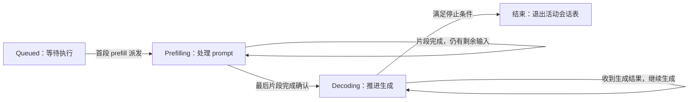
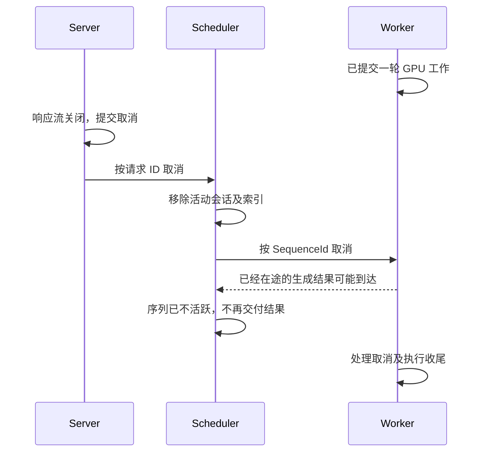

# 第 1 章：请求与会话的生命周期

用户发送“介绍一下 Rust”，随后等待回答。对于推理框架，这项工作会持续一段时间：输入需要排队，prompt 需要被计算，回答需要逐步生成，相关资源最后需要释放。即使网络消息已经被接收，承载这项工作的状态仍要留在系统中，供后续调度、计算和结果返回使用。

一条请求因此带出三个基本问题：它是谁，现在进行到哪里，以及由谁保存和推进这些信息。它们把 Server、Scheduler 和 Worker 三个进程连接起来，也决定了一个结果如何找到正确的响应流、一块显存何时可以再次使用。

Worker 进程内部又分为两类职责：**Worker Server（服务层）**接收调度命令、管理执行中的序列、组织批次并返回结果；**Model Runner（模型执行器）**接收准备好的执行请求，组织模型计算并收集结果。

```text
Server 进程
    ↕ 请求与结果
Scheduler 进程
    ↕ 批次命令、执行结果与控制消息
Worker 进程
    ├── Worker Server：通信、序列管理与执行推进
    └── Model Runner：执行计划、模型计算与执行资源
```

源码中，Worker Server 的职责主要由 `serve_loop`、`worker_scheduler` 和 `decode_engine` 协作完成；Model Runner 对应的核心类型名为 `Runtime`，位于 `infer-worker` 的 `application/runtime/` 中。后文出现 `Runtime` 时，指的就是这个 Worker 内部的模型执行器。普通单卡路径由服务循环直接调用它，GPU 工作提交后可以异步执行。

沿用[引言](../../02-introduction.md)中的场景：模型已经就绪，使用单卡 dense 模型进行普通文本生成，暂时关闭前缀复用和推测解码。先跟随请求 A，再让请求 B 加入同一个批次，观察身份、状态与位置如何变化。

阅读跳转：[请求的身份](#identity) · [从等待到生成](#lifecycle) · [状态归属与 DDD](#ownership) · [结束、取消与迟到结果](#termination)。

<a id="identity"></a>
## 1.1 一条请求，在系统里有几种身份

### 从 HTTP 请求到推理会话

请求 A 到达 Server 时，携带的是聊天消息、生成长度上限、采样参数和流式标志。Server 将消息转换成 token IDs，生成请求标识，再提交给 Scheduler。

Scheduler 接收后，需要持续记住这项任务：输入有多长，是否已经获得执行机会，哪些输入已经处理，已经生成多少 token，结果应交给哪个 Server。保存这些信息的对象称为推理会话，代码中使用 `InferenceSession` 表示。这里的“会话”对应一次推理任务；用户连续进行多轮聊天时，每次提交都可以创建新的推理会话，历史对话则作为新请求输入的一部分。

Worker 关注这项任务参与计算时的状态。一条普通生成序列由 prompt 和逐渐增长的输出构成，执行时需要知道下一次输入哪个 token、已有 KV 在哪里、还允许生成多少 token。在本章的普通单序列生成路径中，一个已接纳请求对应一个会话和一个逻辑序列。

| 对象或概念 | 表达的含义 | 主要使用位置 |
| --- | --- | --- |
| HTTP 推理请求 | 外部输入、生成参数和响应方式 | Server |
| 推理会话 session | 一次生成任务的身份、阶段与进度 | Scheduler |
| 生成序列 sequence | prompt 与输出 token 构成的计算对象 | Scheduler 与 Worker |
| 批次行 batch row | 序列在某次批量执行中的位置 | Worker 内部的批次组织与模型执行 |
| KV slot | 某个 token 的 K/V 在缓存池中的存储位置 | Worker 的资源管理与模型执行 |

### 请求标识如何跨越进程

Server 为 A 创建 UUID 字符串，放入协议的 `request_id`。Scheduler 接纳 A 后，保留这个字符串作为 `external_id`，另外生成内部 `RequestId`，并分配一个整数 `SequenceId`。三者表达同一项任务在不同接口中的身份。

| 标识 | 由谁建立 | 用途 |
| --- | --- | --- |
| Server 的 `request_id` | Server | 将返回结果关联到本地请求及响应流 |
| Scheduler 的 `RequestId` | Scheduler | 在调度领域内识别会话 |
| `SequenceId` | Scheduler | 在调度命令、Worker 执行状态和计算结果中识别序列 |

Worker 返回的普通生成结果携带 `sequence_id`。Scheduler 据此找到会话，取出 `external_id`，放入发往 Server 的结果消息；Server 再按这个请求 ID 找到对应的结果通道。

同一个 Server 连接可以承载许多请求。Scheduler 保存的 `client_id` 用于选择返回消息的连接，请求 ID 则用于选择该连接上的具体请求。连接身份与请求身份共同完成路由。

### 身份稳定，执行位置可以变化

A 与 B 一起进入 decode 批次时，可以采用下面的布局。KV 索引仅作示意：

| 执行时刻 | batch row | 序列 | 已有 KV slot 索引 |
| --- | --- | --- | --- |
| A、B 都在执行 | 0 | A | `[5, 9]` |
| A、B 都在执行 | 1 | B | `[12, 40, 7]` |
| A 结束、批次压缩后 | 0 | B | `[12, 40, 7]` |

B 从第 1 行移到第 0 行，`SequenceId` 仍然属于 B，已有 KV 也可以继续保存在原来的 slot 中。发生改变的是行与序列之间的映射，以及按行排列的执行数据。B 下一步产生的新 KV，再通过自己的索引表加入序列。

Worker 用序列状态表保存“B 已有多少 KV、分别在哪里”，用 `DecodeRows` 保存“这一批的第几行属于 B”。`block_table` 将序列内的 token 位置关联到 KV 存储索引。项目当前按单 token slot 分配 KV，因此一个 slot 对应一个 token 在各层缓存中的 K/V 存储位置；一个长序列会持有许多 slot。

这种分工使批次可以随请求到达和结束而变化。多个请求共享一次批量计算，每条序列仍然保有自己的历史与身份。序列不会因为换行变成另一个请求，KV 也不必因为批次压缩而整体搬家。

<a id="lifecycle"></a>
## 1.2 请求如何从等待走到生成结束

### 等待：任务已经存在，执行尚未开始

A 被 Scheduler 接纳后进入等待状态 `Queued`。此时已经有身份、输入和生成参数，可以参与调度，也可以被取消。

等待会话需要在 Worker 可用、计算预算和 KV 预算允许的条件下获得执行机会。进入 Server 的本地发送队列、被 Scheduler 接纳、开始 GPU 计算，分别发生在这条链路的不同位置。

### Prefill：把输入变成可继续生成的模型状态

Scheduler 为 A 下发首段 prefill 工作后，会话进入 `Prefilling`。Worker 处理输入 token，为它们计算各层 K/V，并把结果保存在 KV Cache 中。较长的 prompt 可以拆成多个片段，在多轮执行中完成。

例如，A 的 prompt 有 100 个 token，首段处理前 60 个。首段发出时，Scheduler 记录的是“这 60 个 token 正在处理”；收到 Worker 的完成确认后，已完成长度才推进到 60。剩余 40 个 token 仍需获得后续调度机会。

因此，Prefilling 状态同时保存两种进度：已经确认完成的输入范围，以及已经派发、尚未确认的片段。后者通常称为在途工作。消息已发送只能说明工作被提交，完成确认才允许上层按执行结果推进状态。

最后一个 prompt 片段完成时，模型可以根据最后一个输入位置的 logits 采样出第一个输出 token。Scheduler 处理完最后片段的确认，将会话转入 `Decoding`，再处理相应的生成结果。

### Decode：将输出作为下一轮输入

假设 A 的输入由三个 token 构成，记为 `p0、p1、p2`。普通自回归生成的前几步如下：

| 本轮计算 | 本轮输入 | 本轮写入的 KV | 本轮采样输出 |
| --- | --- | --- | --- |
| Prefill | `p0、p1、p2` | `p0、p1、p2` 的 KV | `y0` |
| 第一次 Decode | `y0` | `y0` 的 KV | `y1` |
| 第二次 Decode | `y1` | `y1` 的 KV | `y2` |

**本轮写入 KV 的是本轮输入 token；刚采样出的输出 token，通常在下一轮作为输入时才产生自己的 KV。** 如果 `y2` 已经触发停止条件，就不必再为了继续生成而处理它。

Worker 持续重复“输入上次输出、更新 KV、采样下个 token”的过程。Scheduler 保存 Decoding 会话，记录生成进度、检查停止序列并组织输出。中央 Scheduler 负责 prefill 调度，后续普通 decode 由 Worker 自身的循环推进。

Decoding 是会话阶段，表示会话可以处理生成结果。即使第一个输出 token 就满足停止条件，会话也可以在处理它后直接结束，无须再执行一次 decode 计算。

正常路径可以画成下面的状态图：



图中的最后一步表示正常完成。取消和执行失败也会使请求退出活动集合，具体处理见[1.4 节](#termination)。

<a id="ownership"></a>
## 1.3 谁拥有状态，谁负责推进它

### 一条请求，各层保存各自需要的事实

A 正在生成时，Server、Scheduler 和 Worker 都保留了与 A 有关的信息。这些信息分别支撑结果交付、任务管理和模型执行。

| 所属进程 | 职责或内部组件 | 保存的主要状态 | 推进这些状态的事件 |
| --- | --- | --- | --- |
| Server | 请求处理与响应输出 | 请求与结果通道的关联、流等待期限、增量文本解码状态 | 结果到达、响应消费、超时或连接结束 |
| Scheduler | 会话管理与调度 | 会话身份与阶段、prefill 进度、生成记录、资源预算与前缀使用关系 | 请求接纳、调度派发、Worker 结果和控制事件 |
| Worker | Worker Server：服务层 | 序列的最近 token、KV 长度与索引、生成数量、批次行序 | 新批次命令、一步执行完成、取消和资源事件 |
| Worker | Model Runner：源码中的 `Runtime` | 模型、KV pool、执行缓冲、工作区和 CUDA Graph 等资源 | 执行请求、设备操作提交、完成收集与资源复用 |

Model Runner 需要让模型权重、KV 和持久缓冲跨越多个 step 保持有效。Worker Server 在这些资源之上组织序列和批次，Scheduler 则从请求与预算的角度决定哪些 prefill 工作可以派发。HTTP 格式、文本解码和响应流的处理留在 Server。

消息把这些状态连接起来，也让各层的观察存在时间差：Worker 完成计算时，Scheduler 可能还在等待完成消息；Scheduler 发出输出时，Server 可能尚未将其写入 HTTP 响应。各层根据自己已经处理的事件推进状态，跨进程消息携带身份与进度，使这些记录能够对应起来。

### 用类型表达会话阶段

Scheduler 中的会话结构如下：

```rust
pub struct InferenceSession<S: SessionState> {
    pub meta: Arc<RequestMeta>,
    pub handle: RequestHandle,
    pub state: S,
}
```

`meta` 保存身份、输入和生成参数等元数据；`handle` 保存返回消息所需的 Server 连接身份与流式标志；`state` 保存当前阶段特有的数据。Server 进程内的结果通道由 Server 自己持有。

`InferenceSession<Queued>` 和 `InferenceSession<Prefilling>` 是不同类型。`start_prefill(self)` 消费等待会话，返回 Prefilling 会话；`start_decode(self)` 再将它转换成 Decoding 会话。旧对象的所有权被移交后，调用者便不能继续拿它执行原阶段的操作。

类型让“哪些数据和操作属于哪个阶段”成为接口的一部分。输入是否全部处理、结果对应的序列是否还活跃、资源预算是否足够，仍由执行时的状态检查和应用流程保证。

### DDD 中的规则与协作

在这一条请求链中，领域层表达会话、状态转换和资源约束；应用层接收事件，组织接纳、派发、结果处理与结束等用例；基础设施层负责消息编解码、socket 收发和具体设备访问。

例如，一条 prefill 完成消息首先通过通信层进入系统，应用层找到对应会话，调用请求表的确认操作。请求表推进已完成长度；如果输入已经处理完毕，再将会话从 Prefilling 容器移入 Decoding 容器，并更新身份到当前位置的索引。

同一条序列在稳定状态下只属于一个活动阶段，身份索引指向该阶段内的会话。状态改变时，容器与索引必须一起更新。Scheduler 的 Engine 独占请求表，通过事件循环组织这些修改，领域对象和请求表共同表达局部一致性要求。

领域规则由这些对象及其操作承载，进程之间则通过命令和事件协作。一次跨进程发送无法把 Server、Scheduler 与 Worker 的全部状态同时改完，因此在途工作、确认和迟到结果都属于请求生命周期的一部分。各层数据结构的具体组织可继续阅读[第 2 章的请求状态与结果关联](02-server-and-transport.md#request-state-and-routing)。

<a id="termination"></a>
## 1.4 结束、取消与迟到结果

### 正常结束发生在哪一层

普通生成会在遇到 EOS、达到生成长度上限，或匹配停止序列时结束。Worker 根据 EOS 和生成数量推进本地执行；Scheduler 还会根据生成 token 匹配配置的停止序列，整理最终输出并结束会话。

结束处理涉及几个不同的动作：Worker 停止为该序列安排后续计算，Scheduler 移除活动会话及其身份索引，Server 处理最终输出并完成响应流。在正常完成路径中，领域对象可以转成 `InferenceSession<Finished>`，用于携带完成原因、输出和统计信息；活动请求表不保存已完成会话。

执行失败时，Scheduler 根据受影响的请求进行错误输出和资源收尾。取消则依据会话所处阶段移除活动对象，必要时通知 Worker。这里的“结束”涵盖多种处理路径，活动表中的等待、Prefilling 和 Decoding 容器负责保存仍在推进的任务。

### 用户断开后，取消如何传播

假设 B 已经开始生成，用户关闭页面。Server 的响应流被释放后，会尝试提交取消。取消消息用 Server 请求 ID 找到 Scheduler 会话，再通过 `SequenceId` 指向 Worker 的执行序列。

取消遇到的阶段不同，后续工作也不同：

| Scheduler 中的阶段 | 取消时的处理 |
| --- | --- |
| 等待 | 移除等待会话及索引；该请求尚未派发到 Worker |
| Prefilling | 移除活动会话，处理相关资源记录，并向 Worker 发送序列取消 |
| Decoding | 移除活动会话，处理相关资源记录，并向 Worker 发送序列取消 |
| 已经不在活动表中 | 没有活动会话可取消，该次取消结束 |

取消通过消息传播，需要经过队列与通信边界。Server 停止等待时，Worker 可能已经完成一轮计算，也可能仍在执行已经提交的 GPU 工作。



这是可能发生的一种交错。若结果先于取消被处理，它可能已经进入返回链路；若取消先被处理，后来的结果就无法再找到活动会话。Scheduler 在处理批次结果前，根据活动会话过滤已失效的序列结果，不会根据一条迟到的生成结果重新创建会话。Server 同样会忽略已无本地 pending 条目的结果。

### 逻辑结束与资源可复用

从活动表中移除 B，表示系统不再把它作为活动请求推进。GPU 上已经提交的工作仍需遵守自己的完成顺序。某个缓冲或 KV 存储只要还可能被在途操作访问，就不能交给另一条请求覆盖。

因此，资源回收要同时考虑逻辑上的使用者与设备上的未完成访问。Worker 内部的服务循环与 Model Runner 在执行收尾过程中协调完成确认、缓冲复用与 KV 释放。CPU/GPU 的具体依赖在第 9 章展开，KV 分配与所有权在第 6 章展开。

启用前缀缓存后，还会出现另一种情况：A 已经结束，但它的一部分 KV 仍被缓存保留，供后续请求复用。请求生命周期与缓存生命周期由此分开；结束会话会释放它的使用关系，缓存是否保留则由前缀管理规则决定。相关机制在第 12 章展开。

### 源码入口与后续阅读

| 内容 | 源码入口 |
| --- | --- |
| Server 建立请求身份 | [chat.rs](../../../../crates/infer-server/src/api/openai/chat.rs) |
| Scheduler 接纳请求并分配身份 | [ingestion.rs](../../../../crates/infer-scheduler/src/application/ingestion.rs) |
| 会话对象与类型状态转换 | [lifecycle.rs](../../../../crates/infer-scheduler/src/domain/inference_session/lifecycle.rs) |
| 会话容器、身份索引与迁移 | [table.rs](../../../../crates/infer-scheduler/src/domain/inference_session/table.rs) |
| Worker 序列状态与批次行序 | [worker_state.rs](../../../../crates/infer-worker/src/application/worker_state.rs) |
| 结果处理、完成与取消 | [output_fns.rs](../../../../crates/infer-scheduler/src/application/output_fns.rs)、[cancel.rs](../../../../crates/infer-scheduler/src/application/cancel.rs) |
| 结果反馈与迟到结果过滤 | [workflow/llm.rs](../../../../crates/infer-scheduler/src/application/workflow/llm.rs) |
| Worker 执行推进与收尾 | [serve_loop.rs](../../../../crates/infer-worker/src/application/serve_loop.rs) |
| Model Runner 的核心实现 | [runtime/mod.rs 中的 `Runtime`](../../../../crates/infer-worker/src/application/runtime/mod.rs) |

接下来沿 A 的实际入口进入[第 2 章：HTTP、异步任务与 ZMQ 通信](02-server-and-transport.md)，展开 Server 如何准备输入、交接任务并返回结果；[第 3 章](03-scheduler-and-worker-group.md)继续进入 Scheduler，解释请求如何获得执行机会。

返回[全书目录](../../01-CONTENTS.md)或[书籍入口](../../00-README.md)。
