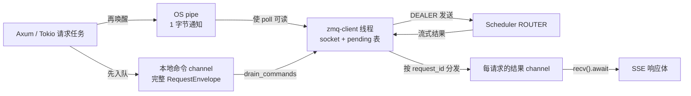
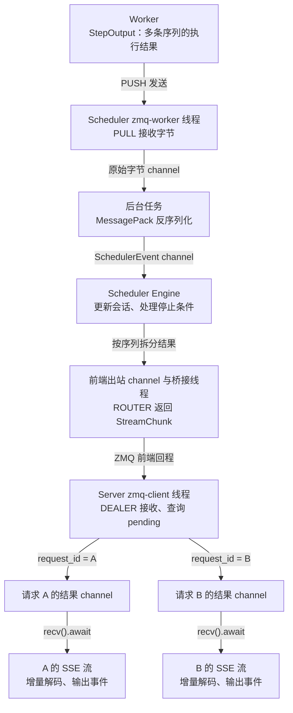

# 第 2 章：从接口到领域——HTTP、异步任务与 ZMQ 通信

一条 HTTP 请求到达后，模型并不会立刻开始计算。Server 先把外部协议转换成推理请求，再跨越线程与进程边界交给 Scheduler；结果返回时，还要把 token 转成可以持续输出的文本。本章沿着这段旅程，解释每一步由谁执行、在哪里等待，以及等待会占用什么资源。

沿着[第 1 章建立的身份与生命周期](01-lifecycle.md)，这里进入 Server，以使用 Hugging Face tokenizer 的纯文本流式聊天请求为主线。

阅读跳转：[HTTP 与编码](#http-to-tokens) · [异步与线程](#async-and-threads) · [channel 与流式提交](#stream-submission) · [ZMQ](#what-is-zmq) · [轻量唤醒](#wake-and-transfer) · [结果接收与 SSE](#receiving-results) · [请求状态与结果关联](#request-state-and-routing) · [与 vLLM 对照](#vllm-comparison) · [收益与边界](#tradeoffs) · [线程通信与计网基础](#network-and-os) · [锁与环形队列](#locks-and-rings) · [DDD 与源码](#ddd-and-sources)。

<a id="http-to-tokens"></a>
## 2.1 从 HTTP 到 token IDs

请求进入 Axum 路由后，先经过准入中间件。它通过信号量（semaphore）的许可数量限制同时处理的请求数：取得一个 permit 才能继续，容量耗尽就返回 HTTP 429。这个位置在读取请求体之前，因此过载时不必继续读取和解析大请求。取得 permit 后，Axum 提取共享状态、请求扩展以及 JSON 请求体，随后调用路由处理函数（handler）`chat_completions`。JSON 解析本身也要消耗 CPU，并不会因为 handler 是 `async fn` 就自动进入后台线程。

进入 handler 后，首先校验消息、采样参数及功能组合。随后处理输入。聊天请求中的 `system`、`user`、`assistant` 等角色，需要通过模型对应的 chat template 转成 prompt，再经过 tokenizer 编码为 token IDs。

```text
HTTP JSON 中的 messages
    → chat template：组织角色、文本和特殊标记
    → tokenizer：按既定规则编码
    → input_ids：模型输入的整数编号序列
```

**token 是 tokenizer 词表中的编码单元，可以对应完整单词、子词、字符片段、字节或特殊标记。** 不同 tokenizer 可以使用 BPE、WordPiece、Unigram 等模型，以及不同的预切分、字节处理和特殊 token 规则。高频片段可能在 tokenizer 训练阶段成为词表中的单元；推理时，编码器按照已经确定的词表和规则处理输入。[Hugging Face Tokenizers 组件说明](https://huggingface.co/docs/tokenizers/components)

所以，限制上下文长度要在编码后看 `input_ids.len()`，不能用字符数或字符串字节数代替。模板和特殊标记同样可能占用 token。

得到输入后，Server 执行以下转换：

1. 统计 `prompt_tokens`。若输入长度已经达到或超过 `max_model_len`，拒绝请求。
2. 计算输出预算：用户指定 `max_tokens` 时，取它与 `max_model_len - prompt_tokens` 的较小值；未指定时采用剩余上下文容量。
3. 将用户提供的 stop 字符串转换为停止 token 序列。
4. 生成请求 UUID，组织 `InferenceRequest`，包含输入 IDs、生成上限、采样参数、停止条件和流式标志等。

此时完成的是输入准备与协议转换。模型计算、KV 分配和 GPU 提交还没有发生。源码入口是 [chat.rs 的 `chat_completions`](../../../../crates/infer-server/src/api/openai/chat.rs) 与 [shared.rs 的 `cap_max_tokens`、`prepare_stop_sequences`](../../../../crates/infer-server/src/api/openai/shared.rs)。

<a id="async-and-threads"></a>
## 2.2 `async` 在哪里让出执行权

Rust 的 `async fn` 产生 Future；编译器可以把其中跨越暂停点的执行状态组织成状态机。执行器调用 Future 的 `poll` 来推进任务。在 `.await` 处，如果被等待的 Future 返回 `Pending`，当前任务才会暂时让出执行权，并依靠唤醒机制安排后续推进。如果它已经 `Ready`，执行可以直接继续。

等待网络 I/O、消息通道（channel）、定时器、异步锁或另一个任务的结果，都可能让 Future 返回 `Pending`。这些任务可以共享执行器的线程；`async` 本身不会为每次函数调用创建操作系统线程。[Rust Future 文档](https://doc.rust-lang.org/std/future/trait.Future.html)

如果在 handler 里直接调用同步 tokenizer，这段计算就会占用当前 Tokio 执行线程，直到函数返回。计算期间，该线程无法推进其他任务；多线程 runtime 的其他线程仍可继续执行各自的任务。

项目把纯文本路径中的模板处理和编码放在 `tokio::task::spawn_blocking` 中。可以将代码概括为：

```rust
// 示意代码：省略了 permit 和模型分支。
let input_ids = tokio::task::spawn_blocking(move || -> anyhow::Result<Vec<i32>> {
    let prompt = template.apply(&messages)
        .map_err(|e| anyhow::anyhow!(e.to_string()))?;
    let encoding = tokenizer.encode(prompt, true)
        .map_err(|e| anyhow::anyhow!(e.to_string()))?;
    Ok(encoding.get_ids().iter().map(|&id| id as i32).collect())
}).await??;
```

闭包在阻塞线程池执行；handler 等待它的 `JoinHandle`。如果结果还没有就绪，handler 暂停，把 Tokio 执行线程交给其他任务。tokenizer 的计算转移到阻塞线程池，与其他异步任务并发推进。线程池会复用工作线程，CPU 任务的积压仍会产生排队与调度成本。[Tokio `spawn_blocking` 文档](https://docs.rs/tokio/latest/tokio/task/fn.spawn_blocking.html)

已经开始执行的 blocking 闭包通常不能通过取消外层 Future 立即停止。源码因此把 admission permit 的一个引用带进闭包：即使客户端提前断开，仍在进行的预处理也继续占用容量，直到闭包退出。正常流式路径中，permit 随后由响应流持有。这把资源计数和实际工作的生命周期联系起来。

| 工作 | 当前执行位置 | 等待或计算的含义 |
| --- | --- | --- |
| HTTP handler、参数校验、组织请求 | Tokio 执行线程 | 同步片段会占用当前线程；`.await` 不保证每次都暂停 |
| 模板处理、tokenizer 编码 | `spawn_blocking` 线程池 | CPU 工作仍在执行，handler 可以等待其结果 |
| Server 的 ZMQ socket 与 pending 表 | 专用 `zmq-client` 线程 | 集中管理收发和结果分发；可以阻塞等待事件 |
| SSE 生成器等待推理结果 | 异步响应体任务 | channel 暂无结果时可以让出执行权 |

这张表描述应用层的执行分工。libzmq 还可以拥有内部 I/O 线程，所以“一个通信线程”并不代表整个传输栈只有一个 OS 线程。

<a id="stream-submission"></a>
## 2.3 channel 与流式请求提交

handler 准备好 `InferenceRequest` 后，需要把它交给 ZMQ 通信线程。两者使用 channel 传递消息。

### channel：队列、发送端与接收端

channel 是消息通道。发送者通过发送端 `tx` 提交一个值，接收者通过接收端 `rx` 取走这个值。带缓冲的 channel 会在两者之间保存尚未取走的消息，使生产者与消费者能够按各自的速度运行。

```text
请求任务 A ─┐
请求任务 B ─┼─→ tx → [请求 A | 请求 B | 请求 C] → rx → ZMQ 线程
请求任务 C ─┘           channel 内部队列
```

项目使用的 `mpsc` 表示 **multiple producers, single consumer，多生产者、单消费者**：多个任务可以持有同一 channel 的发送端，消息由一个接收端统一取走。克隆 `tx` 是增加一个发送入口，不是复制队列，也不会把消息广播给所有参与者。相对地，SPSC 表示单生产者、单消费者，MPMC 表示多生产者、多消费者。

channel 不会自动创建工作线程。线程由 `thread::spawn` 等接口创建，异步任务由执行器推进；channel 只负责它们之间的消息交接。Server 的命令 channel 直接传递 `RequestEnvelope`；ZMQ 线程在发送跨进程消息前，再将其中的业务命令序列化为字节。[Rust MPSC 文档](https://doc.rust-lang.org/std/sync/mpsc/index.html)

### Rust 如何交接消息所有权

下面用一个简单消息说明同步 channel 的用法：

```rust
use std::sync::mpsc;
use std::thread;

let (tx, rx) = mpsc::sync_channel::<String>(16);

let consumer = thread::spawn(move || {
    while let Ok(message) = rx.recv() {
        println!("{message}");
    }
});

let message = String::from("request-1");
tx.send(message).unwrap(); // 成功后，message 的所有权已经交给 channel。
drop(tx);                 // 关闭最后一个发送端。
consumer.join().unwrap();
```

接收端取出消息后获得它的所有权。对于 `String`、`Vec` 这类拥有堆内存的值，移动所有权不要求深拷贝整个字符串或数组；但队列操作仍有同步和内存访问成本。如果传递的是 `Arc<T>`，接收方得到的是共享所有权，数据的并发修改仍需相应的同步机制。

在这个例子中，`recv()` 遇到空队列会等待；所有发送端都被释放且剩余消息读完后，它返回断开错误，循环结束。若接收端提前被释放，后续发送会失败。**队列暂时为空与通道已经关闭是两种不同状态。** 关闭发送端也不等于取消已经被取走的工作，推理取消仍需单独的命令。[Rust MPSC 文档](https://doc.rust-lang.org/std/sync/mpsc/index.html)

### 队列满或空时，究竟由谁等待

“同步 channel”描述的是接口行为。`sync_channel(16)` 可以先缓冲 16 条消息，发送成功表示消息已交给通道；缓冲区满后，普通 `send` 才等待容量。标准库还支持容量为 0 的会合通道，此时发送与接收必须配对才能完成交接。[`sync_channel` 文档](https://doc.rust-lang.org/std/sync/mpsc/fn.sync_channel.html)

| 接口 | 暂时不能完成时的行为 | 适合放在哪里 |
| --- | --- | --- |
| `std::sync::mpsc::SyncSender::send` | 有界队列满时阻塞当前 OS 线程 | 允许阻塞的专用线程 |
| `std::sync::mpsc::Receiver::recv` | 队列空且仍有发送端时阻塞当前 OS 线程 | 同步消费者线程 |
| `try_send` / `try_recv` | 不等待容量或消息，立即返回成功、满、空或断开等结果 | 需要立即作出过载或调度决策的位置 |
| Tokio 有界 channel 的 `send().await` | 队列满时可以暂停当前异步任务 | 异步生产者 |
| Tokio channel 的 `recv().await` | 没有消息时可以暂停当前异步任务 | 异步消费者 |
| Tokio channel 的 `blocking_recv()` | 没有消息时阻塞调用线程 | 与异步侧对接的同步线程 |

异步 channel 暂无消息时，会登记等待任务的 Waker；新消息使任务具备继续执行的条件，再由执行器安排推进。调用 `blocking_recv()` 等阻塞接口时，等待的是 OS 线程，应放在同步线程中。接口带有 `try_` 只说明它不等待队列条件，并不等于整个实现无锁或整个调用路径都不会遇到其他阻塞点。[Tokio MPSC 文档](https://docs.rs/tokio/latest/tokio/sync/mpsc/index.html)

有界 channel 用容量限制排队数量。下游持续变慢时，生产者必须等待、拒绝或取消工作，这种压力向上游传递的机制称为**背压**。无界 channel 没有显式的队列容量上限，积压会持续消耗内存。

### 一次提交包含两条 channel

Server 的命令和结果沿不同方向流动：

| channel | 发送方 → 接收方 | 消息与等待策略 |
| --- | --- | --- |
| 同一 `ZmqClient` 实例共用的命令 channel | HTTP 任务 → ZMQ 线程 | `RequestEnvelope`，容量 1024；提交用 `try_send`，满时拒绝 |
| 每请求独立的结果 channel | ZMQ 线程 → SSE 响应体 | `StreamChunk`，容量 64；接收用 `recv().await`，发送侧用 `try_send` |

请求 envelope 除了携带 `InferenceRequest`，还携带该请求结果 channel 的发送端。ZMQ 线程将这个发送端登记到 pending 表中；Scheduler 的回复到达后，它按 `request_id` 找到发送端，把结果交给对应的 SSE 响应体。这是“消息里携带回复通道”的请求—响应模式。

handler 调用 `state.client.infer_stream(engine_req).await` 时，`ZmqClient` 依次完成本地提交：

1. 创建容量为 64 的 Tokio channel，用来接收该请求的流式结果。
2. 把请求与结果 channel 的发送端一起放进 `RequestEnvelope::Stream`。
3. 使用 `try_send` 将 envelope 放入容量为 1024 的本地命令队列；队列满会产生提交错误，并映射为 HTTP 429。
4. 调用唤醒器，通知专用通信线程检查队列。
5. 返回持有接收端的 `StreamHandle`。

这个 `async fn` 的函数体内部没有 `.await`，完成本地入队和唤醒后就返回。首 token 的等待发生在结果 channel 上。其中同步的锁和 pipe 写入仍可能阻塞线程，后文会展开其条件。

**返回成功说明本地命令已经入队，并尝试了唤醒；不说明 Scheduler 已收到，更不说明 GPU 已开始执行。** 唤醒写入的错误目前被忽略。相应源码见 [`infer_stream` 与 `StreamHandle`](../../../../crates/infer-server/src/client/zmq_client.rs)。

handler 随后构造 SSE 响应并返回。HTTP 响应体还会继续运行：生成器通过 `stream_handle.recv().await` 等结果，将 token IDs 增量解码为文本，再输出 SSE 事件。初始的角色事件可以先于模型输出出现；某个 token 也可能暂时解不出完整文本。因此，第一个 SSE 事件、首个输出 token 和首段可见文本是不同的观测点。

正常结束时，生成器标记 handle 已完成并发送结束事件；响应流提前被丢弃时，未完成的 handle 会尝试提交取消命令。本地队列满或链路故障都可能阻止取消到达 Worker，因此取消提交与远端停止之间存在时间差和失败窗口。源码入口是 [streaming.rs 的 `run_stream`](../../../../crates/infer-server/src/api/openai/streaming.rs) 和 [`StreamHandle::drop`](../../../../crates/infer-server/src/client/zmq_client.rs)。

<a id="what-is-zmq"></a>
## 2.4 ZMQ 是什么，它在项目里承担哪一层

ZeroMQ，通常简称 ZMQ，是嵌入进程使用的消息通信库。它提供带有不同通信模式的 socket、消息队列和传输机制，应用通过它发送一条条消息。项目中的 Server 与 Scheduler 可以直接建立连接，不需要因为用了 ZMQ 就另外部署一个消息代理服务。[ZeroMQ 概览](https://libzmq.readthedocs.io/en/latest/zmq.html)

理解当前调用栈，可以从外到内分成四层：

```text
InferenceRequest / ServerCommand       应用协议：业务上表达什么
    ↓ MessagePack 编码
payload 字节                          序列化：字段怎样表示为字节
    ↓ ZMQ frame / multipart message
DEALER ↔ ROUTER 等 socket              消息边界、通信模式和路由
    ↓ ipc:// 等 transport
操作系统的进程间通信                  字节实际如何跨越进程
```

MessagePack 负责结构体和字节之间的转换；ZMQ 负责消息通信；Scheduler 收到后才解释命令的业务含义。ZMQ 不知道什么是 prefill、KV 预算或 token，也不会替我们决定请求优先级。

默认端点使用 `ipc:///tmp/rustinfer-...`，由[配置代码](../../../../crates/infer-protocol/src/config.rs)生成。IPC 传输基于 Unix-domain socket，路径用于定位本机通信端点，请求内容通过 socket 传输。`inproc://` 则用于同一进程、同一 ZMQ context 中的 socket 通信；跨主机通信还可使用 `tcp://` 传输。[ZMQ IPC](https://libzmq.readthedocs.io/en/latest/zmq_ipc.html)、[ZMQ inproc](https://libzmq.readthedocs.io/en/latest/zmq_inproc.html)

| 项目链路 | socket 模式 | 在这里解决的问题 |
| --- | --- | --- |
| Server ↔ Scheduler 前端 | DEALER ↔ ROUTER | 多个请求在途、流式回复，以及将结果路由回对应 Server 连接 |
| Scheduler → Worker 数据面 | PUSH → PULL | 发送批次命令 |
| Worker → Scheduler 数据面 | PUSH → PULL | 回传执行结果 |
| Worker ↔ Scheduler 控制面 | DEALER ↔ ROUTER | 控制请求和回复 |
| Scheduler 内部唤醒 | PAIR ↔ PAIR，使用 inproc | 提醒另一个线程检查本地业务队列 |

ROUTER 使用 routing identity 区分连接，业务层使用 `request_id` 区分请求。一条 Server 连接可以承载多条请求，所以这两种标识不能互相代替。普通 DEALER/ROUTER 组合也不要求所有业务请求都按“发一条、等完整回复、再发下一条”的交替方式推进。[ZMQ socket 类型说明](https://libzmq.readthedocs.io/en/latest/zmq_socket.html)

在前端协议中，Server 的 DEALER 发送 `[空帧, MessagePack payload]`；Scheduler 的 ROUTER 收到 `[routing identity, 空帧, payload]`。回程按对应结构组织。空帧是前端协议的约定；Worker 控制面发送 payload 时不附加这个空帧。ZMQ 的 multipart 将多个 frame 组成一条消息，具体字段和帧数由应用协议定义。

这里的 ZMQ 数据面传递推理命令与结果。TP 中的张量集合通信由 NCCL 等机制负责，PUSH/PULL 本身不表达张量分片或 AllReduce。

<a id="wake-and-transfer"></a>
## 2.5 轻量唤醒与专用线程中的同步收发

业务任务把完整消息交给本地 channel，再用一个很小的信号唤醒通信线程，由它调用同步 ZMQ API。两条路径各司其职：**channel 保存“要做什么”，唤醒通道只表示“请检查队列”。**

Server 通信线程通过 `zmq::poll` 等待外部消息。标准库 channel 的接收端无法直接加入这里的文件描述符等待集合，它自身的通知机制也无法唤醒正在等待 socket 的 `poll`。pipe 的读端可以被 `poll` 观察，因此额外的 pipe 把“内存队列里有工作”转换成通信循环能收到的 I/O 就绪事件。

### Server：业务 channel 与 OS pipe



`ZmqClient::new` 创建有界命令 channel、匿名 pipe 和一个长期运行的 `zmq-client` 线程。通信线程创建并持有 DEALER socket，还维护 `request_id → PendingRequest` 的映射。业务任务不直接访问该 socket。

通信循环按以下顺序推进：

1. 排空当前命令队列。为请求登记 pending 状态，再序列化并发送命令。
2. 根据流式请求的最近 deadline 计算等待时间，上限为 1 秒。
3. 用 `zmq::poll` 同时等待 DEALER 可读和 pipe 读端可读。
4. 收取已经到达的回复，按请求 ID 分发；按时机发送心跳。
5. pipe 可读时读取一批唤醒字节，处理超时，再回到循环顶部检查命令队列。

生产者必须先入队、再唤醒。如果先通知，消费者可能醒来却发现队列为空，随后再次睡眠；真正的消息在这之后才入队，就可能等待下一次事件或超时。先入队保证消费者在观察到通知后能够找到已经发布的工作。对象跨线程的安全发布由 channel 的同步机制保证，pipe 只负责通知。

如果通知发生在通信线程进入 `poll` 之前，也不需要线程恰好在那一瞬间醒着：成功写入的字节会留在 pipe 中，使读端保持可读。一次检查可以处理多条命令，所以通知数不必与业务处理次数一一对应。当前代码每次读取最多 64 字节，并非一次就保证排空整个 pipe；剩余字节会让后续 `poll` 继续报告可读。

`zmq::poll` 可以同时观察 ZMQ socket 和普通文件描述符，并以可读等事件报告就绪。没有事件时可以阻塞等待；这和反复检查队列的忙轮询不同。[ZMQ poll 文档](https://libzmq.readthedocs.io/en/latest/zmq_poll.html)

### Scheduler：业务 channel 与 inproc PAIR

Scheduler 前端回复和 Worker 数据命令的发送侧采用类似思想，但具体实现多了一层桥接：

```text
Scheduler 异步应用逻辑
    → 有界 Tokio channel
    → bridge 线程 blocking_recv()
    → 有界 std channel 保存业务消息
    → inproc PAIR 发送 1 字节唤醒
    → ZMQ I/O 线程结束 poll 等待、取消息、调用发送 API
```

桥接线程创建自己的 PAIR 发送 socket，I/O 线程持有另一个 PAIR 接收 socket，两者使用同一 context。这样，异步任务无须直接操作唤醒 socket。前端与 Worker 数据面这两组出站桥接，每一跳当前容量均为 16,384；第二跳同样有界，防止它把第一跳的容量限制变成无效约束。第二跳满时，`SyncSender::send` 会阻塞桥接线程；若第一跳也因此填满，应用侧的 `.send().await` 才会等待容量，压力由此逐级传回生产者。

前端和 Worker 数据面 I/O 循环使用 `poll(..., -1)` 等待输入或唤醒；控制面则设置有限等待时间，以便及时处理 RPC deadline。Worker 自身在服务循环里直接处理数据面与控制面消息。源码见 [Scheduler ZMQ transport](../../../../crates/infer-scheduler/src/infrastructure/transport/zmq_transport.rs) 和[控制面 router thread](../../../../crates/infer-scheduler/src/infrastructure/transport/control_plane/router_thread.rs)。

### 同步调用与消息完成

**专用线程调用同步 ZMQ API，业务任务通过 channel 与它协作。** libzmq 内部仍有队列和异步传输过程。`send` 成功表示消息被接受进入 ZMQ 的发送流程，对端接收与业务执行在之后发生。[ZMQ send 文档](https://libzmq.readthedocs.io/en/latest/zmq_send.html)

请求在不同边界上的完成阶段如下：

```text
本地命令队列接受
    → ZMQ 接受发送
    → Scheduler 收到并处理
    → Worker 执行并产生结果
    → Server 生成 SSE 事件
    → 客户端实际收到并解析
```

每个箭头都有自己的等待与失败窗口。关联 ID 帮助找到同一请求，但它本身不提供持久化、自动去重或 exactly-once 执行保证。

<a id="receiving-results"></a>
## 2.6 结果如何从 Worker 回到 SSE

一次模型执行可以产生多条序列的结果，而每条 HTTP 响应流只应收到自己的输出。返回路径因此需要完成三件事：接收执行结果、找到对应会话、把可以输出的内容交给对应响应流。以下沿普通 LLM 流式路径展开。



### 第一站：Scheduler 接收 Worker 的执行结果

Worker 的 `DataPump::send_step_output` 将 `StepOutput` 序列化，经 PUSH socket 发送。Scheduler 的专用 `zmq-worker` 线程持有对应的 PULL socket。PUSH 只负责发送，PULL 只负责接收；批次命令和执行结果分别走两组方向相反的 PUSH/PULL 链路。

`StepOutput` 包含 prefill 完成信息、生成的 token，以及本步分配的 KV 索引信息。其中每个 `GeneratedToken` 携带 `sequence_id`、`token_id` 和 `finished`。这一步使用序列 ID 关联执行结果，还没有转换成 Server 用来分发回复的字符串请求 ID。

通信线程通过 `zmq::poll(..., -1)` 同时等待 PULL 上的结果和 PAIR 上的本地唤醒。无事件时阻塞当前 OS 线程；事件到达后，循环处理待发命令和已有结果。PULL 设置了 `RCVTIMEO=0`，因此后续 `recv_bytes(0)` 在没有消息时立即返回 `EAGAIN`，结束这一轮收取，再回到 `poll` 等待。

收到的字节先进入原始结果 channel。后台 Tokio 任务执行 `raw_rx.recv().await`，反序列化为 `SchedulerEvent`，再通过另一条 channel 交给 Engine。这里的 decode 指 **MessagePack 反序列化**，与模型逐 token 生成的 decode 阶段不同。

Engine 用 `tokio::select!` 等待前端请求、Worker 结果、控制事件和定时器。暂时没有可处理事件时，等待的是异步任务；Tokio 执行线程可以推进其他任务。结果处理与调度仍由 Engine 顺序组织，拆出通信线程和反序列化任务并不意味着多个任务同时修改会话表。

源码入口：[Worker DataPump](../../../../crates/infer-worker/src/infrastructure/transport/data_pump.rs)、[结果协议](../../../../crates/infer-protocol/src/worker_to_scheduler_data.rs)、[Scheduler transport](../../../../crates/infer-scheduler/src/infrastructure/transport/zmq_transport.rs)、[Engine 的 `decode_worker_output` 与 `poll_next_event`](../../../../crates/infer-scheduler/src/application/engine.rs)。

### 第二站：把批次结果转成每请求输出

Scheduler 按 `sequence_id` 查找会话，更新 prefill 进度或追加生成 token。处理生成 token 时，还要检查停止 token 序列：如果当前输出尾部可能成为停止序列的前缀，就暂缓发送这部分；后续不匹配时再释放，完整匹配时将停止序列从输出中移除。因而 Worker 产生了 token，不代表它立刻成为一条对外消息。

对于可以流出的 token，Scheduler 从会话取出两个标识：

- `client_id`：ZMQ routing identity，决定回复发回哪条 Server 连接。
- `external_id`：该连接上的业务请求 ID，写入 `StreamChunk.request_id`。

随后构造 `StreamChunk`，通过前端出站 channel、桥接线程和 ROUTER socket 发回 Server。`Token` 携带 token ID；`Done`、`Error` 则表达终态。非流式请求保留生成结果，在完成时返回完整响应。源码见 [`append_generated_token`](../../../../crates/infer-scheduler/src/domain/inference_session/table.rs) 与 [output_fns.rs](../../../../crates/infer-scheduler/src/application/output_fns.rs)。

### 第三站：Server 按请求 ID 分发

Server 的 `zmq-client` 线程同时监听 DEALER socket 和唤醒 pipe。DEALER 可读时，`drain_dealer` 使用 `recv_bytes(DONTWAIT)` 收取已有回复，直到 `EAGAIN`。等待采用有限超时，使请求截止时间和心跳也能得到处理。

收到 payload 后，`handle_response` 先将 MessagePack 字节解析成 `SchedulerReply`。流式消息进入 `handle_stream_chunk`：取出 `chunk.request_id`，查询 `pending`，取得该请求结果 channel 的发送端，然后调用 `try_send(chunk)`。

Server 在这里直接完成分发，没有再接一个全局 `outputs_queue → output_handler` 任务。各请求的输出可以交错到达：A 的 token、B 的 token、A 的下一个 token 会分别进入 A、B 各自的 channel。每个 channel 保存尚未被对应 SSE 流取走的消息。

源码见 [zmq_client.rs 的 `drain_dealer`、`handle_response` 与 `handle_stream_chunk`](../../../../crates/infer-server/src/client/zmq_client.rs)。

### 第四站：每条 SSE 流独立生成文本

每个 SSE 生成器拥有一个 `StreamHandle` 和一个 `IncrementalDecoder`。它通过 `stream_handle.recv().await` 等待自己的 `StreamChunk`，再根据消息类型推进：

| 消息或状态 | SSE 流的处理 |
| --- | --- |
| `Token` | 把 token ID 交给增量解码器；有可输出文本时，封装为 OpenAI chunk 并产生 SSE 事件 |
| `Done` | 标记 handle 完成，flush 解码器尾部，输出结束原因、可选 usage 和 `[DONE]` |
| `Error` | 标记完成，输出错误事件及终止事件 |
| channel 在终态前关闭 | 将异常中断反映给客户端，避免表现为正常完成 |
| HTTP 响应流提前丢弃 | 未完成的 `StreamHandle` 尝试提交取消命令；响应流持有的 admission permit 随之释放 |

文本解码需要跨 token 保存上下文。例如当前 token 只提供了一个多字节字符的部分字节，解码器可能暂时不产生文本。不同请求必须分别维护解码状态，不能把交错收到的 token 送进同一个全局文本解码器。

从 socket 字节得到 `StreamChunk` 是协议反序列化；从 token ID 得到文本是 tokenizer 的增量解码；从文本得到 SSE 字节又是响应格式转换。这三步处理不同层次的数据，分工也不同。源码见 [decoder.rs](../../../../crates/infer-server/src/api/openai/decoder.rs) 与 [streaming.rs 的 `run_stream`](../../../../crates/infer-server/src/api/openai/streaming.rs)。

### 持续接收如何避免忙等

长期运行的循环不一定持续占用 CPU。决定等待成本的是循环内部的等待点：

| 位置 | 暂无消息时 | 谁继续推进它 |
| --- | --- | --- |
| Scheduler 的 ZMQ 数据面线程 | 阻塞在 `zmq::poll(..., -1)` | PULL 可读或 PAIR 唤醒 |
| Server 的 ZMQ 线程 | 阻塞在带超时的 `zmq::poll` | DEALER、pipe 可读或超时 |
| 后台反序列化任务、Engine、SSE 流 | channel 或其他等待对象未就绪时返回 `Pending` | channel 等待机制通知执行器 |

忙等会在没有工作时立即反复检查；这里的通信循环先等待事件，醒来后批量处理已经就绪的消息，再回到等待点。[ZMQ poll 文档](https://libzmq.readthedocs.io/en/latest/zmq_poll.html)

Worker 发来的结果本身就会使 PULL 可读，不需要业务层额外写 pipe。轻量唤醒解决的是另一个方向的问题：本地 channel 新增待发消息时，要让正在等待 socket 的线程回来取消息。通信线程既负责收又负责发，所以需要把这两类事件放进同一个等待集合。同步发送若阻塞，仍可能延迟同一线程的接收工作，详见[实现边界](#tradeoffs)。

<a id="request-state-and-routing"></a>
## 2.7 请求状态如何与结果关联

请求跨过 Server、Scheduler 和 Worker 后，各层保留的数据服务于不同职责。Server 需要知道结果交给哪条响应流；Scheduler 需要知道会话阶段和输出进度；Worker 需要知道执行位置和 KV 索引。它们通过标识建立联系。

### Server：结果通道的关联表

`zmq-client` 线程持有 `HashMap<String, PendingRequest>`。键是请求 ID，值区分流式与非流式回复：

```rust
enum PendingRequest {
    Oneshot {
        tx: oneshot::Sender<InferenceResponse>,
    },
    Stream {
        tx: mpsc::Sender<StreamChunk>,
        deadline: Instant,
    },
}
```

流式条目保存发送端与等待截止时间，接收端由 SSE 的 `StreamHandle` 持有。非流式请求使用 oneshot，交接一次完整响应。这张表不保存完整 prompt、生成历史或 KV Cache；HTTP admission 的信号量则负责容量计数，也不是请求关联表。

注册跨越两步：`infer_stream` 先创建结果 channel 并提交 envelope；ZMQ 线程随后取出 envelope，登记 `pending`，再向 Scheduler 发送请求。因而 `infer_stream` 返回时，发送端可能还在命令队列中。完成登记之前，通信线程不会发送这个请求。

**发出请求时，接收回复所需的本地关联信息已经存在。** 这一顺序由“先登记 pending，再发送请求”保证；发送失败则移除条目。pending 保存请求与结果通道的关联，socket 的连接和发送由传输层负责。

Server 的登记、发送和接收由同一个线程顺序执行。网络回复即使提前到达，也会先在 ZMQ 中等待，直到通信线程进入接收阶段。收发并发执行时则可能出现另一种交错：请求已经发出，接收方处理快速回复时登记尚未完成，查不到条目，消息因而被忽略。关联信息的发布顺序决定了这种竞态是否可能发生。

这张表也定义了本地结果交付的生命周期：

| 事件 | pending 与结果通道的处理 |
| --- | --- |
| 收到普通流式 chunk | 更新 deadline，尝试投递到结果 channel |
| 收到 `Done` / `Error` | 尝试投递终态后移除条目；已入队的消息仍可由接收端取走 |
| 结果 channel 满 | 移除条目并尝试发送取消；不会覆盖未消费的 token |
| 结果接收端关闭 | 移除条目并尝试取消远端工作 |
| 流等待超时 | 移除条目，尝试投递错误消息并发送取消 |
| 收到取消命令 | 移除本地条目，再向 Scheduler 转发取消 |
| 收到已移除请求的迟到结果 | 找不到关联条目，忽略该结果 |

流式 deadline 随 chunk 到达而刷新，非流式等待则由 `infer()` 中的 Tokio timeout 管理。删除 pending 不等于 Worker 已经停下；取消仍需跨越传输和调度边界。源码入口：[zmq_client.rs](../../../../crates/infer-server/src/client/zmq_client.rs)。

### Scheduler：会话容器与身份索引

Scheduler 的 `RequestTable` 保存活动会话，结构可分为状态容器和索引两组：

| 字段 | 数据结构 | 用途 |
| --- | --- | --- |
| `waiting` | `WaitingQueue`，内部为 `VecDeque<Option<InferenceSession<Queued>>>` | 按优先级组织等待会话，同优先级新请求按入队顺序排列 |
| `prefilling` | `SlotMap<SessionKey, InferenceSession<Prefilling>>` | 保存 prefill 进度及已下发未确认的分段 |
| `decoding` | `SlotMap<SessionKey, InferenceSession<Decoding>>` | 保存生成 token、已流出数量、停止状态等 |
| `by_request` / `by_sequence` | `HashMap<RequestId, SequenceId>` 及其反向映射 | 连接内部请求身份与序列身份 |
| `by_external_id` | `HashMap<String, SequenceId>` | 从前端请求 ID 查找序列 |
| `locations` | `HashMap<SequenceId, Address>` | 找到序列当前的状态容器与槽位句柄 |

这里没有一个独立的 `running` 队列，运行中的会话分别保存在 `prefilling` 与 `decoding` 中。等待队列删除请求时先扫描定位，再取走对象并留下 `None`，累计空位后统一压缩；这避免每次取消都移动后续元素，但查找本身仍是线性的。普通完成路径会移除活动会话及其索引，不会把完整请求永久留在一个 completed 历史表里。

`SlotMap` 通过带版本的句柄访问槽位。删除对象后，同一存储槽位可以复用，旧版本句柄则不能直接访问新版本对象，从而防止槽位复用造成的身份混淆。项目的 `Address` 同时记录所属容器和句柄，因为 Prefilling 与 Decoding 是两张独立的 SlotMap。这些 CPU 对象槽位与 GPU 的 KV slot、批次 row 属于不同层次。[SlotMap 文档](https://docs.rs/slotmap/latest/slotmap/)

会话本身使用类型表达阶段：

```rust
pub struct InferenceSession<S: SessionState> {
    pub meta: Arc<RequestMeta>,
    pub handle: RequestHandle,
    pub state: S,
}
```

`meta` 保存身份、输入、生成预算和采样等元数据；`handle` 保存 Server 连接身份与流式标志，不持有 Server 进程内的结果 channel；`state` 保存当前阶段的数据。`Queued`、`Prefilling`、`Decoding` 等状态类型限制可执行的操作，状态转换消费旧对象并产生新状态对象。Engine 独占这张会话表，通过接收消息顺序推进它。

源码入口：[table.rs](../../../../crates/infer-scheduler/src/domain/inference_session/table.rs)、[queue.rs](../../../../crates/infer-scheduler/src/domain/inference_session/queue.rs)、[lifecycle.rs](../../../../crates/infer-scheduler/src/domain/inference_session/lifecycle.rs)、[handle.rs](../../../../crates/infer-scheduler/src/domain/inference_session/handle.rs)。会话的阶段迁移见[第 1 章](01-lifecycle.md#lifecycle)，Scheduler 的接纳、预算与调度在第 3 章展开。

### Worker：序列执行状态与身份转换

Worker 的普通 LLM 服务循环使用 `PrefillSeqMap = HashMap<u64, PrefillSeq>` 保存分段 prefill 状态，用 `ActiveSeqMap = HashMap<u64, ActiveSeq>` 保存 decode 状态。两者以 `sequence_id` 为键；值包含 KV 长度、`block_table`，decode 状态还包含最近 token、已生成数量、生成预算和采样参数。

物理 batch row 顺序另由 `DecodeRows` 的 `Vec<u64>` 保存，不能用 HashMap 的遍历顺序推导 GPU 行号。请求身份、当前批次行号和 KV 地址各自变化，通过显式映射连接。源码见 [worker_state.rs](../../../../crates/infer-worker/src/application/worker_state.rs)。

沿普通 LLM 回程，可以看到三种身份的分工：

```text
Worker 的 GeneratedToken.sequence_id（u64）
    → Scheduler 的 locations 索引与会话对象
    → 会话中的 external_id（Server 创建的请求 UUID 字符串）
    → StreamChunk.request_id
    → Server 的 pending[request_id]
    → 该请求的结果 channel
```

Scheduler 另外创建内部 UUID 类型的 `RequestId`，通过 `by_request` 和 `by_sequence` 与序列关联。这个内部 ID 不等于 Server 的字符串 ID。`client_id` 则表示 Server 连接，同一连接可以对应许多请求。

<a id="vllm-comparison"></a>
### 与 vLLM 的生产者—消费者结构对照

vLLM 的 `EngineCoreProc` 将 socket 输入放在独立线程中处理：`process_input_sockets` 等待 socket、接收并预处理消息，再放入 `input_queue`；Engine 主循环中的 `_process_input_queue` 取消息并调用 `_handle_client_request`。`input_queue` 是线程交接消息的队列，与 Scheduler 内部的等待、运行集合承担不同职责。

接收线程调用的是同步 `poller.poll()`，无事件时会阻塞。它与 Engine 并发运行，不要求自身是 `async` 协程。Engine 无工作时通常通过阻塞 `get` 等待；已有推理工作时，先用非阻塞方式取走当前输入，再继续 Engine step。已有请求不会仅因为没有新请求到来而停止生成。输出方向还由独立线程消费 `output_queue` 并发送结果。[vLLM EngineCore 源码](https://docs.vllm.ai/en/latest/api/vllm/v1/engine/core/)

前端以通过 `outputs_queue` 交接结果的 AsyncMPClient 路径为例：它使用异步 PULL socket 接收并解析 `EngineCoreOutputs`，交给本地 `outputs_queue`；AsyncLLM 的后台 `output_handler` 通过 `get_output_async()` 取得这些输出，再交给 `OutputProcessor`。其中共享队列与各请求的输出通道位于不同阶段：

```text
Engine PUSH → AsyncMPClient PULL
    → outputs_queue：多个请求的 Engine 输出
    → AsyncLLM output_handler
    → OutputProcessor：按 request_id 查状态、文本解码与后处理
    → 各请求的输出收集器
    → generate() 持续取出并交给调用方
```

这条路径中的每请求输出通道由 `RequestOutputCollector` 实现。它以事件通知消费者；生产速度超过消费速度时，新到的增量输出会与尚未取走的输出合并，消费者随后取得合并后的结果。[vLLM AsyncLLM 源码](https://docs.vllm.ai/en/latest/api/vllm/v1/engine/async_llm/)、[OutputProcessor 与收集器](https://docs.vllm.ai/en/latest/api/vllm/v1/engine/output_processor/)

| 责任 | vLLM 对应结构 | RustInfer 对应结构 |
| --- | --- | --- |
| 输入消息交接 | socket 线程 → `input_queue` → Engine | `zmq-frontend` 线程 → incoming channel → Engine 异步任务 |
| 按请求定位输出 | `OutputProcessor.request_states` | Scheduler 会话表与 Server `pending` 分别完成不同阶段的关联 |
| 结果后处理 | `OutputProcessor` 集中处理后交给每请求收集器 | Scheduler 处理生成状态与停止序列，SSE 流在分发后做文本解码 |
| 每请求交付 | 输出收集器 → `generate()` | 容量为 64 的结果 channel → `StreamHandle` → SSE |

两者都通过消息通道连接生产者与消费者，通过请求身份关联结果。RustInfer 的中心 Scheduler 调度 prefill，Worker 自己推进普通 decode；Server 收到流式回复后直接查表分发，文本解码由各请求的 SSE 流完成。

<a id="tradeoffs"></a>
## 2.8 这套设计的收益与实现边界

| 机制 | 得到的收益 | 需要承担的代价或约束 |
| --- | --- | --- |
| socket 与 pending 状态由专用线程集中管理 | 业务任务通过消息交互，减少 socket 共享和跨线程状态协调 | 需要额外线程；串行处理可能成为瓶颈 |
| 本地有工作就发唤醒信号 | 不必等下一次固定轮询周期；空闲时可以阻塞等待 | 通知仍有同步、系统调用及线程调度成本 |
| 完整消息走 channel，通知只携带一个字节 | 唤醒路径简单，多个命令可以在一次队列检查中处理 | 消息仍有排队、序列化和跨进程传输成本 |
| 部分关键队列有界 | 在局部形成可见的过载处理或背压 | 相邻的无界队列仍可能积压，系统总内存还受到在途请求和结果数量的影响 |
| DEALER/ROUTER 配合请求 ID | 多请求并行在途，流式结果可以交错返回 | 应用必须维护关联、超时、取消和终态 |

假设通信线程每隔 T 检查一次队列，期间没有其他唤醒事件，而且请求在一个检查周期内均匀到达，则等待下一次检查造成的额外延迟平均约为 T/2。主动唤醒让线程可以在请求到达后被唤起，省去这段周期性等待；剩余延迟主要来自队列积压、通知与 OS 调度。

这套结构的阻塞点与容量限制决定了它在负载上升时的行为。

**pipe 与锁可能阻塞提交线程。** Server 的 `Waker` 使用同步 `Mutex` 保护 `PipeWriter`，每次写入一个字节；pipe 没有设置非阻塞标志。当管道缓冲区满时，写入会等待读端腾出空间；多个提交者竞争锁时也可能等待。因此，通知载荷很小，并不意味着发送通知始终能立即完成。[Rust `std::io::pipe`](https://doc.rust-lang.org/std/io/fn.pipe.html)、[Linux pipe 语义](https://man7.org/linux/man-pages/man7/pipe.7.html)

**同步发送可能拖住通信线程。** Server 的 DEALER 发送和 Scheduler 的 PUSH 发送没有使用 `DONTWAIT`，可能在发送容量不足时等待。若通信线程停在发送操作上，同一线程负责的接收、超时与其他请求也会受影响。Scheduler 的 PAIR 唤醒使用 `DONTWAIT`，发送失败时返回错误；当前实现忽略该错误。具体发送阻塞、报错或丢弃行为取决于 socket 类型及选项。

**不同队列采用不同的过载策略。** Server 命令队列满会拒绝提交；单请求结果队列满时，通信线程会移除该 pending 请求并发取消。该路径使用 `CancelReason::StreamTimeout` 表达取消原因，其触发条件包括结果队列满。1024 的命令队列容量只限制尚未被通信线程取走的命令；`pending` 表没有独立容量上限，在途请求数量还受到 HTTP admission、超时与取消生命周期的影响。

Scheduler 的 Worker 结果入口、控制面的 Tokio 命令/事件队列及其 std 桥接队列是无界的。这些位置的消费者持续变慢时，积压会转化为内存增长和更长的排队时间。

<a id="network-and-os"></a>
## 2.9 线程通信与计网基础

### 线程为什么能通信，又为什么需要同步

同一进程中的线程共享虚拟地址空间，可以访问共同的堆对象和全局数据；每个线程又有自己的执行栈、寄存器上下文和调度状态。把一个有效引用交给另一个线程，就可能让两者访问同一对象。但“可以访问”没有解决“谁可以修改、何时可以读取、怎样等待更新”这三个问题。

例如，一个线程向队列尾部写请求，另一个线程从头部取请求。队列的长度、槽位和消息内容必须协调更新，否则可能出现重复消费、读取尚未初始化的内容或覆盖未消费消息。同步机制既要管理并发访问，也要建立必要的内存可见性与先后关系。[Rust 同步原语](https://doc.rust-lang.org/std/sync/index.html)

线程协作通常从两种方式组织：

| 方式 | 使用方式 | 在请求链中的对应关系 |
| --- | --- | --- |
| 共享状态 | 多个线程访问同一个对象，通过锁或原子操作协调 | 提交者共享唤醒器，使用 Mutex 保护 pipe 写端 |
| 消息传递 | 一方提交命令或结果，另一方收到后修改自己管理的状态 | 请求经 channel 交给 ZMQ 线程，由该线程修改 pending 表 |

两种方式可以同时使用。channel 也需要共享队列状态，只是把同步封装在通道内部；调用者主要处理消息与生命周期。进程之间通常拥有独立地址空间，不能直接把普通 Rust 指针交给另一个进程使用，需要 IPC、socket 或显式共享内存等机制。

### Mutex、条件变量、信号量和原子操作

| 机制 | 核心作用 | 与消息通道的关系 |
| --- | --- | --- |
| 互斥锁 Mutex | 同一时刻只允许一个持有者访问受保护的可变状态 | 可以保护队列、读写索引等；它本身不保存消息 |
| 条件变量 Condvar | 在线程等待某个条件时释放关联的锁，收到通知后重新加锁并检查条件 | 可以让消费者等待“队列非空”，让生产者等待“队列未满” |
| 信号量 Semaphore | 用许可计数限制并发访问某种资源 | 可以表示剩余槽位或可用消息数；Server 用它控制请求准入 |
| 原子操作 Atomic | 对特定值进行原子读写或读改写，配合内存序协调可见性 | 可以实现计数、槽位状态与队列索引，但不会自动保证多步业务操作一致 |
| channel | 组合消息存储、交接、等待和关闭语义 | 向业务代码提供 `send` / `recv` 等接口 |

以 Mutex 和条件变量实现有界队列时，生产者与消费者可以按下面的协议协作。检查条件和修改队列使用同一把锁：

```text
生产者：
  加锁
  while 队列已满且接收端仍存在：等待“未满”条件
  若接收端已关闭：返回发送错误
  消息入队
  解锁，并通知等待“非空”的消费者

消费者：
  加锁
  while 队列为空且仍有发送端：等待“非空”条件
  若队列为空且所有发送端已关闭：返回结束
  取走一条消息
  解锁，并通知等待“未满”的生产者
```

条件变量的 `wait` 将“释放锁并进入等待”协调为一个操作，返回时重新持有锁。消费者使用 `while` 重新检查条件，因为可能出现虚假唤醒，或者唤醒后条件又被其他线程改变。**真正决定能否继续的是共享状态中的条件，通知只是让等待者重新检查。** 条件变量不会像消息队列一样积存每一次通知。[Rust Condvar 文档](https://doc.rust-lang.org/std/sync/struct.Condvar.html)

最后一个发送端或接收端关闭时，也要在同一把锁下更新关闭状态，并唤醒对应的等待者，使它们有机会退出等待。

队列也可以利用原子操作实现。比较并交换（CAS）只在当前值符合预期时写入新值，常用于竞争某个槽位或更新索引。完整的 channel 还包含消息发布、容量管理和等待者登记。队列读写可以在用户态完成；等待与唤醒路径可能使用互斥锁或 OS 提供的机制，具体组合取决于 channel 的实现。

### 内存可见性与 Rust 所有权

假设生产者先填好 `InferenceRequest`，再成功发送；消费者通过 channel 收到它后，应当看到完整初始化的字段。这个交接需要同步关系。channel 的安全接口负责消息发布与接收，业务代码不必再用手写内存屏障保护已经转移所有权的消息。单独增加一个“有数据了”的标志，若没有正确的同步与所有权安排，并不足以构成安全队列。

Rust 的 `Send` 表示值可以安全地在线程间转移，`Sync` 表示其共享引用可以安全地在线程间使用。`Arc<T>` 提供线程安全的引用计数，让多个线程共同持有对象；它不会自动让 `T` 的内部修改变安全。需要共享修改时，常见组合是 `Arc<Mutex<T>>`，或者在适合的字段上使用原子类型。[Rust Send](https://doc.rust-lang.org/std/marker/trait.Send.html)、[Rust Sync](https://doc.rust-lang.org/std/marker/trait.Sync.html)、[Rust Arc](https://doc.rust-lang.org/std/sync/struct.Arc.html)

Server 将请求所有权交给通信线程后，由该线程串行维护 pending 表，业务任务通过后续消息与它协作。这减少了多个线程直接修改同一请求状态的机会。

<a id="locks-and-rings"></a>
### 项目中的锁与无锁环形队列

项目中的共享状态包括唤醒写端、就绪快照、待完成 RPC 和 Worker 注册表。它们通过互斥锁或读写锁协调并发访问：

| 对象 | 当前保护方式 | 所需语义 |
| --- | --- | --- |
| Server 的唤醒写端 | `Mutex<PipeWriter>` | 协调多个提交者向同一个 pipe 写入通知 |
| Server 的就绪状态 | `Mutex<ClientReadiness>` | 多个读取者观察一致的当前状态；读取不消费状态 |
| Scheduler 控制面待完成 RPC | `Mutex<HashMap<RequestId, PendingEntry>>` | 按 RPC ID 登记、完成、聚合和超时清理 |
| Scheduler Worker 注册表 | `RwLock<RegistryView>` | router 更新状态，liveness 读取并删除超时 Worker |
| Server 的 `pending`、Engine 的 `RequestTable` | 由各自执行单元独占，无外层共享锁 | 其他参与者通过消息请求其所有者更新状态 |

FIFO 环形队列按入队顺序交接消息；HashMap 支持按 ID 查找和移除条目；快照保存可被反复读取的当前状态。共享状态还可以采用单所有者结构：一个线程持有状态，其他参与者通过命令请求读写，状态变化由该线程顺序执行。控制面 RPC 的 `RequestId` 与推理会话的同名类型分属不同协议。

源码见 [Server 通信状态](../../../../crates/infer-server/src/client/zmq_client.rs)、[PendingCalls](../../../../crates/infer-scheduler/src/infrastructure/transport/control_plane/pending_calls.rs)、[Registry](../../../../crates/infer-scheduler/src/infrastructure/transport/control_plane/registry.rs) 和 [Liveness](../../../../crates/infer-scheduler/src/infrastructure/transport/control_plane/liveness.rs)。

HTTP 任务到 Server 通信线程是 MPSC；Scheduler 单个 bridge 到对应 I/O 线程的第二跳是 SPSC；单个请求的结果 channel 当前也是一个发送者对应一个接收者。单生产者表示发送端只有一个并发使用者；异步任务可以在执行器线程之间迁移，生产者角色保持不变。

SPSC 有界环形队列用一组可循环复用的槽位保存消息。以 `tail` 表示写入进度、`head` 表示读取进度，两个方向都需要安全发布：

```text
生产者写入消息
    → Release 发布 tail
    → 消费者以 Acquire 观察到发布进度
    → 读取并移出消息
    → Release 发布 head，表示槽位可复用
    → 生产者以 Acquire 观察到读取进度
    → 可以再次写入该槽位
```

发布 `tail` 之前必须写好消息；发布 `head` 之前必须完成从槽位读取或移出消息。如果消费者先归还槽位再读，生产者可能同时覆盖它，造成数据竞争。消费者将消息移到自己拥有的值以后，可以归还槽位再继续处理业务，无须占着槽位直到整个请求处理结束。`Relaxed` 保证原子变量自身访问的原子性，但不能单独建立消息载荷所需的发布关系。[Rust 原子内存序](https://doc.rust-lang.org/std/sync/atomic/enum.Ordering.html)

SPSC 的两个进度分别只有一个写入者，通常不需要 CAS 来竞争槽位。MPSC 中，多个生产者可能同时申请写入位置，算法还要协调槽位预留与消息发布。容量判断、索引回绕、消息析构和通道关闭共同决定了队列的完整生命周期。

标准库正容量 `sync_channel` 使用预分配环形数组保存消息，以原子位置和槽位状态协调访问，等待与唤醒部分还使用互斥锁。同一个 channel 因而同时包含环形存储、原子同步和阻塞等待机制。[标准库数组队列实现](https://doc.rust-lang.org/src/std/sync/mpmc/array.rs.html)、[等待与唤醒实现](https://doc.rust-lang.org/src/std/sync/mpmc/waker.rs.html)

环形队列负责消息存储和槽位交接，等待机制负责空队列时的挂起、满队列时的背压以及断开时的唤醒。在项目的通信循环中，pipe 或 PAIR 把本地消息到达转换成 `zmq::poll` 可以观察到的就绪事件。

### 死锁与等待顺序

阻塞本身不等于死锁。消费者等待新请求时，只要生产者还能独立运行，系统仍可继续推进。死锁发生在参与者形成无法自行解除的等待环时。

例如，线程 A 持有锁 L，向已经满的 channel 执行阻塞 `send`；线程 B 必须先取得锁 L 才能消费消息。A 等待 B 腾出容量，B 等待 A 释放锁，两者都无法继续。常见死锁条件包括互斥、持有资源并等待其他资源、资源不能被强行剥夺，以及循环等待。缩短持锁范围、统一锁顺序、避免持有其他必要资源时进行阻塞发送，都有助于打破等待环。

异步任务也可能形成逻辑死锁：`.await` 能让出执行线程，却不会自动释放任务仍然持有的锁或容量许可。任务、锁、队列容量和消息之间的循环依赖同样可能阻止系统继续推进。

### 消息边界与字节流

TCP 提供可靠、有序的字节流，不保存应用每次 `send` 的消息边界。接收端可能一次读到半条消息，也可能读到多条消息拼在一起，应用协议需要自己的分帧规则。ZMQ 提供消息和 multipart 抽象，应用按消息接收；这不等于底层网络一次发送就对应一个包。当前默认使用 IPC，这个对比用于理解传输层与消息层的职责。[TCP 规范 RFC 9293](https://www.rfc-editor.org/rfc/rfc9293.html)

在本项目里至少有四种不同的边界：模型 token、ZMQ 消息、SSE 事件、底层传输的数据片段。它们不必一一对应。SSE 用 HTTP 的持续响应输出 `text/event-stream`，事件依照文本格式分隔；客户端仍需按事件格式解析，不能把一次网络读取当成一个完整 token。[HTML 标准中的 SSE](https://html.spec.whatwg.org/multipage/server-sent-events.html)

### 异步任务、线程与就绪通知

线程是 OS 调度的执行单元；Future 是运行在执行器之上的计算状态。Future 等待一个异步 channel 时，执行线程可以推进其他任务；专用线程阻塞在 `zmq::poll` 时，则是在等待 I/O 就绪。二者都能避免忙等，但工作单位和调度层次不同。

异步执行器与通信循环各有自己的推进和通知机制：

| 名称 | 作用 |
| --- | --- |
| `Future::poll` | 尝试推进一个异步任务，返回 `Ready` 或 `Pending` |
| `std::task::Waker` | 通知执行器某个 Future 值得再次推进 |
| `zmq::poll` | 观察 socket / 文件描述符是否就绪，可以阻塞当前线程 |
| 项目的自定义 `Waker` | 向 OS pipe 写字节，使通信线程等待的读端可读 |

OS pipe 是有容量的单向字节通道；多个生产者共享写端时，需要协调写入与错误处理。这里利用的是“可读状态可以被等待”的性质。`zmq::poll` 对底层等待机制进行了封装，具体后端由构建和平台决定。

### 队列、背压与队头阻塞

当生产速度长期超过消费速度，等待的工作会积压。有界队列必须选择等待、拒绝、丢弃或取消等策略；无界队列把压力转移到内存和等待时间上。`try_send` 表示满时立即失败，不会自动替调用者等待容量；某个 `.send().await` 则可能因容量不足暂停任务。两者代表不同的用例契约。

单个通信线程负责多个请求时，一个同步调用拖延就可能影响其他请求，这是一种队头阻塞风险。序列化耗时、发送阻塞、锁竞争和结果分发都可能延长后续请求的等待时间；上层异步任务仍依赖这个通信线程完成消息交接。

### 生命周期与取消

handler 返回只说明响应对象已经构造，响应体和推理工作可能仍在继续。客户端连接、Server pending、Scheduler session、Worker 序列有各自的生命周期，需要通过请求标识和取消协议协调。

传输层确认、ZMQ 接受发送和应用执行完成发生在不同阶段。客户端超时后，远端可能尚未收到、正在排队，也可能已经执行但回复还未到达。重新发送可能与尚未结束的旧请求并存，重复识别、幂等执行和迟到结果处理属于应用协议的职责。

<a id="ddd-and-sources"></a>
## 2.10 DDD 职责边界与源码映射

这段请求链跨越协议适配、用例编排和基础设施。DDD 根据业务职责、状态归属与一致性要求划分边界；ZMQ、Tokio 和 channel 则提供跨边界协作所需的技术机制。

| 责任 | 这里拥有或解释什么 | 源码入口 |
| --- | --- | --- |
| HTTP 适配与输入准备 | OpenAI 请求字段、HTTP 错误、模板与 token 输入 | [chat.rs](../../../../crates/infer-server/src/api/openai/chat.rs)、[shared.rs](../../../../crates/infer-server/src/api/openai/shared.rs) |
| 请求容量生命周期 | admission permit，过载拒绝，后台任务和响应体的容量占用 | [admission.rs](../../../../crates/infer-server/src/middleware/admission.rs) |
| 推理客户端接口 | 向 handler 暴露提交和结果契约 | [client/mod.rs](../../../../crates/infer-server/src/client/mod.rs) |
| Server 通信适配 | socket、命令队列、唤醒 pipe、pending 与结果分发 | [zmq_client.rs](../../../../crates/infer-server/src/client/zmq_client.rs) |
| Scheduler 通信适配 | 外部消息到内部事件、连接身份和 channel 桥接 | [zmq_transport.rs](../../../../crates/infer-scheduler/src/infrastructure/transport/zmq_transport.rs) |
| 推理会话与结果关联 | 状态容器、身份索引、输出进度与停止序列 | [table.rs](../../../../crates/infer-scheduler/src/domain/inference_session/table.rs)、[output_fns.rs](../../../../crates/infer-scheduler/src/application/output_fns.rs) |
| Worker 序列执行状态 | 每序列 KV 索引、生成进度与批次行序 | [worker_state.rs](../../../../crates/infer-worker/src/application/worker_state.rs) |
| 外部响应表示 | token 增量解码、SSE 事件和结束处理 | [decoder.rs](../../../../crates/infer-server/src/api/openai/decoder.rs)、[streaming.rs](../../../../crates/infer-server/src/api/openai/streaming.rs) |
| 调度领域与应用用例 | 请求状态、资源预算和执行选择，在后续章节展开 | [Scheduler domain](../../../../crates/infer-scheduler/src/domain)、[Scheduler application](../../../../crates/infer-scheduler/src/application) |

SSE 格式由 HTTP 适配层解释，KV 预算由调度与资源管理规则解释；更换输出格式不应改变预算计算。传输实现负责把命令送到正确位置，推理客户端接口则定义提交和结果的契约。本地入队成功与 Scheduler 准入成功属于不同阶段，应用层需要分别处理其错误和生命周期。

请求离开 Server 后，[第 3 章](03-scheduler-and-worker-group.md)继续进入 Scheduler，从 Worker Group 的职责展开连接、接纳、资源预算、批次派发与结果反馈。

返回[全书目录](../../01-CONTENTS.md)或[书籍入口](../../00-README.md)。
