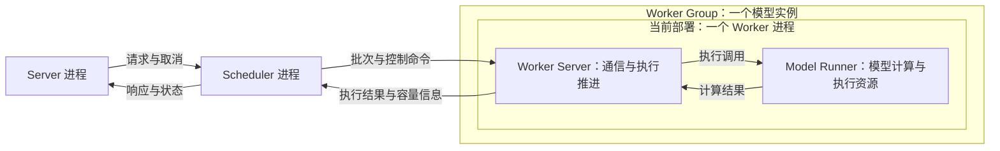
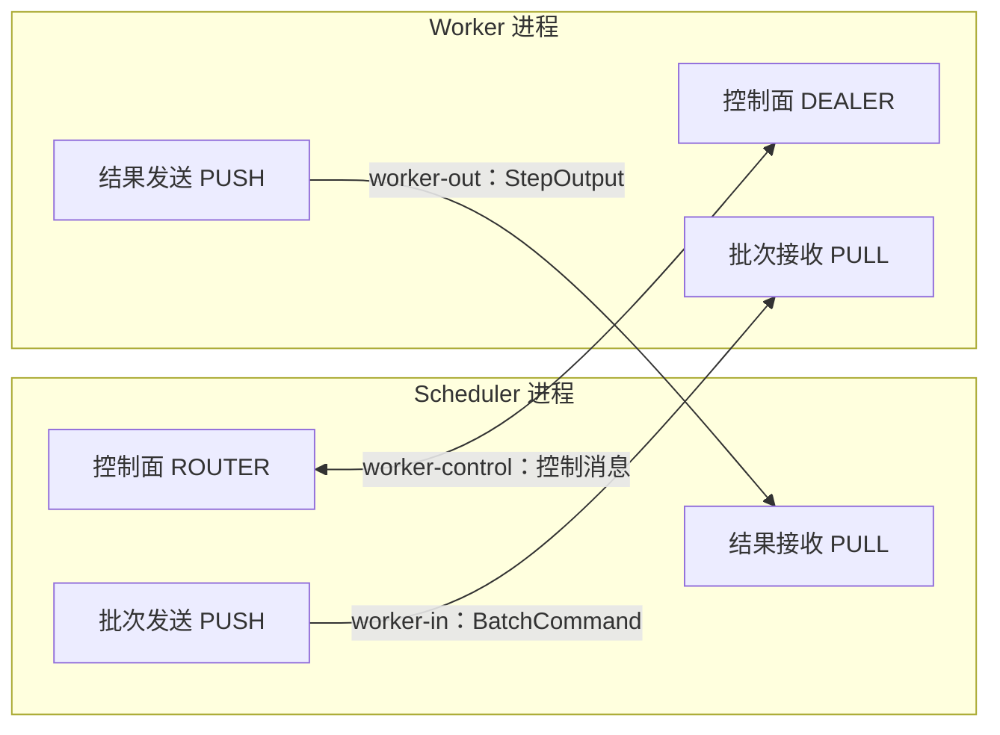
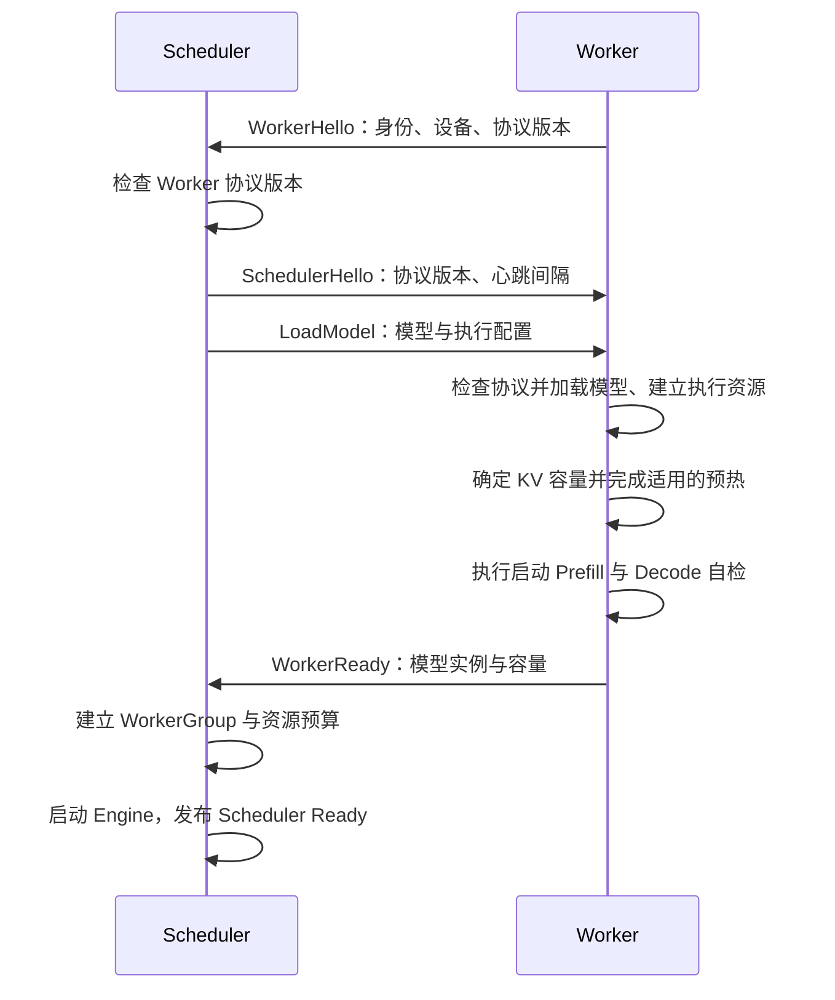
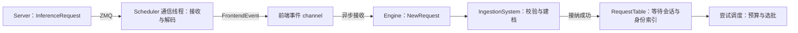

# 第 3 章：Scheduler——面向 Worker Group 的通信与资源调度

一个模型可以由一张 GPU 执行，也可以通过张量并行分布到多张 GPU 上。当服务进一步扩展到多台机器、多个模型副本时，请求需要找到合适的执行资源，执行资源也需要统一的容量管理。模型是否已经就绪、还能接纳多少请求、已有请求占用了多少 KV，都会影响下一次调度。

Scheduler 独立成进程的设计目标，就是统一管理多机器上的 Worker Group，并分配请求与资源。**Worker Group 对外提供一个模型实例的推理能力，Scheduler 面向这个执行单位协调工作。** 组内由哪些设备参与计算、怎样切分模型，由 Worker 侧组织。

沿着第二章的请求继续向前：Server 已经完成输入编码，将 token IDs 和生成参数交给 Scheduler。请求随后需要排队、获得资源、完成 Prefill，并在持续生成的过程中不断返回结果。每次状态变化，都会影响其他请求能否进入执行。

本章从 Scheduler 与 Worker Group 的职责开始，依次进入连接与就绪、请求接纳、资源预算、批次选择、命令派发和结果反馈，再讨论取消、故障与多 Group 扩展。当前主链路管理一个 Group，TP 在一个 Worker 进程内部组织；多机器上的 Group 选择与资源分配，将在这些机制的基础上展开。

阅读跳转：[职责与 Worker Group](#responsibilities) · [两层调度](#two-level-scheduling) · [状态归属与 DDD](#domain-boundaries) · [连接与就绪](#connection-and-readiness) · [启动握手](#bootstrap-handshake) · [容量报告](#capacity-report) · [控制消息关联](#control-correlation) · [请求接纳](#request-admission) · [请求表](#request-table) · [Engine 事件循环](#engine-event-loop) · [调度触发与合批等待](#scheduling-triggers)。

<a id="responsibilities"></a>
## 3.1 Scheduler 管什么，Worker Group 管什么

### 以一个模型实例作为执行单位

假设一个模型需要两张 GPU 才能完成推理。请求进入后，两张 GPU 分别执行自己的权重分片，并在需要的位置交换中间结果。它们共同完成同一次模型计算，对外提供一个模型实例的服务能力。这个协作执行的整体，就是 Scheduler 所面对的 Worker Group。

张量并行中的每个参与者称为一个 **rank**，由 rank 编号区分其身份。项目的本地 TP 将不同 rank 放在同一个 Worker 进程中，分别使用对应的 GPU。单卡执行也可以放入同样的 Group 抽象中，只是内部只有一个执行成员。

如果部署两个完整的模型副本，就可以形成两个 Group；每个 Group 都能独立承接请求，每个 Group 内部又可以使用多张 GPU。组间需要决定请求分配，组内需要协调一次模型计算。两者对应不同层次的调度与通信。

| 概念 | 表达的含义 | 在当前实现中的位置 |
| --- | --- | --- |
| Worker Group | 对外提供一个模型实例推理能力的执行单位 | Scheduler 持有的调度对象 |
| Worker 进程 | 承载服务循环和模型执行的软件进程 | 一个进程对外提供当前 Group 的服务 |
| TP rank | 参与张量并行计算的成员 | 由 Worker 在进程内部组织 |
| GPU | 存放张量并执行计算的设备 | 各 rank 使用的设备资源 |

当前 Scheduler 在启动时根据一个 Worker 的就绪报告建立 `WorkerGroup`，向这个执行端派发批次。Group 结构中的注册记录与 Worker 内部的 TP 拓扑分别维护，因此不能用外部注册记录的数量推断实际 TP 并行度。多 Group 部署还需要请求选择、按组维护的资源账本与结果路由。

### 三个进程，逐层展开执行职责

Server 保存外部连接与响应流。Scheduler 接过请求之后，建立持续存在的推理会话，管理它的等待、执行进度和结束条件。Worker Group 承接安排好的工作，并通过结果消息让 Scheduler 得知执行进展。

当前 Group 的服务由 Worker 进程提供。进程内部，Worker Server 接收命令、管理序列、组织本地执行；Model Runner 接收执行请求，组织模型计算并收集结果。



图中的 Worker Server 和 Model Runner 是 Worker 内部的职责划分。普通单卡路径通过函数调用交接执行；TP 路径还需要在 Worker 内部协调各 rank。Model Runner 的核心源码类型名为 `Runtime`，它持有模型、KV pool、计算缓冲和 CUDA Graph 等执行资源，随服务持续存在。

### Scheduler 统筹请求与资源

Scheduler 需要回答三个连续的问题：哪些请求正在等待，当前资源允许安排多少工作，以及执行结果会怎样改变下一次选择。

| 职责 | Scheduler 保存或决定什么 |
| --- | --- |
| 会话管理 | 请求身份、输入与生成参数、等待状态、Prefill 进度和生成结果 |
| 请求排序 | 等待请求的顺序，以及新请求与续段 Prefill 的执行机会 |
| 资源预算 | token、序列与 KV 容量约束，已经派发但尚未确认的工作 |
| 批次派发 | 本轮选中的请求、各自处理的输入区间，以及前缀复用信息 |
| 结果处理 | 完成确认、输出追加、停止判断、资源账本更新与返回 Server |
| 执行端协作 | 就绪、心跳、资源压力、取消与故障事件的处理 |

这些职责通过事件循环连接起来。一个新请求改变等待队列，一条完成消息改变会话进度，一次资源释放改变可用预算。Scheduler 在这些变化之后重新判断能否派发工作。

资源调度也包含两种尺度。当前单 Group 路径需要决定何时允许请求进入、一次派发多少计算；扩展到多 Group 后，还需要决定请求由哪个模型实例承接，并为每个 Group 单独维护容量与在途工作。跨机器通信承载这些命令与反馈，使调度决策能够作用于远端执行资源。

<a id="two-level-scheduling"></a>
### 中央安排 Prefill，Worker 持续推进 Decode

在普通自回归生成路径中，Scheduler 为新请求选择 Prefill 区间；长输入尚未处理完时，还会安排后续片段。Worker 收到命令后，为序列分配所需的 KV slot，准备批次并调用 Model Runner。

最后一个 Prefill 片段可以产生首个输出 token。此后，Worker 在本地反复执行“以上次输出作为输入、写入 KV、采样下一 token”，并向 Scheduler 报告结果。Scheduler 继续记录生成进度、检查停止条件、返回输出，同时考虑是否接纳其他等待请求。

| 执行问题 | 中央 Scheduler | Worker Server |
| --- | --- | --- |
| 新请求何时获得 Prefill 机会 | 根据等待顺序和预算作出选择 | 接收选中的工作 |
| 长输入下一段处理多少 token | 安排 Prefill 区间 | 执行相应片段 |
| 普通 Decode 下一轮如何推进 | 记录占用与进度，处理结果和停止 | 组织本地 Decode 序列并推进执行 |
| 新增 KV 放在哪些 slot | 跟踪容量和分配报告 | 通过分配器选择索引并更新序列状态 |
| 哪些 token 返回给用户 | 关联原请求、组织输出消息 | 上报采样 token 与完成信息 |

这样，每一轮普通 Decode 都可以由 Worker 本地继续推进，无需等待中央再次派发该轮 Decode 命令。结果仍然持续返回 Scheduler，用于输出和后续调度。对未来的远端执行部署而言，这种划分减少了逐 token 调度对进程间往返的依赖。

本地推进的序列仍然占用资源。Scheduler 在安排新 Prefill 时，需要计入已经处于 Decode 阶段的序列数与 KV 需求；否则，新工作可能挤占已有请求继续生成所需的空间。

### 同一份 KV，分别管理容量、索引和存储

以请求 A 为例，Scheduler 首先根据预算决定能否派发它的输入片段。批次到达 Worker 后，Worker Server 使用分配器取得实际 slot 索引，将这些索引纳入本次执行使用的 KV 映射。Model Runner 按执行计划，把计算得到的 K/V 写入设备上的 KV pool；执行完成后，再根据结果提交相应的序列状态。

结果回到 Scheduler 后，已经确认的分配量进入资源账本；启用前缀缓存时，Scheduler 还会维护 token 与 KV 索引之间的关联，用于后续复用与淘汰。三个位置分别保存自己作决策所需的信息：

| 位置 | 管理的信息或资源 | 主要作用 |
| --- | --- | --- |
| Scheduler | 已确认占用、在途预算与前缀索引 | 控制接纳，协调复用与回收 |
| Worker Server | slot 分配器、每序列索引表与执行进度 | 安排本次执行实际使用的位置 |
| Model Runner | 设备上的 KV pool、模型和计算缓冲 | 按计划读写 K/V 并完成计算 |

这些状态通过命令和结果保持协作。Scheduler 派发命令时，就需要考虑已承诺的资源；Worker 报告分配与完成之后，上层才能确认相应进度。一次释放也需要经过执行侧处理，设备上的存储才能按执行依赖安全复用。资源预算在 3.4 节展开，物理 KV 管理与异步复用分别进入第 6、9 章。

<a id="domain-boundaries"></a>
### 从职责落实到 DDD 分层

Scheduler 中，会话规则解释请求怎样迁移状态，资源规则约束允许承诺多少容量，调度策略决定本轮选择哪些 Prefill 工作。这些规则由应用层组织，再通过通信实现作用于 Worker。

| 层次 | 主要职责 | 代表类型或模块 |
| --- | --- | --- |
| Domain | 表达会话状态、容量约束与选批规则 | `InferenceSession`、`KvBudget`、`SchedulingPolicy` |
| Application | 接纳请求、调用策略、推进状态、派发命令和处理结果 | `SchedulerEngine`、`IngestionSystem`、`PlanningSystem`、`LlmWorkflow` |
| Infrastructure | 提供消息编码、ZMQ 收发、控制面连接等实现 | `MsgPackCodec`、ZMQ transport、control plane |

例如，`SchedulingPolicy` 根据等待请求、运行状态与预算生成 `BatchPlan`；应用层把这个决定落实到会话与批次命令；通信适配将命令交给 Worker。改变选批策略时，可以围绕策略接口演进；改变消息传输时，需要保持上层命令与结果的含义。

Worker Group 则跨越调度对象与连接管理：它表示哪个模型实例可以承接工作，控制面负责建立相应的注册、就绪和容量信息。当前 `WorkerGroup` 类型位于控制面模块中，阅读时应结合它在 Engine 中的用途理解这一职责。

<a id="sources"></a>
### 源码入口

| 阅读目的 | 入口 |
| --- | --- |
| Scheduler 持有的会话、预算与 Group | [engine.rs](../../../../crates/infer-scheduler/src/application/engine.rs) |
| Group 的身份、状态与容量 | [worker_group.rs](../../../../crates/infer-scheduler/src/infrastructure/transport/control_plane/worker_group.rs) |
| 中央 Prefill 计划与运行状态 | [policy/traits.rs](../../../../crates/infer-scheduler/src/domain/policy/traits.rs) |
| Worker 的服务循环与 slot 分配器 | [serve_loop.rs](../../../../crates/infer-worker/src/application/serve_loop.rs) |
| Model Runner 持有的模型与设备资源 | [runtime/mod.rs](../../../../crates/infer-worker/src/application/runtime/mod.rs) |

请求身份与阶段迁移见[第一章](01-lifecycle.md)，通信线程、channel 与唤醒机制见[第二章](02-server-and-transport.md)。接下来进入 Scheduler 如何连接 Worker、取得容量信息并确认模型已经就绪。

<a id="connection-and-readiness"></a>
## 3.2 建立连接、报告容量与确认就绪

Scheduler 要派发第一批请求，需要先知道执行端是谁、要运行哪个模型，以及实际有多少资源可以使用。Worker 也需要从 Scheduler 取得模型与执行配置，完成初始化后，才能接下这些工作。这段协作发生在普通请求进入调度循环之前。

### 三条链路连接调度与执行

Scheduler 与 Worker 之间有三条消息链路：一条发送批次，一条返回结果，一条双向交换控制消息。前两条组成数据面，第三条组成控制面。

| 链路 | Scheduler 端 | Worker 端 | 承载的消息 |
| --- | --- | --- | --- |
| `worker-in` | PUSH，绑定地址 | PULL，连接地址 | 批次命令 `BatchCommand`，普通文本路径主要使用 Prefill 命令 |
| `worker-out` | PULL，绑定地址 | PUSH，连接地址 | 执行结果，普通文本路径使用 `StepOutput` |
| `worker-control` | ROUTER，绑定地址 | DEALER，连接地址 | Hello、模型加载、Ready、心跳、取消、资源管理与错误信息 |

`bind` 在给定地址建立接入端，`connect` 让另一端连接这个地址。收发方向由 socket 类型决定，因此返回结果的链路同样由 Scheduler 绑定、Worker 连接。PUSH 负责发送，PULL 负责接收；双向结果返回使用的是另一对 socket。[ZMQ socket 文档](https://libzmq.readthedocs.io/en/latest/zmq_socket.html)说明了这些消息模式。



当前启动配置按 `cluster_id` 生成三个地址：

```text
ipc:///tmp/rustinfer-{cluster_id}-worker-in.ipc
ipc:///tmp/rustinfer-{cluster_id}-worker-out.ipc
ipc:///tmp/rustinfer-{cluster_id}-worker-control.ipc
```

这里的 `ipc://` 用于同一台机器上的进程间通信；项目通过地址中的 `cluster_id` 区分不同服务实例。Scheduler 与 Worker 的正常启动入口都使用这些地址，因此当前运行链路部署在同一台机器上。跨机器部署需要可达的网络端点，以及相应的 Group 注册、选择与状态管理，后续多 Group 扩展会继续讨论。[ZMQ IPC 文档](https://libzmq.readthedocs.io/en/latest/zmq_ipc.html)解释了本地传输与路径地址。

### 控制面与数据面分别表达什么

数据面围绕一次计算展开：Scheduler 告诉 Worker 本次处理哪些输入，Worker 返回完成了哪些片段、采样出了哪些 token，以及分配了哪些 KV 索引。控制面围绕执行资源的生命周期与管理展开：加载哪个模型、何时可以接活、取消哪个序列、释放哪些索引，以及如何报告错误和资源压力。

控制消息拥有独立的 socket 和消息处理入口，因此模型尚未加载时，双方就可以完成身份交换与配置下发；进入服务阶段后，也能沿同一条连接交换心跳和取消消息。不同职责的消息可以分别编码、接收和处理。

两类消息最终仍需在 Worker 的服务循环中协调。独立控制面提供了单独的传输与处理路径，实际响应时机还取决于 Worker 何时检查控制消息，以及已有计算能在什么位置安全收尾。批次、取消与计算结果经由不同链路推进，也需要依靠序列身份和状态判断处理交错，具体过程在 3.8 节展开。

<a id="bootstrap-handshake"></a>
### 从 Hello 到第一个 Ready

Scheduler 先建立数据面传输与控制面接入端。Worker 创建对应 socket 后，主动发送 `WorkerHello`。Hello 携带 Worker 身份、进程号、主机名、设备与控制协议版本，让 Scheduler 得到这个执行端的基本信息。

Worker 将 `worker_id` 设置为 DEALER 的连接身份。Scheduler 的 ROUTER 收到控制消息时，可以同时取得这个身份与消息正文，随后按身份把命令送回对应 Worker。此处的身份用于连接路由；请求和序列仍使用各自的标识。

Scheduler 检查 Hello 中的协议版本，回复 `SchedulerHello`，告知自己的协议版本与心跳间隔，再下发 `LoadModel`。Worker 同样检查 Scheduler 的协议版本。这样，双方在进入模型执行之前，就能发现控制协议不匹配的问题。

`LoadModel` 指定模型实例 ID、模型路径与类型、设备、批次和序列长度限制、TP 配置以及 KV 相关配置。Worker 据此建立执行环境，加载模型并准备运行所需的资源。



Worker 初始化期间，自动定容路径会在模型、计算缓冲和代表性前向所需资源已经建立后，测量各设备的可用显存，再确定 KV pool 容量。显式配置 `num_blocks` 时，则使用指定容量。TP 路径需要各 rank 都能容纳相同的逻辑序列，因此会结合各 rank 的容量共同确定可用上限。

KV pool 建立后，Worker 按模型与执行模式准备适用的预热路径，再执行启动推理自检：使用最终执行资源完成有限的 Prefill 与 Decode。只有必要初始化和自检成功，才会走到 `WorkerReady` 的发送位置。部分 Graph 预热失败允许回退到 eager 执行，因此 Ready 表示执行端已经按当前可用路径完成启动，并不要求所有计算形状都拥有 CUDA Graph。

模型加载、显存测算与预热的内部过程在第 11 章展开。本节关心的是它们与通信协议的关系：**Worker 完成执行准备之后，通过 Ready 将模型实例与可用容量交给 Scheduler。**

<a id="capacity-report"></a>
### Ready 把执行资源变成调度预算

`WorkerReady` 同时携带模型实例信息和 `WorkerCapacity`。前者说明哪个模型实例可以接受工作，后者说明执行端的容量边界。

| 容量字段 | 含义 | 当前值的来源 |
| --- | --- | --- |
| `max_batch_tokens` | 批次 token 上限 | `LoadModel` 中的配置 |
| `max_batch_seqs` | 批次序列数上限 | `LoadModel` 中的配置 |
| `max_running_requests` | 报告的并发请求上限 | 当前按配置的最大批次序列数填写 |
| `max_total_kv_tokens` | 可分配 KV 容量，以 token slot 数量表示 | Worker 最终确定的 KV pool 可用容量 |

其中，KV 总容量需要结合执行端资源得出。假设两个 TP rank 分别能容纳 3,000 和 2,400 个逻辑 token 的 KV，整组就只能以 2,400 为共同上限。每条序列都需要所有 rank 参与，空闲较多的 rank 无法替另一个 rank 保存其必需的本地 KV 分片。

Worker 报告的是可供序列使用的容量。执行池额外保留的 Graph scratch slot 不计入这个数值，Scheduler 因而不会把内部计算用途的空间分配给请求。

Scheduler 收到 Ready 后，用它构造 `WorkerGroup`，并将 `max_total_kv_tokens` 作为 `KvBudget` 的容量来源。批次 token 与序列上限则继续来自双方共享的启动配置，Worker 在 Ready 中回报这些上限。这里建立的是容量基准；服务运行后，已经占用多少、哪些工作仍在途中，还需要由请求状态和执行反馈持续维护。

### 连接、模型与调度分别何时就绪

建立通信和完成执行准备，发生在不同位置：

| 已发生的事情 | 可以据此确认什么 |
| --- | --- |
| `connect` 成功返回 | ZMQ 接受了连接操作；实际连接可能仍在异步建立 |
| Hello 消息完成交换与版本检查 | 控制面可以交换消息，双方控制协议版本匹配 |
| Worker 发送 Ready | 指定模型实例已完成当前路径所需的初始化与启动自检，并报告容量 |
| Scheduler Engine 发布 Ready | Scheduler 已取得就绪 Group，建立预算并开始运行调度循环 |

ZMQ 会异步处理连接建立，`connect` 返回成功本身不能证明对端已经连接或能够执行推理。[ZMQ connect 文档](https://libzmq.readthedocs.io/en/latest/zmq_connect.html)明确区分了调用成功与实际连接建立。

Scheduler 的前端通信线程在模型加载阶段已经可以回应 Server 的探测，此时携带的就绪状态仍为 Loading。Engine 启动后才将状态设为 Ready，运行期间还会更新时间戳。前端回复根据这份状态与 Engine 最近的推进情况报告是否就绪，避免仅凭通信线程能回包就把整个服务视为可用。

<a id="control-correlation"></a>
### 一条控制命令怎样找到自己的回复

服务开始后，控制面既要传递主动上报的消息，也要支持带回复的操作。项目用 MessagePack 编码控制消息，并在正文外包一层 `ControlEnvelope`：

```rust
pub struct ControlEnvelope<T> {
    pub request_id: RequestId,
    pub payload: T,
}
```

这里的 `RequestId` 是控制调用使用的整数标识。它与 Server 的推理请求 ID、Scheduler 的会话 ID、执行侧的 `SequenceId` 分属不同用途。

| 标识或字段 | 回答的问题 |
| --- | --- |
| Worker 连接身份 | 这条控制消息来自谁，命令应发给谁 |
| 控制 `request_id` | 这个回复对应哪一次控制调用 |
| 命令正文中的 `sequence_id` | 这个操作作用于哪条生成序列 |

控制 `request_id` 为 0 时，消息不关联一个等待中的调用。Hello、Ready、Heartbeat 等主动消息，以及无需等待回复的单向命令，都可以使用这个值。非零 ID 用来关联调用与回复，Worker 在相应回复中带回原 ID。

例如，应用层调用 `call_one` 发起一次需要确认的控制操作时，会先在 `PendingCalls` 中登记调用，保存一个 Tokio oneshot 的发送端，再将命令交给控制通信线程。调用方等待 oneshot 的接收端。ROUTER 收到带有对应非零 ID 的回复后，找到登记项，将结果送入 oneshot，等待中的异步调用便可以继续执行。超时也通过这份待完成调用表管理。

这个过程通常称为 **RPC（远程过程调用）**：调用方提交操作，并通过关联标识等待远端回复。它建立在消息收发之上，回复能确认到哪个阶段，则由具体命令的语义决定。单向 `send_to` 只负责把命令交给发送队列；同步 ZMQ `send` 返回也不能代替远端执行确认。

Worker 的 DEALER 发送的是一个编码后的消息正文，ROUTER 端收到的帧形态为 `[Worker identity][payload]`；Scheduler 回复时同样指定 identity，Worker 取得 payload 后解码。连接身份用于选路，envelope 内的调用 ID 用于回复关联，两层信息共同完成控制通信。

### 同一条控制连接进入运行期

Ready 之后，Scheduler 的启动握手线程继续使用原来的 ROUTER socket 和注册信息，转入运行期控制消息处理。连接身份因此贯穿模型加载与服务运行，Worker 可以沿这条连接持续发送心跳、执行错误和 KV 分配压力。

Scheduler 内部，两条接收路径分别完成消息交接：

- 数据面通信线程收到结果字节后，通过 channel 交给后台解码任务，再将有类型的 `SchedulerEvent` 交给 Engine。
- 控制面通信线程收到消息后，将有调用 ID 的回复交给 `PendingCalls`；将 Heartbeat、StepError、AllocFailed 等事件交给 Engine 的控制事件通道。

后台解码任务由 Tokio 调度；数据面和控制面的 ZMQ socket 则由各自的通信线程持有。Worker 侧的 DataPump 与 ControlPump 由服务循环检查和收发，空闲时可以一起交给 `zmq::poll` 等待。它们通过消息协作的方式，承接第二章的[channel 与唤醒机制](02-server-and-transport.md#wake-and-transfer)。

运行期还需要持续判断执行端是否可达。Worker 在服务循环中按约定间隔报告心跳，携带活动请求数和 KV 使用信息；Scheduler 的 watchdog 也会主动发送 Ping。收到控制消息会刷新最近活动时间，超过时限则产生 `WorkerLost` 事件。watchdog 在启动握手完成后开始运行，模型加载阶段与运行期存活检查由此分开。

心跳让 Scheduler 观察执行端的存活与资源状态，`StepOutput` 则推进具体序列的计算进度。资源账本通过分配报告、释放与在途状态维护，心跳信息用于辅助观察和符合条件时的偏差校正。正常输出如何进入下一轮调度，在 3.7 节展开；超时和执行错误的处理进入 3.8 节。

### 本节源码入口

| 阅读目的 | 入口 |
| --- | --- |
| 三个 Worker 通信地址 | [config.rs](../../../../crates/infer-protocol/src/config.rs) 中的 endpoint 方法 |
| Scheduler 控制面握手与运行期交接 | [control_plane/mod.rs](../../../../crates/infer-scheduler/src/infrastructure/transport/control_plane/mod.rs) |
| Worker 发送 Hello、等待加载配置 | [worker_main.rs](../../../../crates/infer-worker/src/bin/worker_main.rs)、[control_pump.rs](../../../../crates/infer-worker/src/infrastructure/transport/control_pump.rs) |
| KV 定容、自检与 Ready 发送位置 | [serve_loop.rs](../../../../crates/infer-worker/src/application/serve_loop.rs) |
| 数据面批次与结果传输 | [zmq_transport.rs](../../../../crates/infer-scheduler/src/infrastructure/transport/zmq_transport.rs)、[data_pump.rs](../../../../crates/infer-worker/src/infrastructure/transport/data_pump.rs) |
| 控制消息、调用登记与回复匹配 | [control_envelope.rs](../../../../crates/infer-protocol/src/control_envelope.rs)、[handle.rs](../../../../crates/infer-scheduler/src/infrastructure/transport/control_plane/handle.rs)、[router_thread.rs](../../../../crates/infer-scheduler/src/infrastructure/transport/control_plane/router_thread.rs) |
| 运行期存活与对外就绪状态 | [liveness.rs](../../../../crates/infer-scheduler/src/infrastructure/transport/control_plane/liveness.rs)、[readiness.rs](../../../../crates/infer-scheduler/src/infrastructure/transport/readiness.rs) |

至此，Scheduler 已经知道由哪个执行端承接工作，以及可用容量的上限。下一节沿 Server 提交的请求进入 Engine，解释消息如何变成会话、如何进入等待队列，以及不同事件怎样推动调度循环。

<a id="request-admission"></a>
## 3.3 请求接纳与 Engine 事件循环

Worker Group 已经就绪。此时 A 正在生成，Server 又提交了请求 B。Scheduler 既要记录 B，也要继续接收 A 的输出，还可能收到取消与心跳。它需要把这些变化放进同一份请求状态和资源账本中，才能判断下一批工作如何安排。

这项协调由 `SchedulerEngine` 完成。它持有请求表、KV 预算、前缀索引与 Worker Group，通过事件循环接收变化，再调用对应的应用逻辑。下面沿普通文本生成路径，观察 B 如何进入这个循环。

### 从 socket 消息到请求事件

Server 发来的 `InferenceRequest` 已经包含输入 token IDs、生成上限、采样参数和请求 ID。Scheduler 的前端 ZMQ 通信线程从 ROUTER 接收消息，解码 `ServerCommand`，将推理请求包装为 `FrontendEvent::Infer`，通过进程内 channel 交给 Engine。

这里的“前端”指 Scheduler 面向 Server 的通信接口。接收时保存的 `ClientId` 来自 ZMQ 路由身份，用于把响应送回对应的 Server 连接；一条连接可以承载多个推理请求，具体请求仍由消息中的 ID 区分。



Engine 调用 `frontend.recv_event()` 等待 channel，再将收到的事件转换为统一的 `SchedulerEvent::NewRequest`。通信线程负责把消息送进来，Engine 负责决定消息对推理状态意味着什么。

这条入口 channel 有容量限制：普通推理请求最多使用 1,024 个位置，另留 64 个位置供取消消息使用。普通请求无法进入时，通信层向 Server 返回过载错误。取消消息可以使用预留空间，但预留空间耗尽后仍可能投递失败。它缓解的是通信线程与 Engine 之间的积压。

### 接纳：校验输入，建立会话

Engine 收到 `NewRequest` 后，调用 `IngestionSystem::ingest`。这个方法同步完成输入校验与会话建档，不进行网络或 GPU 操作。

对普通文本输入，它检查四个长度条件：输入非空，输入长度不超过 `max_model_len`，`max_tokens` 大于零，以及输入长度与生成上限之和不超过 `max_model_len`。最后一个条件可以写成：

```text
prompt_len + max_tokens <= max_model_len
```

例如，模型允许的上下文长度为 4,096，输入占 3,000 个 token，申请最多生成 1,200 个 token，就会在这里被拒绝。这个检查约束单条序列的长度；Worker 当前是否还有足够的 KV 容量，由后续资源调度判断。带图片的输入还会检查多模态数据与 token 占位区间的一致性。

通过校验后，接纳过程依次完成：

1. 生成内部 `RequestId`，并从计数器取得一个从 1 开始递增的 `SequenceId`。
2. 构造 `RequestMeta`，保存身份、输入、生成参数、优先级、停止条件与到达时间。
3. 构造 `RequestHandle`，保存返回 Server 所需的连接身份与流式标记。
4. 调用 `RequestTable::insert_new`，创建 `InferenceSession<Queued>`，进入等待队列并登记身份索引。

接纳失败时，Engine 使用原请求 ID 与连接身份向 Server 返回错误；接纳成功时，请求成为 Scheduler 管理的活动会话，随后触发一次调度判断。

**接纳表示 Scheduler 已经记住这条请求；派发表示它已经为请求安排了具体执行工作。** B 可以成功进入等待队列，却因当前没有足够资源而暂时留在队列中。此时还没有为 B 分配设备上的 KV slot。

等待队列本身没有独立的业务容量上限。前端 channel 中的一条请求被 Engine 取出并存入请求表后，channel 的位置便可复用。因此，入口 channel 的容量限制不能直接作为等待请求总量的上限；`max_num_seqs` 则用于约束执行阶段可以安排的序列数量。三处约束分别作用于消息交接、待执行会话和运行资源。

<a id="request-table"></a>
### RequestTable：身份索引与三个状态容器

第一章用 `Queued → Prefilling → Decoding` 描述会话的推进。`RequestTable` 将这些状态分别存放，让调度、输出与取消能够找到相应对象。

| 状态 | 存储结构 | 主要用途 |
| --- | --- | --- |
| 等待 | `WaitingQueue`，内部为 `VecDeque<Option<InferenceSession<Queued>>>` | 维护等待顺序，支持选取、取消与重新入队 |
| Prefill | `SlotMap<SessionKey, InferenceSession<Prefilling>>` | 保存已进入 Prefill 的会话、确认进度与在途片段 |
| Decode | `SlotMap<SessionKey, InferenceSession<Decoding>>` | 保存持续生成的会话，按序列处理输出与结束 |

等待队列的新请求按优先级从高到低排列，同一优先级按到达顺序追加。某条等待请求被移除时，内部位置可以暂时留下 `None`；迭代时跳过这些空位，空位积累到阈值再集中整理。这样可以减少逐次删除时移动后续元素的开销，但按请求 ID 查找待删除项仍需要扫描队列。最终选批还受调度策略影响，例如启用短请求优先时，策略会进一步调整选择顺序。

运行中的会话更常见的操作是“根据 `SequenceId` 找到它并更新进度”。`SlotMap` 为元素分配带版本信息的键：一个位置被移除后，即使后来被其他元素复用，旧键也不会直接指向新元素。版本机制用于识别失效的句柄，具体保证见 [SlotMap 文档](https://docs.rs/slotmap/latest/slotmap/)。这里的 slot 是 CPU 容器中的位置，与 GPU 上的 KV slot 分属不同概念。

请求表用几组 `HashMap` 连接身份与状态位置：

```text
by_request:     内部 RequestId → SequenceId
by_sequence:    SequenceId → 内部 RequestId
by_external_id: 非空的外部请求 ID → SequenceId
locations:      SequenceId → 当前状态容器与内部位置键
```

例如，Worker 报告 B 的 `sequence_id` 后，Scheduler 可以通过 `locations` 找到它位于 Prefill 还是 Decode，再访问对应的 `SlotMap`。取消请求携带外部 ID 时，可以先找到序列，再处理它当前所在的状态。等待状态的位置记录只标记所属容器，实际移除仍通过等待队列查找。

这些索引随状态迁移一起维护。从 Prefill 转入 Decode 时，会话移出原容器、插入新容器，`locations` 更新为新的容器与键。内部键只在对应容器内有意义，跨进程消息始终使用 `SequenceId`。请求结束后退出活动索引，`Finished` 对象用于完成结果处理，不形成长期保存的第四个队列。

普通 Server 路径为每次提交生成请求 ID。请求表本身会检查内部 `RequestId` 与 `SequenceId` 是否重复；对于重复的非空外部 ID，索引保存最近插入的序列。因此，外部 ID 索引承担关联作用，不提供重复提交去重。

`RequestTable::active_count()` 统计仍在表中的会话，包含等待、Prefill 和 Decode。分析“活动请求数”时，需要结合这一口径：已经被接纳的请求可能还没有占用 GPU 执行位置。

<a id="engine-event-loop"></a>
### 一个任务维护状态，多个来源提交事件

Engine 独占请求表、KV 预算和前缀索引。处理请求、生成计划和处理输出的方法，依次取得这些对象的可变引用。通信线程与后台解码任务通过 channel 交付事件，不直接修改这几份调度状态。

这种组织方式把状态变更集中在一个所有者中。新请求 B 正在入队时，另一个事件处理器不会同时把 B 从请求表移走；处理 A 的完成结果时，可以依次更新会话与资源信息，然后用更新后的状态安排下一批工作。业务状态无需在每次读写时争抢同一把互斥锁，channel 与就绪信息等跨任务设施仍有各自的同步机制。

Engine 是一个异步任务。“一个任务顺序处理事件”描述的是执行与所有权关系，不要求任务始终绑定到某一条 OS 线程。请求 A、B 的计算和网络消息可以持续在其他执行单元中推进，Engine 只在收到相应事件后更新自己管理的状态。

`poll_next_event` 使用 `tokio::select!` 同时等待多个事件来源：

| 等待分支 | 产生的事件 | 启用条件与作用 |
| --- | --- | --- |
| Server 侧前端 channel | `NewRequest`、`Cancel` | 接收新请求与取消 |
| Worker 输出解码 channel | `WorkerLlmStep` 等 | 存在待处理会话或 workflow 在途批次时启用 |
| 控制面事件 channel | `ControlSignal` | 接收心跳、分配压力、执行错误与失联事件 |
| 合批截止时间 | `BatchTimer` | 已设置合批等待截止时间时启用 |
| 一秒等待 | `ReadinessTick` | 让空闲 Engine 定期返回循环，刷新就绪信息 |

`select!` 在当前任务中等待这些 Future，其中一个就绪并匹配后，返回对应事件；它不会为每个分支自动创建线程。全部尚未就绪时，任务可以挂起。项目没有设置 `biased`，使用默认的随机起始检查顺序；多个来源同时可读时，源码中的排列不代表处理优先级。[Tokio select 文档](https://docs.rs/tokio/latest/tokio/macro.select.html)说明了这些调度语义。

不同 channel 之间没有一个共同的到达顺序。Engine 依次选取和处理事件，形成自己的状态变更顺序；等待队列中的请求优先级，则由队列和选批策略处理。这两个层次的“先后”分别回答谁先进入事件处理、谁先获得执行机会。

Worker 的结果先由 ZMQ 通信线程接收字节，再由后台 Tokio 任务解码成 `SchedulerEvent`。这个后台任务负责消息转换，事件循环负责状态推进。异步解码任务仍然需要执行 CPU 工作，不能将它理解为自动增加了一条专用线程。

### 每处理一个事件，再判断下一步工作

Engine 的主循环每次取出一个事件，处理完毕后再回到等待入口。普通生成路径的主要分支如下：

| 事件 | 先完成的处理 | 后续动作 |
| --- | --- | --- |
| 新请求 | 校验、建档、入队，或返回拒绝原因 | 调用 `maybe_schedule` |
| 取消 | 按身份查找会话，推进取消与资源处理 | 调用 `maybe_schedule` |
| Worker 计算结果 | 处理完成确认、输出 token、结束条件与资源反馈 | 调用 `maybe_schedule` |
| 控制事件 | 更新相关状态，处理压力或故障 | 可以继续运行时调用 `maybe_schedule` |
| 合批计时到期 | 关闭本次等待窗口 | 有可调度工作时执行一轮调度 |
| 就绪刷新 | 下一次进入等待入口时刷新 Engine 状态 | 继续等待事件 |

因此，当前 Engine 的基本节奏是“收到一个事件 → 更新状态 → 尝试安排工作”。通信线程可以连续收取 socket 中的多条消息，Engine 则逐个消费事件；批次可以从请求表中一次选择多条会话。

一次事件处理还可能包含异步发送，例如把响应交给 Server 侧发送队列。如果发送队列已满，处理函数在 `.await` 处等待，Tokio 可以调度其他任务；Engine 自己仍需等这次处理完成，才会进入下一轮 `select!`。同样，较长的同步计算也会推迟它处理下一条事件。集中拥有状态简化了并发修改，事件处理的耗时与背压则决定了这条协调路径的响应速度。

空闲时，Engine 等待消息或计时器，不需要不断检查一个空队列。每次进入 `poll_next_event` 都会刷新就绪快照；一秒等待保证没有业务事件时仍能继续刷新。这个分支用于就绪维护，普通调度由请求、结果、控制事件或合批截止时间触发。

<a id="scheduling-triggers"></a>
### 调用调度，不一定立即派发批次

`maybe_schedule` 决定何时进入一次调度。进入之后，`LlmWorkflow` 根据请求表重算在途 Prefill 占用，建立资源预算，再调用 `PlanningSystem` 生成和落实计划。只有实际构造出需要发送的批次，才通过 `DispatchSystem` 交给 Worker。

因此，A 返回一个 token 后，即使触发了调度，B 也可能继续等待。A 还在生成，执行资源仍然被占用；当预算不足或策略没有选出可执行工作时，本轮可以不发送新批次。Worker 本地仍会继续推进已接纳序列的 Decode。

已有 Prefill 派发后尚未确认，也不必阻止所有后续 Prefill。Scheduler 会把这些在途工作计入预算，允许在剩余资源足够时继续安排其他请求。同一条序列的下一段，则要等待当前片段确认后成为可调度的续段。

Engine 还提供可选的 `batch_wait`，用于给刚到达的请求留出合批时间：

- 未设置时，新请求触发调度后，直接进入本轮选批。
- 设置后，第一个需要暂缓的新请求开启一个等待窗口；后来到达的请求沿用这个截止时间。
- 截止时间到达，或等待请求数达到 `max_num_seqs`，或出现可继续执行的 Prefill 片段时，进入调度。

例如，假设 `batch_wait` 为 2 ms，B 在时刻 0 开启窗口，C 在 1 ms 后到达。截止时间仍为 2 ms。这样可以汇集短时间内到达的请求，也避免连续的新请求不断推迟最早等待者。计时到期会主动触发 `BatchTimer`，即使没有下一条业务消息，仍有机会发起调度；实际派发时间还受事件处理与资源条件影响。

这段时间是应用主动为合批保留的等待，与资源不足造成的排队分别存在。合批窗口关闭后，仍要经过相同的预算与选批判断。

### 沿 A 和 B 看一轮状态变化

假设关闭前缀复用与合批等待，A 正在 Decode，B 刚到达，当前资源暂时不足以安排 B 的 Prefill。

| 时刻 | Engine 处理什么 | 请求状态与调度结果 |
| --- | --- | --- |
| B 到达 | 接收 `NewRequest`，校验并建档 | B 进入等待队列；尝试调度后继续等待 |
| A 返回普通 token | 根据序列 ID 追加输出，并按输出模式处理返回消息 | A 仍在 Decode；重新评估 B，资源不足时仍不派发 |
| A 返回最后一个 token | 完成 A 的输出与结束处理，更新相关资源账本 | 本轮预算若已允许，B 获得一个 Prefill 片段 |
| B 的片段派发 | 记录 B 的 Prefill 状态与在途区间，将批次入发送队列 | B 已进入 Prefill，计算完成还需要 Worker 确认 |
| B 的片段结果到达 | 确认片段进度，处理可能携带的输出 | 未完成输入时重新参与续段调度；最终片段完成后进入 Decode |

每一步都使用当时已经处理过的状态作决定。派发前记录在途工作，收到结果后确认进度，结束后更新可用资源；这些变化共同连接下一次调度。第 1 章的[状态迁移](01-lifecycle.md#lifecycle)在这里落实为持续运行的事件驱动过程。

### 本节源码入口

| 阅读目的 | 入口 |
| --- | --- |
| 前端消息解码、入口限流与 channel 接收 | [zmq_transport.rs](../../../../crates/infer-scheduler/src/infrastructure/transport/zmq_transport.rs) 中的 `ZmqFrontendTransport` |
| 输入校验、身份分配与接纳结果 | [ingestion.rs](../../../../crates/infer-scheduler/src/application/ingestion.rs) 中的 `IngestionSystem::ingest` |
| 请求索引、状态容器与迁移 | [table.rs](../../../../crates/infer-scheduler/src/domain/inference_session/table.rs)、[queue.rs](../../../../crates/infer-scheduler/src/domain/inference_session/queue.rs) |
| Engine 状态所有权、事件等待与合批截止时间 | [engine.rs](../../../../crates/infer-scheduler/src/application/engine.rs) 中的 `poll_next_event`、`maybe_schedule` |
| 事件类型与主循环分支 | [scheduler_event.rs](../../../../crates/infer-scheduler/src/application/scheduler_event.rs)、[event_loop.rs](../../../../crates/infer-scheduler/src/application/event_loop.rs) |
| LLM 调度与资源视图 | [workflow/llm.rs](../../../../crates/infer-scheduler/src/application/workflow/llm.rs)、[workflow/mod.rs](../../../../crates/infer-scheduler/src/application/workflow/mod.rs) |

从 DDD 分层看，通信适配把输入变成事件，应用层组织接纳与调度，领域对象维护会话状态和资源规则。一次调度需要同时读取等待顺序、已运行序列和在途工作。下一节进入这些约束的数值关系：token、序列、KV 与在途预算如何共同决定一批请求能否执行。

返回[全书目录](../../01-CONTENTS.md)或[书籍入口](../../00-README.md)。
