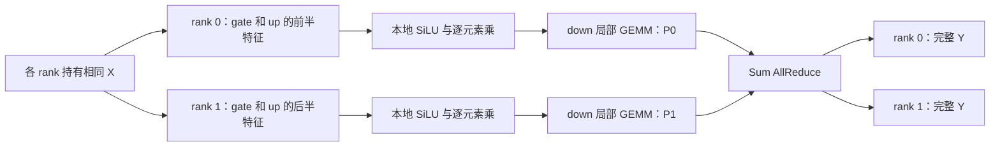
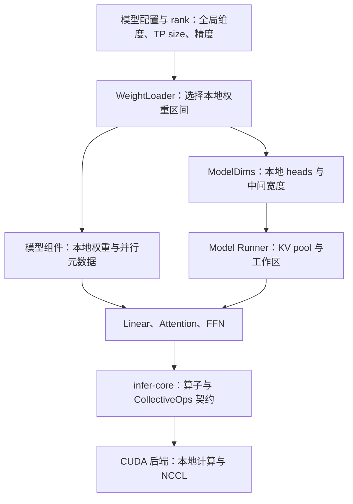

# 第 17 章：从矩阵乘法推导 TP

一个 token 进入模型，需要经过每一层 Attention 和 FFN，最后得到整个词表上的分数。如果模型放不进一张 GPU，或者希望多张 GPU 共同完成这一步，就需要把同一次计算拆开：每张卡持有一部分权重，计算一部分结果，再在必要的位置交换数据。

张量并行（Tensor Parallelism，TP）沿张量的维度切分模型内部的计算。在本项目的 Worker Group 中，各 rank 处理同一个逻辑批次，协作完成同一个模型实例的一步推理。两条请求组成一个批次时，各 rank 都处理这两条请求的输入；分给不同 rank 的是特征、Attention heads 和词表区间。

[第 4 章](../worker/04-worker-service-loop.md#worker-and-group)已经建立 Worker Group 的职责关系。本章从一个矩阵乘法开始，说明权重怎样切、输出怎样合并，以及这些选择为什么决定了模型中的通信位置。主线采用 Llama3、Qwen3 dense 的完整注意力与 SwiGLU FFN；组内线程、命令镜像与 NCCL 提交顺序进入第 18 章，Graph 与故障处理进入第 19 章。

## 本章路线

| 小节 | 要解释的问题 |
| --- | --- |
| [17.1 从矩阵乘法得到列并行与行并行](#column-and-row) | 什么情况下拼接结果，什么情况下求和？数学切分怎样对应代码里的权重布局？ |
| [17.2 Attention、FFN 与词表切分](#transformer-and-vocab) | 怎样让中间结果留在本 rank，只在必要的位置通信？KV 和 logits 分别保存什么？ |
| [17.3 checkpoint、QKV 与量化块边界](#checkpoint-and-quantization) | 怎样从完整权重生成正确的本地分片？为什么整除矩阵维度还不够？ |
| [17.4 计算量、显存和通信量](#compute-memory-communication) | 每张卡减少了多少工作？哪些数据仍然完整保留？增加 GPU 为什么未必降低延迟？ |

<a id="column-and-row"></a>

## 17.1 从矩阵乘法得到列并行与行并行

### 先确定矩阵中的每个维度

先忽略 bias，写出一个线性层：

```text
X[M, K] × A[K, N] = Y[M, N]
```

`M` 是本次参与计算的 token 行数，`K` 是输入特征数，`N` 是输出特征数。普通 Decode 中，一条序列输入一个 token，`M` 等于本轮序列数；Prefill 中，一条序列可以贡献多行。混合批次的行数关系见[第 5 章](../worker/05-command-to-plan.md#batch-plan-and-index)。

矩阵中的一个输出元素是：

$$
Y_{m,n}=\sum_{k=0}^{K-1}X_{m,k}A_{k,n}.
$$

这个求和式给出两种直接的分工：可以让不同 rank 负责不同的输出列 `n`，也可以让它们分别计算求和维度 `k` 的一段。

下文用 `p` 表示 TP size，`r` 表示 rank，且 `0 ≤ r < p`。rank 是通信组内的编号，例如 TP2 包含 rank 0 和 rank 1；它与物理 GPU 编号之间还有设备映射。本项目由一个 Worker 进程持有完整 TP group，各 rank 有自己的 Model Runner 和设备资源。

### 列并行：每个 rank 算一部分输出特征

把 `A` 沿输出维度切开，以 TP2 为例：

```text
A = [ A₀ | A₁ ]

X[M,K] × A₀[K,N/2] = Y₀[M,N/2]
X[M,K] × A₁[K,N/2] = Y₁[M,N/2]

Y = [ Y₀ | Y₁ ]
```

两个 rank 都需要完整的 `X`。rank 0 算前半部分输出特征，rank 1 算后半部分。每个局部输出元素已经完成了对全部 `K` 的求和，因此它是全局结果中对应位置的完整数值。

如果后续操作只需要自己的这一段特征，`Y₀`、`Y₁` 可以留在原处。只有后续操作需要完整 `Y` 时，才需要把它们拼起来。**Column parallel 描述切分方式；是否立刻收集输出，取决于下一步的输入契约。**

### 行并行：每个 rank 算一部分求和项

把 `A` 沿输入维度切开，同时将 `X` 按相同的特征区间切开：

```text
        ┌ A₀[K/2,N] ┐
A     = │           │       X = [ X₀ | X₁ ]
        └ A₁[K/2,N] ┘

X₀[M,K/2] × A₀[K/2,N] = P₀[M,N]
X₁[M,K/2] × A₁[K/2,N] = P₁[M,N]

Y = P₀ + P₁
```

这里的 `P₀`、`P₁` 都有 `[M,N]` 的形状，却分别只累积了一部分输入特征。它们是 partial sum，必须按相同位置相加，才能得到完整结果。

因此，**形状完整不等于数值完整**。`Y₀[M,N/2]` 是一段已经算完的输出，而 `P₀[M,N]` 是覆盖所有输出位置、但尚未加完的部分和。

项目在行并行线性层后使用 Sum AllReduce：每个 rank 提供自己的部分和，归约后每个 rank 都得到完整 `Y`，供下一段计算使用。

<a id="two-rank-example"></a>

### 用同一个矩阵手算两种切法

取两个输入 token，每个 token 四个特征：

```text
X = [ 1  2  3  4 ]       A = [ 1  0  2  1 ]
    [ 2  0  1  1 ]           [ 0  1  1  2 ]
                            [ 1  1  0  1 ]
                            [ 2  0  1  0 ]

Y = X × A = [ 12  5  8  8 ]
            [  5  1  5  3 ]
```

列并行中，rank 0 持有 `A` 的前两列，rank 1 持有后两列：

```text
Y₀ = [ 12  5 ]       Y₁ = [ 8  8 ]
     [  5  1 ]            [ 5  3 ]

按特征维拼接后得到 Y。
```

行并行中，rank 0 持有 `A` 的前两行和 `X` 的前两列，rank 1 持有对应的后半部分：

```text
P₀ = [ 1  2  4  5 ]       P₁ = [ 11  3  4  3 ]
     [ 2  0  4  2 ]            [  3  1  1  1 ]

P₀ + P₁ = [ 12  5  8  8 ]
          [  5  1  5  3 ]
```

以第一个 token 的第一个输出为例，rank 0 算的是 `1×1 + 2×0 = 1`，rank 1 算的是 `3×1 + 4×2 = 11`，加起来才得到 `12`。把 `P₀`、`P₁` 拼接只会得到八个尚未完成的数值，无法得到要求的四个输出特征。

### Replicated、Sharded 与 Partial 三种状态

讨论 TP 时，仅标注 shape 往往不够，还要标注张量在组内的含义：

| 状态 | 每个 rank 持有什么 | 例子 |
| --- | --- | --- |
| Replicated，复制 | 相同的完整逻辑张量 | 列并行线性层的输入 hidden |
| Sharded，分片 | 完整张量中的不同区间 | 列并行后的本地 FFN 中间特征 |
| Partial，部分和 | 同一输出空间中尚未归约的贡献 | 行并行 GEMM 后、AllReduce 前的输出 |

这三种含义决定了通信的作用：AllGather 将各 rank 的分片收集到每个 rank；Sum AllReduce 对各 rank 的贡献求和，并让每个 rank 持有结果；ReduceScatter 求和后只给每个 rank 一段结果；Broadcast 将 root 的数据复制到组内其他 rank。[NCCL 集合通信语义](https://docs.nvidia.com/deeplearning/nccl/user-guide/docs/usage/collectives.html)

项目的核心线性层走的是以下转换：

```text
列并行：Replicated → Sharded
行并行：Sharded → Partial → AllReduce → Replicated
词表输出：Replicated → Sharded → AllGather → Replicated
```

`CollectiveOps` 定义了这些通信接口，但接口存在不代表所有后端都实现了它。CUDA 后端已实现这里使用的 AllReduce、AllGather 和 Broadcast；多 rank 的 ReduceScatter 入口仍返回不支持。不能把 ReduceScatter 路线直接当作本项目正在使用的优化。

<a id="weight-layout"></a>

### 为什么 Column 在代码里切的是权重行

前面的数学使用 `A[K,N]`。项目的 `components::Linear` 保存 `W[N,K]`，实际计算：

```text
Y = X × Wᵀ + bias
A = Wᵀ
```

因此，对应关系是：

| 并行方式 | 数学中的 `A[K,N]` | 项目中的 `W[N,K]` | 本地输出 |
| --- | --- | --- | --- |
| Column | 按列切 `N` | 按行切 `N`，得到 `[N/p,K]` | `[M,N/p]` 的完整特征片段 |
| Row | 按行切 `K` | 按列切 `K`，得到 `[N,K/p]` | `[M,N]` 的部分和 |

Column、Row 延续的是右乘矩阵 `A` 的数学命名。阅读 checkpoint 时，应先确认权重存储轴，再对应输入、输出特征；只看“第 0 维是行”很容易把两种方式理解反。

公式中的 `Wᵀ` 表示计算时怎样解释权重维度，不要求每一步先在显存里转置出一份新矩阵。后端可以通过矩阵布局和 GEMM 的转置参数读取既有存储。

源码用一个枚举表达这份契约：

```rust
pub enum LinearParallelism {
    Replicated { tp: RankPair },
    Column { tp: RankPair, gather_output: bool },
    Row { tp: RankPair },
}
```

`Linear` 同时持有权重、可选 bias 和这份并行元数据。`Column { gather_output: false }` 只输出本地特征；设为 `true` 时，局部 GEMM 后接 AllGather。`Row` 在局部 GEMM 后接 Sum AllReduce。TP1 的普通线性层使用默认的 `Replicated`。

### bias、残差与非线性放在哪里

行并行要先求和，再加完整 bias：

```text
正确：Y = P₀ + P₁ + b
若每个 rank 先加完整 b，再求和：Y = P₀ + P₁ + 2b
```

项目的 `Linear::forward` 按 `matmul_local → all_reduce → add_bias` 执行。列并行的 bias 则随输出特征切分，各 rank 为自己的特征加上对应 bias，随后按需 gather。

完整残差 `X` 也只能进入最终结果一次。若把同一份 `X` 加进每个部分和，再做 AllReduce，就会得到 `ΣPᵣ + pX`。

非线性同样受张量状态约束。逐元素函数可以直接作用于列并行的不同特征片段，因为每个数值已经完整；对于部分和，一般有 `f(P₀+P₁) ≠ f(P₀)+f(P₁)`。例如 `ReLU(1-2)=0`，而 `ReLU(1)+ReLU(-2)=1`。这个区别决定了 FFN 的切分顺序。

<a id="transformer-and-vocab"></a>

## 17.2 Attention、FFN 与词表切分

### 从一个 token 的 hidden 开始

进入一个 decoder 层时，每个 rank 持有相同的完整 hidden，形状为 `[M,H]`。后续会在本地分片上完成一段计算，再通过归约恢复完整 hidden。用下列符号描述一层：

| 符号 | 含义 |
| --- | --- |
| `H` | residual stream 的 hidden size |
| `I` | FFN intermediate size |
| `Hq`、`Hkv` | 全局 Query head 数、KV head 数 |
| `d` | 单个 attention head 的维度 |
| `Q = Hq × d` | 全局 Query 投影宽度 |
| `C = Hkv × d` | 单个 K 或 V 投影的全局宽度 |
| `V` | 全局词表大小 |

很多模型中 `Q = H`，但推导不依赖这个等式；输出投影负责把 `Q` 维的 Attention 结果映射回 `H` 维。

贯穿本节使用一个小模型形状：

```text
p = 2，M = 2，H = 8，I = 12
Hq = 4，Hkv = 2，d = 2，因此 Q = 8，C = 4
V = 16
```

所有权重形状都使用项目的 `[输出特征, 输入特征]` 存储约定。

<a id="ffn-partition"></a>

### FFN：先分特征，再汇总贡献

SwiGLU FFN 包含三组权重：

$$
G=XW_g^T,\quad U=XW_u^T,\quad
Z=\operatorname{SiLU}(G)\odot U,\quad Y=ZW_d^T.
$$

`Wg`、`Wu` 都是 `[I,H]`，`Wd` 是 `[H,I]`。gate 和 up 都沿中间特征 `I` 做 Column parallel，且切分区间一一对应：

```text
rank r：
X[M,H] × Wgᵣ[I/p,H]ᵀ → Gᵣ[M,I/p]
X[M,H] × Wuᵣ[I/p,H]ᵀ → Uᵣ[M,I/p]
Zᵣ = SiLU(Gᵣ) ⊙ Uᵣ
```

每个 `Zᵣ` 只依赖本 rank 的 `Gᵣ`、`Uᵣ`，无需收集其他 rank 的中间特征。然后让 down projection 沿同一中间维度做 Row parallel：

```text
Zᵣ[M,I/p] × Wdᵣ[H,I/p]ᵀ → Pᵣ[M,H]
Y = AllReduceSum(Pᵣ)
```

在小模型中，每个 rank 的 gate、up 权重分别为 `[6,8]`。项目把二者拼成 `[12,8]` 的本地权重，一次线性层产生 `[2,12]`，再由 `swiglu_packed` 得到 `[2,6]`。down 权重是 `[8,6]`，产生 `[2,8]` 的部分和，最后 AllReduce 得到完整输出。



这段结构让扩大的 FFN 中间张量保持分片，到恢复 `H` 维时才通信。列并行后接行并行，也是 Megatron-LM 为 Transformer 层组织张量并行的核心方式之一。[Megatron-LM，第 3 节](https://arxiv.org/html/1909.08053v4#S3)

`DenseFfn::project` 的实际顺序是 `gate_up_proj.forward → swiglu_packed → down_proj.forward`。通信封装在 `Linear` 内，FFN 继续按投影与激活组合计算。

<a id="attention-and-kv"></a>

### Attention：完整的 head 留在本地

Q、K、V 投影先做 Column parallel，按完整的 head 分给不同 rank。每个 rank 持有：

```text
Qᵣ：[M, Hq/p, d]
Kᵣ：[M, Hkv/p, d]
Vᵣ：[M, Hkv/p, d]
```

一个 Query head 的注意力计算是：

$$
O_h=\operatorname{softmax}\!\left(\frac{Q_hK_{g(h)}^T}{\sqrt d}+\text{mask}\right)V_{g(h)}.
$$

`g(h)` 表示这个 Query head 对应的 KV head。GQA 让多个 Query heads 共用一组 K/V，但不同 Query heads 的注意力分数与 softmax 仍分别计算。

切分时把一个 KV head 和使用它的 Query heads 放到同一 rank，该 rank 就拥有计算这些 heads 所需的全部历史 K/V。softmax 沿历史 token 维归一化，而这一维在本地保留完整，因此无需跨 rank 汇总 softmax 的分母。

小模型的 GQA 比例是 `Hq/Hkv = 2`：

| rank | Query heads | KV head | 本地 Q/K/V 宽度 |
| --- | --- | --- | --- |
| 0 | 0、1 | 0 | `4 / 2 / 2` |
| 1 | 2、3 | 1 | `4 / 2 / 2` |

每个 rank 的融合 QKV 权重是 `[8,8]`，输出 `[2,8]`，内部解释为 `Qᵣ[2,4]`、`Kᵣ[2,2]`、`Vᵣ[2,2]`。Q/K 的 head 内归一化、RoPE、KV scatter 和 Attention 都处理本地完整 heads。

Attention 的结果是 `[M,Q/p]` 的特征分片。输出投影 `Wo[H,Q]` 沿输入宽度切为 `[H,Q/p]`，每个 rank 算出 `[M,H]` 的部分和，随后 Sum AllReduce。这里与 FFN 的 down projection 具有相同结构。

### 同一个 KV slot，在不同 rank 上保存不同 heads

[第 6 章](../worker/06-kv-layout-and-ownership.md#physical-layout)中的 slot 是各 rank 本地 KV pool 的物理槽位编号，同一逻辑 token 在各 rank 使用一致的编号。多个 rank 保持相同的序列、位置和 slot 映射，但每张 GPU 上的 K/V pool 只保存自己的 heads。

以小模型某层的 slot 21 为例：

```text
GPU 0：slot 21 → 这个 token 的 KV head 0
GPU 1：slot 21 → 这个 token 的 KV head 1

两个本地片段共同组成这个 token 在该层的全部 K/V。
```

编号相同并不意味着 GPU 指针相同，更不意味着两张卡重复保存了完整 KV。一个逻辑 slot 的可用性需要整个 Group 一致，不能把两张卡各有 1000 个本地 slot，理解为该 Group 可以存放 2000 个不同 token。

当前 dense decoder 分别校验 `Hq`、`Hkv` 可被 `p` 整除，并把本地 head 数写入 `ModelDims`。例如 `Hq=32、Hkv=8` 时，TP4 可以分成每 rank 8 个 Query heads、2 个 KV heads；TP16 会在 KV head 切分处失败。

若 `Hkv=1`，当前均匀切 KV head 的路径也无法直接使用 TP2。复制 KV heads 是另一种可以设计的方案，但它需要相应的加载、head 映射和容量处理，本项目这条路径没有自动采用它。

### RMSNorm 和残差为什么保留完整 hidden

Attention 的输出归约后恢复 `[M,H]`，FFN 的输出归约后也恢复 `[M,H]`。因此每个 rank 都能独立进行同样的残差相加与 RMSNorm：

$$
\operatorname{RMSNorm}(x)_j=
\frac{x_j}{\sqrt{\frac1H\sum_{i=0}^{H-1}x_i^2+\epsilon}}\gamma_j.
$$

对完整 `H` 维的平方和在本 GPU 内即可计算，归一化参数也在各 rank 复制。相较于层中的大型投影，重复这些计算换来了简单的层间契约：下一段投影始终从完整 hidden 开始。

项目有延后残差相加、与下一次归一化融合的实现。它改变的是算子的提交与访存安排；进入残差的 Attention/FFN 输出，已经完成对应行并行层的归约。

若进一步把 hidden 的特征或 token 行分散保存，归一化及下一层输入也需要重新设计通信关系。当前普通 TP 主线没有采用这样的 sequence parallel 布局。

<a id="vocabulary-parallel"></a>

### Embedding：谁拥有这个 token，谁提供向量

Embedding 表形状为 `[V,H]`。项目按词表行切分，rank `r` 保存：

```text
vocab_start = r × (V/p)
本地表：[V/p,H]
负责 token ID 区间：[vocab_start, vocab_start + V/p)
```

所有 rank 收到相同 token IDs。对于每个 token，拥有它的 rank 查出完整 `H` 维向量，其他 rank 为这一行输出零，再对 `[M,H]` 做 Sum AllReduce。

例如 `V=16、p=2`，输入 token IDs 为 `[3,11]`：

```text
rank 0 持有词表 0..7：   [ embedding(3)  ]
                        [      0        ]

rank 1 持有词表 8..15：  [      0        ]
                        [ embedding(11) ]

AllReduce 后，每个 rank 都持有两行完整 embedding。
```

这里词表被切分，但 embedding 向量的 `H` 维完整保留。没有命中本 rank 词表区间的 token 也不能简单删行，否则各 rank 的 token 顺序和 collective 形状就会不同。

### LM head：每个 rank 先算自己负责的词表分数

最后的 hidden 经过最终归一化，再乘 LM head。权重同样按词表切为 `[V/p,H]`：

```text
hidden[R,H] × W_vocabᵣ[V/p,H]ᵀ → logitsᵣ[R,V/p]
```

`R` 是这次送入词表投影的 token 行数。普通 Decode 常有 `R=M`；Prefill、mixed 或 Graph 路径是否只读取每条序列的末行，取决于 readout 选择，见[第 10 章](../worker/10-cuda-graph-and-dynamic-batching.md#execution-paths)。不能把所有阶段的 `R` 都当作请求数。

项目用 `Column { gather_output: true }` 构造 LM head。每个 rank 先把自己的分数写入完整 logits 张量的对应列，再沿词表维 AllGather。因此，**LM head 的权重是分片的，最终 logits 在每个 rank 上仍是完整的 `[R,V]`。**

Gather 还必须保留“token 行 → 词表列”的顺序。两行 logits 的目标布局是：

```text
token 0：[ rank 0 的词表分数 | rank 1 的词表分数 ]
token 1：[ rank 0 的词表分数 | rank 1 的词表分数 ]
```

把两块 `[R,V/p]` 内存按 rank 简单平铺，会变成先放 rank 0 的所有 token 行，再放 rank 1 的所有行，并不符合目标布局。项目的 CUDA `all_gather(dim=1)` 按 outer 行提交 NCCL AllGather，多行时放在同一个 NCCL group 中。第 18 章继续展开该布局与提交过程。

后续选出的 token IDs 还需要组内一致，Runtime 使用以 rank 0 为 root 的广播对齐相应执行路径的结果。组外只返回一份生成结果，其他 rank 继续用同一批 token 推进模型。

对于纯贪心选择，数学上可以让各 rank 提交本地最大分数及全局 token ID，再选出全局最大值，而不收集整个词表。这需要明确并列分数的规则，也需要单独设计采样接口；当前 LM head 仍走完整 logits 的 gather。随机采样涉及全局概率质量，不能直接让各 rank 各抽一个本地 token 来替代。

### 串起一个 decoder 层

| 阶段 | 每个 rank 的主要张量 | 组内数据含义 | 该阶段的数学通信 |
| --- | --- | --- | --- |
| 输入与 pre-norm | `[M,H]` | Replicated | 无 |
| QKV projection | `[M,(Q+2C)/p]` | 按 head 分片 | 无 |
| RoPE、KV 写入、Attention | 输出 `[M,Q/p]` | 本地 heads、完整本地历史 | 无 |
| O projection 的局部 GEMM | `[M,H]` | Partial | Sum AllReduce |
| 残差与 post-attention norm | `[M,H]` | Replicated | 无 |
| gate/up projection | `[M,2I/p]` | 对齐的中间特征分片 | 无 |
| SwiGLU | `[M,I/p]` | Sharded | 无 |
| down projection 的局部 GEMM | `[M,H]` | Partial | Sum AllReduce |
| 残差与层输出 | `[M,H]` | Replicated | 无 |

对这里的 dense decoder 前向，一层主体有两个 hidden AllReduce，分别位于 O projection 和 down projection 之后。Embedding 的归约、LM head 的收集，以及 token IDs 和控制信息的同步在层主体之外计算。

<a id="checkpoint-and-quantization"></a>

## 17.3 checkpoint、QKV 与量化块边界

### 权重文件分片与 TP 分片是两层概念

checkpoint 可能存放在多个 safetensors 文件中，索引文件负责说明一个命名张量位于哪个文件。TP 则决定某个 rank 需要这个逻辑张量的哪一段。文件数量与 GPU 数量不必相等，也不能按文件编号直接把文件分给 rank。

`WeightLoader::with_tensor_parallel(reader, rank, size)` 把 rank 信息带入加载过程。对均匀切分的全局维度 `D`：

```text
local_len = D / p
start = r × local_len
range = [start, start + local_len)
```

`even_shard_range` 要求维度非空且能被 TP size 整除，并校验 rank 范围。词表、head 数和 FFN 中间维度都有自己的约束，不能只检查 hidden size。

对于 `[N,K]` 的稠密权重，`prepare_matrix_shard` 区分两个存储轴：

| 加载轴 | 取得的数据 | 主机上的切片方式 |
| --- | --- | --- |
| `OutputRows` | `[N/p,K]` | 选取连续的输出行 |
| `InputColumns` | `[N,K/p]` | 从每一行取出对应列区间，重新组织为紧凑矩阵 |

转换精度和上传设备时，保留的是当前 rank 需要的矩阵数据。输入列切分虽然在逻辑上是一个矩形，但在完整行优先矩阵里，每两行的有效片段之间隔着其他 rank 的列，不能直接把整段字节解释成紧凑本地矩阵。

<a id="fused-weight-shards"></a>

### QKV 必须分别切，再在本地拼

全局融合 QKV 的布局是：

```text
[ 全部 Q 行 | 全部 K 行 | 全部 V 行 ]
```

一个 rank 所需的布局则是：

```text
[ 这个 rank 的 Q 行 | 这个 rank 的 K 行 | 这个 rank 的 V 行 ]
```

沿用小模型，Q 有 8 行，K、V 各有 4 行，总共 16 行。若直接把这 16 行一分为二，rank 0 会拿到全部 Q，rank 1 会拿到全部 K 和 V。两个 rank 都没有自己的完整 Q/K/V 组合。

正确的行区间是：

| rank | Q 原矩阵 | K 原矩阵 | V 原矩阵 | 本地拼接结果 |
| --- | --- | --- | --- | --- |
| 0 | `0..4` | `0..2` | `0..2` | `[Q₀; K₀; V₀]`，共 8 行 |
| 1 | `4..8` | `2..4` | `2..4` | `[Q₁; K₁; V₁]`，共 8 行 |

这些都是相对于各自原矩阵的半开区间。`prepare_fused_output_shards` 逐个逻辑投影做 `OutputRows` 切分，然后拼接本地结果。当前这条 dense 融合 QKV、gate/up 加载路径构造的线性层不带 bias。

gate/up 融合遵循同一个规则。全局 `[gate;up]` 直接对半切，会使一个 rank 只拿到 gate，另一个只拿到 up；本地 SwiGLU 要求同一中间特征的 gate、up 成对出现，因此应得到 `[gateᵣ;upᵣ]`。

### 权重、维度与缓存必须解释同一份分片

加载结束后，模型的维度描述也要切换到本地视角。dense decoder 的 `ModelDims` 同时包含两类字段：

| 保持全局含义 | 改为本地值 |
| --- | --- |
| `dim`、`vocab_size`、`num_layers`、`head_dim` | `head_num`、`kv_head_num`、`q_dim`、`kv_dim`、`qkv_dim`、`intermediate_size` |

`dim` 保持 `H`，因为各层边界上的 hidden 完整保留；`vocab_size` 保持 `V`，因为最终 logits 会 gather 成完整词表；head 数和中间维度则描述本 rank 实际计算的宽度。

如果只切权重，却仍用全局 head 数分配或解释 QKV，后续 kernel 就会按错误的宽度寻址。反过来，只改 head 数却上传完整权重，也无法得到正确的投影与缓存布局。分片矩阵、`ModelDims`、KV pool、workspace 和算子参数共同构成一份执行契约。

每层 `Linear` 中的 `RankPair` 还会与 `StepCtx` 的 topology 核对。需要 collective 的层会检查 TP communicator，避免拿到某个 rank 的权重，却在另一份 rank 上下文中执行。

### 量化后，矩阵切分还要尊重编码单元

量化权重包含数值编码与 scale 等辅助数据。把一个逻辑矩阵切开时，这些数据必须继续表达同一组数值。按任意字节位置切分，可能把一个量化组或打包字拆开。

本项目的线性层支持不同权重表示，但它们的 TP 加载能力并不相同：

| 权重路径 | TP 主线中的情况 | 切分需要满足的条件 |
| --- | --- | --- |
| 稠密 BF16/F16/F32 | dense decoder 可分片加载 | 维度、head 分组与投影区间匹配 |
| block-scaled FP8 | 有 row、融合 QKV、融合 gate/up 的分片加载路径 | 数值矩阵和 inverse-scale 网格一起切，并对齐量化块边界 |
| AWQ W4A16 | 当前 decoder 的 TP 大于 1 时拒绝加载 | 尚无这条模型路径的 TP 编码与辅助张量切分实现 |
| GGUF BlockQuant | 当前 Worker 与 block-quant 组件限制为 TP1 | 不能由普通 dense 切片直接推得可用的多 rank 路径 |

#### FP8：数值块与 scale 网格一起切

设 FP8 权重逻辑形状为 `[N,K]`，量化块为 `[Bn,Bk]`。每个块对应一个 inverse scale，scale 网格沿相同的输出行、输入列组织。

Column parallel 切输出行时，本地起点和长度必须对齐 `Bn`；Row parallel 切输入列时，必须对齐 `Bk`。源码 `prepare_fp8_fused_shard` 同步切数值矩阵与 `weight_scale_inv`，`prepare_fp8_fused_output_shards` 再组合本 rank 的各个投影。

以 `Bn=128` 为例：

```text
N=512，TP2：每 rank 256 行，对齐 128 行块。
N=384，TP2：每 rank 192 行，矩阵维度可整除，量化块却被切开。
```

第二种形状不能由当前的块对齐加载路径直接切分。Row parallel 对 `K` 和 `Bk` 有相同约束。融合 QKV 还需要分别检查 Q、K、V 各自的本地块边界；融合后的总行数对齐，不代表内部三个投影都对齐。

当前 CUDA block FP8 算子要求权重块为 `[128,128]`，activation 和 output 为 BF16。加载层能描述其他块大小，并不意味着设备算子接受这些配置。权重在设备上保留 E4M3 编码，inverse scale 保留为 FP32；TP 加载按对应块切取二者。

#### INT4：四位数值也有自己的存储边界

项目 AWQ 权重表示包含：

```text
packed：[N, K/8] 的 int32，每个字沿 K 打包 8 个 INT4
scales：[N, K/group]
zeros ：[ceil(N/8), K/group] 的 int32，zero point 沿 N 打包
```

因此，一次逻辑上的 K 切分同时涉及 packed word 和量化 group；N 切分还涉及 zero point 的打包方向。完整支持需要同步处理这些编码关系、bias 与 kernel 形状。当前 `load_int4_parts` 要求 TP1，dense decoder 也会提前拒绝 AWQ TP 配置。

FP8、AWQ 和 GGUF 的区别来自实际存储格式与已实现的加载、算子契约。`LinearWeight` 能表示某种量化权重，并不自动意味着它支持每一种并行布局。

模型结构也有各自的支持边界。当前 Qwen3.5 hybrid builder 和 Qwen3 MoE 的本地加载路径都要求 TP1；本章的 dense Attention 与 FFN 切分不能直接代表它们已经具有多 rank 执行能力。

### 从职责看分片如何落到计算



加载器确定参数的分布，组件维护输入输出与并行语义，Model Runner 建立相应资源并推进执行，后端实现设备计算和通信。Scheduler 把请求交给 Worker Group；矩阵内部的切分和归约由组内模型执行完成。

<a id="compute-memory-communication"></a>

## 17.4 计算量、显存和通信量

### 一次线性层减少了多少计算

乘法和加法各记一次浮点运算，完整 GEMM 的主要计算量为：

$$
F_{\mathrm{linear}}\approx 2MKN.
$$

Column parallel 使每个 rank 的 `N` 变为 `N/p`；Row parallel 使 `K` 变为 `K/p`。在均匀切分下，每个 rank 的主要 GEMM 计算量都约为完整计算的 `1/p`。

但 GPU 的实际吞吐依赖局部矩阵形状。`N/p` 或 `K/p` 太小时，tile 数、并行工作量与权重复用都会变化，不能把运行时间直接除以 `p`。矩阵的计算量、访存量与实际吞吐之间的关系，见[第 13 章](../cuda/13-gpu-execution-and-cost.md#cost-model)。

对于本章的完整注意力与 SwiGLU 一层，忽略 bias、归一化和逐元素开销，大型投影的总 FLOPs 为：

```text
QKV： 2M × H × (Q + 2C)
O：   2M × Q × H
FFN： 6M × H × I

合计：4MH(Q + C) + 6MHI
每 rank：上述总量 / p
```

Attention 的 QK 与 PV 计算还要另计。若序列 `i` 有 `qᵢ` 个 query、`sᵢ` 个可访问 KV token，按未扣除因果 mask 的矩形上界估算，主要 FLOPs 约为 `4Hq d × Σ(qᵢsᵢ)`，head 均匀切分后每 rank 约为其 `1/p`。实际 causal 有效配对和 kernel 分块会影响工作量。

TP 并未减少模型要求的总体数学运算量，而是把大型投影和 head 计算分配到多张设备，并增加必要的归约、传输与部分重复计算。

<a id="memory-budget"></a>

### 权重能切，显存不会整体除以 p

这一层主要投影的参数数量为：

```text
QKV + O：H(Q + 2C) + HQ = 2H(Q + C)
FFN：    3HI
```

均匀切分后，每个 rank 保存这部分参数的 `1/p`。Embedding 和 LM head 的词表权重也各切成 `1/p`；若 checkpoint 使用 tied weights，当前 dense 构建路径让同一 rank 的 embedding 与 LM head 共享本地 Tensor 存储，不重复上传一份。

每个 rank 的显存可以按下面的账本理解：

```text
本地分片权重
+ 本地 KV heads 的缓存
+ 完整 hidden、残差与归一化相关缓冲
+ 分片 QKV、Attention、FFN 中间张量
+ 完整 logits
+ CUDA Graph、工作区、分配池与通信资源
```

其中 norm 参数、完整 hidden 和 gather 后的 logits 不会随 TP size 等比例缩小；Graph arena、通信资源等也有各设备自己的开销。总显存必须按实际资源相加。

对于全是完整注意力的 `L` 层，保留 `S` 个 token slot，每个 K/V 元素占 `bkv` 字节，逻辑 KV 数值区每 rank 为：

$$
B_{\mathrm{KV,rank}}=2LS\frac{H_{\mathrm{kv}}}{p}d\,b_{\mathrm{kv}}.
$$

取 `L=32、S=8192、Hkv=8、d=128`，BF16 每元素 2 字节：

```text
完整 KV：2 × 32 × 8192 × 8 × 128 × 2 = 1 GiB
TP4：每 rank 为 256 MiB
```

这是给定 8192 个逻辑 slot 的 K/V 数值容量，未计额外预留 slot、索引、工作区和其他模型状态。每个 rank 都保留同样多的 token 位置，只是每个位置的 head 数变少。混合注意力模型的 recurrent state 需要单独建账。

### 先数通信对象，再算传输量

在各 rank 都执行完整 `L` 层、`p>1` 的普通 dense decoder 前向中：

| 位置 | 逻辑通信 | 每次完整结果的大小 |
| --- | --- | --- |
| Embedding 后 | 一次 Sum AllReduce | `[M,H]` |
| 每层 O projection 后 | 一次 Sum AllReduce | `[M,H]` |
| 每层 down projection 后 | 一次 Sum AllReduce | `[M,H]` |
| LM head 后 | 沿词表维 AllGather | `[R,V]`，每 rank 原有 `[R,V/p]` |
| 选出下一步 token 后 | 相应路径中的 root Broadcast | token IDs，通常是每条有效序列一个整数 |

因此，大型 hidden 归约的数量是 `2L+1`。这只统计上述数学路径中的张量通信；服务控制、Graph 准备、错误协调和其他执行模式的通信另计。

LM head 表中“一次 AllGather”表示一个逻辑的输出收集阶段。CUDA 后端对 `[R,V]` 的最后一维按行提交，包含 `R` 次 NCCL AllGather API 调用，多行通过 group 组织。逻辑阶段数、API 调用数和最终设备 kernel 数不能混为一谈。

<a id="ring-cost"></a>

### 一个 AllReduce 到底传多少字节

设每个 rank 的完整 hidden 缓冲大小为 `S_h = M × H × ba` 字节，`ba` 是通信张量每个元素的字节数。这里的 `S_h` 是参与一次归约的逻辑数组大小。

若使用 CUDA Graph 补齐形状，这里的 `M` 应取通信实际覆盖的执行行数。五条真实 Decode 使用八行 Graph 时，相关稠密 hidden 和归约按八行计算；有效请求数决定最终输出边界，不能替代设备操作的实际形状。

为了推导成本，采用理想均衡 ring AllReduce：把数组分成 `p` 块，先进行 `p-1` 轮 ReduceScatter，再进行 `p-1` 轮 AllGather。每轮每个 rank 发送一块、接收一块，每块大小为 `S_h/p`。

所以一次 AllReduce：

```text
每 rank 发送量 = 2(p-1)/p × S_h
每 rank 接收量 = 2(p-1)/p × S_h
```

若统计“发送 + 接收”，应再乘 2；若统计整组发送量，应把每 rank 发送量乘以 `p`。这些是不同口径，不能放在同一列直接比较。

NCCL 会根据环境选择实际算法与协议，ring 用于建立成本模型。NCCL tests 的 AllReduce 带宽定义使用 `algbw = S_h/time`，并通过 `2(p-1)/p` 换算 bus bandwidth；`algbw` 的逻辑数据量不能直接当作单条物理链路上的字节数。[NCCL tests 带宽说明](https://github.com/NVIDIA/nccl-tests/blob/master/doc/PERFORMANCE.md)

若每轮固定开销为 `α`，每 rank 有效链路带宽为 `B_link`，简化时间模型为：

$$
T_{\mathrm{AR}}\approx 2(p-1)\alpha+
\frac{2(p-1)}p\frac{S_h}{B_{\mathrm{link}}}.
$$

模型省略了归约计算、分块流水线、拓扑不均衡与资源争用。它仍说明了两个关键趋势：小消息更容易受启动与同步延迟影响；消息增大后，传输字节数和链路吞吐变得更重要。

对于完整输出大小为 `S_v = R × V × ba` 的均衡词表 AllGather，每 rank 已经有 `S_v/p`，理想 ring 中还需接收和转发 `(p-1)/p × S_v`。项目按 token 行组织实际调用，因此估算延迟时还要考虑多行提交方式，不能仅把所有 logits 字节视为一个大调用。

### 用一轮 Decode 算清楚数量级

设一个用于推导的模型与批次为：

```text
L=32，H=4096，V=131072，TP4
单条普通 Decode：M=R=1
hidden 和 logits 的通信 dtype 均取 BF16，即 ba=2
```

一次 hidden AllReduce 的完整缓冲为 `4096×2 = 8 KiB`。在上述 ring 模型下，每 rank 发送 `1.5×8 = 12 KiB`，并接收相同大小。

```text
hidden AllReduce 数量：2×32+1 = 65
每 rank 的 hidden 总发送量：65×12 KiB = 780 KiB

完整一行 logits：131072×2 = 256 KiB
每 rank 的词表 AllGather 发送量：3/4×256 KiB = 192 KiB

两部分每 rank 合计发送量：972 KiB
```

这些数字还没有包含 token IDs、协议开销和控制通信。模型权重在加载后留在本地，不是每轮 Decode 都重新跨卡发送。若改为 256 条普通 Decode，保持同样通信 dtype 和 `M=R=256`，上述大张量发送量按行数扩大为每 rank `243 MiB`；API 组织、吞吐和实际延迟仍需结合执行路径理解。

即使单条 Decode 的字节数不大，仍有几十个受层间依赖约束的归约点。后一层的输入要等前面的归约结果，因此低通信延迟对逐 token 生成尤为重要。

### 为什么 TP4 不保证比 TP2 快

对一段有顺序依赖的计算，可以用下面的结构组织成本：

```text
本地 GEMM、Attention 和逐元素计算
+ 无法被其他工作覆盖的通信
+ 主机提交、跨 rank 等待与其他关键路径开销
```

增加 TP size 会减少每张卡的权重与主要计算，但同时改变多个因素：

| 变化 | 对性能的影响 |
| --- | --- |
| 本地矩阵的 `N` 或 `K` 更小 | 工作量减少，也可能降低 GEMM 的硬件利用率 |
| 每 rank 的权重读取量减少 | 对受权重带宽约束的 Decode 有利，收益受实际并行带宽和算子效率影响 |
| hidden 归约后的形状仍是 `[M,H]` | 通信对象不会随着权重分片一起缩小到 `1/p` |
| 组内成员更多 | 通信路径、同步开销及最慢 rank 的影响发生变化 |
| 各卡显存压力降低 | 可能容纳更长上下文或更大批次，收益也可能表现为容量与吞吐 |
| logits 仍需收集为完整词表 | readout 行数与词表大小继续影响通信和缓冲成本 |

Prefill 通常有更多 token 行，GEMM 可以获得更多并行工作和权重复用；Decode 尤其在小批次时，更容易受到权重读取、短 kernel 和通信延迟的共同影响。长上下文还会增大 KV 读取，不能把所有 Decode 都归结为相同瓶颈。

CUDA Graph 可以减少重复提交计算与 collective 的主机开销，但不会消除跨卡的数据依赖和实际传输。要分析 TP 的时间线，应结合本地计算、通信执行以及 rank 之间的等待，沿[第 13 章的关键路径方法](../cuda/13-gpu-execution-and-cost.md#nsight-systems)理解耗时，第 19 章再展开 TP Graph 的执行约束。

### 数学等价与浮点结果

列切分与行切分的推导在实数运算下保持等价。实际计算使用有限精度，局部 GEMM 与跨 rank 归约会改变求和顺序，部分和还可能经过通信 dtype 的舍入，因此 TP1 与 TP2 的数值不必逐位相同。

当两个候选 token 的 logits 很接近时，小差异也可能改变 argmax，并使后续生成轨迹分开。理解正确性应结合权重切分、局部数值与归约结果，不能仅用一段最终文本解释所有差异。

项目的 [tp_components.rs](../../../../crates/infer-worker/tests/tp_components.rs) 包含双 GPU 的 vocab embedding、LM head gather 和 row-linear 加 bias 对照用例。它们分别针对本章的查表归约、词表拼接与 bias 位置；完整模型、不同量化格式与 Graph 路径还具有各自的执行条件。

<a id="concept-index"></a>

## 概念索引

| 概念 | 正文入口 |
| --- | --- |
| TP size、rank、同一逻辑批次 | [17.1：维度与组内分工](#column-and-row) |
| Column parallel、Row parallel | [17.1：拼接与部分和](#column-and-row) |
| 两 rank 数值重构 | [17.1：手算示例](#two-rank-example) |
| Replicated、Sharded、Partial | [17.1：组内张量状态](#column-and-row) |
| 数学矩阵与 `[N,K]` 权重存储 | [17.1：切分轴对应](#weight-layout) |
| bias、残差与非线性的归约位置 | [17.1：数值完整性](#weight-layout) |
| SwiGLU、gate/up、down projection | [17.2：FFN 切分](#ffn-partition) |
| GQA、head 切分与本地 KV | [17.2：Attention 和 slot](#attention-and-kv) |
| vocab embedding、LM head、logits gather | [17.2：词表并行](#vocabulary-parallel) |
| checkpoint 文件分片、权重分片 | [17.3：加载视角](#checkpoint-and-quantization) |
| QKV 和 gate/up 的先切后拼 | [17.3：融合权重](#fused-weight-shards) |
| FP8 block、INT4 packing、量化 group | [17.3：量化边界](#checkpoint-and-quantization) |
| 每 rank 权重、KV、hidden 与 logits | [17.4：显存账本](#memory-budget) |
| AllReduce payload、发送量、接收量 | [17.4：ring 成本](#ring-cost) |
| algbw、busbw、延迟与带宽 | [17.4：通信量和时间](#ring-cost) |
| TP 扩展收益、浮点归约误差 | [17.4：性能与等价性](#compute-memory-communication) |

<a id="source-index"></a>

## 源码索引

| 入口 | 主要内容 |
| --- | --- |
| [components/linear.rs](../../../../crates/infer-worker/src/components/linear.rs) | `LinearWeight`、`LinearParallelism`、局部 GEMM、gather、reduce 与 bias 的顺序 |
| [components/ffn_dense.rs](../../../../crates/infer-worker/src/components/ffn_dense.rs) | 融合 gate/up、SwiGLU、down 与残差衔接 |
| [components/attention_core.rs](../../../../crates/infer-worker/src/components/attention_core.rs) | 本地 head 的 QKV、RoPE、KV 写入与 Attention |
| [components/full_attention.rs](../../../../crates/infer-worker/src/components/full_attention.rs) | Attention 输出投影与完整 hidden 的衔接 |
| [components/embed.rs](../../../../crates/infer-worker/src/components/embed.rs) | `EmbeddingParallelism::Vocab`、分片查表与 hidden 归约 |
| [components/lm_head.rs](../../../../crates/infer-worker/src/components/lm_head.rs) | 词表投影的组件入口 |
| [models/decoder.rs](../../../../crates/infer-worker/src/models/decoder.rs) | dense decoder 的本地 head 数、组件组装、tied weights 与 `ModelDims` |
| [models/loader.rs](../../../../crates/infer-worker/src/models/loader.rs) | 均匀切分、稠密行列切片、QKV 与 gate/up 融合、FP8 分片与 AWQ 限制 |
| [infer-core/ports/collective.rs](../../../../crates/infer-core/src/ports/collective.rs) | `CollectiveOps`、`ReduceOp` 与通信契约 |
| [CUDA nccl.rs](../../../../crates/infer-backend-cuda/src/nccl.rs) | AllReduce、按 outer 行的 AllGather、Broadcast 与未实现接口 |
| [domain/tensor_parallel.rs](../../../../crates/infer-worker/src/domain/tensor_parallel.rs) | 全局 rank 与进程持有 rank 区间的关系 |
| [application/tensor_parallel.rs](../../../../crates/infer-worker/src/application/tensor_parallel.rs) | 本地 rank 线程与 Worker Group 执行组织 |
| [runtime/peer.rs](../../../../crates/infer-worker/src/application/runtime/peer.rs) | TP 命令镜像与结果对齐入口 |
| [worker_main.rs](../../../../crates/infer-worker/src/bin/worker_main.rs) | 设备与模型加载配置、GGUF TP1 边界 |
| [tests/tp_components.rs](../../../../crates/infer-worker/tests/tp_components.rs) | 词表并行与行并行组件的双卡对照用例 |

自己的矩阵手算、head 分配、量化边界与通信量推导，保存在[第十七章共写记录](../../workshops/17-matmul-to-tensor-parallel.md)。继续阅读[张量并行篇目录](../../01-CONTENTS.md#tensor-parallel)，或回到[书籍入口](../../00-README.md)。
