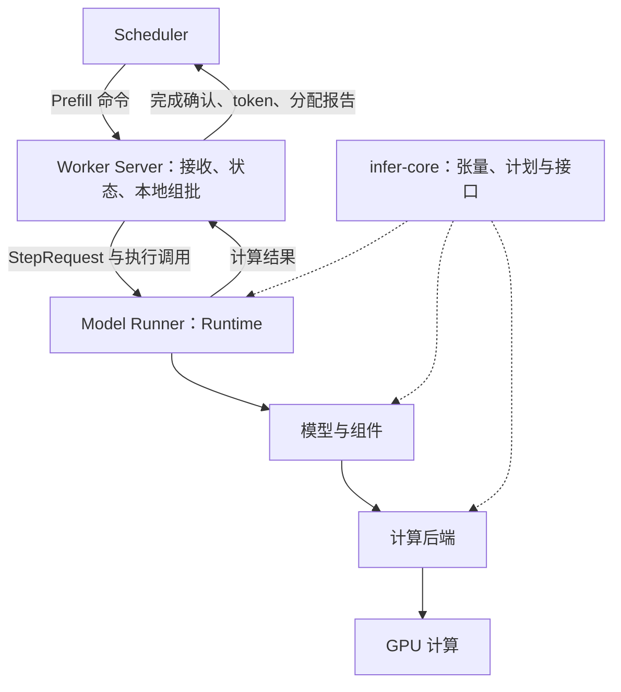
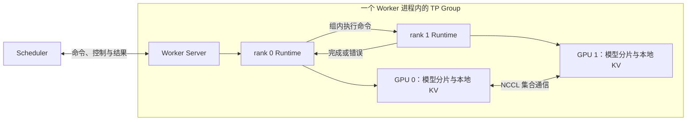
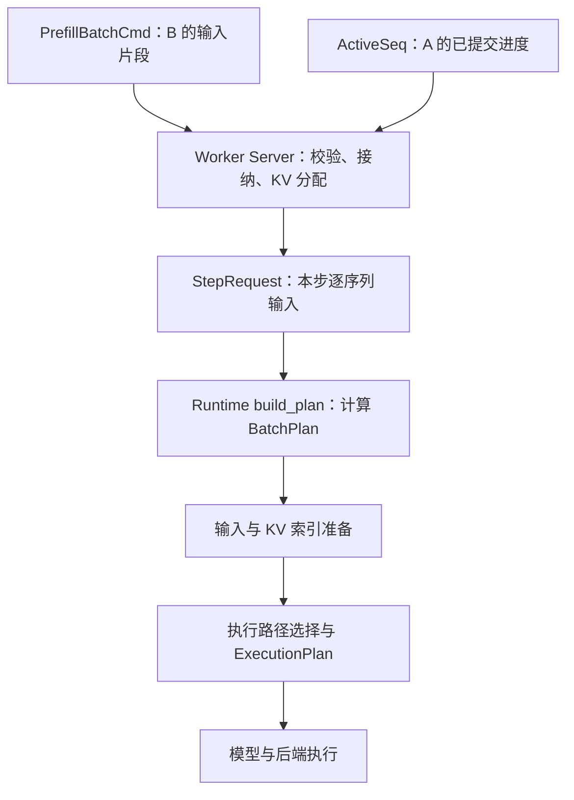
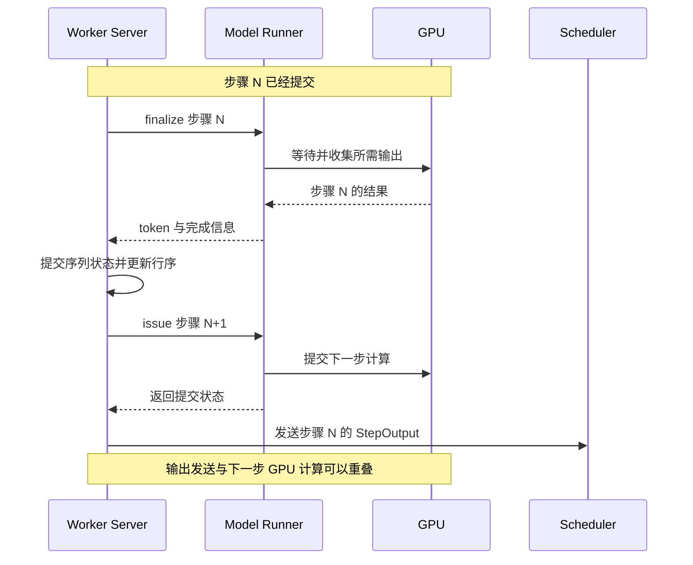

# 第 4 章：Worker 全貌与服务循环

Scheduler 已经选出了请求 B 的一段输入，将 Prefill 命令发往 Worker。与此同时，请求 A 正在这个 Worker 上持续生成 token。B 到达之后，谁保存它的输入，谁决定下一步把 A、B 放在一起，谁把它们转换为 GPU 能够执行的计算？计算完成后，又由谁更新进度、回收资源并返回结果？

这些事情由 Worker 的服务层与模型执行器共同完成。本章以一个已经就绪的单卡 Worker 为起点，使用普通文本生成、greedy 采样，关闭前缀缓存与推测解码。先沿 A、B 的执行过程建立全貌，再把同一条调用链扩展到组内 TP 协作。

这里的 **Worker Server** 指 Worker 进程内部的服务层；面向 HTTP 的 Server 是前面第二章介绍的独立进程。**Model Runner** 是 Worker 内部的模型执行器，源码类型名为 `Runtime`。

本章的阅读路线：

- [4.1 Worker 内部的职责与 Group 协作](#worker-and-group)
- [4.2 控制面与数据面：命令怎样进入 Worker](#control-and-data)
- [4.3 序列、行序与在途步骤：状态保存在哪里](#worker-state)
- [4.4 从批次命令到 Model Runner 的执行计划](#command-to-plan)
- [4.5 从计算完成到状态更新与结果回传](#completion-and-output)
- [4.6 空闲、取消与结束](#idle-and-termination)

<a id="worker-and-group"></a>

## 4.1 Worker 内部的职责与 Group 协作

### 沿职责进入计算

Worker Server 关心的是序列如何继续推进：哪些 Prefill 片段已经到达，哪些序列还在 Decode，本轮使用哪些 KV 索引，完成之后应该怎样更新进度。Model Runner 关心的是怎样执行这一步：输入如何排列，计算需要哪些张量与索引，使用哪条执行路径，何时可以取得结果。

| 部分 | 主要职责与状态 | 源码入口 |
| --- | --- | --- |
| Worker Server | 接收命令，保存序列进度，维护 Decode 行序，分配 KV 索引，组织执行与回传结果 | [serve_loop](../../../../crates/infer-worker/src/application/serve_loop.rs)、[worker_scheduler](../../../../crates/infer-worker/src/application/worker_scheduler.rs)、[decode_engine](../../../../crates/infer-worker/src/application/decode_engine.rs)、[worker_state](../../../../crates/infer-worker/src/application/worker_state.rs) |
| Model Runner | 持有模型、KV pool、索引张量、工作区、持久缓冲与 Graph，准备计划、提交计算并收集结果 | [Runtime](../../../../crates/infer-worker/src/application/runtime/mod.rs) |
| 通用计算基础 | 表达 Tensor、Storage、dtype、设备、执行接口、算子契约与通用批次计划 | [infer-core](../../../../crates/infer-core/src/lib.rs) |
| 模型与组件 | 定义模型结构，连接 embedding、Attention、FFN、输出层与权重 | [models](../../../../crates/infer-worker/src/models)、[components](../../../../crates/infer-worker/src/components) |
| 具体计算后端 | 实现计算接口，执行 CPU 算子或调用 CUDA kernel | [infer-backend-cpu](../../../../crates/infer-backend-cpu/src/lib.rs)、[infer-backend-cuda](../../../../crates/infer-backend-cuda/src/lib.rs) |



图中的实线表示工作与结果的传递，虚线表示公共类型与接口的依赖。`infer-core` 为上层提供计算基础；一次请求仍由 Worker 的服务循环组织，再通过模型与后端完成执行。

例如，同一份 KV Cache 在不同职责中具有不同表示。Worker Server 的 `GlobalKvAllocator` 管理可用 slot，每条序列的 `block_table` 记录逻辑位置对应的物理索引；Runtime 的 `kv_pool` 持有实际存储 K/V 的设备张量。分配器决定写到哪些位置，计算执行器按照索引写入数据。

服务循环通过 Rust 函数调用使用 Runtime。Runtime 持有模型和缓冲等长期状态，调用者通过 `&mut Runtime` 推进它。GPU 提交之后可以继续异步执行，服务线程则继续完成允许重叠的工作；CPU 调用关系与 GPU 执行时间线共同构成这一协作过程。

### Worker Group 对外提供一个模型实例

Worker Group 表示完成一个模型实例推理所需的一组执行资源。单卡时，一张 GPU 就能承担完整执行；使用张量并行时，多个 rank 分别持有模型的一部分，共同完成同一批输入。rank 是组内执行成员的编号。

Scheduler 面向整个 Group 分配工作。组内 TP 继续划分的是模型计算：同一批序列经过各 rank 对应的权重分片，并在层内需要的位置交换或归约张量。两个完整模型副本可以独立服务不同请求，属于不同 Group；一个 TP Group 中的 rank 则需要协同推进。

当前服务入口将一个 Group 放在单个 Worker 进程中：rank 0 所在的服务线程接收外部命令，其他 rank 运行在本地线程中，每个 rank 拥有自己的 Runtime、设备执行环境与模型资源。



这里有两种不同的组内协作：

| 协作 | 传递什么 | 解决什么问题 |
| --- | --- | --- |
| rank 线程之间的执行命令与响应 | 本步逻辑输入、执行动作、完成或错误 | 让各 rank 按一致顺序进入对应步骤，收集组内执行状态 |
| GPU 之间的集合通信 | 模型计算产生的张量 | 合并或交换模型分片的计算结果，使下一层取得所需输入 |

以普通 `Runtime::step` 为例，rank 0 向 follower 分发执行命令，运行自己的本地步骤，再等待 follower 的完成结果。各 rank 的模型在计算过程中通过 NCCL 协作；服务层取得这一轮结果后，统一向 Scheduler 发送协议输出。异步 Decode 将提交与完成拆开，组内也需要保持对应的调用顺序。

线程响应报告对应操作成功或失败，推理输出取自 rank 0 的本地结果。模型张量的汇合由集合通信完成；采样 token 再从 rank 0 广播给各 rank，使后续输入、停止判断和行压缩保持一致。对异步接口，提交操作的线程响应表示这一操作已经返回，GPU 结果仍由对应的完成操作收集。

各 rank 的 Runtime 在各自线程中持有计算资源。线程间传递拥有自身数据的逻辑命令，序列身份和 KV 位置约定保持一致；这些位置在不同 rank 上指向各自 GPU 中的本地存储。组内计算所需的张量由后端的集合通信传递。

这也解释了 TP Group 的容量约束：一条序列需要在参与计算的各 rank 上继续推进，可服务的逻辑容量受到最紧张 rank 的限制。第 3 章介绍容量报告，[第 17 章](../tensor-parallel/17-matmul-to-tensor-parallel.md)从矩阵乘法展开权重切分与归约，第 18–19 章继续进入集合通信与多 rank 执行。

当前服务入口由一个 Worker 进程承载整个 TP Group；跨机器 TP 启动，以及 Scheduler 对多个 Group 的选择，尚未接入这条服务路径。它们继续向外扩展通信与资源调度的边界。

源码入口：[Worker 启动与 follower 创建](../../../../crates/infer-worker/src/bin/worker_main.rs)、[本地 TP 引导](../../../../crates/infer-worker/src/application/tensor_parallel.rs)、[组内命令与响应](../../../../crates/infer-worker/src/application/runtime/peer.rs)、[TP 线性层](../../../../crates/infer-worker/src/components/linear.rs)、[异步 Decode](../../../../crates/infer-worker/src/application/runtime/abc_decode.rs)。

### 职责怎样落实到 DDD 分层

Worker 的应用层组织接收、组批、执行和回传；领域层表达步骤请求、模型契约和 KV 分配规则；基础设施层提供 ZMQ 收发与具体后端适配。`infer-core` 中的公共计算契约可被 Worker 和后端直接引用。

这些边界依靠状态归属建立联系：序列事实由服务层修改，计算资源由 Runtime 持有，传输层负责把命令与结果编码、发送和接收。沿这条关系阅读代码，就能分别找到业务规则、流程编排和具体实现。

<a id="control-and-data"></a>

## 4.2 控制面与数据面：命令怎样进入 Worker

### 两个“面”分别承载什么

**数据面**承载实际推理工作及其执行事实：本次有哪些输入需要计算，哪些 Prefill 片段已经完成，本步生成了什么 token。**控制面**管理执行端的状态与执行条件：模型是否就绪，请求是否取消，资源是否需要回收，Worker 是否仍然存活。

这里的“面”是一组职责与协议的划分。项目用不同的 socket 承载它们，使批次执行、生命周期管理和资源协调各有明确的消息类型。

| 链路 | Scheduler 侧 | Worker 侧 | 代表消息 |
| --- | --- | --- | --- |
| 数据面：输入 | PUSH | PULL | `BatchCommand::Prefill` |
| 数据面：输出 | PULL | PUSH | `StepOutput` |
| 控制面：双向 | ROUTER | DEALER | Hello、LoadModel、Ready、Heartbeat、Cancel、AllocFailed、FreeKvIndices |

PUSH/PULL 分别承担单向发送和接收，因此输入与结果使用两条链路。ROUTER/DEALER 用于带执行端身份的双向控制通信。Worker 的 `DataPump` 持有数据面的接收和发送 socket，`ControlPump` 持有控制面的 DEALER socket。

数据面协议还定义了 Beam 与 Diffusion 命令。下面继续沿普通自回归生成路径展开。

控制消息按用途可以分成几组：

| 用途 | 消息示例 | Worker 侧动作 |
| --- | --- | --- |
| 建立执行环境 | Hello、LoadModel、Ready | 建立联系、加载模型、报告容量与就绪 |
| 管理序列 | Cancel、Preempt | 移除对应序列状态，调整本地行序和资源 |
| 协调 KV 资源 | AllocFailed、FreeKvIndices | 报告容量不足，接收 Scheduler 的回收决定 |
| 检查存活 | Ping、Pong、Heartbeat | 响应探测，报告负载与 KV 统计 |
| 管理服务生命周期 | Drain、UnloadModel、Shutdown | 按命令处理剩余工作、释放或退出 |
| 报告异常 | StepError、Error | 将执行失败交给 Scheduler 处理 |

控制调用需要关联应答时，`ControlEnvelope` 的 `request_id` 将一次调用与 CancelAck、DrainAck 等响应对应起来。这个编号标识控制交互；推理序列仍由 `sequence_id` 标识。

控制面和数据面分别维护各自的收发过程。跨两条链路的业务先后关系要由状态、确认和协议规则表达。分开 socket 也不会自动增加处理线程或赋予控制消息抢占正在运行的 GPU kernel 的能力。

源码入口：[数据命令](../../../../crates/infer-protocol/src/scheduler_to_worker_data.rs)、[数据结果](../../../../crates/infer-protocol/src/worker_to_scheduler_data.rs)、[Scheduler 控制消息](../../../../crates/infer-protocol/src/scheduler_to_worker_control.rs)、[Worker 控制消息](../../../../crates/infer-protocol/src/worker_to_scheduler_control.rs)、[DataPump](../../../../crates/infer-worker/src/infrastructure/transport/data_pump.rs)、[ControlPump](../../../../crates/infer-worker/src/infrastructure/transport/control_pump.rs)。socket 与控制应答的连接过程见[第三章 3.2](../requests/03-scheduler-and-worker-group.md#connection-and-readiness)。

### B 到达后，服务循环如何看到它

普通服务路径在同一个循环中检查控制消息、读取数据命令、组织执行并回传结果。B 到达 socket 时，输入先进入通信接收队列；服务循环调用 `drain_data`，通过 `try_recv_batch(0)` 读取当前可取得的命令，并反序列化为 `BatchCommand`。

每轮首先处理可取得的控制消息，再把上一轮延后的 Prefill 命令取出，与新到达的 Prefill 放进本轮待处理集合。后续的本地组批决定哪些片段实际参加计算。命令被接收、获得本轮执行位置、完成 GPU 计算，是不同的时刻。

下面是普通路径的流程示意，省略 Beam、推测解码与错误分支：

```text
循环：
    处理可取得的控制消息
    本轮 Prefill = 上轮延后命令 + 当前收到的新命令

    如果没有可推进工作：
        等待数据 socket、控制 socket 或心跳期限
        处理被唤醒后取得的消息

    如果有待处理 Prefill：
        组织 Prefill 与活跃 Decode 的执行
        保留本轮未接纳的命令
    否则，如果有活跃 Decode 或在途步骤：
        推进 Decode，并收集需要完成的结果

    按期限报告心跳
```

服务循环主动推进已经进入 Decode 的序列。A 的下一步可以从本地状态直接构造，Scheduler 继续接收其输出，并为 B 等新请求安排 Prefill。

<a id="worker-state"></a>

## 4.3 序列、行序与在途步骤：状态保存在哪里

### 一条序列有几种不同的状态

一个新命令到达时，Worker 需要保存输入；进入计算后，需要记录已经完成的进度；组成批次时，需要知道各序列占据哪一行；设备尚未完成时，还需要保留本次分配与结果对应关系。

| 状态 | 数据结构 | 内容与用途 |
| --- | --- | --- |
| 本轮待处理的输入命令 | `pending_prefills` | 本轮取得、等待本地组批的 Prefill 命令 |
| 延后处理的输入命令 | `deferred_prefills` | 本轮接纳预算放不下、留给后续轮次的命令 |
| 分段 Prefill 的已完成进度 | `PrefillSeqMap = HashMap<u64, PrefillSeq>` | 已写入的 KV 长度与 `block_table`，供后续片段继续执行 |
| 已进入 Decode 的序列事实 | `ActiveSeqMap = HashMap<u64, ActiveSeq>` | 最近生成的 token、KV 长度、索引表、生成计数、采样参数与停止条件 |
| Decode 的设备行序 | `DecodeRows` | `Vec<u64>` 保存行顺序，`HashSet<u64>` 辅助判断成员关系 |
| 已提交而尚未收集的 Decode 步骤 | `DecodeEngine::pending` | 本次行序、新分配的 KV 索引、分配报告和完成时所需的信息 |
| 为下一步预留的 KV | `DecodeEngine::prealloc` | 已从分配器取得、尚未提交到序列索引表的 slot |

B 刚进入 `pending_prefills` 时，命令已经存在于 Worker 内存中，但还没有因此变成一个活跃 Decode 序列。若 B 的输入需要分段处理，中间片段完成后，`PrefillSeqMap` 保存继续执行所需的进度；若一个片段就完成了整个输入，则可以直接产生首个 token，并在仍需生成时进入 `ActiveSeqMap`。

A 的 `last_token` 表示最近一次生成、将用于下一步输入的 token。`kv_len` 表示已经写入 KV 的输入长度。两者的时间关系是：先把本步输入计算成 K/V，再预测下一个 token；新预测出来的 token 要在后续作为输入时才写入自己的 K/V。

### 为什么序列状态与行序分开保存

`ActiveSeqMap` 按 `sequence_id` 查找序列，适合修改某个请求的事实；GPU 批次则需要确定的行顺序。假设当前设备缓冲的两行分别属于 A、B，A 结束后，行压缩可能把 B 移到第 0 行。B 的序列身份保持不变，变化的是本步的执行位置。

因此，`DecodeRows` 单独维护设备缓冲对应的序列顺序，`DecodeEngine` 还记录缓冲与索引元数据已经准备好的行序。下一步才能判断哪些设备数据可以复用、哪些新序列需要加入、哪些位置需要重建。直接从 HashMap 的遍历顺序推导设备行序，会丢失这一对应关系。

同样，KV slot 是存储位置，batch row 是执行位置。在当前 `block_size = 1` 的路径中，每个本步输入 token 需要一个新的 token slot；一个四 token 的 Prefill 片段会需要四个新位置。序列身份、批次行与 KV 索引的含义见[第一章](../requests/01-lifecycle.md#identity)，具体存储布局在第 6 章展开。

### 已提交状态与在途状态怎样协作

当 A 的一步 Decode 已经提交到 GPU，而结果还未收集时，`ActiveSeq` 仍保存上一次完成后提交的序列事实。本步新分配的 slot 则由 `PendingDecode` 中的 `KvLease` 保管，直到执行结果决定把它们提交给序列，或归还分配器。

`KvLease` 表达“这批索引已经占用，但所有权处理尚未结束”。调用者通过 `commit` 接管索引，或通过 `release` 归还索引；它的 `Drop` 用于检测未处理的索引，不会自动完成资源归还。

这一划分让服务层可以回答两个问题：A 已经确认走到了哪里，本轮又承诺了哪些尚未确认的资源。心跳中的容量统计也要考虑这些临时占用，才能与 Scheduler 的账本对应。

源码入口：[序列与行序](../../../../crates/infer-worker/src/application/worker_state.rs)、[DecodeEngine 与 PendingDecode](../../../../crates/infer-worker/src/application/decode_engine.rs)、[GlobalKvAllocator 与 KvLease](../../../../crates/infer-worker/src/domain/global_kv_alloc.rs)。

<a id="command-to-plan"></a>

## 4.4 从批次命令到 Model Runner 的执行计划

### 先看一条命令携带什么

Scheduler 给 B 发送的是 `PrefillBatchCmd`。它把多个片段的 token 放入一个扁平 `input_ids` 数组，用 `q_start_loc` 标记每个片段在数组中的起点，再用 `segments` 说明每段属于哪条序列、处理哪个输入区间、完成后是否开始 Decode。

| 字段或信息 | 含义 |
| --- | --- |
| `sequence_id` | 片段所属的序列 |
| `segment_start`、`segment_end` | 本片段在完整输入中的绝对区间 |
| `prompt_len` | 整个输入的长度 |
| `completion` | 继续 Prefill，或完成输入并开始 Decode |
| `max_tokens`、采样参数、`ignore_eos` | 生成阶段的规则 |
| `prefix_hint` | 可复用前缀对应的 KV 索引；本章场景关闭此功能 |

`q_start_loc` 描述消息数组中的位置，`segment_start` 描述序列中的位置。消息里的 `block_table` 当前由 Scheduler 留空，实际 KV 索引由 Worker 分配。

### Worker Server 组织本步逻辑输入

`worker_scheduler` 结合命令与已有状态，检查片段与已有 Prefill 进度能否衔接，为新增输入取得 KV slot，并构造每条序列的 `SeqStep`。一条 `SeqStep` 包含：

- 本步输入 `input_ids` 与位置 `positions`；
- KV 写入起点 `kv_write_start` 与完成后的长度 `kv_len_after`；
- 本次计算需要的完整 `block_table`；
- 序列身份 `sequence_id`。

对于 A，Worker 从活跃状态中取出上一轮生成的 token，安排一个新 KV 位置，形成单 token 的 Decode 输入。对于 B，Worker 从 Prefill 命令取出本段输入，并把新位置接在已经存在的索引之后。

这些 `SeqStep` 与逐序列的采样、停止信息一起形成 `StepRequest`。服务层据此调用 Runtime 的普通步骤、混合步骤或异步 Decode 接口。

源码入口：[Worker 的步骤类型](../../../../crates/infer-worker/src/domain/plan.rs)、[Prefill 与混合组批](../../../../crates/infer-worker/src/application/worker_scheduler.rs)、[Decode 输入构造](../../../../crates/infer-worker/src/application/decode_engine.rs)。

### A、B 怎样进入同一次计算

设上一轮结果已经提交，A 当前有 5 个输入 token 的 KV，最近生成的 token ID 是 17；B 的完整输入是四个 token `[41, 42, 43, 44]`。假设容量充足，本轮选择把 A 的一次 Decode 与 B 的 Prefill 放入同一批次。

在当前每个 block 容纳一个 token 的布局下，可以得到如下逻辑输入。表中的 slot 编号仅用于展示映射，假设这些位置可用，本步也无需添加 padding 行。

| 序列 | 本步输入 | `positions` | KV 写入起点 | 完成后的 KV 长度 | 本步使用的 `block_table` |
| --- | --- | --- | --- | --- | --- |
| A | `[17]` | `[5]` | 5 | 6 | `[0, 1, 2, 3, 4, 10]` |
| B | `[41, 42, 43, 44]` | `[0, 1, 2, 3]` | 0 | 4 | `[11, 12, 13, 14]` |

这一步共有两条序列、五个输入 token。A 读取已有上下文并补写位置 5；B 在自己的序列内执行因果 Attention。两条序列可以共享一次批处理的执行流程，同时保持各自的上下文边界。

Worker 的组批同时受行数、token 数和可用 KV 限制。有 Prefill 命令时，普通路径进入 `handle_fused_step`，以完整命令为单位，按预算接纳一段 FIFO 命令前缀，其余命令进入 `deferred_prefills`。已接纳命令再接受容量与 KV 检查，并结合活跃 Decode 组织为一个或多个 `ForwardGroup`；容量检查或 KV 分配失败会报告相应错误。

第一组可以携带活跃 Decode，额外的组可以只执行 Prefill。因此，命令延后、本轮接纳失败与拆成多个执行组具有不同含义，一次服务循环与一次模型 forward 也并非固定的一一对应关系。

只有 A 等活跃 Decode、没有新 Prefill 时，循环走 `DecodeEngine::run_step`。新的 B 可以改变下一轮批次组成，A 则继续由本地状态推进。这正是连续批处理的服务层含义：请求持续进入和结束，执行批次随每一步可用的状态重新组织。

### Runtime 把逻辑输入转换成计算计划

进入 Runtime 后，`build_plan` 检查序列数、输入长度、位置数量、KV 区间与模型容量，并构造 `infer_core::plan::BatchPlan`。这个计划面向计算布局，描述每条序列本步有多少输入、可见多少 KV、位置从哪里开始，以及整批的形状。

沿上面的例子，主要元数据为：

```text
batch         = 2
num_tokens    = 5
q_lens        = [1, 4]
kv_lens       = [6, 4]
seq_positions = [5, 0]
rope_positions = [5, 0, 1, 2, 3]
```

Runtime 再把这些信息落实为设备索引张量与输入缓冲。`upload_index` 准备 block table、各行 KV 长度、输入片段边界及 Attention 所需索引；计算时，kernel 据此找到每条序列应该读取和写入的位置。稳态 Decode 可以复用并在设备上更新部分元数据，详细路径在第 9 章展开。

从外部调度到设备执行，几个容易同名的对象承担不同职责：

| 对象 | 所在位置 | 回答的问题 |
| --- | --- | --- |
| Scheduler 的 `BatchPlan` | Scheduler 调度域 | 本轮选择哪些请求与 Prefill 区间？ |
| `PrefillBatchCmd` | 进程间协议 | 把哪些输入片段交给 Worker？ |
| `StepRequest` | Worker 服务层到 Runtime 的调用边界 | 本次实际执行哪些序列，它们的输入与 KV 位置是什么？ |
| `infer_core::plan::BatchPlan` | Runtime 使用的公共计算类型 | 这批输入怎样排列，计算需要哪些长度与位置元数据？ |
| `ExecutionPlan` | Worker 的执行契约 | 这次操作处于什么阶段，使用 eager 或哪类 Graph，借用哪类工作区？ |

`ExecutionPlan` 是执行阶段、模式、形状和工作区使用的描述，实际模型结构由模型及组件定义，捕获好的 CUDA Graph 由 Runtime 管理。执行契约经过校验后，Runtime 调用相应执行分支。

在 eager 的模型调用中，Runtime 将执行环境与 `BatchPlan` 组合成 `StepCtx`，同时提供 hidden 缓冲、KV pool 及索引视图，再调用模型的 embedding 与 decoder layers。组件通过后端接口执行具体算子。这样，服务层的序列决策最终落实为模型调用所需的输入、存储和计算上下文。



这张图展示职责与数据的转换。各个优化路径可以复用已有缓冲、分开提交与完成，或减少元数据上传。混合批次说明的是参与计算的序列组成；Graph 说明的是执行方式，二者分别判断。Graph 覆盖的形状、模型能力、采样方式与配置共同决定执行路径，无法使用相应 Graph 时由 eager 路径执行。

源码入口：[BatchPlan 构造与索引上传](../../../../crates/infer-worker/src/application/runtime/plan.rs)、[Runtime 普通步骤](../../../../crates/infer-worker/src/application/runtime/mod.rs)、[混合执行](../../../../crates/infer-worker/src/application/runtime/mixed_abc.rs)、[ExecutionPlan](../../../../crates/infer-worker/src/application/execution.rs)。第 5 章继续展开元数据与计划契约，第 10 章展开 Graph 选择。

<a id="completion-and-output"></a>

## 4.5 从计算完成到状态更新与结果回传

### 四个时刻连接一个步骤

| 时刻 | 发生的事情 | 服务层可以据此做什么 |
| --- | --- | --- |
| 提交 | 将本步计算与必要搬运安排到设备执行路径 | 记录在途步骤，继续允许重叠的 CPU 工作 |
| 完成 | 取得这一步所需的计算与输出结果 | 校验结果，决定保留哪些 token 与索引 |
| 状态提交 | 更新序列进度、生成计数、KV 归属与行序 | 根据新状态组织后续工作 |
| 协议回传 | 将完成事实编码为消息交给输出 socket | 让 Scheduler 更新会话与资源账本，并继续返回用户输出 |

GPU 提交调用返回时，结果未必已经就绪；状态提交也要依据实际结果。向 ZMQ socket 发送成功则表示输出已交给传输路径，Scheduler 还需要接收并处理该消息。第 2 章的[结果接收链](../requests/02-server-and-transport.md#receiving-results)继续把它连接到每请求的 SSE 输出。

### B 怎样从 Prefill 进入 Decode

若 B 本次只完成中间片段，Worker 保存新的 `kv_len` 与 `block_table`，报告该片段完成，等待 Scheduler 派发下一段输入。

若本次完成整个输入，模型输出 B 的首个生成 token。Worker 将它连同结束标记回传；如果仍需生成，则创建 `ActiveSeq`，保存这个 token 作为下一步输入。此时 `generated_count` 已计入首个输出，而 `kv_len` 对应刚完成的输入长度。

因此，B 完成 Prefill 后可能进入活跃 Decode，也可能因首 token 就满足停止条件而直接结束。后续组批根据实际存活的序列决定行序。

### A 的稳态 Decode 如何重叠计算与回传

普通 greedy Decode 的流水线把上一步结果处理与下一步设备计算串接起来。假设进入本轮时，步骤 N 已提交，仍等待收集：

1. 完成步骤 N，取得结果并提交序列状态。
2. 若仍有活跃序列，组织并提交步骤 N+1。
3. 发送步骤 N 的协议输出。
4. 返回服务循环，检查新的控制消息与 Prefill 命令。



执行顺序让结果编码、ZMQ 发送以及部分循环工作有机会与下一步 GPU 计算重叠。服务线程继续顺序处理本地状态，设备按自己的执行依赖推进。

进入流水线的第一步需要单独处理：没有上一轮输出可收集时，冷启动分支可以在提交之后立即完成并发送首轮 Decode 结果，再补入下一步，避免让输出额外等待一次循环。收尾时则可能只有完成与发送，没有下一步提交。

B 到达造成混合执行时，顺序还取决于具体路径。常规分支可以先收集上一轮 Decode，再准备混合输入；符合条件的重叠路径可以利用设备上的上一轮输出提前提交混合步骤，再处理上一轮的主机结果。无论采用哪条路径，输入依赖与缓冲生命周期都必须成立，第 9 章会沿设备时间线展开。

### 返回的是执行事实

Runtime 的内部计算结果需要经过服务层处理，才能形成发给 Scheduler 的 `infer_protocol::worker_to_scheduler_data::StepOutput`。

| 协议字段 | 含义 |
| --- | --- |
| `prefill_done` | 本步完成了哪些序列的 Prefill 片段 |
| `tokens` | 生成的 token，每项携带 `sequence_id`、`token_id` 与 `finished` |
| `assigned_indices` | 本步新分配的 KV 索引区间；启用前缀缓存时还可携带对应输入 token |

Worker 内部也有一个 `domain::plan::StepOutput`，描述计算得到的逐序列 token、保留的输入数量与结束状态。它与协议输出分别服务于计算调用和跨进程协作。异步 ABC 路径可以返回紧凑的完成结果，再由 `DecodeEngine` 转成协议输出。

Scheduler 根据 `sequence_id` 找到对应会话，确认片段进度、更新 KV 账本、处理 token 和停止条件，再把结果交给 Server。一个 Worker 输出可以包含多个序列的事实，之后才沿各自请求的响应流返回用户。

源码入口：[Prefill 结果处理](../../../../crates/infer-worker/src/application/worker_scheduler.rs)、[Decode 完成与回传](../../../../crates/infer-worker/src/application/decode_engine.rs)、[协议输出类型](../../../../crates/infer-protocol/src/worker_to_scheduler_data.rs)。

<a id="idle-and-termination"></a>

## 4.6 空闲、取消与结束

### 没有新请求时，仍可能需要继续工作

只要存在活跃 Decode 或已提交的在途步骤，服务循环就有工作可以推进。即使 `ActiveSeqMap` 已经为空，最后一个 pending 步骤仍需要完成、收集结果并处理临时资源。

另一种情况是：`PrefillSeqMap` 中还保留 B 的中间进度，但后续片段尚未到达。已有进度本身不足以触发下一次 forward；如果没有其他可推进工作，Worker 可以等待新命令。

完全没有可推进工作时，Worker 将数据 PULL socket 与控制 DEALER socket 一起交给 `zmq::poll`。任一 socket 可读都能唤醒等待；超时时间按下一次心跳期限设置。这样既能等到新 Prefill，也能响应取消、探测与退出命令，并在空闲期间继续报告心跳。

活跃阶段读取消息时使用零超时检查，然后继续推进计算；空闲阶段则阻塞等待事件。服务循环的等待策略由当前工作状态决定。

### 正常结束如何影响下一批次

A 产生 EOS 或达到输出长度上限时，本步输出带上结束标记。服务层完成这一步的状态提交，从活跃表中移除 A，并调整后续 Decode 行序。

在本章关闭前缀缓存的场景中，A 私有的 KV 索引回到分配器。启用前缀缓存后，已完成请求的 KV 可能继续由 Scheduler 的前缀索引保留，等待复用或淘汰；请求结束与物理索引归还之间的关系在第 12 章展开。

### 取消到达时，已提交计算如何收尾

假设 B 已经进入 Decode，一步计算提交之后，Cancel 消息才到达。服务循环处理控制消息时移除 B 的活跃或 Prefill 状态，处理它已持有的 KV 索引，并调整后续行序；带关联编号的调用可以收到 CancelAck。

已经提交的设备工作仍需要按对应路径收尾。本步刚分配、尚未进入 B 的 `block_table` 的索引仍保存在 pending 中。完成处理发现 B 已不在活跃表中时，会回收这些失去序列归属的索引，避免遗留占用。

该步骤的结果消息仍可能包含 B 的迟到 token。Scheduler 根据会话当前状态过滤迟到结果，避免把已结束的请求重新推进。取消横跨序列状态、设备工作和消息传输三个位置，逻辑结束之后仍可能存在必要的完成处理。

这里的取消过程针对已经登记到序列状态中的请求。新命令与取消分别经过数据面和控制面，两个 socket 的检查顺序本身不提供完整的跨链路取消保证；请求状态与在途消息需要结合分析，见[第一章的结束与迟到结果](../requests/01-lifecycle.md#termination)。

### 清理整个 Worker 时处理什么

`Drain(Immediate)` 先完成并回收 pending Decode 的临时资源，再清理活跃与 Prefill 状态、行序以及 Runtime 中相关的序列状态。UnloadModel 与 Shutdown 的服务分支也会收尾待完成的 Decode 工作，再离开服务循环。

`Drain(Graceful)` 在当前 Worker 处理分支中保留已有序列，并返回剩余请求数。停止向该 Worker 派发新工作、持续观察剩余任务等动作，需要与 Scheduler 的生命周期管理配合。

对单个取消、整组清理和正常结束，资源处理都要同时回答：哪些索引已经属于序列，哪些仍属于在途步骤，后续设备计算是否还会访问这些存储。第 6 章解释索引所有权，第 9 章解释设备依赖与安全复用。

源码入口：[服务循环、控制处理与空闲等待](../../../../crates/infer-worker/src/application/serve_loop.rs)、[在途步骤回收](../../../../crates/infer-worker/src/application/decode_engine.rs)。

沿本章的 A、B 场景，Worker 已经从跨进程命令走到本地状态、执行计划、计算结果与协议回传。[第 5 章](05-command-to-plan.md)继续放大 `PrefillBatchCmd → StepRequest → BatchPlan`，逐项解释批次元数据怎样对应到设备上的输入与 KV 索引。

返回[全书目录](../../01-CONTENTS.md)或[书籍入口](../../00-README.md)。
