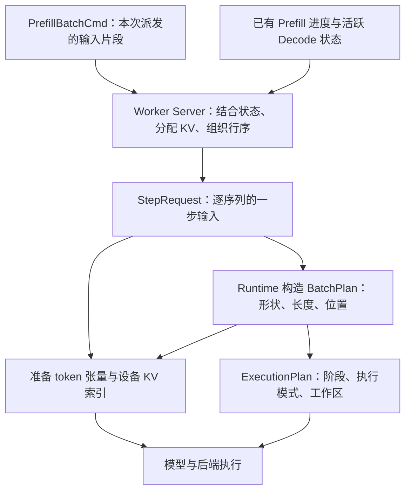

# 第 5 章：从批次命令到执行计划

Worker 收到一个 Prefill 命令时，已经知道哪些 token 需要计算，但还不能直接执行模型。命令没有给出本轮所有 Decode 序列，也没有替新 token 分配物理 KV 位置。模型还需要知道：输入怎样排列，每条序列能看到多长的上下文，各个 token 的位置是什么，以及本轮使用哪种执行路径。

[第 4 章](04-worker-service-loop.md#command-to-plan)串起了这些参与者。本章沿同一批输入逐步展开：Worker Server 结合命令与本地状态构造 `StepRequest`，Model Runner 根据它生成 `BatchPlan`、准备设备索引，再用 `ExecutionPlan` 约束实际执行。

主线仍然是普通文本生成：A 正在 Decode，已经有 5 个输入 token 的 KV，最近生成的 token 是 17；B 的完整输入为 `[41, 42, 43, 44]`。先假设单卡、贪心生成、关闭前缀缓存，上一轮状态已经提交，容量充足。本章先解释真实序列的布局，再加入分段、前缀复用与填充行。



<a id="command-and-segments"></a>

## 5.1 命令、前缀信息与 Prefill 分段

### 一条命令里的 token 怎样对应到序列

`PrefillBatchCmd` 用三个字段表达一批输入片段：

| 字段 | 内容 | 解决的问题 |
| --- | --- | --- |
| `input_ids` | 各片段的 token IDs 顺次拼接成的数组 | 这一条消息携带哪些输入 |
| `q_start_loc` | 每个片段在 `input_ids` 中的起始偏移 | 从哪里切出某个片段 |
| `segments` | 与片段逐一对应的元数据 | 输入属于谁、处于什么进度、计算后如何推进 |

片段元数据包含 `sequence_id`、`prompt_len`、`segment_start`、`segment_end`、`completion`，以及后续生成所需的采样参数和停止条件。`segment_start..segment_end` 是左闭右开的区间，表示完整输入中的一段。

若一次发送 B 的全部输入，关键字段是：

```text
input_ids   = [41, 42, 43, 44]
q_start_loc = [0]

segments[0]:
  sequence_id  = B
  prompt_len   = 4
  segment_start = 0
  segment_end   = 4
  completion    = FinishPrefillAndStartDecode
```

这里用 A、B 表示实际的 `u64` 序列 ID。`q_start_loc` 每个片段只有一个起点，最后一段的终点取 `input_ids.len()`，数组末尾没有额外的结束标记。

假设 B 已经完成前两个 token，现在与另一条序列 C 的首段共同发送：

```text
input_ids   = [43, 44, 71, 72, 73]
q_start_loc = [0, 2]

segments[0]: B，完整输入区间 [2, 4)
segments[1]: C，完整输入区间 [0, 3)
```

B 的消息切片是 `[0, 2)`，序列区间却是 `[2, 4)`；C 的消息切片是 `[2, 5)`，序列区间是 `[0, 3)`。前者用于找到消息内存中的 token，后者用于接续序列的位置与 KV 历史。它们不能互相代替。

Scheduler 的 `BatchBuilder::build_prefill_cmd` 正是按这个方式打包：取每条序列本次的 `input_ids[start..end]`，记录拼接前的数组长度，再附上片段元数据。物理 KV 由 Worker 分配，因此 Scheduler 发出的 `block_table` 留空。

源码入口：[批次协议与片段切片](../../../../crates/infer-protocol/src/scheduler_to_worker_data.rs)、[Scheduler 的命令构造](../../../../crates/infer-scheduler/src/application/batch_builder.rs)。

### 分段 Prefill 怎样接续历史

现在把 B 的四个 token 分成两次计算。两条命令描述同一条序列，Worker 用 `PrefillSeqMap` 保存它们之间的计算进度。

| 步骤 | 收到的输入 | 序列区间 | 执行前的基础索引表 | 本步新 slot | 完成后的处理 |
| --- | --- | --- | --- | --- | --- |
| 第一段 | `[41, 42]` | `[0, 2)` | `[]` | `[11, 12]` | 保存 `kv_len = 2`、索引表 `[11, 12]`，确认本段完成 |
| 第二段 | `[43, 44]` | `[2, 4)` | `[11, 12]` | `[13, 14]` | 完成输入，产生首个生成 token；若未结束，进入 Decode |

第一段的 `completion` 是 `ContinuePrefill`，第二段是 `FinishPrefillAndStartDecode`。这个字段决定计算结果怎样推进业务状态。中间片段的输出不能作为完整 prompt 的回答返回：模型此时只看到了输入的前半部分。

第二段到来时，Worker 从 `PrefillSeqMap` 取得基础索引表，并检查它的长度能否接上 `segment_start`。在当前一个 block 存一个 token 的路径中，`segment_start = 2` 就要求已经有两个位置。`plan_prefill_segments` 对基础长度不匹配的片段标记为跳过，避免把不衔接的片段继续拼到已有状态上。

执行第二段只需要输入 `[43, 44]`。前两个 token 的 K/V 已经存在，Attention 通过基础索引表读取它们。因此，**本步输入长度可以小于本步可见的 KV 长度**：这里分别是 2 和 4。

`prefill_done` 在协议中用于确认片段完成，中间片段也会产生该确认。是否已经完成整个 prompt，还要结合该片段的 `completion` 与 Scheduler 保存的进度判断。

### 前缀命中怎样改变本步输入

分段执行的历史来自同一请求之前的计算；前缀复用的历史可以来自已经保留的缓存。两者进入本次计算时，都需要提供“新输入之前的 KV 在哪里”。

设 B 的前两个 token 命中缓存，它们的物理 KV 索引是 `[21, 22]`。Scheduler 将 Prefill 起点推进到 2，再发送未命中的后缀：

```text
input_ids    = [43, 44]
q_start_loc  = [0]
segment_start = 2
segment_end   = 4
prefix_hint   = [21, 22]
```

Worker 尚无 B 的 Prefill 状态时，可以用 `prefix_hint` 建立基础索引表，再为 `[43, 44]` 分配两个新位置。若新位置是 `[13, 14]`，本步使用的完整映射就是 `[21, 22, 13, 14]`。

这条主路径中，消息已经只携带未命中的 token，Worker 直接使用消息切片。实现还支持一种起点为 0、消息包含命中前缀的形式：此时 Worker 才在本地裁去前缀 token，并把位置起点移到命中长度。是否需要裁剪取决于命令表达的区间，不能仅凭 `prefix_hint` 非空判断。

前缀提示包含已有 KV 的索引，成立的前提是这些索引仍然有效、对应相同的输入前缀。`BatchPlan` 不负责建立这项所有权保证；缓存匹配、保留与释放在第 12 章展开。本章只使用部分命中且仍有新输入的情形。

源码入口：[前缀提示随计划派发](../../../../crates/infer-scheduler/src/application/planning.rs)、[片段接续与输入构造](../../../../crates/infer-worker/src/application/worker_scheduler.rs)。

<a id="step-request-and-mixed-batch"></a>

## 5.2 SeqStep、StepRequest 与混合批次

### 先决定本轮接纳哪些命令

一条消息的边界表达 Scheduler 的派发单位，一次模型 forward 的边界由 Worker 结合本地 Decode 和资源容量组织。两者并不总是重合。

普通 Prefill 路径由 `handle_fused_step` 组织。对于待处理的 Prefill 命令，Worker 按本轮预算接纳一段 FIFO 命令前缀，再为接纳的输入分配 KV。接纳以完整命令为单位，未接纳的命令按原顺序进入 `deferred_prefills`。为保证队首能够前进，首条命令可以越过接纳策略的软限制；Runtime 的实际行数和 token 容量仍然是后续执行的硬限制。

对已经接纳的命令，Worker 接着解析片段、判断新增 Decode 序列是否超出容量，并为新输入取得 KV slot。通过这些步骤后，命令成为等待计算的 `CmdPrep`，其中保存片段计划、本次 KV 租约、行数与 token 数。

最后，Worker 把这些命令装入 `ForwardGroup`。第一组可以同时携带已有 Decode；后续装不下的命令进入额外的纯 Prefill 组。这个阶段保持命令完整，不会把单个命令重新切成更小的片段。Scheduler 应当先把长输入切成合适的大小，Runtime 再检查最终请求的硬容量。

因此有三种不同结果：预算尚未接纳，留待下一轮；接纳后发现容量或 KV 无法满足，报告错误；命令本身可以执行，但需要放到另一个 forward 中。它们对应不同的进度和资源处理。

### SeqStep：把一条序列的一步说完整

回到 B 一次发送全部四个 token 的场景。Worker 选择让 A 的一次 Decode 与 B 的 Prefill 同组执行，为 A 取得 slot 10，为 B 取得 slot 11–14。每条序列形成一个 `SeqStep`：

| 字段 | A | B | 信息来自哪里 |
| --- | --- | --- | --- |
| `sequence_id` | A | B | 活跃状态或命令中的序列身份 |
| `input_ids` | `[17]` | `[41, 42, 43, 44]` | A 的最近输出；B 的消息切片 |
| `positions` | `[5]` | `[0, 1, 2, 3]` | 本步各 token 的位置 |
| `kv_write_start` | 5 | 0 | 已有 KV 的长度 |
| `kv_len_after` | 6 | 4 | 已有长度加本步输入长度 |
| `block_table` | `[0, 1, 2, 3, 4, 10]` | `[11, 12, 13, 14]` | 已有索引表与新分配索引拼接 |

这里的 `block_table` 覆盖本步所需的完整上下文，既有旧位置，也有新位置。只提供新 slot 能找到写入目标，却不足以让 Attention 找到过去的 K/V。

对于本章的普通文本路径，一条合法的步骤应满足：

```text
q_len = input_ids.len()
positions.len() = q_len
kv_len_after = kv_write_start + q_len
positions[j] = kv_write_start + j
```

前三项描述长度与区间的一致性，最后一项是本章文本输入的位置构造方式。KV 写入位置与 RoPE 位置分别保存，后续的多模态位置规则可以让它们具有不同含义。

A 的输入 17 来自上一轮生成结果。即使这个 token 已经返回给用户，它自己的 K/V 仍要通过本轮 forward 才能得到。因此，A 此前的 `kv_len` 是 5，本轮先把 17 写到逻辑位置 5，再从本轮输出预测下一个 token。生成计数与 KV 长度分别记录输出进度和输入物化进度。

`kv_len_after = 6` 表示本次计算计划达到的长度。构造请求时，GPU 还没有完成写入，服务层也不能仅凭该字段就确认执行成功。预留、提交与回收的所有权关系在第 6 章展开。

### StepRequest：行顺序也是契约

Worker 按实际执行顺序收集 `SeqStep`，并附上采样与停止信息，得到 `StepRequest`。假设 A 已生成 3 个 token、最多生成 16 个，B 最多生成 8 个，示意如下：

```text
seqs                   = [A 的 SeqStep, B 的 SeqStep]
sampling               = [A 的采样参数, B 的采样参数]
stop.eos_ids           = [2]
stop.generated_counts  = [3, 0]
stop.max_tokens        = [16, 8]
stop.ignore_eos        = [false, false]
draft_tokens           = []
```

`eos_ids` 是这一步共用的结束 token 集合，其他示例数组按序列行对齐。第 0 行的输入、采样规则、已生成数量与最大输出数量必须都属于 A。普通 Runtime 接口允许逐行参数数组为空或长度等于 batch；服务层的常规组批会显式收集这些参数，ABC 接口还会对所需停止数组执行更严格的长度检查。

`draft_tokens` 为空表示普通执行。推测解码利用它描述待验证的草稿；K 个草稿需要 K+1 个输入位置，输出与保留输入错开一位，详见[专题 A 的验证计划](../../topics/01-speculative-decoding.md#target-verification)。

混合 ABC 接口还会收到与行对齐的 `row_kind`：

| 行类型 | 这一行承担的工作 | 业务结果 |
| --- | --- | --- |
| `Decode` | 处理一个待输入的生成 token | 产生下一 token，判断继续或结束 |
| `PrefillCont` | 处理 prompt 的中间片段 | 保存 KV 进度，确认片段完成 |
| `PrefillFinal` | 处理 prompt 的最后片段 | 产生首个生成 token，判断是否进入 Decode |
| `Pad` | 配合执行形状添加的占位行 | 不作为真实请求输出 |

当前 A、B 的 `row_kind` 是 `[Decode, PrefillFinal]`。若 B 只收到前两个 token，第二项则是 `PrefillCont`。`row_kind` 是混合执行的伴随参数，独立于 `StepRequest` 和 `BatchPlan`。

这说明两种信息需要同时保留：长度告诉模型要算多少 token，行类型告诉混合执行与提交逻辑如何使用结果。即使中间 Prefill 的计算路径得到一个候选 token，服务层也只确认片段，不把它作为完整输入的回答发送出去。

源码入口：[SeqStep 与 StepRequest](../../../../crates/infer-worker/src/domain/plan.rs)、[混合组批与 Prefill 提交](../../../../crates/infer-worker/src/application/worker_scheduler.rs)、[Decode 输入构造](../../../../crates/infer-worker/src/application/decode_engine.rs)。

<a id="batch-plan-and-index"></a>

## 5.3 逻辑序列、物理行序与 BatchPlan 元数据

### 从两条序列变成一条 token 数组

模型中的 embedding、线性变换等计算需要连续的 token 行。A 本步只有一个输入，B 有四个输入，Runtime 将它们按序列行顺序拼接：

```text
序列行          0                  1
                A                  B
扁平输入      [17,        41, 42, 43, 44]
token 行        0         1   2   3   4
```

序列行数是 2，token 行数是 5。若模型隐藏维度为 `hidden_dim`，这 5 个有效 token 对应的 hidden 数据形状为 `[5, hidden_dim]`。一次 Prefill 可以贡献多个 token 行，因此二者不能都用一个含糊的“batch size”代称。

各序列贡献的 token 数不同，这种布局称为 ragged batch，即不等长批次。扁平数组保存实际输入，各种长度与索引保留序列边界。

`Runtime::build_plan` 将逐序列信息转换为 `infer_core::plan::BatchPlan`：

| 字段 | A、B 示例值 | 含义 |
| --- | --- | --- |
| `kind` | `Ragged` | 计算布局类别 |
| `batch` | 2 | 本步的序列行数 |
| `num_tokens` | 5 | 本步 token 行总数 |
| `q_lens` | `[1, 4]` | 每条序列本步参与计算的 query token 数 |
| `kv_lens` | `[6, 4]` | 本步写入后，各序列完整的 KV 长度 |
| `seq_positions` | `[5, 0]` | 每条序列本步的 KV 写入起点 |
| `rope_positions` | `[5, 0, 1, 2, 3]` | 按扁平 token 顺序排列的 RoPE 位置 |
| `block_size` | 1 | 一个 KV block 容纳的 token 数 |
| `max_blocks_per_seq` | Runtime 的配置容量 | 设备索引表每行的固定宽度 |
| `total_q_tiles` | 2 | 按 query 长度分出的有效计算块数量 |

其中 `q` 对应 Attention 的 Query。本步输入需要计算新的 Q、K、V；历史输入的 K/V 则来自缓存。A 本步只有一个 Query，却需要在自己的六个 KV 位置上计算因果 Attention。

`BatchPlan` 的类型定义在 `infer-core`，构造逻辑位于 Worker 的 Runtime。它保存计算所需的长度、形状与位置，token IDs、sequence IDs、完整 block table、采样参数仍由其他输入对象承载。`upload_index` 因而同时接收 `BatchPlan` 和 `StepRequest`。

### 累积长度怎样恢复每条序列的边界

对 `q_lens` 做前缀和，得到 `cu_q_lens`：

```text
q_lens    = [1, 4]
cu_q_lens = [0, 1, 5]

第 i 行的 token 区间：
[cu_q_lens[i], cu_q_lens[i + 1])
```

`cu` 表示 cumulative，即累积。A 对应 `[0, 1)`，B 对应 `[1, 5)`。与协议中的 `q_start_loc` 相比，`cu_q_lens` 多了一个末尾总长度，而且它描述的是 Worker 组织后的实际计算批次，其中已经包含本地 Decode。

沿任意一个 token 往下追，就能连接三种位置。设它属于序列行 `i`，在该序列本步输入中的偏移是 `j`：

```text
扁平 token 行 = cu_q_lens[i] + j
逻辑 KV 位置  = seq_positions[i] + j
物理 KV slot = block_table[i][逻辑 KV 位置]   // 本章 block_size = 1
```

代入具体数据：

| 扁平 token 行 | 序列行与身份 | token ID | 序列内本步偏移 | 逻辑 KV 位置 | 物理 KV slot |
| --- | --- | --- | --- | --- | --- |
| 0 | 0，A | 17 | 0 | 5 | 10 |
| 1 | 1，B | 41 | 0 | 0 | 11 |
| 2 | 1，B | 42 | 1 | 1 | 12 |
| 3 | 1，B | 43 | 2 | 2 | 13 |
| 4 | 1，B | 44 | 3 | 3 | 14 |

例如 token 43 位于扁平数组第 3 行，属于序列行 1，在 B 本步输入中的偏移为 2。它的逻辑位置是 `0 + 2 = 2`，因此把 K/V 写到 B 的 `block_table[2] = 13`。

执行因果 Attention 时，它最多能看到 B 的逻辑位置 0、1、2，对应 slot 11、12、13；不能看到 B 的位置 3，也不会因为 A 排在扁平数组前面就读取 A 的上下文。序列边界、KV 映射与因果位置共同定义可见范围。

如果一个 KV block 容纳多个 token，寻址还要把逻辑位置分解为 `逻辑块号 = 位置 / block_size` 和 `块内偏移 = 位置 % block_size`。本章 `block_size = 1`，所以块号与 token 位置重合；完整的 K/V 张量布局在第 6 章展开。

### 设备索引表为什么有固定行宽

主机上的 A、B 分别持有一个变长 `Vec<u32>`。设备上的 `block_tables` 使用固定行宽 `max_blocks_per_seq`，方便按行定位。

假设这个宽度为 8，设备表的有效内容是：

```text
          列 0  1  2  3  4   5   6  7
行 0，A：   0  1  2  3  4  10   ·  ·
行 1，B：  11 12 13 14  ·   ·   ·  ·
```

索引表元素的线性偏移由 `序列行 × 固定行宽 + 逻辑块号` 确定，取出的表项才是物理 KV 索引。B 的表从第 8 个元素开始，并非紧接在 A 的第 6 个有效元素之后。这里的 `·` 表示当前长度之外、无需读取的内容，不代表一定存着零。

`upload_index` 使用持久的主机 block table 暂存区组织这些行，再写入地址固定的设备索引张量。有效长度之外的 block table 项可以保留旧值，前提是算子始终按本步长度限制读取范围。

长度控制数组则采用另一种方式：`cu_q_lens`、`kv_lens`、`seq_positions`、`seq_lens_step` 上传时补零到设备容量。假设设备曾服务过四行，现在只剩 A、B，后两行必须失效。否则旧长度可能让 kernel 把已经退出的行继续当作有效序列，错误地处理真实 token。

这里的核心区别在于访问规则：索引表的无效列由长度隔离，容量内的无效序列行则需要清除控制信息。设备分配仍然存在，不等于其中每一行都在本轮参与执行。

源码入口：[BatchPlan 与前缀和](../../../../crates/infer-core/src/plan.rs)、[计划构造及索引上传](../../../../crates/infer-worker/src/application/runtime/plan.rs)、[设备 KV 索引张量](../../../../crates/infer-core/src/kv.rs)。

### Query tile 怎样分配给序列

除了逐序列索引，Attention 还需要把本步 Query 划分成计算块。`RAGGED_Q_TILE` 为 128，序列 `i` 贡献的 tile 数为 `ceil(q_lens[i] / 128)`。

`BatchPlan::plan_ragged_tiles` 生成两个映射数组：

- `block2req[t]`：第 `t` 个有效 Q tile 属于哪个序列行。
- `block2tile[t]`：它是该序列内的第几个 Q tile，从 0 开始。

这里名称中的 `block` 指 Query 的计算分块，与存储 K/V 的 block 是两种含义。A、B 的长度都不超过 128，因此：

```text
q_lens        = [1, 4]
block2req     = [0, 1]
block2tile    = [0, 0]
total_q_tiles = 2
```

再看一个输入与索引容量足够的独立例子：保持 A 的长度为 1，把 B 的本步长度改为 257，就能看出这个映射的作用。这里不沿用上面宽度为 8 的索引表：

| 有效 tile 编号 | `block2req` | `block2tile` | 对应本步输入区间 |
| --- | --- | --- | --- |
| 0 | 0，A | 0 | A 的 `[0, 1)` |
| 1 | 1，B | 0 | B 的 `[0, 128)` |
| 2 | 1，B | 1 | B 的 `[128, 256)` |
| 3 | 1，B | 2 | B 的 `[256, 257)` |

`build_plan` 先计算总 tile 数，`upload_index` 再生成映射并上传。`valid_q_tiles` 标记实际有效数量；分离 Decode 前缀与 Prefill 后缀的路径还使用 `valid_suffix_q_tiles`。A、B 的普通索引上传会得到有效 tile 数 2、后缀 tile 数 1，mixed Graph 可按捕获形状指定前缀边界。上传完成后，后端还可以通过 `prepare_paged_attention_index` 准备自身需要的索引表示。

### 行重排必须同时改变什么

若只从通用 ragged 布局看，把顺序改成 `[B, A]`，则所有依赖本次行序的内容都要一起变化：

```text
扁平 input_ids = [41, 42, 43, 44, 17]
q_lens         = [4, 1]
cu_q_lens      = [0, 4, 5]
kv_lens        = [4, 6]
seq_positions  = [0, 5]
rope_positions = [0, 1, 2, 3, 5]
block table 行 = [B 的表, A 的表]
```

采样参数、停止条件、结果对应的序列身份也必须同步换位。只交换 token 输入，会让 token 使用另一条序列的位置或 KV 历史。

物理 slot 的归属不因行重排而改变：B 仍使用 11–14，A 仍在 slot 10 写入本轮 K/V。变化的是它们在本轮数组中的执行位置。

服务中的 mixed ABC 还利用“Decode 行位于前缀”的布局约定，因此不能把上述任意排列直接用于该路径。重排除了保持数组一致，还必须满足具体执行接口的顺序要求。

### 三种不同的填充

为了适配已有执行形状，批次可能包含额外空间。区分填充发生在哪里，才能判断它是否增加序列、是否占用 KV、是否参与输出。

| 填充方式 | 放在哪里 | 对应的处理 |
| --- | --- | --- |
| 设备容量尾部补零 | 长度与控制张量未使用的行 | 将旧行置为无效，不新增真实输入 |
| Decode 前缀占位行 | Worker 构造的 `StepRequest` 内 | 增加 `Pad` 行和临时 KV slot，使前缀匹配已有执行槽位；提交时忽略这些行 |
| 扁平 token 尾部填充 | Runtime 的运行形状与输入张量尾部 | 扩大部分计算的 token 维度，真实序列边界仍由有效长度描述 |

Worker 只有在行数、token 数和临时 KV 允许时才加入 Decode 占位行。它们虽然不产生请求输出，仍然进入本次执行形状，不能从容量账本中忽略。

eager mixed 路径还可以把 token 行数向 32 的倍数扩展，受实际容量与模型条件限制。若 A、B 的有效输入是 5 个 token，容量足够且没有 recurrent state，运行计划可能使用 32 个 token 行；真实 `q_lens` 仍为 `[1, 4]`，设备索引仍按实际计划上传。额外 token 行不属于任何真实序列，不写入有效 KV，也不作为回答采样。

因此，`num_tokens = sum(q_lens)` 对本章从请求构造出的实际计划成立；运行时为特定执行路径派生出的填充计划，可以有更大的 `num_tokens`。实际输入、执行形状和分配容量各有自己的作用。

源码入口：[Worker 的占位行构造](../../../../crates/infer-worker/src/application/worker_scheduler.rs)、[mixed 的运行形状与索引准备](../../../../crates/infer-worker/src/application/runtime/mixed_abc.rs)。

<a id="execution-contract"></a>

## 5.4 ExecutionPlan、形状校验与 workspace 契约

### 校验发生在不同的边界

到了 Runtime，输入已经完成本地组批，但仍然要检查是否满足计算接口的容量与一致性要求。`build_plan` 中的普通步骤检查包括：

| 检查内容 | 需要维护的关系 |
| --- | --- |
| batch 非空且不超过 `cap_batch` | 有效序列行落在 Runtime 容量内 |
| 每行输入非空，且与 `positions` 等长 | 每个输入都有对应的位置 |
| 总 token 数不溢出且不超过 `cap_num_tokens` | 输入与中间缓冲能够容纳本步计算 |
| `block_table.len()` 不超过每行上限 | 上传不超出索引表行宽 |
| KV 起点与结束长度非负 | KV 区间有合法的基本表示 |
| `kv_len_after = kv_write_start + input_ids.len()` | 新增输入与目标 KV 长度一致 |
| 目标 KV 长度不超过 `max_seq_len` | 上下文长度落在模型执行容量内 |
| 逐行参数数组为空或长度等于 batch | 参数不会只覆盖任意一部分行 |

这些检查覆盖步骤形状与区间一致性。slot 的分配来源与所有权由服务层维护；普通 `build_plan` 也没有遍历验证每个物理 slot、完整索引覆盖范围和全部普通 token 的词表范围。因此，正确构造请求与执行入口校验共同形成调用契约。

接收消息、业务接续与形状检查也各有职责。协议类型提供了 `PrefillBatchCmd::validate`，普通 fused 接收主链则从反序列化进入片段规划，不会因此自动执行该函数。`plan_prefill_segments` 检查已有长度的衔接，`build_plan` 再检查最终步骤的形状，二者都只负责各自明确实现的检查。

对 A、B 来说，若把 A 的 `kv_len_after` 写成 5，便与 `5 + 1` 不一致，会在构造计划时失败；若仅仅没有适用的 Graph，输入依然可以合法，执行器可以选择 eager。输入错误与优化路径不适用具有不同的处理含义。

### BatchKind 描述计算布局

普通请求没有草稿时，Runtime 根据实际 query 长度与模型要求选择 `BatchKind`：所有 `q_len` 都等于 1，并且模型不要求 eager ragged，才得到 `DecodeOnly`；其他普通输入使用 `Ragged`。带草稿的请求进入 `Spec`。

所以，`DecodeOnly` 表达可用于单 token 行计算的布局条件。一个只剩一个 token 的 Prefill 片段，在适用模型上也可能具有这种布局。它完成之后是否继续 Prefill、是否开始生成，仍由服务层的片段状态与行类型决定。

A、B 的 `q_lens = [1, 4]`，因此本例得到 `Ragged`。其中既有 Decode 又有 Prefill，依然可以统一表达为逐行长度、位置与索引。

### ExecutionPlan 确定这一步怎样执行

当数据布局明确后，还要选择实际执行方式。`ExecutionPlan` 用五个字段记录这项决定：

| 字段 | 作用 |
| --- | --- |
| `phase` | 本次操作的阶段，如 `Decode`、`Prefill`、`Mixed` |
| `mode` | eager、Decode Graph、Prefill Graph 或 mixed Graph |
| `batch` | 本次操作记录的序列行数 |
| `tokens` | 本次操作记录的 token 数 |
| `workspace` | 本次使用哪一类已有工作区 |

沿服务中的贪心 mixed ABC 路径，若本例选择 eager，可写为：

```rust
ExecutionPlan::eager(
    Phase::Mixed,
    2,
    5,
    WorkspaceUse::Abc,
)
```

这里仍按有效计划记录两行、五个 token；具体执行区域可以使用上一节的填充运行形状。

同样的 `StepRequest` 若通过普通 `Runtime::step` 执行，则使用 `WorkspaceUse::Runtime`。该入口按“是否所有 `q_len` 都为 1”记录 `Decode` 或 `Prefill`，因此本例记录为 `Phase::Prefill`。`Phase::Mixed` 对应专门的混合执行入口，不能只根据请求里同时有 A、B 就推断所有路径都记录这个阶段。

普通 `step` 先构造 `BatchPlan`、准备索引等数据，再结合模型、采样方式和 Graph 条件决定分支。mixed ABC 使用独立的 mixed Graph 判定；纯 Decode ABC 则有自己的持久缓冲与索引复用路径。它们共享部分计划构造逻辑，执行准备并不完全相同。

`ExecutionPlan::validate` 对模式与阶段的组合执行检查。例如：

- `DecodeGraph` 要求阶段是 Decode、token 数等于行数、Graph slot 能覆盖当前行数。
- `PrefillGraph` 要求阶段是 Prefill，计划记录的 token 数与模式中的长度相等。
- `MixedGraph` 要求阶段是 Mixed，并且存在有效 token。
- ABC 工作区只用于它支持的 Decode、Mixed、Wait、Commit 等阶段。

这些条件使“选了什么路径”成为显式的数据。检查通过后，`execute` 调用实际操作闭包，并在启用统计时记录执行信息。具体的算子调用仍由模型与后端实现，Graph 本体由设备执行范围管理；`ExecutionPlan` 本身没有保存一份算子依赖图。

源码入口：[执行阶段、模式与校验](../../../../crates/infer-worker/src/application/execution.rs)、[普通步骤的分派](../../../../crates/infer-worker/src/application/runtime/mod.rs)、[普通 Graph 决策](../../../../crates/infer-worker/src/application/runtime/graph_exec.rs)。

### 工作区约束的是已有资源的使用

workspace 指执行过程中复用的输入暂存、中间结果、采样输出等缓冲。`WorkspaceUse` 标明本次操作使用哪一类已有资源，构造这个枚举不会另外分配一份显存。

本章涉及两种主要用法：普通步骤使用 Runtime 管理的工作区；异步 Decode 和 mixed ABC 使用 A/B/C 持久缓冲，相关占用持续到配套的完成处理。推测解码还会使用 proposer 自有缓冲、借用的 token tape 或 recurrent snapshot，其契约见[专题 A 的状态与提交](../../topics/01-speculative-decoding.md#state-and-commit)。

工作区契约要回答的不只是“缓冲多大”，还有“谁拥有、哪个操作正在使用、什么时候能再次修改”。这些问题把本章的计划连接到第 9 章的异步依赖。仅有稳定的设备地址，还不足以决定主机暂存区何时可复用；异步传输也必须服从相应的完成关系。

### 模型怎样读到计划

进入 eager 模型计算时，Runtime 基于持久 hidden 缓冲创建本步视图，再构造 `StepCtx`：

```text
StepCtx 借用：
  scope：设备执行范围
  plan ：本步 BatchPlan

模型另行收到：
  input_ids：输入 token 张量
  hidden   ：本步 hidden 视图
  cache    ：KV pool 与设备索引的视图
```

`StepCtx` 的生命周期参数约束它借用的 scope 和计划，模型组件通过该上下文读取批次形状、长度与位置。KV 实体和设备索引通过 cache 视图传入，既保持计算接口所需的信息完整，也避免让模型组件直接管理请求队列。

源码中的 `run_layers_observed` 沿这个接口调用 embedding 与 decoder layers；之后的输出投影和采样根据请求规则生成结果。对于普通生成，可以只取每条序列最后一个输入位置的 hidden 来预测下一 token。A、B 的有效最后 token 行分别为 0 和 4，业务提交再判断它们是 Decode 输出、首 token，还是只完成一个 Prefill 片段。

这条调用链体现了职责与类型的配合：Worker Server 保存序列事实并组织一步输入，Runtime 维护模型执行资源并解释输入，`infer-core` 提供跨模型与后端的计算契约，模型组件按照契约组合算子。分层的依据是状态与决策的归属，各层通过明确的数据结构协作。

源码入口：[StepCtx](../../../../crates/infer-core/src/exec.rs)、[模型执行与输出选择](../../../../crates/infer-worker/src/application/runtime/mod.rs)。

### 计划存在，不代表每步都重新上传全部数据

前面的推导展示了从主机输入完整准备一次计算所需的信息。稳态 Decode 可以继续复用设备上的 token 和索引，由上一步的收尾逻辑准备下一步数据，因此某些调用会跳过完整索引上传。

在重叠的 mixed 路径中，Decode 前缀的真实 token 还可以直接从设备上的上一轮结果收集，主机请求中相应 token 只是占位值，Runtime 只上传后缀输入。形状、长度、序列映射仍然必须正确，变化的是数据从哪里来，以及如何避免重复搬运。

这些优化都以本章建立的映射关系为基础。下一章进入[KV Cache 的物理布局与所有权](06-kv-layout-and-ownership.md)，继续解释 slot 怎样分配、预留、提交与回收；第 9 章再沿同一批数据展开异步传输和 ABC 流水线，[第 10 章](10-cuda-graph-and-dynamic-batching.md)讨论 Graph 的捕获与重放，并推演五条请求怎样安全使用八行 Graph。

返回[第 4 章](04-worker-service-loop.md) · [全书目录](../../01-CONTENTS.md) · [书籍入口](../../00-README.md) · [第 5 章共写记录](../../workshops/05-command-to-plan.md)
