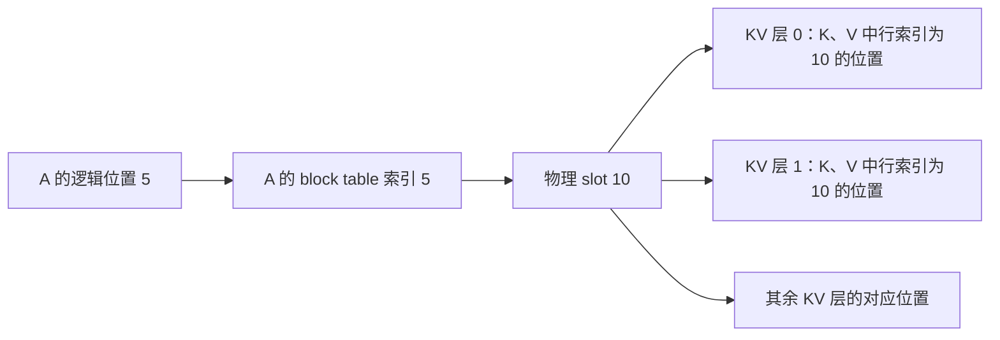
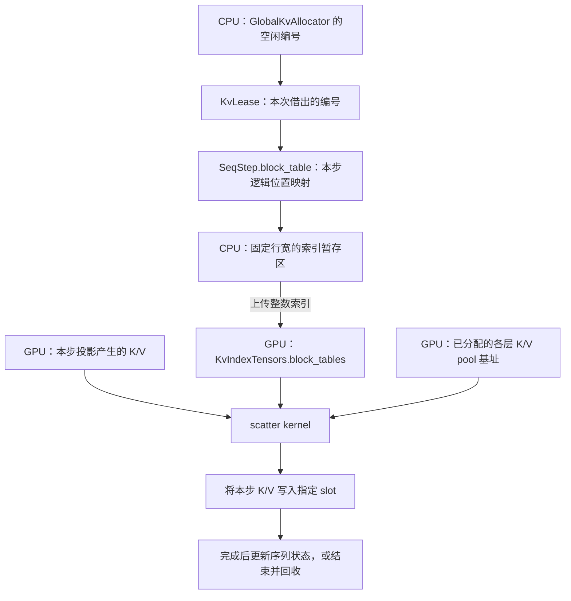
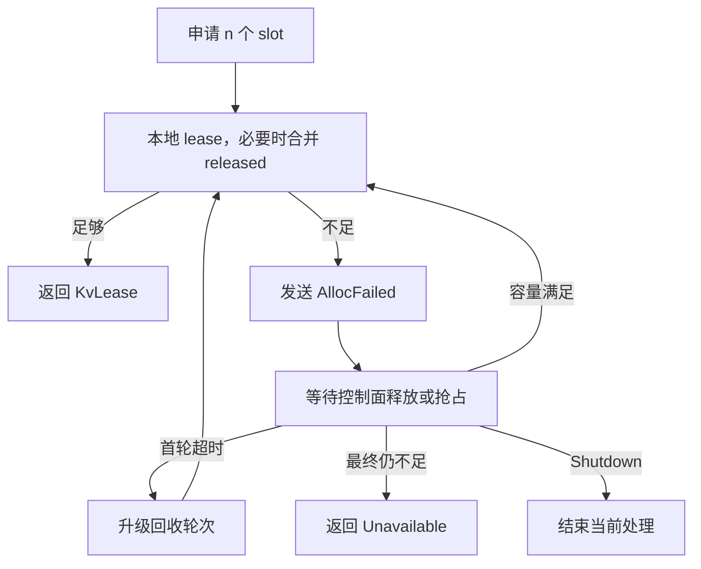

# 第 6 章：KV Cache 的物理布局与所有权

第 5 章把批次中的每个输入 token 映射到了一个 KV slot。现在继续沿这个地址向下看：slot 10 里面到底存着什么，谁有权把它交给 A，A 结束之后又由谁收回？

仍以 A 正在 Decode、B 的 Prefill 到达为例。A 已有五个 token 的 KV，最近生成的 token 是 17；B 的输入是 `[41, 42, 43, 44]`。本轮给 A 分配 slot 10，给 B 分配 slot 11–14：

```text
A 的旧 block table：[0, 1, 2, 3, 4]
A 的本步写入位置：逻辑位置 5 → slot 10
B 的本步写入位置：逻辑位置 0、1、2、3 → slot 11、12、13、14
```

这些编号沿用上一章的示意，不表示整个池的其他位置都空闲。本章先使用单卡、普通文本生成、完整 Attention 与关闭前缀缓存的场景，再引入共享前缀和多 rank 对所有权的影响。

<a id="kv-capacity"></a>

## 6.1 KV 容量：一个 token 究竟占多少显存

### 保存历史 K/V，避免重复计算历史输入

在自回归生成中，新位置的 Query 要与之前位置的 Key 计算相关性，再用得到的权重汇总 Value。对于已经处理过的输入，各层对应的 K/V 可以保留下来，供后续位置继续读取。

以 A 为例，当前输入 token 17 位于逻辑位置 5。这一步在每个 Attention 层产生它的 Q、K、V：Q 用于本次计算，K/V 写进该层的 slot 10，并与已有五个位置的 K/V 一同参与 Attention。下一步输入到来时，可以直接读取这六个位置的缓存。

缓存中的内容是各层计算得到的向量。对于带 RoPE 的模型，K 还需要完成相应的位置变换后写入缓存。token ID、文本和采样结果由其他数据结构保存。

这也解释了生成与缓存之间的时间关系：本步输入 17，物化的是 **17 的 K/V**；本步预测出的下一个 token，只有再次作为输入执行，才会产生自己的 K/V。若它就是最终输出，序列可以直接结束，无需再为这个最终输出执行一次模型。

源码入口：[Attention 的投影与缓存写入](../../../../crates/infer-worker/src/components/attention_core.rs)、[融合 Q/K 处理与 KV 写入](../../../../crates/infer-backend-cuda/src/kernels/qkv_norm_rope_scatter/qkv_norm_rope_scatter.cu)。

### 从一层、一个 token 推到整个池

先假设各个完整 Attention 层的 KV 形状相同，K 和 V 使用同一种未量化的数据类型。定义：

| 符号 | 含义 |
| --- | --- |
| `L` | 需要保存完整 K/V 的层数 |
| `Hkv` | 当前设备上每层的 KV head 数 |
| `D` | 每个 head 的维度 |
| `E` | 一个元素占用的字节数 |
| `S` | 一个物理 block 容纳的 token 数 |
| `N` | 提供给请求使用的物理 block 数 |

一层的一个 token 有 `Hkv × D` 个 K 元素和同样多的 V 元素。因此：

```text
kv_dim           = Hkv × D
每 token 的字节数 = 2 × L × Hkv × D × E
每 block 的字节数 = 2 × L × S × Hkv × D × E
请求池的字节数    = N × 每 block 的字节数
```

系数 2 来自 K 与 V 两份数据。GQA 中多个 Query head 共用 KV head，所以应代入 `Hkv`，而不是 Query head 数。模型的 hidden dimension 也不能直接替代 `kv_dim`。

例如，一个使用 BF16 的模型有 32 个完整 Attention 层、8 个 KV head，每个 head 维度为 128：

```text
每 token = 2 × 32 × 8 × 128 × 2 bytes
         = 131072 bytes
         = 128 KiB

8192 个已物化 token 的 KV = 1 GiB
16 GiB 纯 KV 数据空间      = 131072 个 token 的存储空间
```

这组数字只描述 K/V 数据本体。最后一个数是所有请求共同使用的 token 容量，不能直接当作单请求上下文长度，也不能直接当作可服务的并发数。假设每条请求都持有 8192 个 token 的 KV，16 条就会用完这份纯数据预算，下一轮 Decode 所需的新位置还没有计入。

模型权重、输入与 hidden 缓冲、算子工作区、采样缓冲、索引张量和 Graph 相关资源都需要另外计算。实际可用请求容量还受最大序列长度、批次行数、预留 slot 等条件约束。

### 容量计算必须对应实际模型与实际 rank

RustInfer 的普通 CUDA 服务使用 BF16 KV，启动代码按以下关系估算每块字节数：

```text
model.cache_layout().num_full_layers()
× 2
× block_size
× model.dims().kv_dim
× size_of::<bf16>()
```

其中 `num_full_layers()` 很关键。混合注意力模型可能只有部分层使用完整 K/V，其他层使用 recurrent state；这些状态有自己的布局和容量，不能拿模型总层数直接代入上述公式。

TP 下则要使用 rank 本地的 `kv_dim`。项目的 dense decoder 按 head 切分，并要求全局 KV head 数能被 TP 数量整除。在这个条件下，每个 rank 保存 `Hkv_global / TP` 个 KV head，对应的单 rank KV 数据量也按这个比例下降；不满足整除条件会被拒绝，不会自动复制 KV head 来适配。容量公式应沿用模型实际提供的本地维度。

自动配置容量时，Worker 在模型与工作区建立、执行过启动阶段的计算后读取剩余显存，扣除预留空间，再换算可用 block 数。多个 TP rank 使用各自探测结果中的最小容量，使同一组 slot 编号在所有 rank 上都有效。关闭前缀缓存时，自动容量还会按配置的最大批次行数与每序列最大块数限制工作集。显式指定 `num_blocks` 则直接确定请求容量。

服务中的请求分配器管理 `[0, N)`；实际 KV pool 额外分配一个 block，形状中的块数为 `N + 1`。最后一块是预留块，启动日志称为 Graph scratch，不交给普通请求，也不计入 Ready 报告的请求容量。因此，计算整个 K/V 张量占用时还要加上这块空间。服务中的临时 `Pad` 行仍需另从请求分配器借出 slot；它与普通 Decode Graph 的零长度尾部如何区分，见[第 10 章的 padding 推演](10-cuda-graph-and-dynamic-batching.md#padding-kinds)。

`KvQuantTier` 提供量化描述类型，普通 Runtime 构造这里仍使用 `None`。权重采用 INT4 或 FP8，也不会自动把 BF16 KV 改成同样的精度。KV 量化需要配套的数据表示、写入和读取路径，放在后续专题展开。

源码入口：[Worker 容量规划与请求池建立](../../../../crates/infer-worker/src/application/serve_loop.rs)、[Runtime 的 KV 张量分配](../../../../crates/infer-worker/src/application/runtime/mod.rs)、[KV 类型与量化描述](../../../../crates/infer-core/src/kv.rs)、[dense decoder 的 TP head 切分](../../../../crates/infer-worker/src/models/decoder.rs)。

<a id="physical-layout"></a>

## 6.2 从逻辑位置到物理 KV：slot、block table 与 batch row

### 一个 slot 对应所有相关层的一组位置

Runtime 持有 `PagedKvPool`，其中 `layers` 保存每个完整 Attention 层的缓存。对应的数据结构在 `infer-core::kv` 中：

```rust
pub struct PagedKvLayer<T: Dtype, D: Device> {
    pub k: Tensor<T, D>,
    pub v: Tensor<T, D>,
}

pub struct PagedKvPool<T: Dtype, D: Device> {
    pub layers: Vec<PagedKvLayer<T, D>>,
    pub num_blocks: usize,
    pub block_size: usize,
    pub kv_dim: usize,
    pub quant: KvQuantTier,
    pub seq_kv_len: HashMap<SeqId, u32>,
}
```

外层的 `Vec` 保存在主机内存中，里面每个 `Tensor<T, D>` 描述一个张量。`D = Cuda` 时，张量的数据存储在设备上；Rust 结构体本身不需要搬到 GPU。`num_blocks`、`block_size` 和 `kv_dim` 定义池的形状，`quant` 描述 KV 量化方式。`seq_kv_len` 是该通用类型保留的长度记录接口，普通服务的权威长度由 Worker 序列状态维护。

每层的 K 与 V 使用两个独立张量：

```text
PagedKvPool
  layers[0]
    K：[pool_blocks, block_size, kv_dim]
    V：[pool_blocks, block_size, kv_dim]
 layers[1]
    K：[pool_blocks, block_size, kv_dim]
    V：[pool_blocks, block_size, kv_dim]
  ...
```

Runtime 初始化中真正建立存储的核心代码是：

```rust
let mut layers = Vec::with_capacity(model.cache_layout().num_full_layers());
for _ in 0..model.cache_layout().num_full_layers() {
    layers.push(PagedKvLayer {
        k: D::alloc_tensor(
            Shape::from_slice(&[num_blocks, block_size, dims.kv_dim]),
            device,
        )?,
        v: D::alloc_tensor(
            Shape::from_slice(&[num_blocks, block_size, dims.kv_dim]),
            device,
        )?,
    });
}
```

这里的 `num_blocks` 是传给 Runtime 的物理池块数，服务启动传入的是请求容量加一。执行这些分配之后，各层 K/V 才拥有可以被 kernel 使用的存储；后续为请求分配 slot 时，通常继续使用这些已经存在的张量。

对于本章的 `block_size = 1`，一层的 slot 10 对应 K 张量的一行和 V 张量的一行，各有 `kv_dim` 个元素。A 获得编号 10 后，会在每个完整 Attention 层使用该编号对应的位置。各层存储不同的向量，却沿用同一张序列 block table。

这些层由分别分配的张量组成，不能把它们看成必然连续的一块 `[L, 2, N, ...]` 大张量。编号只负责在每层张量中定位；层的基址由当前执行的模型组件和 cache view 确定。池的形状里没有请求或 batch 维度，所有请求共同使用这份存储，通过各自的 block table 隔离逻辑上下文。

TP 也沿用这一关系：同一逻辑 token 在各 rank 使用一致的 slot 编号，各 rank 的张量保存本地负责的 K/V 数据。slot 编号一致不意味着显存地址相同，更不意味着整份缓存被传到了 rank 0。head 怎样切分、为什么本地 Attention 可以直接读取自己的完整历史，见[第 17 章](../tensor-parallel/17-matmul-to-tensor-parallel.md#attention-and-kv)。



### 写入地址怎样计算

设序列位于本批次第 `r` 行，要写入的逻辑 token 位置为 `p`，每个 block 可容纳 `S` 个 token，设备 block table 的行宽为 `M`：

```text
逻辑块号 b = p / S
块内偏移 o = p % S
物理块号 s = block_tables[r × M + b]

在某层 K 或 V 张量中的元素偏移：
((s × S + o) × kv_dim) + h × D + d
```

其中 `h` 是本地 KV head 编号，`d` 是 head 内的元素编号。元素偏移乘以 `E`，再加上该层 K 或 V 张量的基址，才得到对应的字节地址。CUDA 的 paged scatter 按这条关系把本步生成的 K/V 写入池中。

代入本章的 B：token 43 位于逻辑位置 2，`S = 1`，因此查到 `B.block_table[2] = 13`。若 `kv_dim = 1024`、`D = 128`，要找 `h = 2、d = 7` 的元素，两个下标均从 0 编号：

```text
元素偏移 = 13 × 1024 + 2 × 128 + 7 = 13575
BF16 字节偏移 = 13575 × 2 = 27150
```

每一层都按相同编号定位到自己的 K/V 张量。K 与 V 使用各自的基址。

Attention 读取历史时同样使用这张表：沿逻辑位置遍历历史上下文，再取得物理 slot。对于 token 43 的因果 Attention，可见的是 B 的位置 0、1、2，即 slot 11、12、13。即使整个 Prefill 已经把 token 44 的 K/V 写到 slot 14，因果边界仍会阻止当前位置读取它。

CPU 参考后端与 CUDA 后端使用同样的 pool 布局和索引含义。CPU 在主机上完成参考计算，CUDA 将这些映射交给 kernel，并可融合 Q/K 归一化、RoPE 与 KV 写入。布局契约一致，使模型组件能够通过相同接口调用不同后端。

源码入口：[paged scatter 的地址计算](../../../../crates/infer-backend-cuda/src/kernels/kv_cache/scatter_kv_batch.cu)、[设备索引的固定行宽](../../../../crates/infer-worker/src/application/runtime/plan.rs)、[core 中的参考算子实现](../../../../crates/infer-core/src/ports/fused_ops.rs)。

<a id="allocator-to-device"></a>

### 一个主机编号怎样驱动一次显存写入

分配器只返回整数，GPU 必须通过本步索引才能知道这些整数属于哪条序列、哪一个逻辑位置。以 B 获得 `[11, 12, 13, 14]` 为例，连接分配与计算的过程分为四步。

第一步，Worker 把已有表与本次新增编号拼接，构造 `SeqStep`。这个结构体的完整字段是：

```rust
pub struct SeqStep {
    pub sequence_id: u64,
    pub input_ids: Vec<i32>,
    pub positions: Vec<i32>,
    pub kv_write_start: i32,
    pub kv_len_after: i32,
    pub block_table: Vec<u32>,
}
```

于是 B 的步骤可以表示为：

```text
input_ids      = [41, 42, 43, 44]
positions      = [0, 1, 2, 3]
kv_write_start = 0
kv_len_after   = 4
block_table    = [11, 12, 13, 14]
```

第二步，Runtime 把逐序列的主机表排成设备索引。`KvIndexTensors` 中与这里直接相关的字段如下，其余位置和 tile 辅助字段省略：

```rust
pub struct KvIndexTensors<D: Device> {
    // 其余辅助字段省略。
    pub block_tables: Tensor<i32, D>,
    pub cu_q_lens: Tensor<i32, D>,
    pub kv_lens: Tensor<i32, D>,
    pub seq_positions: Tensor<i32, D>,
    pub seq_lens_step: Tensor<i32, D>,
    // 其余辅助字段省略。
}
```

`upload_index_with_suffix_prefix` 选择一份持久主机暂存区，按固定行宽写入编号。其填表操作是：

```rust
for (i, seq) in req.seqs.iter().enumerate() {
    let row = i * mbps;
    for (j, &block) in seq.block_table.iter().enumerate() {
        block_tables_host[row + j] = block as i32;
    }
}
```

随后把本批次对应的暂存区上传到 `self.kv_index.block_tables`，长度和写入起点分别进入其他索引张量。这里传输的是整数元数据；历史 K/V 仍在原来的各层 pool 里。

第三步，模型在 GPU 上对输入完成投影，得到本步 K/V，scatter kernel 读取设备索引，确定写入目标。省去循环与向量化部分，关键寻址操作为：

```cpp
const int logical_pos = base_pos + token;
const int blk_idx = logical_pos / block_size;
const int blk_off = logical_pos - blk_idx * block_size;
const unsigned int physical_block =
    block_tables[seq * max_blocks_per_seq + blk_idx];

const size_t dst_offset =
    (static_cast<size_t>(physical_block) * block_size + blk_off) * kv_dim;
T* k_dst = k_pool + dst_offset;
T* v_dst = v_pool + dst_offset;
```

例如 B 的 token 43 查到 13 后，本步计算得到的整行 K/V 才被写入各层对应位置。`lease(4)` 已经占用了四个 slot；模型计算和 kernel 写入则让它们拥有 B 的有效数据。这两个动作发生在不同层。

第四步，执行成功后，若序列还需继续，Worker 将这份表保存进 `PrefillSeq` 或 `ActiveSeq`，供后续步骤索引历史 KV；若本步已生成最终输出，则进入结束与回收处理。普通分段 Prefill 的持久状态本身也很小：

```rust
pub struct PrefillSeq {
    pub kv_len: usize,
    pub block_table: Vec<u32>,
}

pub type PrefillSeqMap = HashMap<u64, PrefillSeq>;
```

这条联动关系可以连成一张图：



稳态 Decode 可以在设备上维护后续索引，省略部分主机重建与上传，但仍要保持相同的位置映射关系。GPU 不会扫描 CPU 的空闲数组，也不会因 `head` 改变而自行改变访问位置。

源码入口：[步骤结构](../../../../crates/infer-worker/src/domain/plan.rs)、[Prefill 组装](../../../../crates/infer-worker/src/application/worker_scheduler.rs)、[索引上传](../../../../crates/infer-worker/src/application/runtime/plan.rs)、[序列持久状态](../../../../crates/infer-worker/src/application/worker_state.rs)。

### slot 归还之后，显存中发生了什么

假设 B 结束，slot 13 被归还后又交给 C。分配器修改的是 CPU 上的空闲编号；显存中原来属于 B 的 K/V 仍留在对应位置。C 的执行计划把自己的逻辑位置映射到 13，在设备访问顺序正确的前提下，新 K/V 会覆盖这个位置。

因此，整个过程不要求移动其他 slot，也不要求先把 13 清零。旧内容是否存在，与它是否仍能被有效序列引用是两个问题。结束处理必须使旧引用不再被使用，执行依赖必须保证覆盖晚于最后一次旧访问。

将内存变化分开看，就能看到两份账本的区别：

| 操作 | CPU 编号账本 | 已分配的 K/V 张量空间 | K/V 数据内容 |
| --- | --- | --- | --- |
| 建立 Runtime 的 KV pool | 服务层建立对应范围的编号池 | 分配各层 K、V 存储 | 尚未成为请求的有效历史 |
| `lease(n)` | 空闲减少 `n`，借出增加 `n` | 保持原大小 | 尚未因这次借出而产生新 K/V |
| 执行本步 scatter | 编号归属保持 | 保持原大小 | 写入本步输入的 K/V |
| `free` 或 `release` | 相应编号计为空闲 | 保持原大小 | 保留旧值，等待覆盖 |
| `recycle` | 重新整理空闲编号 | 保持原大小 | 不搬移 K/V |

整份张量存储的生命周期由 Tensor、Storage 和后端内存管理负责。沿 K/V 张量继续展开，对象关系如下：

```text
PagedKvPool.layers[i]
  ├─ k: Tensor<T, D>
  └─ v: Tensor<T, D>
       ├─ shape、strides、offset_elems 等视图信息
       └─ storage: Arc<Storage<D>>
            ├─ ptr: NonNull<u8>   底层存储指针
            ├─ size: usize       存储字节数
            └─ device: D         所属设备及内存操作接口
```

K、V 各自沿 Tensor 连接到自己的 Storage。Tensor 的克隆和视图可以共享同一个 `Arc<Storage<D>>`；最后一个引用释放时，才调用 Storage 的 `Drop`，由它调用设备的 `free_bytes`。`GlobalKvAllocator` 的四个字段里没有设备指针，因此一次 slot 归还不会触发这个过程。

这里还可以区分三层不同的回收：

| 回收层次 | 管理单位 | 实际动作 |
| --- | --- | --- |
| KV slot 分配器 | 池内编号 | 修改 CPU 空闲集合，pool 张量继续存在 |
| Tensor / Storage | 整块张量底层 allocation | 最后一个 Storage 引用释放，将 allocation 交回设备后端 |
| CUDA 后端字节内存池 | 可复用的设备 allocation | 根据保留预算缓存该 allocation，或驱逐并调用 `cudaFree` |

后端缓存整块 allocation 与 KV 分配器暂存 slot 编号，是两种粒度不同的机制。即使一个 Tensor 的最后引用消失，其显存也可能仍被后端保留，以便后续张量复用。Storage 的释放本身也不能代替对设备在途访问的管理。

启动时的 `resize_kv_pool` 会清除旧层张量并重新分配，更新容量并清空 pool 的长度记录；它没有复制旧 K/V，也没有迁移活跃序列。服务用它在容量探测之后、Graph 预热之前建立最终池，不能把这个入口当作运行期无损扩容。

源码入口：[KV pool 建立与重建](../../../../crates/infer-worker/src/application/runtime/mod.rs)、[Tensor](../../../../crates/infer-core/src/tensor.rs)、[Storage](../../../../crates/infer-core/src/storage.rs)、[CUDA allocation 的保留与释放](../../../../crates/infer-backend-cuda/src/config.rs)。

### 分页让逻辑连续与存储连续分开

A 的逻辑位置 `[0, 1, 2, 3, 4, 5]` 连续，物理 slot 却是 `[0, 1, 2, 3, 4, 10]`。只要索引表正确，A 就能增长，无需先找到长度为 6 的连续空闲区域，也无需为了追加一个 token 搬动已有五个位置的数据。

这与操作系统分页有相似的组织思路：一份映射把逻辑地址空间连接到离散的存储单元。PagedAttention 将这种思路用于 KV 缓存，使 Attention 能按映射读取非连续的 K/V。[PagedAttention 论文](https://arxiv.org/abs/2309.06180)

在 RustInfer 中，block table 是应用程序维护、kernel 显式读取的数据；KV block 的粒度由推理框架定义。它与操作系统的页表、硬件 TLB 和缺页异常处在不同层次。这里所谓“物理 slot”，表示 KV pool 内的实际存储位置，并不是操作系统意义上的物理地址。

若 `S > 1`，长度为 `T` 的序列需要 `ceil(T / S)` 个 block，最后一块可能有未使用的 token 位置。例如 `T = 5、S = 4` 时，需要两块，总容量为 8，尾部暂时空出 3 个位置。这是块粒度带来的内部碎片；索引映射则使序列无需占用一个整体连续的区域。

当前 Worker 服务在启动时明确要求 `block_size = 1`。虽然底层张量与部分 kernel 保留了通用块大小参数，服务层的分配、长度和 block table 关系都按一 token 一 slot 组织。改变配置为 16 并不能直接获得完整的多 token block 管理。

粒度为 1 时，没有“一个已分配 token block 中还剩几个 token 位置”的尾部浪费，但会为每个 token 保留索引，增长和归还也以 slot 为单位。更大的块可以减少表项和管理次数，同时增加尾部空闲以及共享部分块的处理复杂度。这些是粒度取舍，不能只凭地址是否相邻推断 kernel 性能。

### batch row 可以变，slot 归属保持稳定

假设下一轮把 B 放在第 0 行、A 放在第 1 行，设备表需要随之重排：

```text
本轮：[A 的表, B 的表]
下轮：[B 的表, A 的表]

A 仍然使用 slot 0、1、2、3、4、10
B 仍然使用 slot 11、12、13、14
```

行号属于本次执行布局，slot 属于持续存在的序列存储。重排索引和输入不要求搬动 K/V 本体。请求结束后的行压缩、连续批处理中的新请求加入，以及 ABC 的设备行重排，都建立在这一区分上。

设备 block table 只是执行时的索引副本。把它清零、截短或重新排列，都不会自动把 slot 还给分配器。反过来，把一个 slot 标为空闲也不会清除所有曾引用它的表项；旧表项必须由有效长度、行状态和执行时序保证不再被使用。

<a id="slot-ownership"></a>

## 6.3 分配、预留、提交与回收：沿着 slot 的使用权往前走

### 不同对象分别保护什么

| 对象 | 持有者 | 负责的事情 |
| --- | --- | --- |
| 各层 K/V 张量及底层存储 | Model Runner 的 `PagedKvPool` | 保存计算数据，提供稳定的池内地址 |
| 空闲与已借出 slot 的账本 | Worker Server 的 `GlobalKvAllocator` | 决定哪些编号可以再次分配 |
| 序列已经物化的 KV 及其索引 | `PrefillSeqMap`、`ActiveSeqMap` | 保存序列长度和 block table，决定后续如何使用 |
| 尚未转入序列状态的新增 slot | `CmdPrep`、`PendingDecode` 中的 `KvLease` | 在准备、执行与完成之间保留资源责任 |
| 为下一步提前保留的 slot | `DecodeEngine.prealloc` 等临时 lease | 保证下一步可能使用的位置不会被别的分配取走 |

这些对象共同维护资源生命周期：池提供存储，分配器记录可用性，序列表与 lease 承接每批编号的使用责任。只修改 pool 内的长度记录，不能代替归还 lease、更新服务状态或完成 GPU 操作。

<a id="allocator-structure"></a>

### 四个字段构成的分配器

`GlobalKvAllocator` 的完整状态只有四个字段：

```rust
pub struct GlobalKvAllocator {
    total: u32,
    free: Vec<u32>,
    head: usize,
    released: Vec<u32>,
}
```

其中 `total` 是可交给请求使用的 slot 总数；`free` 是存放编号的连续数组；`head` 指向下一次分配开始读取的数组位置；`released` 暂存已经归还、但尚未合入快速分配区域的编号。

初始化时，Worker 用 `GlobalKvAllocator::new(num_blocks as u32)` 建立请求池，把 `[0, total)` 的每个编号依次放进 `free`，令 `head = 0`、`released = []`。这一步分配的是主机上的整数数组，GPU 的 K/V 张量已经由 Runtime 建立。

数组的有效部分由游标决定：

```text
free = [0, 1, 2, 3, 4, 5, 6, 7]
                 ↑
               head = 3

free[..head] = [0, 1, 2]       已消费的数组前缀
free[head..] = [3, 4, 5, 6, 7] 立即可分配的编号
```

游标之前的数字可以暂时留在数组里，只是分配器不再读取它们。这样，每次申请不必删除数组头部，也不必把后面的编号整体左移。等需要整理空闲集合时，再一次性移走已消费前缀。

`head` 是 **CPU 数组下标**，不是某条序列的 KV 长度，也不是“下一个物理 slot 号”。例如 `free = [2, 7, 9]、head = 1` 时，下一次拿到的是 `free[1] = 7`。编号经过回收和重排后，这两个数字通常并不相等。

同样，`free[..head]` 不是活跃 slot 的完整登记表：整理数组时会直接丢弃这段旧记录，而对应请求可能仍然运行。各序列的具体编号由 block table 与 lease 保存，分配器只负责可用集合。

四个字段给出三项直接可算的指标：

```text
available   = free.len() - head
total_free  = available + released.len()
outstanding = total - total_free
```

`available` 是无需整理即可拿出的数量；`total_free` 是当前逻辑空闲的总数量，包括立即可分配部分与 `released`；`outstanding` 是已经借出、尚未归还的总数量。初始化后从未借出的编号也计入 `total_free`。下面的懒回收过程会让前两项出现差异。

### 分配：复制一段编号，再推进游标

`alloc_indices` 先尝试快速路径，不足时再整理待回收编号。去掉注释后，实际控制流程如下：

```rust
pub fn alloc_indices(&mut self, n: u32) -> Result<Vec<u32>, AllocFull> {
    if n == 0 {
        return Ok(Vec::new());
    }
    let n_usize = n as usize;

    if self.head + n_usize <= self.free.len() {
        let out = self.free[self.head..self.head + n_usize].to_vec();
        self.head += n_usize;
        return Ok(out);
    }

    if !self.released.is_empty() {
        self.recycle();
        if self.head + n_usize <= self.free.len() {
            let out = self.free[self.head..self.head + n_usize].to_vec();
            self.head += n_usize;
            return Ok(out);
        }
    }

    if self.total_free() >= n {
        self.merge_and_sort();
        debug_assert!(self.free.len() >= n_usize);
        debug_assert_eq!(self.head, 0);
        let out = self.free[..n_usize].to_vec();
        self.head = n_usize;
        return Ok(out);
    }

    Err(AllocFull {
        need: n,
        available: self.available(),
        total_free: self.total_free(),
    })
}
```

快速路径只需要确认剩余切片是否够长，再将其中 `n` 个整数复制到返回值。游标推进本身是常数操作，但 `to_vec()` 需要为编号准备主机存储并复制 `n` 项，因此整个快速分配是 `O(n)`。

申请返回的 slot 不必连续。若有效切片为 `[2, 7, 9]`，申请两个就得到 `[2, 7]`；kernel 通过 block table 找到它们，无需为序列寻找一段连续显存。

如果快速区域不够，分配器先处理 `released`，再尝试同样的切片分配。之后的 `merge_and_sort` 分支是防御性的再次整理；正常保持不变量时，经过前面的回收，足够的空闲编号已经能够被取出。

申请失败不会先交出一部分编号。例如还剩一个 slot，申请两个，最终返回 `AllocFull`，由上层决定回收、等待或失败。一次失败尝试可能已经整理了内部数组，但不会因此增加借出数量。

### 立即归还：压缩数组，再合并有序集合

普通服务中最常用的归还接口是 `free`：

```rust
pub fn free(&mut self, indices: &[u32]) {
    if indices.is_empty() {
        return;
    }
    self.compact_head();
    let returned = self.sanitize_returned_indices(indices, "free");
    if returned.is_empty() {
        return;
    }
    self.merge_sorted_returned(&returned);
}
```

第一步 `compact_head` 只保留 `free[head..]`，将这段有效编号搬到数组开头，截短 `Vec` 的长度，再把 `head` 置为 0。它搬动的是 CPU 上的整数，不会移动对应的 K/V。`Vec` 的长度变短，也不要求同时缩小它已经申请的主机容量。

第二步 `sanitize_returned_indices` 对本次归还批次排序、去重，逐项过滤三类非法归还：超出 `[0, total)` 的编号、已经在立即空闲集合中的编号、已经放进 `released` 的编号。这些检查在 release 构建中也会执行。

第三步 `merge_sorted_returned` 将两个有序数组合并。它先扩展 `free` 的长度，再从末尾向前比较、写入，避免覆盖还没有读取的旧元素。排序只针对归还批次，已有空闲部分保持有序，无需每次重新排序整个池。

用一个独立的八 slot 例子逐步看：

```text
归还之前：free = [0,1,2,3,4,5,6,7], head = 5
已借出：  [0,1,2,3,4]
可分配：  [5,6,7]

free([4,0])
  compact_head：          free = [5,6,7], head = 0
  排序、检查归还批次：     returned = [0,4]
  有序合并：              free = [0,4,5,6,7], head = 0

再 alloc_indices(3)：     返回 [0,4,5]
剩余可分配：              [6,7]
```

这样，刚归还的编号能被下一次申请立即取得。代价是归还时要整理数组、检查批次并合并空闲集合；连续结束多个序列时，将它们汇总为一次 `free`，可以减少重复压缩和合并。

<a id="lazy-recycling"></a>

### 懒回收：先登记归还，申请不足时再整理

分配器还保留另一组接口：`release` 和 `recycle`。这里延后的工作是将已归还编号并入快速分配区域。

```rust
pub fn release(&mut self, indices: &[u32]) {
    if indices.is_empty() {
        return;
    }
    let returned = self.sanitize_returned_indices(indices, "release");
    self.released.extend_from_slice(&returned);
}

pub fn recycle(&mut self) -> usize {
    if self.released.is_empty() {
        return 0;
    }
    let n = self.released.len();
    self.compact_head();
    self.free.append(&mut self.released);
    self.free.sort_unstable();
    n
}
```

调用 `release` 时，仍会排序、去重并校验本次归还批次，但暂不压缩 `free`，也不与整个空闲数组合并。`released` 保存过滤后的编号，多个批次追加后不保证整体有序。

一旦放进 `released`，这些编号就已经计入 `total_free`，`outstanding` 相应减少。它们只是尚未进入 `free[head..]`。只要快速区域足够满足后续申请，就继续推进 `head`；当某次申请不够用，才在 `alloc_indices` 内触发 `recycle`。

`recycle` 先移走已消费前缀，再把 `released` 中的编号移入 `free`，将整个当前空闲集合排序。`Vec::append` 之后，`released.len()` 变成 0。这里排序的是可用编号，仍然没有重排 GPU 数据。

下面专门沿这组懒回收接口推演。池中有八个 slot，所有归还都假设已经满足设备访问结束的条件。表里的 `free` 展示完整 `Vec`，包含游标之前的旧记录：

| 操作及返回值 | `free` 完整数组 | `head` | `released` | `available` | `total_free` | `outstanding` |
| --- | --- | --- | --- | --- | --- | --- |
| `new(8)` | `[0,1,2,3,4,5,6,7]` | 0 | `[]` | 8 | 8 | 0 |
| `alloc_indices(5)` → `[0,1,2,3,4]` | `[0,1,2,3,4,5,6,7]` | 5 | `[]` | 3 | 3 | 5 |
| `release([3,1])` | `[0,1,2,3,4,5,6,7]` | 5 | `[1,3]` | 3 | 5 | 3 |
| `alloc_indices(2)` → `[5,6]` | `[0,1,2,3,4,5,6,7]` | 7 | `[1,3]` | 1 | 3 | 5 |
| `release([2])` | `[0,1,2,3,4,5,6,7]` | 7 | `[1,3,2]` | 1 | 4 | 4 |
| `alloc_indices(3)` → `[1,2,3]`，内部先回收 | `[1,2,3,7]` | 3 | `[]` | 1 | 1 | 7 |
| `alloc_indices(2)` → `AllocFull` | `[1,2,3,7]` | 3 | `[]` | 1 | 1 | 7 |

第四行最能看出“懒”的位置：尽管已经归还了更小的 1、3，申请仍直接取得 5、6，因为原有快速切片足够。启用这组接口时，分配取得的是当前快速切片前部的编号，不保证总是取得所有逻辑空闲编号中最小的几个。

第六行中，快速区域只剩 `[7]`，不足以满足三个 slot 的申请，才发生以下变化：

```text
整理前：free = [0,1,2,3,4,5,6,7], head = 7, released = [1,3,2]
压缩后：free = [7],                 head = 0
移入后：free = [7,1,3,2],           released = []
排序后：free = [1,2,3,7],           head = 0
申请后：返回 [1,2,3]，               head = 3，剩余 [7]
```

单看整理动作，`available` 从 1 增加到 4，`total_free` 始终为 4，`outstanding` 始终为 4；之后申请成功才让后两项变成 1 和 7。**回收整理改变编号放在哪里，申请和归还改变编号是否被占用。**

### 懒回收节省了什么，又把成本放到了哪里

懒回收把多个归还批次积累起来，减少每次归还时对原有空闲数组的搬动和合并。连续申请仍有充足快速区域时，只需复制所需编号并推进游标。

这不意味着 `release` 是无条件的常数时间操作。它仍要检查本次批次：设归还数量为 `k`、立即空闲数量为 `F`、待整理数量为 `R`，排序去重与查重包含对批次的排序、对有序空闲切片的二分查找，以及对 `released` 的线性查找。批量很大或待整理列表很长时，这些操作也会有成本。

`recycle` 则把压缩、合并与排序集中到某一次申请上。这减少了整理次数，但该次申请需要承担额外工作；立即 `free` 更早付出合并成本，让归还的编号直接进入快速切片。二者的区别是成本何时发生、空闲编号何时进入快速路径。

### 当前服务怎样选择这些接口

普通请求结束时，关闭前缀缓存的路径采用立即回收。`release_owned` 的实际实现是：

```rust
pub fn release_owned(&mut self, block_table: &[u32], enable_prefix_caching: bool) {
    if enable_prefix_caching || block_table.is_empty() {
        return;
    }
    self.free(block_table);
}
```

Decode 的完成处理还会把多条结束序列与孤立 slot 汇总到 `to_free`，一次调用 `kv_allocator.free(&to_free)`。Scheduler 发来的 `FreeKvIndices` 同样进入 `free`。

有一个容易混淆的同名方法：`KvLease::release(alloc)` 也直接调用 `alloc.free`，不会进入分配器的 `released`。可以按接收者和后续动作区分：

| 调用 | 编号去向 | 是否使用懒回收列表 |
| --- | --- | --- |
| `allocator.free(indices)` | 合入立即可分配集合 | 否 |
| `allocator.release(indices)` | 进入 `released`，之后由 `recycle` 整理 | 是 |
| `lease.release(&mut allocator)` | 调用 `allocator.free` | 否 |
| `allocator.release_owned(table, false)` | 调用 `allocator.free` | 否 |
| `allocator.release_owned(table, true)` | 保留缓存占用，等待跨进程回收决策 | 否 |

当前 Worker 的普通服务链没有调用 `GlobalKvAllocator::release` 来填充待回收列表；这组懒回收 API 保留在分配器中，模块测试覆盖它的行为。理解 `released` 有助于理解整个数据结构，推演实际请求结束时则应沿 `free` 路径前进。

Worker 服务层通过可变借用顺序修改这份账本。它没有在这四个字段中使用原子变量或多生产者共享锁；单一修改入口负责批量借出、归还与序列衔接。`Vec + head` 是这个有限编号池的分配结构，不能单靠形似队列就推断它是一套无锁并发算法。

归还检查能过滤越界、重复和当前已归还的编号，但分配器没有记录每次分配的代数或 owner。若旧请求把 slot 10 归还后，10 又分给了新请求，此时再次收到旧请求对 10 的归还，分配器无法识别这是过期操作。因此，去重无法替代上层的所有权约束。

源码入口：[分配器四字段与分配回收接口](../../../../crates/infer-worker/src/domain/global_kv_alloc.rs)、[服务中的分配器建立与控制回收](../../../../crates/infer-worker/src/application/serve_loop.rs)、[Decode 批量归还](../../../../crates/infer-worker/src/application/decode_engine.rs)。

### KvLease 把尚未完成的责任带过函数边界

分配成功后，资源还不一定属于一个已提交的序列状态。例如 B 的 Prefill 可能尚未执行，下一步 Decode 可能最终不需要预留的 slot。`KvLease` 保存这段过渡期借出的编号：

```rust
#[must_use = "a KvLease must be committed or released, or its slots leak"]
pub struct KvLease {
    slots: Vec<u32>,
}
```

`allocator.lease(n)` 的实现是在 `alloc_indices(n)` 成功后，把返回的向量包装成 `KvLease { slots }`。这个结构没有 GPU 指针，也没有复制 K/V，它携带的是“这一批编号必须被接管或归还”的责任。相关操作为：

| 操作 | 语义 |
| --- | --- |
| `lease(n)` | 从空闲集合取走编号，形成待处理责任 |
| `as_slice()` | 借用编号，供构造计划和索引使用 |
| `take()` | 移出整份 lease，原位置变为空 lease |
| `shrink_to(k, alloc)` | 保留前 `k` 个编号，立即归还多余部分 |
| `commit()` | 消耗 lease，交出编号，由调用者完成后续归属处理 |
| `release(alloc)` | 消耗 lease，把编号归还分配器 |

`commit()` 不等待 GPU，不修改 `ActiveSeq`，也不替调用者将编号插入 block table。它结束的是 lease 自身的管理责任。真正的逻辑提交需要外层代码一起完成长度、token、序列状态与资源归属的更新。

这两种消费方式对应的代码很直接：

```rust
pub fn commit(mut self) -> Vec<u32> {
    std::mem::take(&mut self.slots)
}

pub fn release(mut self, alloc: &mut GlobalKvAllocator) {
    let slots = std::mem::take(&mut self.slots);
    if !slots.is_empty() {
        alloc.free(&slots);
    }
}
```

两条路径都会把 lease 内部向量置空。第一条将编号交给调用者继续管理；第二条直接归还。它们都消费 `self`，因而正常 Rust 调用无法再对同一份 lease 重复执行一次。

例如 Decode 的结果处理先消耗 lease，再逐行把新编号追加到仍然存在的序列；已经消失的序列，其新增编号汇入待归还集合。Prefill 则先按结果把表保存到 `prefilling` 或 `active`，或为已结束的序列完成归还，再消耗对应 lease。

`#[must_use]` 提醒调用者处理返回值。若直接丢弃非空 lease，`Drop` 在 debug 构建中触发断言，在 release 构建中记录错误；它没有持有分配器，**不会自动归还编号**。这是一种显式的资源责任约束，正确性仍依赖每条分支给资源安排去处。

### A、B 的一步执行怎样改变账本

本轮开始时，A 的五个旧位置已经提交。A 新增的 slot 10 与 B 新增的 11–14，先由 lease 持有，再被写入本步 `SeqStep` 的 block table。此时执行计划已经包含目标位置，服务层保存的已完成长度仍保持旧值。

| 时刻 | A 的已提交状态 | B 的已提交状态 | 本轮新增 slot 的责任 |
| --- | --- | --- | --- |
| 组批前 | 长度 5，表 `[0,1,2,3,4]` | 尚未建立 | 尚未分配 |
| 分配与计划完成 | 仍为长度 5 | 尚未建立 | A 的 lease 持有 10；B 的 lease 持有 11–14 |
| GPU 正在执行 | 等待完成处理 | 等待完成处理 | 编号继续占用，GPU 按计划读写 |
| 成功完成并提交，二者均继续 | 长度 6，表追加 10，更新 `last_token` | 长度 4，表为 11–14，保存首个生成 token | 已纳入序列状态，lease 责任结束 |
| 后续某步序列结束 | 移除对应状态 | 移除对应状态 | 关闭前缀缓存时汇总归还其完整 block table |

如果 B 本轮只是前两个输入的 `ContinuePrefill`，完成后只保存 slot 11、12 到 `PrefillSeqMap`。下个片段到来时，在这份已有表后追加新 slot，直到最终片段完成才进入 `ActiveSeqMap`。分段改变的是每步新写多少 token，不会为第二个片段重新分配已经存在的前缀。

正常 Decode 结束时，也要处理本步新分配的位置：先将本步输入对应的 slot 纳入完成处理，再随整个结束序列一起归还。否则只释放执行前的旧表，会漏掉最后一步的新增 slot。

源码入口：[Prefill 计划与提交](../../../../crates/infer-worker/src/application/worker_scheduler.rs)、[序列状态](../../../../crates/infer-worker/src/application/worker_state.rs)、[Decode 的 lease 与结果提交](../../../../crates/infer-worker/src/application/decode_engine.rs)。

### 下一步的预留已经占用容量

纯 Decode 通常每个存活行每步需要一个新 slot。`DecodeEngine` 可以按当前行数提前申请下一步使用的编号，存入 `prealloc`。在 `issue_new` 中，这项预留发生在发起当前步骤之前；执行器可以据此在设备侧准备后续的行与索引。

这次申请是尽力而为的普通分配，失败就不预留，不会为了预测中的下一步触发抢占。之后真正准备下一步时，优先消费已有预留；如果行数减少，归还多出的尾部；如果预留不足，则先归还原预留，再按完整需求重新申请。

预留的编号虽然尚未进入主机序列表，仍可能已经被 `compact_extend_control` 写入下一步设备索引。因此，“尚未提交给序列”不能直接解释成“设备尚未引用”，归还与改写仍要遵守执行依赖。

因此，资源占用不能只计算所有 `ActiveSeq.block_table.len()` 的和。尚未提交的新 slot、下一步预留、mixed 执行的临时 `Pad` 行，都可能已经从空闲池借走位置。

在关闭前缀缓存、一次状态迁移完成后的正常状态下，可以把请求池理解为几个互不重叠的集合：

```text
全部 slot
  = 逻辑空闲 slot
  + 已提交序列持有的 slot
  + 尚未提交的 lease 所持 slot
```

其中逻辑空闲包括 `released`，lease 包括准备中的 Prefill、在途 Decode、预留与临时占位。`outstanding = total - total_free` 统计所有尚未归还的编号，不会因为它们还没进入序列表就忽略它们。额外的预留 block 位于请求池之外，不参与这个等式。

CPU 上给 `Vec` 调用 `reserve` 只增加索引容器的空间；GPU 上给后续 token 保留 slot 会减少可分配 KV 容量。两者都可能叫“预留”，应根据实际对象区分。

### 共享前缀把独占改成协同管理

打开前缀缓存后，B 可以沿用已有前缀的物理索引。例如 B 的前两个 token 已保存在 slot 21、22，本轮只为后两个 token 新增 13、14：

```text
B 的 block table = [21, 22, 13, 14]
                    共享前缀   新增后缀
```

B 结束时直接归还整张表，就可能破坏其他请求仍在使用的 21、22。复制一个 `Vec<u32>` 也只复制编号，不会自动增加底层 slot 的引用计数。

项目把前缀的共享与淘汰决策放在 Scheduler 的 RadixTree 中：树节点的 `owners` 记录使用该段前缀的序列，匹配时 pin，序列完成时解除对应关系。Worker 的分配器没有逐 slot 引用计数。开启缓存时，`release_owned` 保留这些编号，由 Scheduler 的回收决策经 `FreeKvIndices` 等控制消息驱动真正归还。

这时同一个 slot 可以出现在多张序列表中，累加所有表长会重复计算共享部分。容量账本需要对序列与缓存持有的物理编号去重，再计入 pending、prealloc 等尚未提交的 lease 占用。已无活跃请求、但仍为前缀缓存保留的位置也继续占用容量。树的 owner、节点切分、完成结果中的 `assigned_indices` 与淘汰消息如何衔接，将在第 12 章完整展开。

源码入口：[前缀树的 owner 与回收](../../../../crates/infer-core/src/radix_tree.rs)、[Scheduler 的 KV 回收](../../../../crates/infer-scheduler/src/application/kv_reclaim.rs)、[Worker 接收释放命令](../../../../crates/infer-worker/src/application/serve_loop.rs)。

<a id="capacity-and-inflight"></a>

## 6.4 容量不足与设备在途访问

### slot 用完与 CUDA 显存分配失败是两个边界

KV pool 建立之后，可能还有大量已分配显存，但每个 slot 都已经被序列、缓存或 lease 占用。此时 `GlobalKvAllocator` 返回 `AllocFull`，含义是池内可用编号不够；CUDA 设备是否还有别的空闲显存，并不能直接让当前分配成功。

相反，即使逻辑池里还有空闲 slot，其他 CUDA 工作区的分配也可能失败。调度层的 KV 预算只覆盖它管理的容量，无法代表设备上的全部内存需求。

对于一次申请 `n` 个 slot，`alloc_with_relief` 先向本地分配器申请，必要时回收 `released`。仍不够时，通过控制面发出 `AllocFailed`，等待 Scheduler 释放缓存或选择抢占对象。



等待回收期间，Worker 还会处理 `FreeKvIndices`、`Preempt`、`Cancel`、`Ping` 和 `Shutdown`。收到一条释放消息并不意味着申请已经满足：归还的数量可能太少，还需要重新比较可用容量与本次需求。

Decode 的申请可以随活跃序列减少而缩小。假设最初准备八行，回收期间四行被取消，便可能只需要四个新 slot。Prefill 则不能随意减掉几个输入 token 后继续执行原来的片段计划；它需要保持输入区间与新增 KV 数量一致。

回收达到边界后，申请返回 `Unavailable`，由外层失败处理归还临时资源并报告相关序列错误。这里的有限回收流程负责推进一次真实申请，提前为下一步准备的 `prealloc` 失败则只影响是否能够使用预留路径。

源码入口：[KV relief 状态流转](../../../../crates/infer-worker/src/application/kv_relief.rs)。

### 暂存空闲编号、保留缓存和保护在途访问

有些位置暂时不交给新请求，是因为需要整理数据结构；有些则仍保存可复用的前缀；还有些正在被 GPU 使用。它们对账本和复用条件有不同含义：

| 机制 | 暂不直接分配的原因 | 是否计入 `total_free` | 后续条件 |
| --- | --- | --- | --- |
| 分配器的 `released` | 延后压缩、合并与排序 | 是 | `recycle` 将编号并入快速切片 |
| 前缀缓存保留 | 保存以后可命中的 K/V | 否 | Scheduler 淘汰后，将释放决定送到 Worker |
| GPU 在途访问约束 | 旧设备操作仍可能访问这些位置 | 没有安全复用顺序时，应继续保护占用 | 使最后一次旧访问先于新使用者的覆盖写入 |

第三行描述复用必须满足的执行约束，当前分配器没有一个统一的 event 队列来自动实现它。`released` 里也只有整数，没有 CUDA event、stream 或完成标记。把编号先放一会儿再拿出来，并不能证明 GPU 已经用完；即使采用懒回收接口，调用 `release` 之前也必须保证随后的回收和再使用具有合法顺序。

### 内存复用需要一条设备执行上的先后关系

假设 A 的 kernel 正在读取 slot 10，CPU 同时收到了取消请求。把 A 从 `ActiveSeqMap` 删除，只能表明服务层不再继续它；已经提交给 GPU 的指令仍可能访问它的 K/V。

若此时 slot 10 被重新分配给 B，而 B 的写入没有排在 A 的最后一次访问之后，就会发生内容被提前覆盖的问题：显存地址仍然合法，程序甚至可能没有任何越界错误，但 A 读到的已经是 B 的数据。

因此，复用所需的条件是：

```text
A 对 slot 10 的最后一次设备访问
              先于
B 对 slot 10 的第一次覆盖写入
```

CPU 等待设备完成是一种建立顺序的方法；同一 stream 的执行顺序、跨 stream 的 event 依赖也可以建立必要的先后关系。采用哪一种，要覆盖所有会访问该 slot 的执行路径。CUDA 的异步接口允许主机在设备操作结束前继续执行，跨 stream 的依赖需要显式表达。[CUDA 异步执行说明](https://docs.nvidia.com/cuda/cuda-programming-guide/02-basics/asynchronous-execution.html)

Rust 对 `Vec<u32>` 或张量对象的借用检查，不能单独证明这个设备顺序。kernel 持有的地址及异步执行持续时间，需要 Runtime、stream 与完成处理共同保证。给分配器加锁，也只能排好 CPU 对账本的修改顺序，无法让已经发出的 GPU 访问自动完成。

### pending、取消与 drain 各自处理到哪一步

`PendingDecode` 把本轮行序与资源责任放在一起：

```rust
struct PendingDecode {
    order: Vec<u64>,
    new_indices: KvLease,
    assigned: Vec<AssignedIndices>,
    batch: usize,
    device_prepared: bool,
}
```

`order[i]` 给出本轮第 `i` 行对应的序列，`new_indices` 保存这一轮借出的 slot，`assigned` 保存需要回报的分配关联信息；`batch` 用于完成接口，`device_prepared` 记录设备是否已准备后续控制数据。它不需要持有另一份 K/V 张量，实际数据仍在 Runtime 的 pool 中。

完成处理先收集 Runtime 的结果，再把这些编号纳入存活序列，或为已经不存在的序列归还孤立的新 slot。

取消发生在 issue 与 finalize 之间时，旧 block table 和本轮新 slot 分处两处：旧表在 `ActiveSeqMap`，新 slot 在 pending lease。只删除并归还旧表，无法收回本轮新增位置；这正是完成处理还要识别“序列已被取消，但本轮结果仍然回来”的原因。相应的迟到 token 也要由请求状态判断是否继续对外输出。

立即 drain 使用更明确的顺序：先通过 `finalize_and_reclaim_pending` 收尾在途 Decode，完成各 rank 对应的 finalize 调用，归还 pending 和预留 slot，然后清理已提交序列及行状态。正常成功的收尾路径把设备完成放在旧存储复用之前。只有归还编号的 `reclaim_pending` 不会等待设备，不能单独承担这个同步作用。

普通 `Cancel`、`Preempt` 和 `FreeKvIndices` 处理则没有统一先执行这段 finalize。特别是 mixed 重叠执行中，Worker 可以在上一轮 Decode 尚未完成时为新 Prefill 申请资源；如果 `alloc_with_relief` 在这期间处理抢占并重新借出旧 slot，就可能跨过仍在使用这些位置的设备步骤。这是当前重叠与资源回收组合中的实现边界。

这条重叠路径需要把在途访问纳入回收条件：在允许回收之前完成相关步骤，或将其使用的 slot 保持为不可复用，直到对应完成事件满足。

执行失败也需要区分发生的位置。组装计划时失败，可以归还尚未投入执行的资源；已经提交部分设备操作之后收到错误，收尾还要覆盖这些已提交操作。lease 的存在保证资源责任有明确载体，不能把任意错误返回自动解释为设备已空闲。

源码入口：[Decode 的 pending 与收尾](../../../../crates/infer-worker/src/application/decode_engine.rs)、[取消、抢占和立即 drain](../../../../crates/infer-worker/src/application/serve_loop.rs)、[mixed 重叠与 KV relief 的衔接](../../../../crates/infer-worker/src/application/worker_scheduler.rs)。

### 复用改变归属，不会自动清空旧内容

slot 被归还时，分配器没有把所有层的 K/V 清零。下一次使用它时，新输入通过模型计算写入新数据，Attention 只读取当前 block table 和有效长度允许访问的范围。

因此，正确性同时依赖三个条件：新数据在被读取前已经写好；旧使用者的访问已经结束或被正确排序；无效行、无效列和已结束序列不会继续把旧表项解释为有效上下文。稳定的地址、有界的索引和明确的所有权，需要沿同一条执行链成立。

下一章进入 [infer-core：Tensor、存储与后端契约](../../01-CONTENTS.md#worker-execution)，解释这些 K/V 张量怎样表示 shape、stride 与视图，以及计算接口如何跨越模型和设备。第 9 章再展开 issue、finalize、stream 依赖与 ABC 流水线，第 12 章把共享前缀的资源关系接回 Scheduler。

返回[第 5 章](05-command-to-plan.md) · [全书目录](../../01-CONTENTS.md) · [书籍入口](../../00-README.md) · [第 6 章共写记录](../../workshops/06-kv-layout-and-ownership.md)
