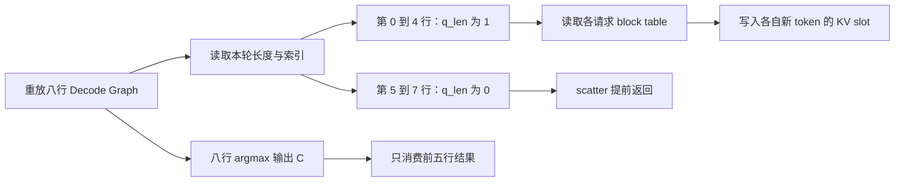
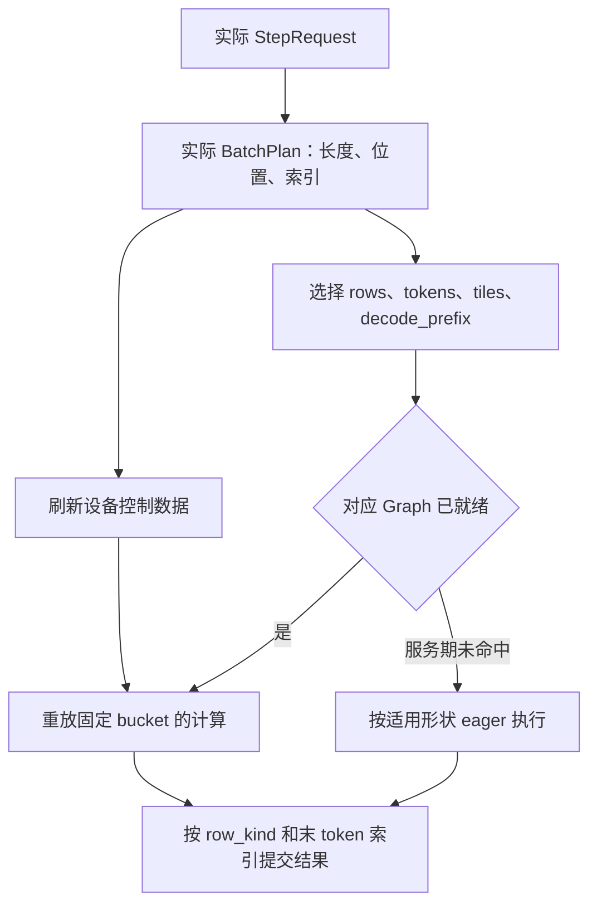

# 第 10 章：CUDA Graph 与动态批次

五条请求正在 Decode，每条请求本轮输入一个 token。Model Runner（源码类型为 `Runtime`）已经准备了 batch size 为 1、2、4、8 的 CUDA Graph，于是这一步选择 8 行的 Graph。请求只有五条，计算却有八行：后面三行怎样处理，才能既复用 Graph，又不碰到真实请求的 KV Cache？

这件事连接了前面两章的核心对象。[第 5 章](05-command-to-plan.md#batch-plan-and-index)中的长度和索引，决定每行数据属于哪条序列；[第 6 章](06-kv-layout-and-ownership.md#allocator-to-device)中的 slot，决定新 K/V 落到哪块物理存储。CUDA Graph 固定了一组执行操作，动态批次则通过这些操作读取的设备数据，描述本轮真正有效的工作。

本章先用普通文本、完整注意力、贪心 Decode 解释这条链路，再展开 Prefill、mixed、recurrent state 与 TP 的区别。这里的 batch 指本轮序列行数；在单 token Decode 中，它恰好也等于有效 token 行数。

## 本章路线

| 小节 | 要解释的问题 |
| --- | --- |
| [10.1 捕获结构与持久地址](#capture-and-addresses) | Graph 保存什么？地址固定之后，为什么每步还能输入不同的 token？ |
| [10.2 bucket、padding 与有效行](#buckets-and-padding) | 五条请求怎样使用八行 Graph？额外行在哪一步失去读写真实 KV 的资格？ |
| [10.3 Decode、Prefill、mixed 的执行条件](#execution-paths) | 不同阶段需要固定哪些维度，又把哪些变化放进设备元数据？ |
| [10.4 预热、资源生命周期与 eager 路径](#lifecycle-and-fallback) | 捕获何时发生？工作区如何存活？哪些情况可以回退，哪些必须返回错误？ |

<a id="capture-and-addresses"></a>

## 10.1 捕获结构与持久地址

### 一次 Decode 为什么值得捕获

一次 Decode 会经过 embedding、各层 attention 和 FFN、最终归一化、词表投影与采样。一个模型层又包含多次 kernel 或库调用。eager 执行时，CPU 每一步都要沿调用链准备并提交这些操作；当每个 kernel 都很短，提交间隙就可能成为延迟的重要组成部分。

CUDA Graph 将操作表示为节点，将先后依赖表示为边。图先建立并实例化，随后可以重复提交。它减少重复组织与提交这组工作的开销；各节点仍然需要执行自己的计算和访存。[NVIDIA CUDA Graphs](https://docs.nvidia.com/cuda/cuda-programming-guide/04-special-topics/cuda-graphs.html)

第 5 章的 `ExecutionPlan` 决定本步走 eager、Decode Graph 还是 mixed Graph。CUDA Graph 则描述选定计算区域内的设备操作与依赖。两者位于不同层：前者是 Worker 的执行决策，后者是 CUDA 的可执行工作图。

### capture、instantiate、replay 分别做什么

项目通过 stream capture 建图。在正常调用模型代码的外面，包上捕获的开始与结束：

```text
一次 eager 预热，并等待完成
        ↓
graph_capture_begin
        ↓
调用 forward_finalize_argmax
        ↓
graph_capture_end：取得图并实例化
        ↓
后续步骤刷新设备输入，再 graph_launch
```

捕获时，Rust 函数仍会运行，循环仍会遍历模型层，后端仍会调用 CUDA API；被捕获 stream 中的设备操作记录进图，暂不作为这一轮 GPU 计算执行。replay 时则提交已记录的图，不重新执行这段 Rust 模型调用链。普通的 Rust `if`、`Vec` 构造或请求状态更新，也不会因为位于两次 capture API 之间，就自动变成每次重放的动作。[CUDA Stream Capture](https://docs.nvidia.com/cuda/cuda-programming-guide/04-special-topics/cuda-graphs.html#stream-capture)

例如，捕获时 CPU 根据 `M = 8` 选择了一条 GEMM 路径，图里就记录了当时提交的操作。随后把某个 Rust 变量改成 `M = 5`，不会让旧图自动重走算法分派。让图适应变化，需要预先设计好设备输入、执行上界与有效性判断。

后端保留两类 CUDA 句柄：

```rust
pub struct CudaGraph {
    graph: ffi::cudaGraph_t,
    exec: ffi::cudaGraphExec_t,
}
```

`graph` 是图对象，`exec` 是完成实例化的可执行对象。`capture_end` 先结束捕获，再调用 `cudaGraphInstantiate`；只有二者成功后，才把这一对句柄放进 Graph 表。`graph_launch` 查找 `exec`，通过 `cudaGraphLaunch` 提交到 compute stream。

源码入口：[Graph 捕获与重放](../../../../crates/infer-worker/src/application/runtime/graph_exec.rs)、[CUDA 图对象与管理](../../../../crates/infer-backend-cuda/src/config.rs)。

### 固定的是指针参数，变化的是指针指向的内容

考虑一个概念上的 kernel：

```cpp
decode_kernel(input_ids, kv_lens, block_tables, kv_pool, batch);
```

捕获时，`batch = 8` 作为标量参数进入节点；几个指针参数也记录了当时的设备地址。下次执行前，在原地址写入新的 token IDs、长度和 block table，kernel 就会读到新数据。

| 对象 | 一张图重放时的要求 | 每一步可以变化的内容 |
| --- | --- | --- |
| kernel 函数、调用序列与依赖 | 与这张图的执行契约一致 | 不通过改 Rust 分支自动改变 |
| 传入节点的标量形状与 grid | 保持所捕获的配置 | 需要其他 bucket 或显式 Graph 更新才能改变节点配置 |
| `input_ids_buf` | 设备地址稳定 | 每行输入 token |
| `kv_index` 内的设备数组 | 地址和容量稳定 | query 长度、KV 长度、位置、物理 slot 映射 |
| 权重与 KV pool | 捕获引用的存储继续有效 | KV 内容随每步计算增长 |
| `hidden`、argmax 输出与 scratch | 地址稳定，容量足够 | 中间结果与输出 token |

因此，Graph 不需要绑定 request ID。上一轮第 2 行是请求 B，下一轮换成请求 D，只要 token、长度、位置、block table、停止条件和结果映射一起更新，第 2 行就可以执行 D 的工作。请求身份仍由 Worker Server 管理。

项目为这些数据建立持久缓冲。下面保留与 Graph 直接相关的字段，省略其他 Runtime 状态：

```rust
pub struct Runtime<T, D, M> {
    pub model: M,
    pub kv_pool: PagedKvPool<T, D>,
    pub kv_index: KvIndexTensors<D>,
    pub hidden: Hidden<T, D>,
    pub input_ids_buf: Tensor<i32, D>,
    pub prefill_ids_buf: Tensor<i32, D>,
    pub abc: AbcBuffers<D>,
    pub cap_batch: usize,
    pub cap_num_tokens: usize,
    pub capture_sizes: Vec<usize>,
    pub graph: Option<GraphRunner<D>>,
    // 其余字段省略。
}
```

`view_raw`、`narrow` 可以给已有存储建立视图，但不能借此改变旧图中已记录的参数。普通 Decode 的实际计划可以只有五行，同时重放此前捕获的八行计算；八行图读取的底层缓冲依然有足够容量。

### 序列越来越长，为什么不用每生成一个 token 就重新捕获

假设 A 的 KV 长度从 6 变成 7，下一步再变成 8。变化的长度放在 `kv_lens`，新增 K/V 的逻辑位置放在 `seq_positions`，物理位置放在 block table。若捕获的 attention 路径使用设备长度和足够的执行上界，就可以读取这些新值。

这里有两个不同的量：

- **执行上界**决定工作区、launch 覆盖范围、后端描述符等固定配置。
- **实际长度**决定本轮真正遍历哪些 token、哪些 KV 位置有效。

只更新实际长度，不能突破捕获时允许的上界，也不能改变一个只在 CPU 上选择的算法分支。项目的 Decode 索引与后端为这种重放准备了专门路径；将新的 attention kernel 接入 Graph 时，同样需要保证它覆盖 bucket 内所有合法长度。

CUDA 也提供节点参数更新与 `cudaGraphExecUpdate`，但更新必须满足对应 API 的限制。项目的主要机制是预先保存多种形状的图，并在稳定地址上刷新数据，并没有在每轮请求中遍历节点来修改参数。[CUDA Graph Management](https://docs.nvidia.com/cuda/cuda-runtime-api/cuda_runtime_api/group__CUDART__GRAPH.html)

<a id="buckets-and-padding"></a>

## 10.2 bucket、padding 与有效行

<a id="five-to-eight"></a>

### 五条请求选择哪一张图

`GraphRunner` 保存经过排序、去重的 `capture_sizes`，并验证这些值非零且不超过 `cap_batch`。选择过程取满足条件的最小值：

```text
slot_batch = min { s ∈ capture_sizes | s ≥ actual_batch }
```

若配置为 `[1, 2, 4, 8, 16]`：

| 实际行数 | 选择的 Graph | 补齐行数 |
| --- | --- | --- |
| 4 | 4 | 0 |
| 5 | 8 | 3 |
| 8 | 8 | 0 |
| 9 | 16 | 7 |
| 17 | 无匹配 | 走适用的 eager 路径 |

bucket 不要求是 2 的幂。例如配置含有 24，就可以用 24 行图承接 17–24 行。分桶来自配置集合，不是 CUDA 自动替应用做的取整。

表中的输入都以不超过 `cap_batch`、`cap_num_tokens` 等 Runtime 容量为前提。超过最大 Graph bucket 可以走 eager，超过实际缓冲容量则在建计划时返回错误，eager 不能绕过容量校验。

本例假设八行图已经完成捕获，缓冲容量至少为八行，五条请求的实际计划仍然是：

```text
plan.batch      = 5
plan.num_tokens = 5
plan.q_lens     = [1, 1, 1, 1, 1]
plan.kv_lens    = [6, 10, 3, 8, 5]
```

Runtime 不会为了普通 Decode 的这次 5→8 重放，往 `StepRequest` 中增加三条真实序列，也不会为这三行申请临时 KV lease。

### 先把设备上的有效性元数据准备好

设五条请求为 A–E，`block_size = 1`。本步输入分别写在各自旧 KV 历史之后：

| Graph 行 | 身份 | `q_len` | `kv_len` | `seq_position` | 本步目标物理 slot |
| --- | --- | --- | --- | --- | --- |
| 0 | A | 1 | 6 | 5 | 21 |
| 1 | B | 1 | 10 | 9 | 44 |
| 2 | C | 1 | 3 | 2 | 13 |
| 3 | D | 1 | 8 | 7 | 58 |
| 4 | E | 1 | 5 | 4 | 72 |
| 5 | 无请求 | 0 | 0 | 0 | 不应访问 |
| 6 | 无请求 | 0 | 0 | 0 | 不应访问 |
| 7 | 无请求 | 0 | 0 | 0 | 不应访问 |

表中的 slot 是各自 block table 在本步逻辑位置处的值。例如 A 的第 5 个逻辑位置映射为 21，写入发生在所有相关层的 slot 21；其他历史位置仍由 A 的表描述。

`upload_index_with_suffix_prefix` 把真实计划的值写入设备缓冲前缀，并将关键控制数组的剩余容量清零：

```rust
upload_i32_full_zeropad(device, &self.kv_index.cu_q_lens, &cu_q_lens)?;
upload_i32_full_zeropad(device, &self.kv_index.kv_lens, &plan.kv_lens)?;
upload_i32_full_zeropad(device, &self.kv_index.seq_positions, &plan.seq_positions)?;
upload_i32_full_zeropad(device, &self.kv_index.seq_lens_step, &plan.q_lens)?;
```

假设这里 `cap_batch = 8`，上传之后有：

```text
seq_lens_step = [1, 1, 1, 1, 1, 0, 0, 0]
kv_lens       = [6,10, 3, 8, 5, 0, 0, 0]
seq_positions = [5, 9, 2, 7, 4, 0, 0, 0]
```

代码会清到缓冲的完整容量。如果 `cap_batch` 大于 8，八行以外的控制尾部也会清零。这是因为一些后端操作根据索引张量容量组织访问，而不仅仅查看当前 `plan.batch`。

`cu_q_lens` 的有效前缀为 `[0, 1, 2, 3, 4, 5]`；容量为 9 时，这个通用上传函数得到 `[0, 1, 2, 3, 4, 5, 0, 0, 0]`。它的容量尾部不能当作完整、单调的 ragged 前缀和继续做差。使用这套索引的 kernel 还读取显式的 `seq_lens_step`，只有有效行才使用其起点；后端需要其他表示时，再生成对应的有效索引。

block table 则只更新本轮真实行所需的内容。无效行和有效长度之外的旧表项可以仍留在设备内存里，因为长度检查会阻止 kernel 用它们寻址。**清零控制长度，才是这些旧索引不再被使用的前提。**

源码入口：[索引上传与尾部清零](../../../../crates/infer-worker/src/application/runtime/plan.rs)、[上传辅助函数](../../../../crates/infer-worker/src/application/runtime/mod.rs)。

### 写 KV 之前，哪条判断拦住了额外三行

普通 paged KV scatter 的关键顺序如下，省略向量化拷贝：

```cpp
const int seq = blockIdx.x;
const int len = seq_lens[seq];
if (len <= 0) return;

const int base_pos = seq_positions[seq];
const int start = seq_starts[seq];

for (int token = blockIdx.y; token < len; token += gridDim.y) {
    const int logical_pos = base_pos + token;
    const int blk_idx = logical_pos / block_size;
    const int blk_off = logical_pos - blk_idx * block_size;
    const unsigned int physical_block =
        block_tables[seq * max_blocks_per_seq + blk_idx];

    const size_t dst_offset =
        (static_cast<size_t>(physical_block) * block_size + blk_off) * kv_dim;
    // 把本 token 的 K/V 写入各自 pool 的 dst_offset。
}
```

第 5、6、7 行读到 `len = 0` 后，整个对应 block 就返回了。**它们在读取物理 block 编号之前退出，所以不会沿旧 block table 写进真实请求的 KV。**

项目的 Q/K Norm、RoPE、scatter 融合 kernel 同样先读取该行长度并检查 `len <= 0`。这个判断还阻止无效行拿着旧 token 起点，对真实 Q/K 再做一次错误位置的 RoPE。只在最后屏蔽 logits，已经来不及保护这些中间写入。

这里把图中行号、有效性和物理写入连起来：



源码入口：[paged KV scatter](../../../../crates/infer-backend-cuda/src/kernels/kv_cache/scatter_kv_batch.cu)、[融合 Q/K Norm、RoPE 与 scatter](../../../../crates/infer-backend-cuda/src/kernels/qkv_norm_rope_scatter/qkv_norm_rope_scatter.cu)。

### Attention 和其余算子怎样处理这些行

额外三行的 `kv_len` 也为零。项目的自定义 paged Decode attention 遇到 `kv_len <= 0`，会把对应输出置零并返回，不读取 K/V。cuDNN 路径则启用 padding mask，绑定独立的 query 长度和 KV 长度张量，由库按逐行长度处理无效行；这条路径没有把后三行的表项统一改写为某个 scratch slot。

两条路径的共同契约是无效行不参与真实请求的 attention，输出尾部也不被消费。自定义 kernel 的提前返回可以直接从源码看出；cuDNN 的具体物理访存由库实现决定，不能仅根据 padding mask 推导其内部每一次访存或尾部输出值。KV 写入检查与 attention 有效性处理各有作用：前者防止污染缓存，后者约束历史参与计算的范围。

源码入口：[自定义 paged Decode attention](../../../../crates/infer-backend-cuda/src/kernels/flash_attn_gqa/flash_attn_paged_decode.cu)、[cuDNN 的 padding mask 与长度绑定](../../../../crates/infer-backend-cuda/src/kernels/flash_attn_gqa/cudnn_paged_attention.cu)。

embedding、GEMM、RMSNorm、FFN 和词表投影仍可能按八行执行。每行各自做计算，不会因为某个无效行算出无意义的结果，就自动把结果混入其他请求。这里依赖的是这些路径的行隔离：RMSNorm 沿单行隐藏维归约，词表 softmax 或 argmax 沿该行词表归约，attention 使用该序列自己的历史。

因此，无效行可以有计算成本，却没有请求语义。它们的 token 输入仍需满足 embedding 的安全寻址要求；不能随便填一个越界 token ID。当前普通 Decode 主要刷新输入缓冲的真实前缀，尾部可以保留初始化或之前步骤的合法 token；它并不是依靠“每次把额外 token 全部填 0”实现 KV 隔离。

如果以后引入跨请求共享容量的路由、跨行统计或其他会让行之间相互影响的算子，padding 的隔离条件也需要覆盖这些操作。不能仅凭 scatter 已经跳过，就推导所有模型结构都可以原样采用这种补齐。

### 八个计算结果，为什么只返回五个

Decode Graph 把 argmax 写进持久缓冲 C，即 `abc.argmax_out_dev`。普通同步收集路径中的代码，用实际 `plan.batch` 建立结果视图：

```rust
let batch = plan.batch;
let c_view = self.abc.argmax_out_dev.view_raw(
    Shape::from_slice(&[batch]),
    Shape::from_slice(&[batch.max(1)]).contiguous_strides(),
    0,
    true,
);
let ids = c_view.to_host_vec()?;
```

本例只读 `C[0..5]`。`C[5..8]` 即使有值，也没有对应的请求身份，不参与结果构造。

ABC Decode 路径使用同样的边界：Graph 可以运行八行，但随后停止条件判断和行压缩使用真实 `old_batch = 5`。压缩后的 A 只包含这五条真实请求中继续运行的行；额外三行不会变成下一轮的新请求。

至此有三道配合的约束：

1. **写入边界：** `q_len = 0`，不做真实 KV scatter。
2. **读取与计算边界：** 空长度及后端的 padding 处理，使无效行不参与真实请求的 attention。
3. **提交边界：** 只对真实行做结果返回、停止判断和状态推进。

将 token ID 填 0 只改变输入内容；将 attention 分数 mask 掉只影响 attention；将输出丢弃只影响返回。它们都不能独自替代写 KV 前的有效性检查。

### batch 从八行缩到五行，为什么不能只覆盖前五个值

设上一步八行全部有效，设备上的 `seq_lens_step` 为八个 1。本步只上传五个 1，却不清掉尾部，那么第 5–7 行还会保留上一轮的非零长度、位置和索引。

这些旧值不会因为旧请求完成而自动失效。旧 slot 可能已经归还并重新分配给其他请求，旧 `cu_q_lens` 也可能指向本轮不同的 token。重放旧图时，这三行就会成为仍在工作的“幽灵序列”。

完整清理控制尾部，保证设备看到的是这一轮的有效集合。即使某一步真实行数没有变化，只要行顺序改变，所有与行对应的数组也必须一致更新。

ABC 复用设备控制数据时，这项工作也可以由 GPU 完成。`compact_extend_control` 根据存活行重新组织表和长度，并将非活跃尾行长度置零。因此，并非每次重放都必须从 CPU 重传整张表，但每次重放前的有效性约束始终相同。见[设备控制压缩](../../../../crates/infer-backend-cuda/src/kernels/gather_merge/gather_merge.cu)。

<a id="padding-kinds"></a>

### mixed 的 Pad 行为什么又需要临时 KV slot

前面的 5→8 是**Graph 执行容量尾部**，真实请求计划没有增加行。Worker 还存在另一种补齐：在 Decode 与 Prefill 合成 mixed 批次时，将前面的 Decode 行补到一个 capture slot。

例如五条 Decode 后面要接一个 Prefill，服务层在容量和 KV 余量允许时，可以把 Decode 前缀补到八行，再放入 Prefill。这里新增的三行进入 `StepRequest`，具有真正的一 token 执行形状：

```text
input_ids      = [1]
positions      = [0]
kv_write_start = 0
kv_len_after   = 1
block_table    = [本 Pad 行独占的临时 slot]
row_kind       = Pad
```

它们的 `q_len` 和 `kv_len` 都是 1，scatter 会执行。服务层因此通过 `KvLease` 从分配器借出三个独立 slot；它们与真实请求当前拥有的 slot 分离。`Pad` 行的输出不会成为请求结果，执行收尾时再归还临时 lease。

| 补齐发生的位置 | 是否进入实际请求计划 | 是否执行 KV 写入 | 隔离方式 |
| --- | --- | --- | --- |
| 普通 Decode 的 Graph 容量尾部 | 否 | 零长度行跳过 | 控制长度清零，结果只取真实 batch |
| Worker 为 mixed 增加的 Decode 前缀 Pad | 是，但不是用户请求 | 会 | 独立临时 KV slot，`row_kind = Pad`，完成后回收 |
| mixed Graph 的额外序列行 | 否 | 零长度行跳过 | 零长度索引，输出元数据标记为 Pad |
| mixed 的额外 token 行 | 不增加真实序列 | 不属于有效 query 区间 | 真实长度与 tile 映射约束访问，采样只选真实末行 |

临时 slot 的归还仍服从[第 6 章的在途访问规则](06-kv-layout-and-ownership.md#capacity-and-inflight)：CPU 知道该行是 Pad，不代表 GPU 已经不再访问它。也不能让多个会实际执行写入的 Pad 行随意复用某个真实请求的 slot。

KV pool 额外保留的 Graph scratch block，也不能与这些机制画等号：普通 Decode 的零长度尾部没有逐行重定向到该 block；Worker 的 mixed Pad 则实际借用分配器中的独立 slot。是否占用请求可分配容量，要看具体路径的分配行为。

源码入口：[Worker 的 mixed 组批与 Pad lease](../../../../crates/infer-worker/src/application/worker_scheduler.rs)、[mixed 输出元数据](../../../../crates/infer-worker/src/application/runtime/mixed_abc.rs)。

<a id="execution-paths"></a>

## 10.3 Decode、Prefill、mixed 的执行条件

### 普通 Decode Graph 包含哪些计算

`forward_finalize_argmax` 捕获的是：

```text
持久 token 输入 A
    → embedding
    → 所有 decoder layers
    → 最终归一化与词表投影
    → argmax
    → 持久输出 C
```

普通 Graph 内的采样尾部是 argmax。因此，`step_local` 遇到非贪心采样、草稿验证或需要特殊多模态 Prefill 处理时，会选择相应的 eager 路径。不能把“支持 Decode Graph”理解成所有采样策略都被这张图覆盖。

`GraphRunner::decide` 先检查计划是否 `DecodeOnly`，然后选择最小可用 batch bucket。普通单 token Decode 满足这一布局；一个只包含一 token 的其他阶段，也可能满足该布局，但它的业务阶段仍由 Worker 状态决定。

在 ABC 路径中，Graph 只负责上述 forward 与 argmax 区域。新 token 合入 A、停止条件判断、C 到 A 的压缩、下一步控制更新、D2H 和结果回传，在外部按流水线依赖衔接。Graph 没有取代服务循环，也没有把 ZMQ、Scheduler 或请求表搬进 GPU。

### Prefill 的 token 数与序列数是两个维度

五条 Decode 是五行输入，但一条长度为 128 的 Prefill 就包含 128 个输入 token。Prefill 的 GEMM 行数、ragged query 长度和最终读出位置，无法只用“请求数为 1”描述。

项目保留了一条单序列 Prefill Graph 路径：

| 条件或行为 | 实现 |
| --- | --- |
| 适用形状 | `batch = 1`、`num_tokens ≥ 2`、普通 `Ragged`，且不超过允许长度 |
| Graph key | `(1 << 40) | num_tokens`，按精确 token 数区分 |
| 捕获区域 | `run_layers`：embedding 与 decoder layers |
| 图外区域 | `sample_tail`：读出、采样与结果构造 |
| 图数量预算 | `PREFILL_GRAPH_BUDGET = 16` |
| 默认开关 | `PREFILL_GRAPH_MAX_TOKENS = 0`，这条路径默认关闭 |

这里的关闭是具体执行策略。大 Prefill 的计算本身更重，Graph 减少的提交成本未必足以抵消其固定算法选择、工作区或补齐开销；在不同形状和后端上，eager 与 Graph 可能有不同收益。

启动时的 `prewarm_prefill_shapes` 即使没有捕获 Prefill Graph，也能通过真实 eager 执行准备形状相关的库状态与内存。**预热和捕获是两个动作。**

### mixed 需要一组形状，不能只按 batch 建表

mixed 同时包含 Decode 前缀和 Prefill 后缀。其 Graph 形状用下面的数据结构表示：

```rust
struct MixedGraphShape {
    rows: usize,
    tokens: usize,
    tiles: i32,
    decode_prefix: usize,
}
```

| 字段 | 固定哪部分执行规模 |
| --- | --- |
| `rows` | 序列行、结果行及控制处理的覆盖范围 |
| `tokens` | 扁平输入、hidden 与部分 GEMM 的行数 |
| `tiles` | ragged attention 的 Q tile launch 范围 |
| `decode_prefix` | 采用 Decode 前缀处理的边界 |

默认分桶中，`rows` 向上匹配 capture size，`tokens` 向 64 的倍数补齐，`tiles` 向 32 的倍数补齐。Decode 前缀边界默认向下匹配 capture size；可选调优会改变部分 bucket 规则。因此“所有维度都向上取整”也不足以概括这条路径。

`mixed_graph_key` 还混入 EOS 列表长度与是否执行下一步控制更新。这些值会影响所记录的处理规模或操作组合。key 使用混合哈希再加上 `(1 << 41)` 的类别标记；普通 Decode 直接用 bucket 大小作 key，单序列 Prefill 使用另一类标记。

`GraphSlotId` 表示 `capture_sizes` 中的位置，和上述 key 也不同。例如 `[1, 2, 4, 8]` 中八行 bucket 的 `GraphSlotId` 为 3，普通 Decode key 则是 8。CUDA 后端将各类 key 统一放进 `GraphSlot::LlmDecode` 的字段中，不能仅凭这个枚举名字就认定它只保存普通 Decode 图。

这些 key 在一个 Runtime 及其后端配置中使用。换模型、换权重地址、换 dtype 或换算法模式，不能仅凭整数 key 相同就拿旧图跨 Runtime 复用。

### A 一步 Decode，B 四 token Prefill，怎样落入 mixed bucket

沿用第 5 章的实际计划：

```text
序列行       = [A, B]
q_lens       = [1, 4]
num_tokens   = 5
batch        = 2
total_q_tiles = 2
row_kind     = [Decode, PrefillFinal]
```

假设 capture sizes 包含 1、2，容量足够，使用默认分桶规则且未覆盖调优，得到：

```text
MixedGraphShape {
    rows: 2,
    tokens: 64,
    tiles: 32,
    decode_prefix: 1,
}
```

实际输入仍只有五个 token。输入 staging 将 token tape 补到 64；真实 query 长度与 KV 索引按 `[1, 4]` 上传；有效 Q tile 数为 2。多出的 token 行可以经过 GEMM，但没有对应的真实 query 区间；多出的 tile 需要由有效 tile 数约束。

真实末 token 行为：

```text
A 的读出位置 = 0
B 的读出位置 = 4
last_token_rows = [0, 4]
```

结果处理从这些设备索引取得每条序列需要的输出。mixed Graph 的默认读出可以先对整个 token bucket 做词表投影，再选行执行 argmax；可选的 selected readout 则先 gather 需要的 hidden 行，再做词表投影。两者的计算成本区别见[第 13 章](../cuda/13-gpu-execution-and-cost.md#bottlenecks-and-optimization)。

### 实际计划和捕获用计划为什么要分开

mixed 捕获需要让 CPU 端的后端分支稳定，因此 `mixed_graph_bucket_plan` 会构造代表 bucket 的计划。设备控制数据仍来自实际请求计划。

例如上述 64 token bucket，在统一 FA3 捕获模式下，代表性 `q_lens` 可以是 `[1, 63]`。这里的 63 表示这张图需要覆盖的最大 Prefill query 上界，不表示 B 实际输入了 63 个 token。实际长度仍然是设备上的 4。

这个上界由以下关系推出：

```text
实际最长 Prefill query
    ≤ 实际 token 总数 - 实际 Decode 前缀 token 数
    ≤ bucket tokens - bucket decode_prefix
```

FA3 的部分 launch 参数取决于 CPU 端 `max_q`。如果只按预热时某条短请求的长度捕获，随后同一 bucket 中更长的 query 就可能超出 launch 覆盖范围。使用 bucket 上界，才能同时覆盖映射到该图的多种请求组合。legacy 分离路径通过设备 tile 映射表达有效工作，其代表计划只需要维持对应的分支结构。



mixed Graph 还会把停止判断、mixed 行压缩和可选的下一步控制更新放进捕获区域。相对于普通 Decode Graph，它捕获的边界更大。因此它的预热不能先随意执行整段区域，否则用于当前步的控制平面可能已经被改成下一步。代码先预热 forward 与 argmax，再重新上传输入和元数据，最后捕获完整区域。

### 单卡 mixed 选择哪一种后端路径

在模型适用、Graph 支持和形状条件都满足的前提下，单卡 mixed 还根据后端能力与配置选择执行方式：

| 配置条件 | 选择 |
| --- | --- |
| 统一 mixed attention 可用，且未显式关闭 FA3 Graph | mixed FA3 Graph 模式，重放已预热 bucket |
| `RUSTINFER_MIXED_GRAPH=0` | eager mixed |
| `RUSTINFER_MIXED_GRAPH=1` | legacy 分离 attention 的 mixed Graph 模式 |
| 统一 attention 可用，但 `RUSTINFER_MIXED_FA3_GRAPH=0` | eager mixed |
| 统一 attention 不可用，Graph 条件允许 | 可选择 legacy mixed Graph 路径 |

选择 Graph 模式仍不等于本步一定命中图；未预热 bucket 依然走 eager。这里的“统一 attention 可用”由后端、数据类型和 head dimension 等条件决定，不能只根据 GPU 商品名判断。

### 多模态、recurrent state 与 TP 各多了一项约束

多模态 Prefill 可能涉及视觉 embedding 的替换和额外位置表示。普通 `step_local` 在需要这类 Prefill 处理时选择 eager；模型进入后续单 token Decode 后，则要按该模型实际支持的 Decode 契约判断，不能仅凭最初输入包含图片就断定后续永远不能用 Graph。

具有 recurrent state 的模型还维护卷积或线性注意力历史。KV 写回同一位置可以是幂等覆盖，而 recurrent 更新可能把历史向前推进一次。项目的 Decode 冷路径因此在这类模型上保留 eager 产生的结果，捕获完成后不再立即重放一次；逻辑历史由外围步骤在成功后提交。recurrent 的行槽位、长度和无效行保护也需要随计划更新，单独把 `kv_lens` 清零并不能保护所有状态。

这部分通过 `LinearBatch` 的设备索引保护无效行：`state_slots` 尾部填为 `-1`，`cu_seqlens` 尾部填为同一个有效 token 总数；卷积和 gated delta rule kernel 遇到负 slot 返回。它们没有给每个补齐行建立一份有效 recurrent 历史。具有 recurrent state 时，mixed 使用 eager，也不采用前述服务层 Decode 前缀 Pad；单序列 Prefill Graph 关闭。

另外，模型若声明 `requires_eager_ragged`，Runtime 会清空 capture sizes，并让全一 token 的计划也保持 `Ragged`。这是模型加载路径提供的能力约束，不能把某一种模型家族一概等同于“有 recurrent 就不能 Decode Graph”。见[线性状态的批次索引](../../../../crates/infer-worker/src/domain/cache.rs)。

TP 则要求每个 rank 在自己的设备上捕获并执行相同逻辑步骤。图句柄与地址都是 rank 本地的，NCCL collective 的顺序和参与条件却必须一致。普通 Decode 的预热先完成各 rank 的捕获与实例化，再通过下一次镜像 `Step` 一起重放，避免某个 rank 已经 launch collective，另一个仍在构建图。

TP mixed 使用另一套形状预热流程。统一 FA3 可用时，TP 配置选择 eager mixed，关闭 mixed FA3 Graph；统一 FA3 不可用时，配置得到 `mixed_eager = false`、`mixed_fa3_graph = false`。后一个组合仍可能进入 legacy mixed Graph 的准备路径，但其 bootstrap 捕获开关没有像普通 `Step` 一样完成组内镜像，因此缺少完整的多 rank 捕获协同。单卡 mixed Graph 的支持范围不能直接推广到这个 TP 组合。多 rank Graph 的操作顺序在第四篇进一步展开。

源码入口：[普通步骤决策](../../../../crates/infer-worker/src/application/runtime/mod.rs)、[mixed 形状、key 与捕获区域](../../../../crates/infer-worker/src/application/runtime/mixed_abc.rs)、[recurrent 状态](../../../../crates/infer-worker/src/application/runtime/recurrent.rs)、[TP 命令镜像](../../../../crates/infer-worker/src/application/runtime/peer.rs)。

<a id="lifecycle-and-fallback"></a>

## 10.4 预热、资源生命周期与 eager 路径

### 从安装 GraphRunner 到真正拥有 Graph

`prime_graphs` 的主要工作是安装 `GraphRunner`。只有 capture sizes 非空、后端支持 Graph，才会启用选择策略；它本身不等于所有 bucket 都已捕获。

`prewarm_decode_graphs` 随后逐个构造精确 bucket 大小的合成 Decode 请求，通过普通 `step` 驱动冷路径。自动确定 KV 容量时，初始化顺序如下；显式指定 KV block 数量的分支跳过容量探测和 pool 替换：

```text
模型与主要工作区建立
    → 用临时 KV pool 完成容量探测
    → 建立最终 KV pool
    → prime_graphs 安装选择策略
    → 预热、捕获各 Decode bucket
    → 按配置预热 Prefill 与 mixed
    → 启动检查与 Ready
```

最终 KV pool 必须先建立。若图已经记录了旧 pool 基址，再扩容并替换底层存储，旧图不会自动跟着新 `Tensor` 走。项目的 `resize_kv_pool` 要求在 `prime_graphs` 之前调用；这里调整的是物理 pool，不是每步通过索引借出几个 slot。

预热发生在真实请求接纳之前，可以使用合成 block table 写入暂时没有请求拥有的 KV 区域。普通 Decode 预热为每行准备一 token、`kv_len = 1` 的合成输入；后续真实请求通过新索引覆盖和使用自己的位置。这个行为依赖启动阶段没有活跃请求，不能把同样的 scratch 使用方式任意插入服务期。

### Decode 冷路径与热路径的差别

| 条件 | 执行行为 |
| --- | --- |
| 选中的 bucket 已有 Graph | 刷新输入与索引，重放，收集真实行 |
| Graph 尚未建立，实际 batch 恰好等于 bucket | 普通 `step_graph` 先 eager 预热并同步，再捕获 |
| Graph 尚未建立，实际 batch 小于 bucket | 普通 `step_graph` 按实际 batch eager 执行，不能拿五行计划直接捕获八行图 |
| ABC Decode 选中的 Graph 未就绪 | eager 执行 `forward_finalize_argmax`，这条热路径不现场捕获 |
| 没有可用 bucket | 按适用 eager 路径执行 |

完整注意力、单 rank 的普通 Decode 冷路径，在 eager 预热和捕获后还会立即重放一次。相同输入在相同 KV 位置的再次写入是覆盖；捕获阶段本身没有执行这些 kernel。TP 或 recurrent 模型的冷路径则避免这次立即重放，使用先前 eager 的结果，并在后续步骤重放图。

因此，启动预热的作用是把大部分首次形状开销移到 Ready 之前。它既避免服务线程临时完成捕获，也让真实请求更容易直接命中已建立的 bucket。

### mixed 为什么只在启动阶段捕获

mixed 的形状由多个维度共同决定，如果运行期遇到新组合就捕获，会同时带来图数量增长和首次请求停顿。

项目把 `mixed_graph_capture_enabled` 默认设为 `false`，仅在 mixed bootstrap 预热期间临时打开。运行期遇到已就绪的 bucket 就重放；未命中时返回 eager，不再在请求路径上执行一次预热、同步和捕获。

实现中 mixed Graph 的数量预算为 128，默认预热候选上限为 112，token bucket 候选包含 64、128、192、256、320、384；最终能建立哪些图，还取决于序列容量、token 容量、Decode 前缀和调优配置。预算上限也不意味着启动后已经保存了同样数量的图。

### 捕获期间创建的临时 Tensor，为什么没有悬空

模型函数内部会创建 QKV、attention 中间结果、FFN 临时张量和 logits。Rust 临时对象离开作用域后会释放自己的存储引用，而图还可能在之后多次使用当时记录的地址。

项目为捕获提供独立 arena。它保存一块设备区域，用单调递增的偏移为临时分配划出空间：

```text
arena_base
    ├── 对齐后的临时区域 0
    ├── 对齐后的临时区域 1
    ├── 对齐后的临时区域 2
    └── 尚未使用的空间
```

`arena_begin` 在捕获之前确保底层区域已分配，再将分配游标归零。分配按 256 字节对齐，返回 `base + offset`，并在 compute stream 上记录所需的清零操作。处于 arena 内的临时 Tensor 被释放时，不单独归还或销毁这块设备区域。

| 存储 | 谁保持其有效 | 如何复用 |
| --- | --- | --- |
| 模型权重、KV pool、持久输入输出 | Runtime 与模型对象 | 原地址更新允许变化的内容 |
| Graph 临时区域 | CUDA 配置持有的 arena | 每次捕获重新规划偏移，replay 使用记录的地址 |
| 普通 eager 临时分配 | 常规存储对象与回收池 | 按池的分配、保留和释放规则管理 |
| Graph 与 executable 句柄 | Graph 表中的 `CudaGraph` | 用 key 查找，销毁时释放句柄 |

不同 Graph 可以记录同一 arena 内的地址。它们共享的是可复用工作空间，因此必须有互不冲突的执行时序；当前 Runtime 将相关计算提交到同一 compute stream，流水线还通过 event 保护持久缓冲。仅仅“指针没有变”并不赋予两张图同时读写同一 scratch 的安全性。

捕获期间 arena 不够用时，代码返回错误并标记本次捕获失败，不把普通 eager 回收池的短期地址悄悄记进图。普通 eager arena 会话可按实现回退到回收池，真正的 Graph capture 则必须维持更长的地址生命周期。

源码入口：[arena 分配与捕获失败状态](../../../../crates/infer-backend-cuda/src/config.rs)、[Tensor 分配和释放路由](../../../../crates/infer-backend-cuda/src/lib.rs)、[已有 Graph 内存测试](../../../../crates/infer-backend-cuda/tests/graph_memory.rs)。

### 地址稳定，还需要数据准备完成

同一张图反复读取稳定设备地址，并不表示可以在任意时刻改写那里。

本轮长度和索引必须在读取它们的 kernel 前准备好；下一轮改写输入、控制数组或工作区，也必须等待前一轮最后一次相关访问完成。同一 stream 的顺序与跨 stream 的 event 建立这些依赖。Graph launch 是提交动作，不能当作 GPU 完成通知。

H2D 还有主机源缓冲的生命周期。设备目标是持久 Tensor，不会替 CPU 端的临时 `Vec` 延长生命：异步复制仍可能读取源数据时，就不能释放或改写它。输入准备层需要持有源缓冲直到复制完成，或通过完成依赖再复用。项目的 block table 采用持久双缓冲 staging，ABC 收集也保留主机镜像，都是把地址与完成时机一起管理的例子。仅从设备指针稳定，推不出整个异步传输过程已经安全。

相关 stream、event、H2D 和 D2H 关系见[第 13 章](../cuda/13-gpu-execution-and-cost.md#launch-stream-and-graph)；ABC 的 issue 与 finalize 在第 9 章集中展开。

### Relaxed capture 也有约束

后端使用 `cudaStreamCaptureModeRelaxed`。这个模式放宽部分可能不安全的 API 调用检查，但不会让与捕获必然冲突的操作变合法，也不会替应用自动管理普通分配的生命周期。[CUDA Stream Management](https://docs.nvidia.com/cuda/cuda-runtime-api/cuda_runtime_api/group__CUDART__STREAM.html)

项目因此把库的首次形状准备放在 eager 预热里，把 arena 建立放在 capture begin 之前，把设备同步放在捕获区域之外。捕获完成之前，不能通过同步正在捕获的 stream 来等待其中记录的 kernel 执行，因为这时记录的工作尚未正常入队执行。

一次捕获被无效操作打断后，仍要结束捕获，使 stream 退出该状态。`graph_capture_abort` 调用结束捕获并清理未发布句柄；成功图只有在完整实例化后才进入表。失败的替换不会先删除原先可用的 Graph。

### 哪些是正常回退，哪些是执行失败

| 情况 | 项目的处理含义 |
| --- | --- |
| 未启用 Graph、后端不支持、形状或采样不适用 | 选择对应 eager 路径 |
| 普通 Decode 无匹配 bucket，或较大 bucket 尚未捕获 | 按当前真实形状 eager 执行 |
| mixed 服务期遇到未预热 bucket | eager，不在服务期捕获新图 |
| 单序列 Prefill Graph 数量达到预算 | 该未捕获长度执行 eager |
| 捕获区域返回错误、arena 耗尽、实例化失败 | 清理捕获并返回错误，不自动把失败当作一次成功步骤 |
| Graph launch 返回错误 | 向上传播，不自动对当步重试 eager |
| 致命 CUDA 故障 | 保留并上报故障，不能靠换 eager 恢复正确设备状态 |

启动层会对部分非致命 Graph 准备错误记录并继续，对致命错误终止启动；已经成功建立的图可以仍在表中。普通运行期的捕获函数则返回其错误。读取代码时，应分别看“策略决定不使用 Graph”和“执行 Graph 相关操作失败”的分支。

### bucket 越多，或者 Graph 覆盖越大，就一定越快吗

五条请求运行八行图，稠密逐行部分的行数倍率是 `8 / 5 = 1.6`，执行行中有 `3 / 8 = 37.5%` 属于补齐。这个比例不能直接当作总耗时增加 60%：权重复用、SM 利用率、算法选择、零长度 attention 和固定开销都会影响实际时间。

选择 bucket 时，需要同时考虑三项成本：

- 更细的 bucket 减少补齐，却增加图数量、启动准备与管理成本。
- 更粗的 bucket 提高形状复用，却可能扩大 GEMM、词表投影和工作区规模。
- 更大的捕获区域减少图外提交，却把更多动态控制条件纳入固定执行契约。

用一个简化的顺序成本模型表示，设某类形状捕获与实例化成本为 `C`，eager 每步成本为 `E`，该 bucket 的 Graph 每步成本为 `G`，预计重用 `N` 次，则覆盖建立成本需要：

```text
E > G，并且 N × (E - G) > C
```

其中 `G` 要包含补齐和必要图外工作的成本。如果所选 bucket 因补齐或算法变化使 `G ≥ E`，增加重放次数也不会自动带来收益。对于重叠流水线，最终仍要比较关键路径，而不是简单累加所有 kernel 和 CPU 调用时长。

可以从 Nsight Systems 查看提交间隙、Graph launch 及图外同步，从 Nsight Compute 分析被补齐后 kernel 的计算与访存。具体术语和成本推导见[第 13 章](../cuda/13-gpu-execution-and-cost.md)。

<a id="concept-index"></a>

## 概念索引

| 概念 | 正文入口 |
| --- | --- |
| capture、instantiate、replay | [10.1：从模型调用到可执行图](#capture-and-addresses) |
| 固定参数、持久地址、可变设备内容 | [10.1：指针参数与数据](#capture-and-addresses) |
| CUDA Graph 与 ExecutionPlan | [10.1：两层执行决策](#capture-and-addresses) |
| batch bucket 与有效行 | [10.2：五条请求使用八行图](#five-to-eight) |
| query 长度、KV 长度与 scatter 防护 | [10.2：写入、读取与提交边界](#buckets-and-padding) |
| 零长度尾部、Pad lease、token padding | [10.2：不同补齐方式](#padding-kinds) |
| Graph key、混合形状与 launch 上界 | [10.3：mixed Graph](#execution-paths) |
| Prefill Graph 与 eager 预热 | [10.3：阶段与执行条件](#execution-paths) |
| TP collective 与 recurrent 更新 | [10.3：其他状态和组内约束](#execution-paths) |
| arena、缓冲生命周期与 event | [10.4：资源生命周期](#lifecycle-and-fallback) |
| 冷路径、热路径与错误回退 | [10.4：捕获时机及错误语义](#lifecycle-and-fallback) |
| Graph 建立成本、补齐开销与收益条件 | [10.4：bucket 的成本](#lifecycle-and-fallback) |

<a id="source-index"></a>

## 源码索引

| 入口 | 主要内容 |
| --- | --- |
| [runtime/graph_exec.rs](../../../../crates/infer-worker/src/application/runtime/graph_exec.rs) | `GraphRunner`、bucket 选择、Decode 冷热路径、Prefill Graph、预热 |
| [runtime/plan.rs](../../../../crates/infer-worker/src/application/runtime/plan.rs) | 实际计划与设备索引，完整控制尾部清零 |
| [runtime/mod.rs](../../../../crates/infer-worker/src/application/runtime/mod.rs) | 持久缓冲、采样与 Graph 决策、forward/argmax、真实行输出 |
| [runtime/abc_decode.rs](../../../../crates/infer-worker/src/application/runtime/abc_decode.rs) | ABC Graph 重放与实际 batch 的停止、压缩和输出 |
| [runtime/mixed_abc.rs](../../../../crates/infer-worker/src/application/runtime/mixed_abc.rs) | mixed 形状、key、bucket 计划、末行索引与 bootstrap 捕获 |
| [worker_scheduler.rs](../../../../crates/infer-worker/src/application/worker_scheduler.rs) | mixed Decode 前缀 Pad 与临时 KV lease |
| [runtime/recurrent.rs](../../../../crates/infer-worker/src/application/runtime/recurrent.rs) | recurrent 槽位、历史推进与状态清理 |
| [runtime/peer.rs](../../../../crates/infer-worker/src/application/runtime/peer.rs) | rank 间逻辑步骤镜像与完成等待 |
| [serve_loop.rs](../../../../crates/infer-worker/src/application/serve_loop.rs) | 最终 KV pool、Graph 准备与启动阶段的错误处理 |
| [CUDA config.rs](../../../../crates/infer-backend-cuda/src/config.rs) | arena、capture 状态、图句柄、实例化、launch 与清理 |
| [CUDA lib.rs](../../../../crates/infer-backend-cuda/src/lib.rs) | `ExecScope` 与 Graph API 的连接、设备存储分配路由 |
| [scatter_kv_batch.cu](../../../../crates/infer-backend-cuda/src/kernels/kv_cache/scatter_kv_batch.cu) | 零 query 长度如何阻止 paged KV 写入 |
| [qkv_norm_rope_scatter.cu](../../../../crates/infer-backend-cuda/src/kernels/qkv_norm_rope_scatter/qkv_norm_rope_scatter.cu) | 融合操作中的逐行有效性判断 |

关于五行变八行、地址更新与 mixed 形状的复述和推导，见[第十章共写记录](../../workshops/10-cuda-graph-and-dynamic-batching.md)。继续阅读[Worker 篇目录](../../01-CONTENTS.md#worker-execution)，或回到[书籍入口](../../00-README.md)。
