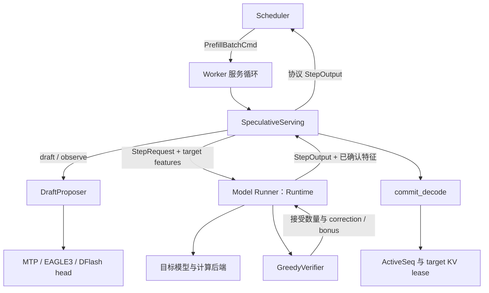
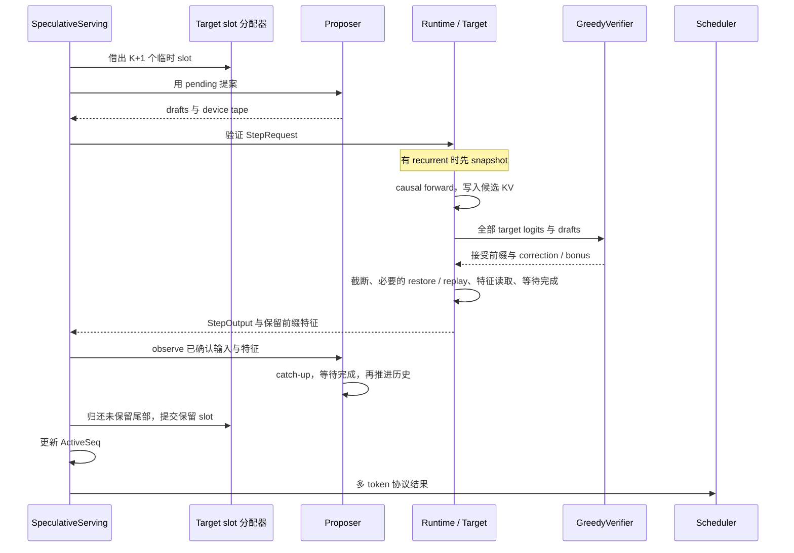

# A. 推测解码：从草稿提案到状态提交

普通 Decode 每执行一次目标模型，通常只得到一个新的 token。上一轮的输出成为下一轮的输入，模型计算沿着生成序列逐步推进。推测解码在这条链上加入一个更便宜的提案者：先猜出接下来几个 token，再让目标模型一次检查这些猜测，把正确的连续前缀一起返回。

这里最关键的工程问题是：**目标模型已经计算了整段草稿，但只有其中一部分可以成为请求的正式历史。** 返回哪些 token、保留哪些 KV、恢复哪些状态、怎样让草稿模型继续跟上，必须遵守同一套位置关系。

本专题从一个具体请求出发，沿 Worker 的真实服务路径展开。目标模型称为 **target**，生成候选的组件称为 **proposer**，候选 token 称为 **draft**。项目使用 `SpeculativeServing` 串联提案、验证和提交；MTP、EAGLE3 与 DFlash 分别提供不同的草稿计算方式。当前服务使用 greedy 验证：接受与目标 argmax 连续相同的草稿，遇到第一个不同的位置就停止。

建议先建立[Worker 服务循环](../chapters/worker/04-worker-service-loop.md)、[批次计划](../chapters/worker/05-command-to-plan.md)与[KV 所有权](../chapters/worker/06-kv-layout-and-ownership.md)的基本认识，再进入下面的流程。

## 本专题路线

- [A.1 一轮推测究竟推进了什么](#one-round)：pending token、K+1 个输入位置、接受前缀与 correction/bonus。
- [A.2 组件职责与状态归属](#components)：服务适配器、proposer、draft head、Runtime、verifier 与 committer。
- [A.3 从启动到 Prefill 完成](#startup-and-prefill)：加载、单请求服务、目标特征、跨 chunk 对齐。
- [A.4 草稿如何产生](#draft-generation)：MTP/EAGLE3 的逐 token 提案与 DFlash 的整块提案。
- [A.5 从草稿到目标验证计划](#target-verification)：资源预算、StepRequest、causal mask、argmax 与结束截断。
- [A.6 恢复、追赶与正式提交](#state-and-commit)：target KV、recurrent state、draft KV 和 lease 的完整变化。
- [A.7 结果怎样回到用户](#output-and-termination)：多 token 结果、流式返回、取消与失败。
- [A.8 收益从哪里来](#cost-and-limits)：计算、显存、同步成本及当前支持范围。
- [概念索引](#concept-index)与[源码索引](#source-index)：从术语和职责跳回具体实现。

<a id="one-round"></a>

## A.1 一轮推测究竟推进了什么

### A.1.1 先区分“已经输出”和“已经写入 KV”

假设一个请求已经完成 Prefill，target KV 中保存了 6 个输入 token，逻辑位置为 `0..5`。目标模型根据最后一个输入的 hidden 预测出 token `17`，服务已经把 `17` 返回给用户。

此时 `17` 尚未作为输入经过目标模型，所以还没有自己的 target KV。Worker 保存的状态是：

```text
target KV：位置 0..5，长度 L=6
last_token：17
generated_count：1
下一次 target 输入的起点：位置 6
```

`17` 就是 **pending token**：已经确定并输出、等待下一次 target forward 消费的 token。普通 Decode 也具有这个一拍的错位。推测解码只是把下一次输入从 `[17]` 扩成 `[17, d1, d2, d3]`。

源码中 `ActiveSeq.last_token` 保存 pending token；`kv_len` 保存已经物化为 target KV 的输入长度。`generated_count` 记录已生成的输出数。这三个量描述不同的事实，见 [ActiveSeq](../../../crates/infer-worker/src/application/worker_state.rs)。

### A.1.2 三个草稿为什么需要四行 target 计算

现在 proposer 从 pending token `17` 出发，生成三个候选：

```text
drafts = [23, 24, 25]
target input = [17, 23, 24, 25]
positions = [6, 7, 8, 9]
```

目标模型仍然执行 next-token prediction。每个输入位置产生的是它之后那个位置的预测：

| target 输入行 | 输入 token | 该行 logits 的含义 | 用途 |
| --- | --- | --- | --- |
| 0 | pending `17` | 已有历史加 `17` 之后应生成什么 | 检查 `d1=23` |
| 1 | `d1=23` | 历史加 `17,23` 之后应生成什么 | 检查 `d2=24` |
| 2 | `d2=24` | 历史加 `17,23,24` 之后应生成什么 | 检查 `d3=25` |
| 3 | `d3=25` | 历史加 `17,23,24,25` 之后应生成什么 | 全部接受时提供额外 token |

因此，`K` 个草稿对应 `K+1` 个 target 输入位置与预测行。最后一行提供 **bonus token**；它让一次完整接受最多返回 `K+1` 个新 token。

这些行属于同一条序列。target 使用 causal mask，每一行只看到历史和当前候选前缀。在完整 Attention 模型里，已知整段候选输入后，各层可以把多个位置放进一次批量计算；层与层之间仍按模型依赖推进。

### A.1.3 第二个草稿被拒绝时，发生什么

设四行 target argmax 为：

```text
target predictions = [23, 99, 26, 27]
drafts             = [23, 24, 25]
```

从左向右比较，`23` 相同，接受第一个草稿；第二个位置的目标预测是 `99`，与草稿 `24` 不同。验证到这里结束。本轮输出为：

```text
接受的草稿：      [23]
纠正 token：     99
本轮新输出：      [23, 99]
保留的 target 输入：[17, 23]
下一轮 pending：  99
target KV 长度：  6 + 2 = 8
```

后两行预测依赖被拒绝的 `24`，不能用于接续真实历史。即使更后面的某个 token 碰巧再次匹配，也不能跳过拒绝位置继续接受。

设接受草稿数量为 `r`，在没有 EOS 或额度截断时：

$$
\text{输出}=[d_1,\ldots,d_r,c],\qquad
\text{保留输入}=[p,d_1,\ldots,d_r]
$$

$$
\Delta \text{KV}=r+1,\qquad
\text{新 pending}=c
$$

这里 `p` 是旧 pending；`c` 在拒绝时是 correction，在全接受时是 bonus。**输出和保留输入的数量相同，但内容错开一个位置。** 本轮不会再次输出旧 pending，也不会把新 pending 当作已经写入的 KV。

| 情况 | target 预测示例 | 新输出 | 保留输入 | 新 pending |
| --- | --- | --- | --- | --- |
| 第一个草稿就拒绝 | `[99, …]` | `[99]` | `[17]` | `99` |
| 只接受第一个草稿 | `[23,99, …]` | `[23,99]` | `[17,23]` | `99` |
| 三个草稿全部接受 | `[23,24,25,26]` | `[23,24,25,26]` | `[17,23,24,25]` | `26` |

只要本轮还有输出与上下文额度，即使没有一个草稿被接受，也能靠 target 的第一行预测前进一步。

<a id="components"></a>

## A.2 组件职责与状态归属

### A.2.1 谁组织这一轮，谁只负责计算

推测解码仍在原来的 Server、Scheduler、Worker 三个进程中运行。Scheduler 发送 Prefill 命令后，后续草稿生成与验证由 Worker 本地推进。Model Runner 仍然是 Worker 内的 `Runtime`。



| 组件 | 负责的决策或计算 | 主要状态 |
| --- | --- | --- |
| `serve_loop` | 接收数据命令、处理控制消息、选择本轮执行分支 | `active`、`prefilling`、待处理 Prefill、target slot 分配器 |
| `SpeculativeServing<P>` | 选择草稿长度，串联提案、验证、catch-up、提交与回传 | proposer、当前 owner、可复用 StepRequest、目标特征缓冲 |
| `DraftProposer` | 维护一条序列的草稿历史，提出候选，吸收已确认的目标特征 | 草稿 KV、已确认长度或对齐状态、token tape、工作区 |
| `ConditionedDraft` / `BlockDraft` 的实现 | 特征投影、draft forward、logits 投影 | 草稿权重与计算 scratch；通过参数访问 proposer 的 KV |
| `Runtime` | 将请求变成 BatchPlan，执行 target，保存特征，处理 target 状态恢复 | target 权重、KV pool、索引、hidden、recurrent state、snapshot |
| `GreedyVerifier` | 根据 target argmax 决定连续接受多少草稿 | 无请求历史；输出 `Verification` |
| `commit_decode` | 将保留长度落实到 slot 所有权、序列状态和协议结果 | 修改 Worker 所有的 ActiveSeq 与 allocator |
| Scheduler / Server | 维护外部请求状态、停止条件、结果路由和文本流 | 会话、request 映射、请求专属输出通道 |

这组边界把“选择执行流程”“管理序列历史”“进行模型计算”“决定接受前缀”“提交资源”分开。更换 proposer 后，验证规则与 target slot 提交可以继续复用。

### A.2.2 最重要的三个接口

服务适配器的实际结构很小：

```rust
pub struct SpeculativeServing<P: DraftProposer<bf16, Cuda>> {
    proposer: P,
    owner: Option<u64>,
    draft_tokens: usize,
    request: StepRequest,
    target_hidden: TargetFeatures<bf16, Cuda>,
}
```

`owner` 将这一份 proposer 历史绑定到一个 `sequence_id`。`request` 与 `target_hidden` 在启动时准备，后续轮次复用。

`DraftProposer` 的核心操作可以概括为：

```text
context_len()       已观察多少个 target 输入位置
committed_len()     草稿缓存里确认了多少个位置或对齐对
draft_with_device() 返回草稿 IDs，以及设备上的 [pending, drafts...] tape
observe_with_input()吸收已确认 target 输入和特征，推进草稿历史
reset()             清除当前序列的逻辑历史
```

`draft_with_device` 产生的候选本身不推进已确认历史。只有 target 验证后，`observe_with_input` 才知道哪些输入和特征可以留下。设备 token tape 的有效期持续到下一次 proposer 操作，调用者必须在缓冲被复用前消费它。

验证器只返回决定：

```rust
pub struct Verification {
    pub accepted_drafts: usize,
    pub correction_or_bonus: SampledToken,
}
```

它不释放 slot，也不修改 ActiveSeq。Runtime 将这个决定结合停止条件转换成 `StepOutput`，服务适配器再完成资源提交。

具体接口见 [serving.rs](../../../crates/infer-worker/src/application/speculative/serving.rs)、[proposer.rs](../../../crates/infer-worker/src/application/speculative/proposer.rs)、[draft.rs](../../../crates/infer-worker/src/domain/draft.rs)与[验证契约](../../../crates/infer-worker/src/domain/speculative.rs)。

<a id="startup-and-prefill"></a>

## A.3 从启动到 Prefill 完成

### A.3.1 启动时把策略接到同一个服务循环

启动入口先加载 target，再根据配置构造具体执行适配器：

| 策略 | target 服务入口 | proposer 与 head | 目标特征来源 |
| --- | --- | --- | --- |
| MTP | Qwen3.5 dense | `ConditionedProposer<MtpHead<…>>` | `FinalNormalized` |
| EAGLE3 | Qwen3 dense | `ConditionedProposer<Eagle3DraftHead<…>>` | 配置指定的多个 decoder layer |
| DFlash | Qwen3 dense | `BlockProposer<DFlashDraftHead<…>>` | 配置指定的多个 decoder layer |

`run_with_model_and_execution` 使用 `ServingExecution` 接口接入策略。普通执行对应 `OrdinaryExecution`；推测适配器声明 `SPECULATIVE=true`。服务循环仍复用原来的控制面、数据面与请求表，在执行阶段进入推测分支。

例如 EAGLE3 的配置结构如下，两个路径分别指向配套的 target 与 draft checkpoint：

```toml
model = "/models/qwen3-target"
tensor_parallel_size = 1
max_batch_seqs = 1
max_batch_tokens = 1024
paged_block_size = 1
enable_prefix_caching = false

[speculative]
method = "eagle3"
draft_model = "/models/eagle3-draft"
num_draft_tokens = 3
```

`num_draft_tokens=3` 表示每轮最多提出三个草稿；target 工作区至少需要四行。它与请求的 `max_tokens` 含义不同，后者限制总输出数量。

MTP 使用 `method="mtp"`，从 target 对应权重加载 MTP head；DFlash 使用 `method="dflash"` 和独立 `draft_model`，草稿数还需满足该 checkpoint 的 block size。旧字段 `mtp_num_draft_tokens` 仍存在，与新的 `[speculative]` 配置互斥。

服务启动会准备 proposer KV、工作区、目标特征缓冲与 recurrent snapshot 所需存储。推测分支不进入普通 Decode 的 Graph prime/prewarm 路径；后续目标验证和草稿计算使用 eager 执行。加载入口见 [worker_main.rs](../../../crates/infer-worker/src/bin/worker_main.rs)、[EAGLE3 bootstrap](../../../crates/infer-worker/src/bin/bootstrap/eagle3.rs)、[DFlash bootstrap](../../../crates/infer-worker/src/bin/bootstrap/dflash.rs)与[共享配置](../../../crates/infer-protocol/src/config.rs)。

### A.3.2 请求到达后，先走正常的输入与调度链

HTTP 接收、tokenizer、Server 到 Scheduler 的消息链仍按[第二章](../chapters/requests/02-server-and-transport.md)推进。Scheduler 下发 `PrefillBatchCmd`，Worker 收到后放进待处理的 Prefill 命令集合。

每次进入 `SpeculativeServing::step`：

1. 检查当前最多有一个 active 或 prefilling 请求。
2. 如果原 owner 已经不在两张状态表中，reset proposer 并清除 owner。
3. 如果已有 active 请求，先执行它的一轮推测 Decode。
4. 否则选择当前 Prefill 的续块；没有 Prefill 历史时可以选择一个新请求。
5. 其余 Prefill 命令保留到后续服务循环。

因此，当前的单请求限制指同一时刻推进一条请求，其他请求仍可在上游或本地待处理队列等待。这个执行分支没有把一个请求的推测验证与另一个请求的 Prefill 混成普通 mixed batch。

### A.3.3 首块与续块分别做什么

`SpeculativeServing::prefill` 检查命令只含一条序列，拒绝多模态输入和非空 prefix hit，并校验 greedy 采样参数。

首块 `segment_start=0` 到达时，适配器 reset proposer，将 `owner` 设为该 `sequence_id`。续块必须属于同一个 owner，否则无法证明当前草稿历史与目标序列对齐。

随后复用 `handle_eager_prefill` 管理 target slot 与 Prefill 状态，注入的执行回调依次进行：

```text
runner.step_with_features_input
    → target Prefill forward
    → 取得该输入片段的目标特征
proposer.observe
    → 草稿端吸收这些已确认特征
handle_eager_prefill
    → 更新 Prefill/Active 状态并生成协议结果
DataPump.send_step_output
    → 返回 Scheduler
```

尚未完成的 Prefill 片段继续留在 `PrefillSeqMap`。最后一块完成时，生成首个 token；若请求尚未结束，则创建 `ActiveSeq`，这个首 token 就是后续推测的 pending。如果首 token 已触发结束条件，直接释放该请求的 KV。中间块产生的执行结果不会被当成最终 prompt 之后的新 token 提前输出。

### A.3.4 target 特征具体是什么

`FeatureSpec` 指定读取方式：

```rust
pub enum FeatureSpec {
    FinalNormalized,
    DecoderLayers(Vec<usize>),
}
```

若 hidden 宽度为 `H`，一个片段有 `N` 个输入位置：

- MTP 读取 final normalization 后的 `[N,H]` 特征。
- EAGLE3/DFlash 读取指定的 `m` 个层，各层保存 `[N,H]`，再按列拼成 `[N,mH]`。

`LayerObserver` 在目标模型逐层执行时保存指定层的输出。如果残差仍以 `hidden.stream + hidden.pending` 的形式表示，观察器把两者相加后写入自己的缓冲，得到该层的完整 hidden。这样不需要让 proposer 去猜 Runtime 当前使用哪个临时 Tensor。

`TargetFeatures` 的存储由服务适配器持有，能够跨越后续 draft 操作；target 验证结束后只向 proposer 暴露实际保留的前缀行。具体见 [features.rs](../../../crates/infer-worker/src/domain/features.rs)。

<a id="shifted-alignment"></a>

### A.3.5 MTP/EAGLE3 如何跨 Prefill chunk 对齐

用 `x_i` 表示位置 `i` 的 token，`h_i` 表示该位置对应的 target 特征经过 head 特征投影后的条件向量。MTP 在这个投影接口中直接复制 final-normalized hidden；EAGLE3 将多层拼接特征投影到 H 维。它与 MTP 后面把 token embedding 和条件向量拼接后执行的 `fc` 是两个步骤。ConditionedProposer 使用的输入对是：

$$
(h_i, x_{i+1})
$$

这个 pair 使用草稿位置 `i`。它把前一个位置的目标知识与已知的下一个 token 结合起来，继续预测再后面的 token。

假设六个 prompt token 分两块输入：

| Prefill 阶段 | 新到 token | 可以形成的 pair | 暂存的末尾特征 |
| --- | --- | --- | --- |
| 第一块 | `x0,x1,x2` | `(h0,x1)`、`(h1,x2)` | `h2`，位置 2 |
| 第二块 | `x3,x4,x5` | `(h2,x3)`、`(h3,x4)`、`(h4,x5)` | `h5`，位置 5 |

`ShiftedFeatureAlignment` 持有这个末尾 carry，并检查下一块的起点恰好接在前一块之后。首次只有一个 token 的片段尚不能形成 pair，只保存该 token 的特征。

完成六个 prompt token 后：

```text
target 已物化长度 L = 6
proposer.context_len() = 6
ConditionedProposer.committed_len() = 5
末尾 carry = h5
target 首个输出 pending = x6 = 17
```

草稿端的 `5` 代表已经确认的 shifted pair 数，不能把它直接和 target 的 `6` 比较并判定少算了一步。下一次 draft 会用 `(h5,17)` 从草稿位置 5 开始。

对齐缓冲采用 prepare/commit：先形成待执行 pair，等待相关计算完成，再更新 carry。草稿 forward 失败时不会提前把对齐游标推进。实现见 [prefill.rs](../../../crates/infer-worker/src/application/speculative/prefill.rs)。

<a id="draft-generation"></a>

## A.4 草稿如何产生

### A.4.1 MTP：目标特征与下一 token 的组合

`MtpHead` 按行接收目标特征与下一 token。计算链为：

```text
next_token → embedding → embedding_norm ─┐
                                        ├→ concat → fc → draft decoder
target hidden → hidden_norm ─────────────┘                  ↓
                                               normalized hidden
                                                        ↓
                                                   LM head → logits
```

若有 `N` 对输入、hidden 宽度为 `H`，两路输入各为 `[N,H]`，拼接得到 `[N,2H]`，`fc` 投影回 `[N,H]`。草稿 decoder 通过传入的 `ModelCacheView` 使用 proposer 的 KV。

`MtpHead` 负责计算，不负责决定哪个请求占用这些 KV，也不决定草稿是否被接受。模型家族负责装配相应权重，`ConditionedProposer` 负责历史与执行次序。见 [MtpHead](../../../crates/infer-worker/src/components/mtp.rs)及 [Qwen3.5 MTP 加载](../../../crates/infer-worker/src/models/qwen3_5/mtp.rs)。

### A.4.2 MTP/EAGLE3 共用的逐 token 提案循环

ConditionedProposer 从保存的末尾条件向量出发，逐次调用 head：

```text
真实末尾条件 h5 + pending 17 → draft hidden g0 → argmax → d1=23
草稿条件     g0 + d1=23     → draft hidden g1 → argmax → d2=24
草稿条件     g1 + d2=24     → draft hidden g2 → argmax → d3=25
```

后一步依赖前一步的 token 与草稿 hidden，因此这里仍有 `K` 次串行的 draft forward。计算便宜来自草稿模型的规模与结构，而非消除了这条自回归依赖。

中间 token 留在 GPU：`argmax_into` 将结果写进 workspace 的 token 位置，下一次 embedding 直接读取它；hidden 使用两份缓冲交替承接。完成整轮后同步一次，下载完整草稿 ID 列表供 CPU 组装元数据，同时保留设备 tape：

```text
Host：drafts = [23,24,25]
Device tape：[17,23,24,25]
```

target 随后直接借用这条连续的 device tape，避免把刚生成的 token 再逐个从 CPU 上传。这里仍存在每轮完成后的同步和 ID 下载，设备驻留减少的是逐 token 的往返。

草稿期间会写入 proposer 自己的临时 KV，但不会更新 `ShiftedFeatureAlignment` 的已确认 carry。完整实现见 [ConditionedProposer](../../../crates/infer-worker/src/application/speculative/conditioned.rs)。

### A.4.3 EAGLE3：更换特征来源与 head

EAGLE3 将多个目标层的特征融合成条件向量，再结合 token embedding 进行草稿计算。这一思路的背景可见 [EAGLE-3 论文](https://arxiv.org/abs/2503.01840)。

项目中，`FeatureSpec::DecoderLayers` 决定读取哪些层；`Eagle3DraftHead::project_features_into` 将 `[N,mH]` 投影为 `[N,H]`。服务仍复用 ConditionedProposer 的 shifted alignment、逐 token 提案和验证后 catch-up。

EAGLE3 head 将 token embedding 与条件向量分别归一化，拼成 `[N,2H]`，直接送进 Attention 的投影；残差主干从原始条件向量开始，叠加 Attention 输出并经过 FFN。这里没有 MTP 的 concat 后 `fc` 降维步骤。

MTP 的递归条件是 normalized hidden；EAGLE3 的下一轮条件保留 head 所需的未归一化表示，输出归一化用于 logits 投影。`ConditionedDraft` 通过接口容纳这种差异。

部分 checkpoint 使用较小的 draft vocabulary。`token_map` 将局部 argmax ID 映射为 target 的绝对 token ID，然后再写入后续 token 链。target 验证接收的一定是目标词表中的 ID。

当前这条路径生成一条线性候选链，验证协议描述连续前缀；它没有在一个请求里构造多分支候选树。相关结构见 [Eagle3DraftHead](../../../crates/infer-worker/src/components/eagle3.rs)与 [Qwen3 EAGLE3 加载器](../../../crates/infer-worker/src/models/qwen3/eagle3.rs)。

<a id="block-draft"></a>

### A.4.4 DFlash：一次提出一个候选块

DFlash 把草稿阶段改成 block diffusion：以目标特征作为上下文，一次预测一个块中的多个位置，减少自回归草稿链的串行步骤。原理背景见 [DFlash 论文](https://arxiv.org/html/2602.06036v1)。

项目中的 BlockProposer 先将已确认 target 特征写入自己的 context KV。`DFlashDraftHead::cache_features` 的过程是：

```text
多个 target 层的拼接特征
    → feature_projection
    → hidden_norm
    → 每个 draft layer 使用各自权重生成 context K/V
```

这个 catch-up 过程不对全部已确认历史重跑 draft Attention 和 FFN；每层使用自己的 K/V 投影处理新确认特征。

提案时，输入换成：

```text
[pending=17, MASK, MASK, MASK]
```

已知的第一个 token 称为 anchor。`forward_block` 对整个四位置块运行一次草稿模型，块内使用 Full mask，让这些位置相互可见；只对三个 mask 位置的 hidden 投影 logits，再并行 argmax 得到 `[23,24,25]`。anchor 位置不作为草稿输出。

接下来传给 target 的 tape 变成 `[17,23,24,25]`。**draft 的 Full mask 与 target 的 causal mask 分别属于两次计算。** target 验证仍按候选前缀检查 next-token prediction。

BlockProposer 的 `len` 只记录已确认 target 特征长度，因此 `context_len()` 与 `committed_len()` 都是 `L`，没有 MTP/EAGLE3 的一位错位。临时块写在 context 后面，提案不增加 `len`；验证通过后，新确认特征覆盖对应区域，再推进正式长度。

每轮都重新填写 mask，避免上一轮较长候选或拒绝尾部的 token 残留到新块。实现见 [BlockProposer](../../../crates/infer-worker/src/application/speculative/block.rs)与 [DFlashDraftHead](../../../crates/infer-worker/src/components/dflash.rs)。

<a id="target-verification"></a>

## A.5 从草稿到目标验证计划

### A.5.1 先确定本轮能猜多少，再借 slot

`SpeculativeServing::decode` 先确认 proposer owner 与当前请求一致，并且 `proposer.context_len() == ActiveSeq.kv_len`。

设配置草稿上限为 `K_cfg`，剩余输出额度为 `R`，剩余 target 上下文容量为 `C`，分配器空闲 slot 为 `F`。在 `R,C` 都大于零时，本轮草稿数按以下方式缩小：

$$
K=\min\left(K_{cfg},\ R-1,\ C-1,\ \max(F-1,0)\right)
$$

减去的 `1` 用来容纳 pending 输入与本轮至少一个新输出。随后申请 `K+1` 个 target slot。若 `F=0`，即使计算出 `K=0`，一个 slot 的 lease 仍会失败。

例如只剩一个输出额度时，`K=0`：不生成草稿，target 只计算 pending，返回一个新 token。这依旧经过推测事务的验证与提交路径。`draft_tokens=[[]]` 表示一个零草稿验证请求，和普通执行的 `draft_tokens=[]` 含义不同。

### A.5.2 把候选装进 StepRequest

继续使用 `L=6、K=3` 的例子。假设旧 block table 为 `[8,9,12,13,20,21]`，新 lease 借出 `[40,41,42,43]`。Worker 组装：

```text
SeqStep {
    sequence_id: A,
    input_ids: [17,23,24,25],
    positions: [6,7,8,9],
    kv_write_start: 6,
    kv_len_after: 10,
    block_table: [8,9,12,13,20,21,40,41,42,43],
}

StepRequest {
    seqs: [上述 SeqStep],
    draft_tokens: [[23,24,25]],
    sampling: [A 的 greedy 参数],
    stop: { EOS、已生成数、输出上限、ignore_eos },
}
```

`kv_len_after=10` 是这次候选 forward 的可见范围，尚未成为 ActiveSeq 的正式长度。旧 ActiveSeq 仍保持 `kv_len=6`，直到恢复和 catch-up 成功后才提交。

Runtime 检查 `input_ids.len() == drafts.len()+1`、输入后缀与草稿一致、token ID 合法、位置连续、验证宽度不超过预算，然后生成：

```text
BatchPlan.kind = Spec { mask: Causal }
batch = 1
num_tokens = 4
q_lens = [4]
kv_lens = [10]
seq_positions = [6]
rope_positions = [6,7,8,9]
```

设备索引把四个输入位置映射到新借的 slot，QKV kernel 在各层向这些位置写入数据。target 与普通 Prefill/Decode 使用同一套模型和底层算子接口，只是本次计划要求计算多个待验证位置。见 [Runtime 计划构造](../../../crates/infer-worker/src/application/runtime/plan.rs)。

### A.5.3 目标 forward 为什么需要全部 logits 行

普通 Prefill 只需最后一行 logits 来预测首个输出；验证则需要检查每个候选位置，再提供最后一行 bonus。所以 `sample_tail` 为验证选择 `SampleRows::All`，生成 `[K+1,V]` logits，其中 `V` 为目标词表大小。

`GreedyVerifier` 调用后端 `argmax_into`，在 GPU 上得到每行的 token ID，再把 ID 向量下载给 CPU 比较。整个 `[K+1,V]` logits 不会为了验证而复制到 CPU。

验证的逻辑可以写成：

```text
r = 从开头连续满足 drafts[i] == target_ids[i] 的数量
correction_or_bonus = target_ids[r]
输出候选 = drafts[0..r] + [correction_or_bonus]
```

`DraftBatch` 同时校验各序列 `q_len=K+1` 与总行数。它能够表示不同草稿长度的 ragged 布局，例如两条序列 `K=[3,1]` 对应 `q_lens=[4,2]`、预测区间 `0..4` 与 `4..6`。这是底层契约的表达能力，服务适配器仍限制一条 active 请求。

### A.5.4 greedy 正确性与随机采样的区别

在相同目标计算和 argmax 规则下，第一行使用的历史与普通 Decode 相同。如果第一个草稿被接受，第二行使用的候选前缀也等于普通 Decode 的真实前缀；依次归纳，连续接受的每一个 token 都等于目标模型原本会选择的 token。第一次不同时，用该位置的目标预测纠正，然后丢弃依赖错误前缀的后续结果。

这个论证依赖目标 logits 的计算与决策一致。不同 batch 形状或 kernel 的浮点舍入可能影响极接近的最大值，不能把算法上的一致性直接解释成任意执行路径都逐位相同。

随机 speculative sampling 还需要草稿分布 `q` 和目标分布 `p`：对于按 `q` 采出的候选，以 `min(1,p(x)/q(x))` 接受；拒绝时从归一化的 `max(p-q,0)` 分布重新采样，全部接受时从额外的目标分布采样。其目标是保持 target 输出分布，见 [Speculative Decoding 原论文](https://proceedings.mlr.press/v202/leviathan23a/leviathan23a.pdf)。

当前 `GreedyVerifier` 没有这套概率路径，会拒绝随机验证与不为 1 的 repetition penalty。`temperature=0` 是常见 greedy 配置，后端的判定也包含 `top_k=1` 或 `top_p=0`。本路径返回的 `SampledToken.logprob=0`、`top_logprobs=[]`，这里的零是未计算概率的占位值。

<a id="stopping-counts"></a>

### A.5.5 接受数量、返回数量与物化数量

Runtime 先计算最长接受前缀，再按剩余输出额度与第一个 EOS 截断。三个字段分别表达：

| 字段 | 含义 |
| --- | --- |
| `accepted_drafts` | EOS/输出截断前，连续匹配的草稿数 |
| `tokens[row]` | 这轮实际返回的 token 列表 |
| `materialized_tokens[row]` | 允许外层保留的 target 输入前缀长度 |

对这里的验证协议，最终 `materialized_tokens[row] == tokens[row].len()`；它们的内容关系仍相差一个位置。

例如草稿 `[23, EOS,25]` 全部匹配，验证统计 `accepted_drafts=3`。停止处理只保留输出 `[23,EOS]`，所以 `materialized_tokens=2`，target 保留输入 `[17,23]`。EOS 已经结束输出，无须为了它再保留一个 target KV 位置。

因此，资源提交必须读取 `materialized_tokens`，不能直接使用 `accepted_drafts` 或无条件使用 `accepted_drafts+1`。相关结构见 [StepOutput](../../../crates/infer-worker/src/domain/plan.rs)，截断过程见 [sample_tail 与 truncate_speculative_output](../../../crates/infer-worker/src/application/runtime/mod.rs)。

<a id="state-and-commit"></a>

## A.6 恢复、追赶与正式提交

### A.6.1 一轮事务的完整时序



这里的“事务”指一组状态需要按一致的先后次序公开。target forward 已经写过显存，执行错误也可能使模型状态失效，所以它不提供数据库式的任意失败回滚后继续执行保证。

### A.6.2 普通 Attention KV：缩短可见前缀

目标验证把 `[17,23,24,25]` 的 K/V 写入 slot `[40,41,42,43]`。只接受第一个草稿时，target 应留下 `[17,23]`：

| slot | 验证时写入的 token | 最终归属 |
| --- | --- | --- |
| 40 | 17 | 成为位置 6 的正式 KV |
| 41 | 23 | 成为位置 7 的正式 KV |
| 42 | 24 | 归还分配器 |
| 43 | 25 | 归还分配器 |

Full Attention 的前缀计算受 causal mask 约束，前面的 hidden/KV 不会因为后面候选错误而失效。拒绝后让长度与后续 block table 只引用有效前缀，再归还尾部 slot 即可；`42、43` 的旧字节可以留在 KV pool 中，之后分配给其他输入时覆盖。

这与[第六章的 slot 回收](../chapters/worker/06-kv-layout-and-ownership.md#slot-ownership)相同：归还编号不等于释放整个 GPU Tensor，也不要求把对应显存清零。安全复用还要求之前访问这些位置的 GPU 工作已经完成。

### A.6.3 Recurrent state：为什么截断 KV 不够

Qwen3.5 的混合模型还包含随 token 更新的 recurrent state，例如 convolution state 与 SSM state。它们把历史压进固定大小的状态，验证完整段后已经消费了被拒绝输入，不能通过缩短一个长度字段恢复。

Runtime 的做法是：

1. 验证前保存参与序列的 recurrent snapshot。
2. 执行完整候选段，得到验证与停止决定。
3. 如果保留长度短于候选长度，恢复验证前的 recurrent state。
4. 构造只包含保留输入前缀的请求，重新执行这些输入。
5. 等待重放完成，成功后推进 recurrent 的逻辑长度并返回。

在本例中，先计算 `[17,23,24,25]`，拒绝后恢复旧状态，再执行 `[17,23]`。只有重放结束，recurrent state 才与新的正式历史一致。

当前 Runtime 的 replay 条件还涉及特征读取方式：保留行减少，并且“存在 recurrent”或“未启用 layer observer”时，会重跑保留前缀。因此 `FinalNormalized` 与普通验证入口在裁短时也会 replay；单序列 Full Attention 的 `DecoderLayers` 入口保存了验证中的前缀特征，可以直接取有效行，跳过这次 replay。

这两件事应分开理解：Full Attention KV 的数学恢复可以通过前缀可见性完成；实际执行路径是否还重跑，要看 Runtime 的特征与状态处理分支。实现见 [runtime/speculative.rs](../../../crates/infer-worker/src/application/runtime/speculative.rs)与 [recurrent.rs](../../../crates/infer-worker/src/application/runtime/recurrent.rs)。

<a id="draft-catchup"></a>

### A.6.4 草稿模型也要追上真实历史

验证前的 ConditionedProposer 用自己预测的 hidden 递归生成草稿；这些中间表示不等于 target 真正计算出的特征。即使 token 全部猜对，草稿缓存也需要用真实 target 特征重新对齐。

本例只接受 `23`。target 返回保留输入 `[17,23]` 的真实特征 `h6,h7`。草稿端原来保存 `h5`，catch-up 形成：

```text
(h5,17) → 草稿位置 5
(h6,23) → 草稿位置 6
保存新的 carry：h7
```

这次计算覆盖之前基于临时草稿条件写入的对应 KV；已确认 pair 数从 5 变成 7，已观察 target 长度从 6 变成 8。target 新 pending 为 `99`，下一轮从 `(h7,99)` 开始。

`observe_with_input` 可以复用刚才的 device tape 前缀 `[17,23]`。它完成特征投影、shifted alignment 和 head catch-up，并同步完成后才提交新的 carry。

DFlash 没有 shifted pair：直接把 `h6,h7` 对应的多层特征投影成两位置 context K/V，覆盖临时块的前缀，把 `len` 从 6 推到 8。后面的临时块仍不属于确认历史。

### A.6.5 两份 KV 的布局与所有权

target KV 与 proposer KV 使用独立的池和索引。共享模型的 embedding 或输出权重，不会让它们共享同一份序列缓存。

| 对象 | 谁拥有存储 | 谁管理可见历史 | 分配与回收方式 |
| --- | --- | --- | --- |
| target KV pool | Runtime | ActiveSeq、计划长度与 block table | Worker 的 GlobalKvAllocator 与 KvLease 管理 token slot |
| ConditionedProposer KV | proposer | ShiftedFeatureAlignment | 启动预分配，单请求按位置写入，reset 清逻辑历史 |
| BlockProposer KV | proposer | `len` 与健康状态 | 启动预分配，确认 context 后接临时块，reset 后重建历史 |
| target recurrent state | Runtime | recurrent sequence binding 与逻辑长度 | snapshot/restore/replay，结束时解除序列绑定 |

两个 proposer 都用每层 `[num_blocks,16,kv_dim]` 的 K/V Tensor，`num_blocks=ceil(max_context/16)`，KV dtype 随泛型实例，当前服务为 BF16。这里的 `16` 是 proposer 内部池的 page 大小，与服务 target 按 token 分配的 slot 不能混为同一个单位。

proposer 的 reset 主要清空长度或 carry，缓冲和权重继续复用。新的请求从零开始写，旧数据通过逻辑长度失去可见性。

### A.6.6 commit_decode 把决定落实到账本

只有 target 恢复、特征读取与 proposer catch-up 都成功，服务适配器才调用 `commit_decode`。它先校验单行结果以及 `kept=materialized_tokens[0]`，要求：

```text
0 < kept <= lease.len()
kept == output.tokens[0].len()
generated_count + kept <= max_tokens
```

随后按顺序执行：

1. `lease.shrink_to(kept, allocator)`，归还未保留尾部。
2. `ActiveSeq::commit_accepted`，追加保留 slot，更新 KV 长度、已生成数和 last_token。
3. `lease.commit()`，把保留编号的所有权移交给正式序列。
4. 生成 `AssignedIndices` 与逐 token 的 `GeneratedToken`。
5. 若已经结束，移除 ActiveSeq 并归还该请求全部 target slot。

本例的账本变化为：

```text
提交前：kv_len=6，generated_count=1，last_token=17
lease：[40,41,42,43]

归还：[42,43]
追加：[40,41]

提交后：kv_len=8，generated_count=3，last_token=99
block_table=[8,9,12,13,20,21,40,41]
本轮协议 token=[23,99]
```

`KvLease` 需要显式 commit 或 release。它把临时占用表达为一个对象，但并不在普通 Drop 时自动找到 allocator 并归还所有编号。提交函数及其错误分支见 [commit.rs](../../../crates/infer-worker/src/application/speculative/commit.rs)，lease 实现见 [global_kv_alloc.rs](../../../crates/infer-worker/src/domain/global_kv_alloc.rs)。

<a id="output-and-termination"></a>

## A.7 结果怎样回到用户

### A.7.1 一次 Worker 结果可以包含多个 token

推测提交仍使用原来的 Worker → Scheduler `StepOutput` 协议。`AssignedIndices` 报告已经保留的 target slot；相邻编号会压成连续区间，推测提交在这些区间的 `token_ids` 中填空向量。proposer 自己的 KV 与未保留的 target 尾部 slot 不会作为分配结果发送给 Scheduler。

`tokens` 则包含多条同一 `sequence_id` 的 `GeneratedToken`。若本轮结束，只给本轮最后一个实际输出标记 `finished=true`：

```text
未结束：[ {23,false}, {99,false} ]
已结束：[ {23,false}, {EOS,true} ]
```

Scheduler 按顺序处理这些 token，推进会话、检查自己的停止条件，再进入 Server 的结果分发链。Server 找到请求对应的输出通道，增量解码并通过 SSE 发送文本。token 边界、文本片段边界和 HTTP 传输边界并不要求一一对应，详见[结果接收与 SSE](../chapters/requests/02-server-and-transport.md#receiving-results)。

推测解码因此可能呈现“等待一轮，然后连续返回一小段”的节奏。它改变 Worker 每轮交付的数量，上层仍消费按请求排列的 token 流。

### A.7.2 Scheduler 的停止条件也必须处理整段结果

Worker 根据 EOS、输出额度与上下文容量结束生成；Scheduler 还可能根据会话的停止规则终止请求。

Scheduler 处理一个多 token 结果时，用本轮 `stopped` 集合记录已经停止的序列。一旦某个 token 触发停止，同一结果中该序列后续 token 就不会继续追加和流式返回。若 Worker 尚未报告结束，Scheduler 再发 Cancel 终止本地推进。

因此，“一轮已经验证了四个 token”不意味着上层一定向用户交付四个 token。结果接收与停止逻辑见 [output_fns.rs](../../../crates/infer-scheduler/src/application/output_fns.rs)及 [LLM workflow](../../../crates/infer-scheduler/src/application/workflow/llm.rs)。

### A.7.3 取消与错误落在哪个边界

推测执行在服务循环里以一次同步调用推进。草稿、target 与 catch-up 内部包含 GPU 提交和等待，这一轮内部不轮询 Cancel。取消消息可以先停留在通信队列中，服务循环返回后，在后续 drain 时读取并应用取消。因此取消发生时，当前轮可能已经计算甚至发送结果，上游仍需根据请求状态处理迟到输出。

Worker 的取消处理移除 active/prefilling 状态并释放相应资源；下一次适配器检查发现 owner 已不存在时，会 reset proposer。待处理 Prefill 命令是另一组队列，不能把“移除了 active”理解为所有排队命令也已删除。

执行中出现可恢复的请求错误时，适配器显式归还临时 lease，清理相关 ActiveSeq/PrefillSeq 与 Runtime 序列状态，reset proposer，再通过控制面报告 StepError。fatal 错误继续交给服务循环升级处理。BlockProposer 对可能留下部分写入的错误设置 `poisoned`，reset 前拒绝继续使用该历史。

这里的恢复策略以终止当前失败请求、清除不可信历史为基础；它不会自动从任意半完成轮次继续生成。取消与执行分支见 [serve_loop.rs](../../../crates/infer-worker/src/application/serve_loop.rs)，请求错误收尾见 [SpeculativeServing::step](../../../crates/infer-worker/src/application/speculative/serving.rs)。

<a id="cost-and-limits"></a>

## A.8 收益从哪里来

### A.8.1 用一轮成本除以实际输出量

设普通 Decode 每 token 成本为 `T_base`。一次推测包含：

$$
T_{round}=T_{draft}(K)+T_{verify}(K+1)+T_{replay}
+T_{catchup}+T_{other}
$$

这里的 `T_verify` 只计首次目标验证，不包含单列的 replay；`T_other` 计入 snapshot/restore、额外特征读取，以及尚未计入前述阶段的计划构造、传输、同步、提交和发送成本。各项互不重叠，日志里已经包含 replay 的 `verify_ms` 不能再与 replay 时间直接相加。若本轮平均交付 `E[m]` 个有效 token，则长期平均每 token 成本近似为：

$$
T_{token}\approx\frac{E[T_{round}]}{E[m]},\qquad
\text{speedup}\approx\frac{T_{base}\,E[m]}{E[T_{round}]}
$$

在没有结束截断时，`m=r+1`。收益要求实际多交付的 token 足以抵消 draft、验证加宽、恢复与追赶的额外开销。

例如用纯示意数值：普通一步为 `10 ms`；某一轮 draft `2 ms`、验证 `12 ms`、其余工作 `2 ms`，共 `16 ms`。若返回四个 token，则平均 `4 ms/token`；若只返回一个，则为 `16 ms/token`。这些数值只演示成本关系。

### A.8.2 为什么一次验证多个位置可能更便宜

小 batch Decode 的矩阵乘法常常缺少足够多的 token 行来摊薄权重读取和启动成本。验证把同一个请求的 `K+1` 个候选位置放进一次 forward，可以提高权重复用和矩阵运算利用率，减少推进相同输出长度所需的 target 轮次。相关成本基础见[第十三章](../chapters/cuda/13-gpu-execution-and-cost.md#cost-model)。

但验证工作并没有消失：每个候选都有 QKV、Attention、FFN，所有预测位置还需执行 LM head。`[K+1,V]` logits、目标特征读取和额外临时 KV 都有成本；混合模型拒绝后的 replay 还会再次消费保留输入。

MTP/EAGLE3 的 draft 成本包含 `K` 次依赖串行；DFlash 减少这部分串行轮数，同时增加块内计算与多行 logits。哪种更快取决于 proposer 成本、候选质量与 target 执行形状。

### A.8.3 哪些状态需要显存与缓存容量

除了普通 target 权重与 KV，推测执行还需要：

| 存储 | 随什么增长 |
| --- | --- |
| draft 权重 | 草稿模型层数、hidden、词表；共享权重可减少重复存储 |
| proposer KV | 草稿 full-attention 层数、最大上下文、KV 宽度 |
| target 临时 lease | 每个活动请求本轮占用已有 KV pool 的 `K+1` 个空闲 token 位置 |
| target 特征缓冲 | Prefill/验证最大行数、选取层数、hidden 宽度 |
| draft logits 与 scratch | 草稿词表、block 行数或逐 token 工作区 |
| recurrent snapshot | 混合模型状态的大小与参与序列数 |

临时 lease 增加 target KV pool 的容量需求，不会每轮另行分配一份 target KV Tensor。proposer KV 则是独立创建的池。

例如 BF16 proposer 有 `L_d` 个 Full Attention 层、每层 KV 宽度 `C_d`，预分配上下文容量按 16 对齐到 `S_d`，则 K/V 主体字节数为：

$$
M_{draft\_KV}=2\times L_d\times S_d\times C_d\times 2
$$

第一个 `2` 表示 K 与 V，最后的 `2` 表示 BF16 字节数。这里还没包含索引、权重、logits 和 scratch。

### A.8.4 草稿越长不一定越快

接受的是连续前缀。远处的 token 要对交付量产生贡献，前面的候选必须先全部通过；增加 `K` 可能主要增加被丢弃的计算。

因此需要同时看候选数、连续匹配数、实际输出数与各阶段成本。项目的 `speculative round` 日志分别记录 `proposed`、`accepted`、`emitted`、`draft_ms`、`verify_ms`、`catchup_ms`。其中 `accepted` 是截断前的统计，靠近 EOS 时可能大于实际有用的草稿数量。

日志的 `verify_ms` 从提案完成后计时，包含请求组装和完整 target 调用，也包括可能的 snapshot、restore/replay、readout 与等待；`catchup_ms` 覆盖后续 proposer 更新。这些是主机墙钟分段，后面的 commit 与发送另计，不能直接解释成一个 GPU kernel 的耗时。执行指标也按 `Draft`、`Verify`、`Snapshot`、`Restore`、`Replay`、`Readout`、`CatchUp`、`Wait`、`Commit` 标记阶段，入口见 [execution.rs](../../../crates/infer-worker/src/application/execution.rs)。

### A.8.5 当前服务路径的支持范围

| 维度 | 当前路径 |
| --- | --- |
| 执行设备与接口 dtype | CUDA、BF16；具体权重加载还受各模型路径约束 |
| 并发序列 | 同时一条 active 或 prefilling 请求 |
| 张量并行 | TP1 |
| 采样 | GreedyVerifier；随机接受拒绝未接入 |
| 输入 | 文本；多模态输入拒绝 |
| 前缀缓存 | 关闭；prefix hit 拒绝 |
| 执行方式 | eager；绕过普通 mixed/ABC 与 Decode Graph 执行分支 |
| MTP | Qwen3.5 dense 的 MTP head |
| EAGLE3 / DFlash | Qwen3 dense target 与匹配 draft；相应 bootstrap 要求未量化 BF16 target |
| GGUF 服务 | 配置与加载入口关闭推测解码 |

前缀缓存的限制与特征历史有关：target 命中了 KV，并不代表 proposer 已经拥有该前缀的条件特征与草稿 KV。想复用这部分工作，需要同时恢复相应 proposer 历史，或从可重建的数据重新计算。

扩展到多请求时，需要把 owner、proposer KV 和对齐状态改成请求级资源，按各自 `K_i+1` 组装 ragged 验证批次，再分别恢复、提交。扩展 TP 时，各 rank 除了 token 还需一致地处理接受数、保留长度、特征与状态恢复。CUDA Graph 则需要重新设计动态验证宽度、特征地址、恢复分支和缓冲生命周期。这些条件解释了为什么[普通 Graph](../chapters/worker/10-cuda-graph-and-dynamic-batching.md)与[TP](../chapters/tensor-parallel/17-matmul-to-tensor-parallel.md)的现有路径不能直接套到推测分支。

仓库还提供 `ProposerSession` / `SpeculativeSession` 作为独立单请求执行入口，自己管理 target 的固定位置表、pending 与输出预算，适合参考调用和组件验证。它复用 proposer、Runtime 验证与状态机制；在线服务则由 `SpeculativeServing` 接入 Worker 的 ActiveSeq、GlobalKvAllocator 和协议输出。两者入口见 [session.rs](../../../crates/infer-worker/src/application/speculative/session.rs)与 [serving.rs](../../../crates/infer-worker/src/application/speculative/serving.rs)。

<a id="concept-index"></a>

## 概念索引

| 概念 | 在本项目中的含义 | 正文 |
| --- | --- | --- |
| Pending token | 已经输出、等待下一轮 target 物化的最后一个 token | [A.1](#one-round) |
| Draft / proposer / head | 候选 token、管理草稿历史的组件、执行草稿计算的组件 | [A.2](#components) |
| K+1 | K 个草稿加一个 pending 输入，提供纠正或额外预测 | [A.1.2](#one-round) |
| Correction / bonus | 首次拒绝处的目标预测，或全接受后的额外目标预测 | [A.1.3](#one-round) |
| Shifted alignment | 将前一位置特征与后一 token 配对，并跨 chunk 保存 carry | [A.3.5](#shifted-alignment) |
| Device token tape | proposer 留在 GPU 上、由 target 借用的连续输入 ID 缓冲 | [A.4.2](#draft-generation) |
| Full / causal mask | DFlash 草稿块内部的可见性与 target 验证的自回归可见性 | [A.4.4](#block-draft) |
| Accepted / emitted / materialized | 匹配草稿数、实际输出数、保留输入数 | [A.5.5](#stopping-counts) |
| Snapshot / restore / replay | 保存旧 recurrent state、恢复它、重算保留前缀 | [A.6](#state-and-commit) |
| Catch-up | 用真实 target 特征更新 proposer 的已确认历史 | [A.6.4](#draft-catchup) |
| Commit | 把保留 slot 与长度落实到正式序列，并生成协议输出 | [A.6.6](#state-and-commit) |

<a id="source-index"></a>

## 源码索引

| 读代码时的问题 | 入口 |
| --- | --- |
| 怎样配置策略与约束 | [SpeculativeConfig](../../../crates/infer-protocol/src/config.rs) |
| target 与 head 如何装配进 Worker | [worker_main](../../../crates/infer-worker/src/bin/worker_main.rs)、[EAGLE3 bootstrap](../../../crates/infer-worker/src/bin/bootstrap/eagle3.rs)、[DFlash bootstrap](../../../crates/infer-worker/src/bin/bootstrap/dflash.rs) |
| 如何接入服务循环 | [ServingExecution](../../../crates/infer-worker/src/application/serve_execution.rs)、[serve_loop](../../../crates/infer-worker/src/application/serve_loop.rs) |
| 一轮完整流程由谁组织 | [SpeculativeServing](../../../crates/infer-worker/src/application/speculative/serving.rs) |
| 单请求状态与 proposer 接口 | [worker_state](../../../crates/infer-worker/src/application/worker_state.rs)、[DraftProposer](../../../crates/infer-worker/src/application/speculative/proposer.rs) |
| MTP/EAGLE3 如何提案与 catch-up | [ConditionedProposer](../../../crates/infer-worker/src/application/speculative/conditioned.rs)、[ShiftedFeatureAlignment](../../../crates/infer-worker/src/application/speculative/prefill.rs) |
| DFlash 如何生成整个候选块 | [BlockProposer](../../../crates/infer-worker/src/application/speculative/block.rs)、[DFlashDraftHead](../../../crates/infer-worker/src/components/dflash.rs) |
| 草稿 head 的计算结构 | [MtpHead](../../../crates/infer-worker/src/components/mtp.rs)、[Eagle3DraftHead](../../../crates/infer-worker/src/components/eagle3.rs)、[draft contracts](../../../crates/infer-worker/src/domain/draft.rs) |
| 如何读取与保存 target 特征 | [TargetFeatures](../../../crates/infer-worker/src/domain/features.rs) |
| 验证请求有哪些不变量 | [StepRequest / StepOutput](../../../crates/infer-worker/src/domain/plan.rs)、[DraftBatch / Verification](../../../crates/infer-worker/src/domain/speculative.rs)、[Runtime plan](../../../crates/infer-worker/src/application/runtime/plan.rs) |
| 如何接受前缀与截断结果 | [GreedyVerifier](../../../crates/infer-worker/src/application/speculative/verifier.rs)、[sample_tail](../../../crates/infer-worker/src/application/runtime/mod.rs) |
| 如何恢复 target 状态 | [speculative transaction](../../../crates/infer-worker/src/application/runtime/speculative.rs)、[recurrent state](../../../crates/infer-worker/src/application/runtime/recurrent.rs) |
| 如何归还临时 slot 与提交输出 | [commit_decode](../../../crates/infer-worker/src/application/speculative/commit.rs)、[GlobalKvAllocator / KvLease](../../../crates/infer-worker/src/domain/global_kv_alloc.rs) |
| 如何处理多 token 停止与流式输出 | [Scheduler output_fns](../../../crates/infer-scheduler/src/application/output_fns.rs)、[LLM workflow](../../../crates/infer-scheduler/src/application/workflow/llm.rs) |
| 如何独立调用与理解阶段成本 | [ProposerSession](../../../crates/infer-worker/src/application/speculative/session.rs)、[ExecutionMetrics](../../../crates/infer-worker/src/application/execution.rs) |

共写推演见[专题 A 共写记录](../workshops/01-topic-a-speculative-decoding.md)。返回[全书目录](../01-CONTENTS.md)。
